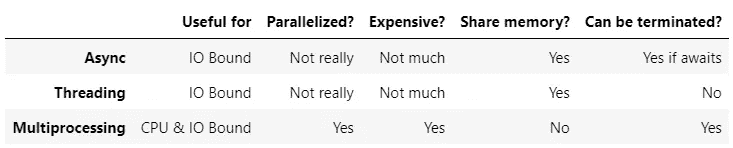

# 异步、线程和多处理实用指南

> 原文：<https://itnext.io/practical-guide-to-async-threading-multiprocessing-958e57d7bbb8?source=collection_archive---------0----------------------->


在本文中，我们将讨论在单独的线程和单独的进程中异步运行任务的实际意义。我还会尽力说明这些是如何工作的，它们的区别和缺陷，这样当我把它们应用到我的项目中时，你就有希望避免我犯的同样的错误。

我们首先定义同步、异步(asyncio)、并发(线程)和并行(多处理)运行代码的含义，至少从 Python 的角度来看是这样的。然后，我们将讨论何时使用哪个选项，以及与每个多任务选项相关的挑战。

## **同步执行**

同步执行其实没什么特别的。这只是意味着我们像往常一样运行代码:一件事情发生，然后另一件事情发生。一次只能运行一个函数，只有当它完成时，才允许发生其他的事情。

这里有一个简单的例子:

正如人们所预料的那样:

```
Running do_first
Running do_second
```

没有太有趣的东西，你可能很熟悉。接下来我们将看到异步代码的区别。

## [**异步执行** **(异步)**](https://docs.python.org/3/library/asyncio.html)

在 async 中，我们一次运行一个代码块，但是我们循环运行哪个代码块。您的程序需要围绕异步构建，尽管您可以从异步程序中调用普通(同步)函数。

下面是让你的程序异步所需的清单:

*   在您的函数声明前面添加 *async* 关键字，使它们*成为可引用的。*
*   当你调用你的异步函数时，添加 *await* 关键字(没有它，它们不会运行)。
*   从您希望异步启动的异步函数创建任务。也等他们说完。
*   调用 *asyncio.run* 来启动程序的异步部分。

下面是一个简单的异步程序的例子，它异步运行两个函数:

这将输出:

```
Running do_first block 1
Running do_second block 1
Running do_first block 2
Running do_second block 2
```

正如我们所看到的，我们在第一个函数中运行第一个代码块，然后我们将执行返回给异步引擎，异步引擎然后运行第二个函数中的第一个代码块(当第一个函数未完成时)，然后我们再次释放执行，然后运行每个函数的最终代码块。

我们同时运行这些模块，给人一种并行执行的感觉。

## [**【并发执行(线程)】**](https://docs.python.org/3/library/threading.html)

在线程中，我们一次执行一行代码，但是我们不断地改变运行哪一行。这是使用线程库完成的:我们首先创建一些线程，启动它们，然后等待它们完成(例如，使用 join)。

下面是这样一个程序的例子:

这是为我输出的:

```
Running do_first line 1
Running do_second line 1
Running do_first line 2
Running do_second line 2
Running do_second line 3
Running do_first line 3
```

正如我们所看到的，它清楚地在从这些函数中执行的代码行之间旋转。它随机运行这些函数的代码行。

请注意，代码行不是同时运行的。这还不是真正的平行度。

## [**并行执行** **(多处理)**](https://docs.python.org/3/library/multiprocessing.html)

在多重处理中，我们实际上同时运行多行 Python 代码。我们使用多种流程来实现这一目标。为了使用多重处理，你需要:创建进程，设置它们运行并等待它们完成(例如，使用 join)。

这里有一个例子:

对我来说，这实际上运行了第一个函数，然后是第二个函数，但这是因为启动一个进程是很昂贵的，当启动第二个函数时，第一个函数就结束了。如果这些是运行时间更长的函数，我们会看到这些函数是并行执行的，如果我们有空闲的内核，它们会真正在同一时间执行。

## 主要差异

现在我们知道了选项，我们讨论一下主要的区别:

*   **同步 vs 其他**:在同步执行中，我们可以决定一切运行的顺序。在异步、线程和多处理中，我们让底层系统来决定。
*   **多重处理与其他处理的比较**:多重处理是唯一真正一次运行多行代码的处理。异步和线程有点假。然而，异步和线程可以真正同时运行多个 IO 操作。
*   **Asyncio vs 线程** : Async 一次运行一个代码块，同时一次只线程化一行代码。使用 async，我们可以更好地控制何时将执行交给其他代码块，但是我们必须自己释放执行。

还要注意，由于 [GIL(全局解释器锁)](https://wiki.python.org/moin/GlobalInterpreterLock)，只有多重处理真正实现了并行化。

# 那么什么时候用哪个呢？

现在我们知道了每一个的意思和它们的区别，我们讨论什么时候应该使用一个而不是其他的。也许比较这些问题的最简单方法是 IO 限制与 CPU 限制问题:

*   **IO 绑定问题**:如果你的库支持异步，就使用异步，如果不支持，就使用线程。
*   **CPU 绑定问题**:使用多处理。
*   **以上都不是问题:**你可能对同步代码很满意。如果您的代码与用户交互，您可能仍然希望使用 async 来获得响应的感觉。

此外，如果您的代码有机会卡住(例如，无限循环)，多重处理是唯一可以可靠终止的方法。实际上，你不能终止线程化的任务，而对于异步，如果它被阻塞，并且从不调用 await，异步也不能终止它。但是，如果被阻塞的任务确实在等待，它可以被终止。

我个人在可能的情况下更喜欢异步，因为多处理和线程的竞争条件更难管理，经常导致难以调试的问题。竞争条件是指执行的顺序取决于操作系统的计时。例如，有时你的一个线程可能运行得比其他线程快，这可能会改变你的程序的行为。这可能会导致很难重现且很少发生的错误。

以下是选择的摘要:



# 陷阱

每个选项中都有一些可能会导致意想不到的困难或者让您无法使用该选项的情况。接下来，我们将讨论一点这些陷阱，以便您有更好的准备。

## 异步ˌ非同步(asynchronous)

Async 的问题是你的代码需要用它来构建，你的库也需要支持它。例如，如果您有一个数据库查询，但是您的数据库客户机不支持异步，这意味着您不能同时运行多个查询，从而失去了同步代码的优势。

此外，你不应该结合异步与线程。异步不是线程安全的。

## 穿线

线程化的问题是，如果多个线程对相同的数据进行操作，就会有损坏甚至崩溃的风险。例如，如果一个线程关闭了另一个线程当前正在使用的连接，就有一个明显的问题。这类问题在 async 中比较少见，因为每个代码块都应该只在安全的情况下返回执行结果。

如果这些函数共享数据或对象，您需要确保它们是线程安全的。如果需要，使用螺纹锁。

## 多重处理

根据我们到目前为止所讨论的内容，多重处理听起来似乎是最好的。然而，多重处理带来了许多重大问题:

*   创建流程是非常昂贵的
*   您不能在进程之间共享内存(尽管您可以通过管道传递数据)
*   为流程序列化数据并不总是那么简单

尤其是最后一个问题通常不太被讨论，但当面对时，它会导致奇怪的错误，这些错误通常很难解决。例如，decorators 在使用 *PermissionError* 的窗口上可能会失败:

但是在 Linux 上，它们通常工作得很好。同样，将修饰函数传递给*进程*，因为参数在酸洗中失败。我还遇到了[其他奇怪的错误，这些错误在新的 Python 版本中出现，但在旧版本](https://stackoverflow.com/a/65749012/13696660)中没有。

通常情况下，我会避免在多重处理中使用 decorators，并尝试删除我在多重处理中创建和使用的类的过程中不需要的属性:

在上面的代码块中，我们覆盖了处理实例 pickle 的 *__getstate__* ，以便删除一个我们无法 pickle 的属性(文件缓冲区无法 pickle)。

还要注意，子进程再次运行导入，所以你应该总是使用 *if __name__ == "__main__":* 块来启动你的程序。在导入和声明全局变量、函数和类时，也应该避免繁重的处理工作。

## 结束语

我在将这些实现到[我的自动化后端](https://rocketry.readthedocs.io/)时遇到了很多问题，有一次，当我试图解决一些由于比赛条件和酸洗错误造成的奇怪错误时，我感到非常绝望。也许这篇文章可以帮助您避免同样的错误，并指导您为您的问题选择正确的并发或并行形式。我希望这篇文章至少对你有用。