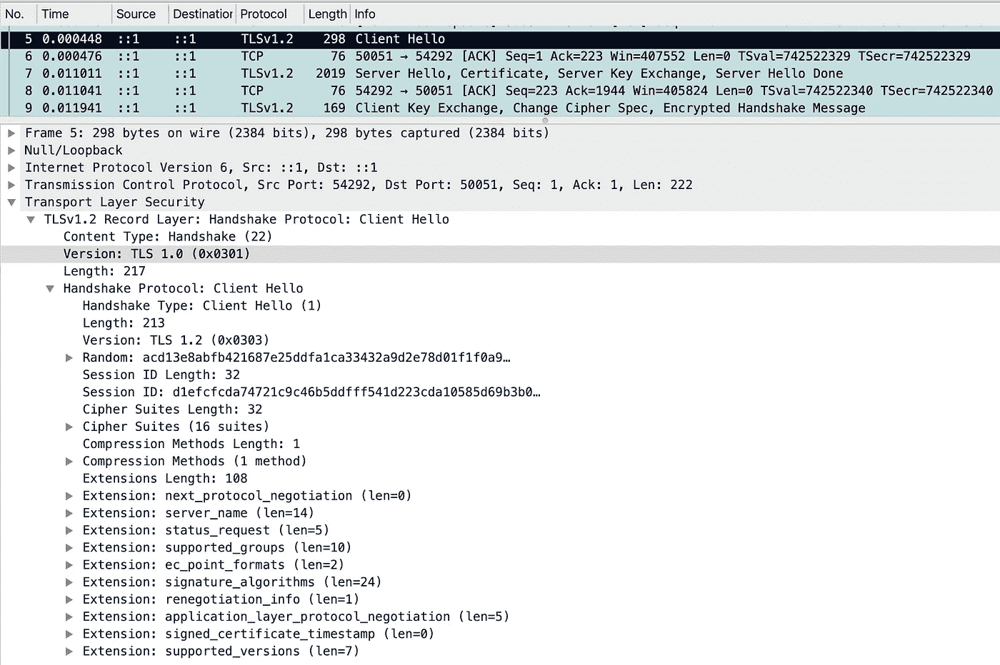
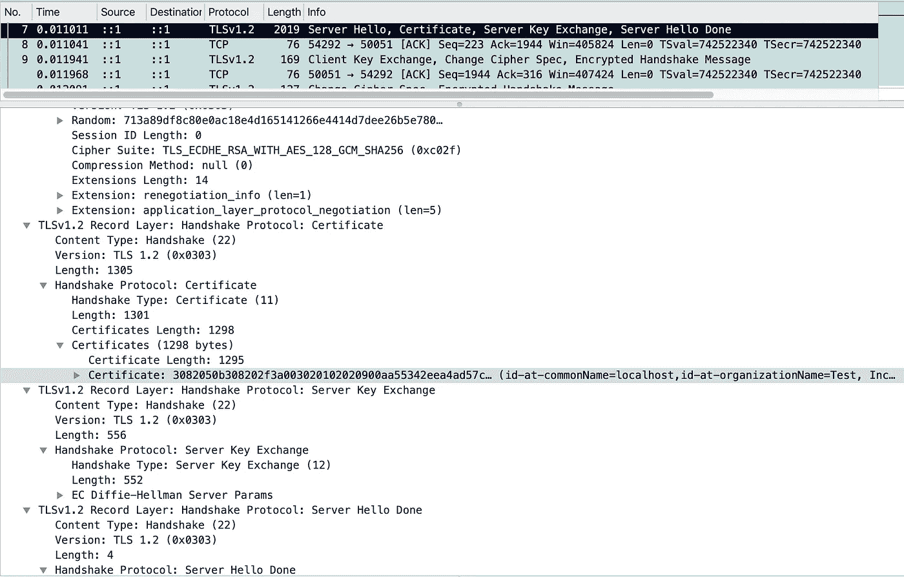
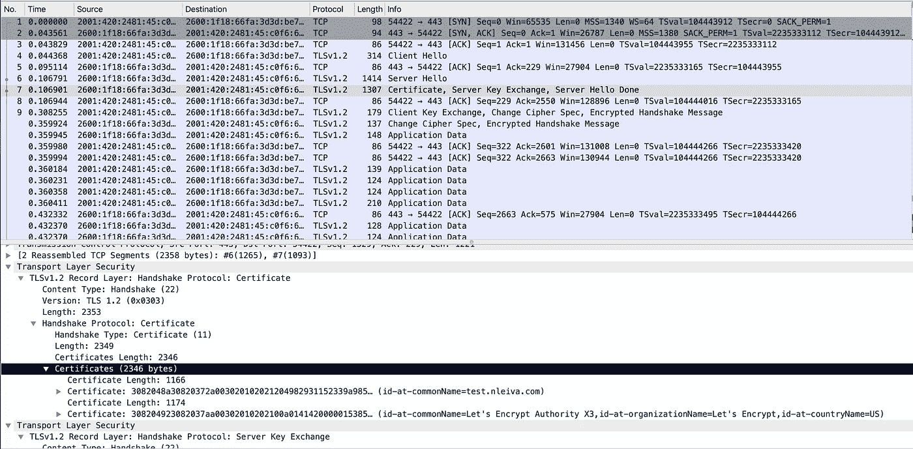
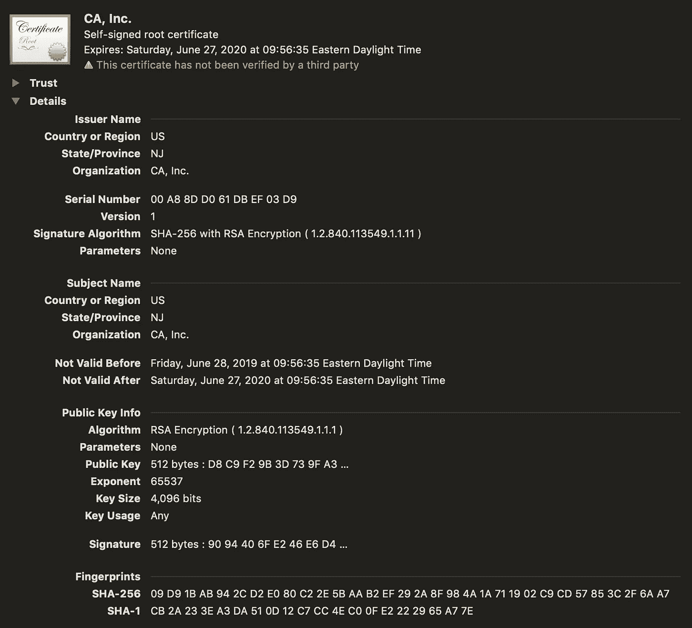
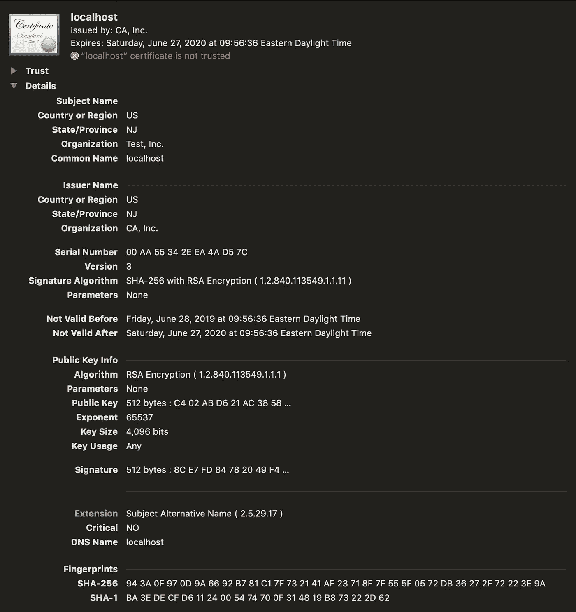

# 保护 gRPC 与 Go 和 TLS 连接的实用指南—第 1 部分

> 原文：<https://itnext.io/practical-guide-to-securing-grpc-connections-with-go-and-tls-part-1-f63058e9d6d1?source=collection_archive---------1----------------------->

与 Go 和 gRPC 建立安全 TLS 连接有不同的方法。与普遍的看法相反，您不需要手动向 gRPC 客户机提供服务器证书来加密连接。这篇文章将提供不同场景的代码示例列表。如果你只想看代码，去源代码[库](https://github.com/nleiva/grpc-tls)。您需要克隆这个[库](https://github.com/nleiva/grpc-tls)来跟进(Go1.11+)。

> " Web 浏览器不持有 TLS 的公共证书，为什么我的应用程序要持有？"[ [不需要:gRPC 客户端认证进入](http://gophersre.com/2019/06/21/grpc-dont-supply-a-client-cert/)

这是三篇系列文章的第一部分。在[第 2 部分](https://medium.com/@nleiva/practical-guide-to-securing-grpc-connections-with-go-and-tls-part-2-994ef93b8ea9?sk=de526794eb30887988c9c78cf077fdf6)中，我们将用[让我们加密](https://letsencrypt.org/)和自动化证书管理环境(ACME)来讨论公共证书，最后在第 3 部分中讨论相互认证。


# 介绍

如 [RFC 5246](https://tools.ietf.org/html/rfc5246) ，*所述，传输层安全(TLS)协议的主要目标是在两个通信应用程序之间提供隐私和数据完整性*。TLS 是 gRPC 内置的身份验证机制之一。*它集成了 TLS，并提倡使用 TLS 对服务器进行身份验证，并对客户端和服务器之间交换的所有数据进行加密* " [ [gRPC 身份验证](https://grpc.io/docs/guides/auth/) ]。

为了建立 TLS 连接，客户端必须向服务器发送一个`Client Hello`消息来启动 TLS 握手。*TLS 握手协议允许服务器和客户端在应用程序协议发送或接收其第一个字节的数据* [ [RFC 5246](https://tools.ietf.org/html/rfc5246) ]之前，相互认证并协商加密算法和密钥。

一个`Client Hello`消息包括客户端支持建立安全连接的选项列表；TLS 版本、随机数、会话 ID、密码套件、压缩方法和扩展名，如下面的数据包捕获所示。



服务器回复一个`Server Hello`，包括它的首选 TLS 版本、一个随机数、一个会话 ID 以及所选的密码套件和压缩方法(下图中的`TLS_ECDHE_RSA_WITH_AES_128_GCM_SHA256`和`null`)。服务器还将包括一个签名的 TLS 证书。client⁠(取决于其 configuration⁠)将通过证书颁发机构(CA)验证该证书，以证明服务器的身份。CA 是颁发数字证书的可信方。



证书也可以出现在单独的消息中，如下面的截图所示。



协商之后，他们通过加密通道开始客户端密钥交换(对称与非对称加密)。接下来，他们开始发送加密的应用程序数据。我对这部分有点过于简化了，但我认为我们已经有足够的上下文来评估接下来的代码片段。

# 证书

在开始编写代码之前，我们先来谈谈证书。X.509 v3 证书格式在 [RFC 5280](https://tools.ietf.org/html/rfc5280) 中有详细描述。它对服务器的公钥和数字签名进行编码(以验证证书的真实性)。

```
Certificate  ::=  SEQUENCE  {
    tbsCertificate       TBSCertificate,
    signatureAlgorithm   AlgorithmIdentifier,
    signatureValue       BIT STRING  }
```

在你问之前，TBS 意味着要被签署。

```
TBSCertificate  ::=  SEQUENCE  {
    version         [0]  EXPLICIT Version DEFAULT v1,
    serialNumber         CertificateSerialNumber,
    signature            AlgorithmIdentifier,
    issuer               Name,
    validity             Validity,
    subject              Name,
    subjectPublicKeyInfo SubjectPublicKeyInfo,
    ...
    }
```

X.509 证书的一些最相关的字段是:

*   `subject`:证书签发主体名称。
*   `subjectPublicKey`:公钥和密钥使用的算法(如 RSA、DSA 或 Diffie-Hellman)。见下文。
*   `issuer`:签发证书的 CA 的名称
*   `signature`:CA 签署证书所用算法的算法标识符(同`signatureAlgorithm`)。

```
SubjectPublicKeyInfo  ::=  SEQUENCE  {
    algorithm            AlgorithmIdentifier,
    subjectPublicKey     BIT STRING  }
```

你可以在 [x.509 库](https://golang.org/pkg/crypto/x509/#Certificate)中看到这个 Go 代码。

## **创建自签名证书**

虽然 SSL 证书在由可信的证书颁发机构(CA)颁发时最为可靠，但出于本文的目的，我们将使用自签名证书，这意味着我们自己对它们进行签名(我们就是 CA)。在第 2 部分中，我们将使用[来加密](https://letsencrypt.org/)证书。

下面描述了创建它们的步骤，我们依靠`openssl`和一个配置文件(`certificate.conf`)来选择主题替换名称(`subjectAltName`)而不是不推荐的通用名称(`CN`)。

为了一次性再现所有这些，您可以在克隆了[存储库](https://github.com/nleiva/grpc-tls)之后运行`make cert`(这是后面所有 gRPC 示例的先决条件)。步骤如下。

**创建根签名密钥**

```
openssl genrsa -out ca.key 4096
```

**生成自签名根证书**

您可以修改“/C=US/ST=NJ/O=CA，Inc.”以适合您的位置和虚构的 CA 名称。

```
openssl req -new -x509 -key ca.key -sha256 -subj "/C=US/ST=NJ/O=CA, Inc." -days 365 -out ca.cert
```

这将为我们的 CA 生成以下证书。



CA 证书

为服务器创建一个密钥证书

```
openssl genrsa -out service.key 4096
```

**创建签约 CSR**

```
openssl req -new -key service.key -out service.csr -config certificate.conf
```

**为服务器生成证书**

```
openssl x509 -req -in service.csr -CA ca.cert -CAkey ca.key -CAcreateserial -out service.pem -days 365 -sha256 -extfile certificate.conf -extensions req_ext
```

这将产生以下证书。



服务器证书

**验证**

也可以看看带`openssl`的证书。

```
$ openssl x509 -in service.pem -text -noout
Certificate:
    Data:
        Version: 3 (0x2)
        Serial Number: 12273773735572067708 (0xaa55342eea4ad57c)
    Signature Algorithm: sha256WithRSAEncryption
        Issuer: C=US, ST=NJ, O=CA, Inc.
        Validity
            Not Before: Jun 28 13:56:36 2019 GMT
            Not After : Jun 27 13:56:36 2020 GMT
        Subject: C=US, ST=NJ, O=Test, Inc., CN=localhost
        Subject Public Key Info:
            Public Key Algorithm: rsaEncryption
                Public-Key: (4096 bit)
                Modulus:
                    00:c4:02:ab:d6:21:ac:38:58:98:cc:dc:65:b6:9b:
                    df:96:8f:4a:f9:9a:e2:ce:3a:65:78:07:6a:8b:d0:
                    ...
```

# gRPC 服务

现在，让我们来看看我们如何应用并利用 Go 和 gRPC 以及一个非常简单的 gRPC 服务来检索用户名。我们将查询“ID=1 ”,这将返回用户`Nicolas`。protobuf 定义如下。

编译后的代码已经在[库](https://github.com/nleiva/grpc-tls)中生成。可以用`make proto`重新编译。

# 不安全的连接

让我们检查几个不推荐的实践。

## 不加密的连接

如果你不想加密连接，Go `grpc`包为客户端提供了`DialOption` `WithInsecure()`。这一点，加上没有任何`ServerOption`的服务器将导致一个未加密的连接。

为了重现这种情况，在一个选项卡中运行`make run-server-insecure`，在另一个选项卡中运行`run-client-insecure`。

```
$ make run-server-insecure
2019/07/05 18:08:03 Creating listener on port: 50051
2019/07/05 18:08:03 Starting gRPC services
2019/07/05 18:08:03 Listening for incoming connections
```

在另一个选项卡中

```
$ make run-client-insecure
User found:  Nicolas
```

## 客户端不对服务器进行身份验证

在这种情况下，我们使用服务器的公钥加密连接，但是客户端不会验证服务器证书的完整性，因此您无法确保您实际上是在与服务器对话，而不是与中间人对话(`man-in-the-middle`攻击)。

为此，我们在之前创建的服务器端提供了公钥和私钥对。客户端需要将`tls`包中的配置标志`InsecureSkipVerify`设置为`true`。

为了重现这一点，在一个选项卡中运行`make run-server`,在另一个选项卡中运行`run-client`。

# 安全连接

让我们看看如何加密通信渠道，并验证我们正在与我们认为的人交谈。

## 自动下载服务器证书并验证它

为了验证服务器的身份(认证它)，客户端使用认证机构(CA)证书**来认证服务器证书上的 CA 签名。**您可以向您的客户端提供 CA 证书，或者依靠您的操作系统中包含的一组可信 CA 证书(可信密钥库)。

**没有 CA 证书文件**

在前面的例子中，除了将`InsecureSkipVerify`标志设置为`true`之外，我们并没有在客户端做任何特殊的事情来加密连接。在这种情况下，我们将把标志切换到`false`，看看会发生什么。不会建立连接，客户端会记录`x509: certificate signed by unknown authority`。

为了重现这一点，在一个选项卡中运行`make run-server`，在另一个选项卡中运行`run-client-noca`。

**带有证书颁发机构的证书文件**

让我们手动提供 CA cert 文件(`ca.cert`)并将`InsecureSkipVerify`选项保留为`false`。

为了重现这种情况，在一个选项卡中运行`make run-server`，在另一个选项卡中运行`run-client-ca`。

**系统(操作系统/浏览器)中包含 CA 证书**

一个空的`tls`配置(`tls.Config{}`)将负责加载您的系统证书。我们将在本系列文章的第 2 部分中验证这个场景(使用来自[的证书，让我们为公共域加密](https://letsencrypt.org/))。

您也可以使用`SystemCertPool()`从系统中手动加载 CA 证书。

```
certPool, err := x509.SystemCertPool()
```

**如果您有服务器证书并且信任它**

这是互联网教程中最常见的场景。如果您拥有服务器和客户端，您可以与客户端预先共享服务器的证书(`service.pem`)，并直接使用它来加密通道。

为了重现这一点，在一个选项卡中运行`make run-server`,在另一个选项卡中运行`run-client-file`。

# 结论

为 gRPC 设置 TLS 有不同的方法。提供完整性和隐私并不需要太多的努力，所以强烈建议您远离像`WithInsecure()`或者将`InsecureSkipVerify`标志设置为`true`这样的方法。

敬请期待[第二部](https://medium.com/@nleiva/practical-guide-to-securing-grpc-connections-with-go-and-tls-part-2-994ef93b8ea9?sk=de526794eb30887988c9c78cf077fdf6)和第三部！。

延伸阅读:

*   [了解公钥基础设施和 X.509 证书](https://www.linuxjournal.com/content/understanding-public-key-infrastructure-and-x509-certificates)作者[杰夫·伍兹](https://www.linkedin.com/in/jeff-woods-a50b921)
*   [由](https://jbrandhorst.com/post/grpc-auth/) [Johan Brandhorst](https://twitter.com/JohanBrandhorst) 进行 gRPC 客户端认证
*   [通过 TLS/SSL 保护 gRPC](https://bbengfort.github.io/programmer/2017/03/03/secure-grpc.html)作者 [Benjamin Bengfort](https://twitter.com/bbengfort)
*   [安全连接的 Go 程序员指南](https://www.youtube.com/watch?v=kxKLYDLzuHA)作者[利兹·赖斯](https://twitter.com/lizrice)
*   [保护 gRPC 与 Go 和 TLS 连接的实用指南—第 2 部分](https://medium.com/@nleiva/practical-guide-to-securing-grpc-connections-with-go-and-tls-part-2-994ef93b8ea9?sk=de526794eb30887988c9c78cf077fdf6)
*   第三部分