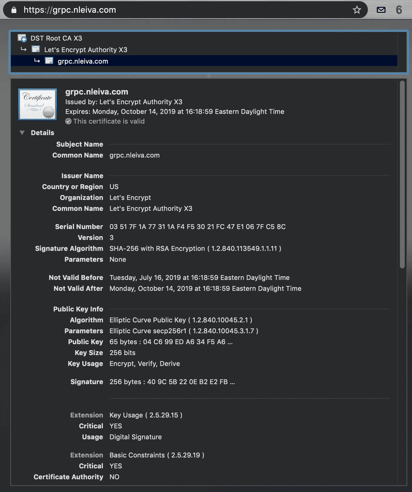

# 保护 gRPC 与 Go 和 TLS 连接的实用指南—第 2 部分

> 原文：<https://itnext.io/practical-guide-to-securing-grpc-connections-with-go-and-tls-part-2-994ef93b8ea9?source=collection_archive---------3----------------------->

在[之前的文章](https://medium.com/@nleiva/practical-guide-to-securing-grpc-connections-with-go-and-tls-part-1-f63058e9d6d1)中，我们研究了不同的(SSL/TLS)证书组合来保护 gRPC 通道。随着端点数量的增长，这个过程很快变得过于复杂，无法手动执行。是时候看看如何自动生成我们的 gRPC 端点可以使用的签名证书，而无需我们的干预。我们将探索私有和公共领域的替代方案。如果你想直接进入代码，查看一下[库](https://github.com/nleiva/grpc-tls)。

这是三篇系列文章的第二部分。在[第 1 部分](https://medium.com/@nleiva/practical-guide-to-securing-grpc-connections-with-go-and-tls-part-1-f63058e9d6d1)中，我们介绍了手动设置 gRPC TLS 连接。相互认证将在第 3 部分讨论。


# 介绍

我们将需要一个证书颁发机构(CA ),我们可以从我们的 Go gRPC 端点进行交互。

对于私有域，我们选择的 CA 是 [Vault PKI Secrets Engine](https://www.vaultproject.io/docs/secrets/pki/index.html) 。为了从我们的 gRPC 端点生成证书签名请求(CSR)和续订，我们将使用 [Certify](https://github.com/johanbrandhorst/certify) 。

对于公共证书的生成和分发，我们将使用[来加密](https://letsencrypt.org/about/)；一个免费的、自动化的、开放的认证中心 …这多酷啊！？。他们要求您做的唯一一件事就是用自动证书管理环境( [ACME](https://tools.ietf.org/html/rfc8555) )协议演示对域的控制。这意味着我们需要一个 [ACME](https://tools.ietf.org/html/rfc8555) 客户端，幸运的是有一个 Go [库列表，我们可以从中选择。在这个机会中，我们将使用](https://letsencrypt.org/docs/client-options/)[自动认证](https://godoc.org/golang.org/x/crypto/acme/autocert)的易用性和对 [TLS-ALPN-01](https://tools.ietf.org/html/draft-ietf-acme-tls-alpn-05) 挑战的支持。

# **私有域:保管和认证**

## **跳马**

Vault 是一个秘密管理和数据保护开源项目，它可以存储和控制对证书的访问，以及密码和令牌等其他秘密。它以二进制的形式发布，你可以把它放在你的`$PATH`中的任何地方。如果你想了解更多关于 Vault 的知识，它的[入门](https://learn.hashicorp.com/vault/)指南是一个很好的起点。本文使用的所有设置细节都记录在[这里](https://github.com/nleiva/grpc-tls/blob/master/vault-cert.md#vault)。

首先，我们用`vault server -config=vault_config.hcl`运行跳马。配置文件(`vault_config.hcl`)提供了存储库数据的`storage`后端。为了简单起见，我们只使用一个本地文件。您也可以选择将它存储在内存中、云提供商或其他地方。参见[存储章节](https://www.vaultproject.io/docs/configuration/storage/index.html)中的所有选项。

```
storage "file" {
  path = ".../data"
}
```

此外，我们指定 Vault 将绑定到的地址。TLS 是默认启用的，所以我们需要提供一个证书和私钥对。如果您选择自签名这些证书(参见[这些说明](https://github.com/nleiva/grpc-tls#generating-tsl-certificates)中的一个示例)，请确保您将根证书(`ca.cert`)放在手边，稍后您将需要它来请求 Vault (*)。其他 TCP 配置选项记录在 [tcp 监听器参数](https://www.vaultproject.io/docs/configuration/listener/tcp.html#tcp-listener-parameters)中。

```
listener "tcp" {
  address     = "localhost:8200"
  tls_cert_file = ".../vault.pem"
  tls_key_file = ".../vault.key"
}
```

在[初始化保险库的服务器](https://github.com/nleiva/grpc-tls/blob/master/vault-cert.md#initialize-the-server)和[解封保险库](https://github.com/nleiva/grpc-tls/blob/master/vault-cert.md#unseal-the-vault)后，你可以验证正在使用 API 调用。

```
$ **curl \
    --cacert ca.cert \
    -i** [**https://localhost:8200/v1/sys/health**](https://localhost:8200/v1/sys/health)HTTP/1.1 200 OK
...{"initialized":true,"sealed":false,"standby":false, ...}
```

下一步是用`vault secrets enable pki`启用 Vault PKI Secrets Engine 后端，生成一个 CA 证书和 Vault 将用来签署证书的私钥，并创建一个可以对我们的域(`localhost`)发出请求的角色(`my-role`)。在这里看到所有的[细节](https://github.com/nleiva/grpc-tls/blob/master/vault-cert.md#enable-vault-pki-secrets-engine-backend)。

```
vault write pki/roles/my-role \
    allowed_domains=localhost \
    allow_subdomains=true \
    max_ttl=72h
```

## **认证**

既然我们的证书颁发机构(CA)已经准备就绪，我们可以向它发出请求，对我们的证书进行签名。如果我们还没有证书，您可能会问哪些证书，以及如何自动告诉我们的 gRPC 端点使用它们？。进入 [Certify](https://github.com/johanbrandhorst/certify) ，一个 Go 库*随时执行证书分发和更新，自动*。它不仅可以与作为 CA 后端的 Vault 配合使用，还可以与 [Cloudflare CFSSL](https://blog.cloudflare.com/introducing-cfssl/) 和 [AWS ACM](https://aws.amazon.com/certificate-manager/private-certificate-authority/) 配合使用。

配置 Certify 的第一步是指定后端`issuer`，在本例中是 Vault。

在本例中，我们通过提供以下信息来标识我们的 Vault 实例和访问凭据:

*   我们为 Vault ( `localhost:8200`)配置的监听器地址。
*   初始化金库服务器后得到的`TOKEN`。
*   我们创建的角色(`my-role`)。
*   我们在 Vault 配置中提供的证书颁发者的 CA 证书。`cp`是包含`ca.cert`的`x509.CertPool`，如(*)所示。

您可以选择通过`CertConfig`提供证书细节。在这种情况下，我们使用`RSA`算法而不是 Certify 的默认算法`ECDSA P256`为我们的证书签名请求(CSR)生成私钥。

Certify 通过 [Certify](https://godoc.org/github.com/johanbrandhorst/certbot#Certify) 类型挂钩到`tls.Config`的`GetCertificate`和`GetClientCertificate`方法，我们现在用它来构建；先前收集的信息，防止为每个传入连接请求新证书的`Cache` *方法*，以及登录插件(本例中为`go-kit/log`)。

最后一步是创建一个指向我们刚刚创建的`Certify`的`GetCertificate`方法的`tls.Config`。然后，在我们的 gRPC 服务器中使用这个配置。

在将环境变量`CAFILE`指向 Vault 的证书文件(`ca-vault.cert`)后，您可以通过在一个选项卡中运行`make run-server-vault`并在另一个选项卡中运行`make run-client-ca`来重现这一点，您可以如下获得:

```
$ curl \
    --cacert ca.cert \
    [https://localhost:8200/v1/pki/ca/pem](https://localhost:8200/v1/pki/ca/pem) \
    -o ca-vault.cert
```

服务器:

```
$ **make run-server-vault**
...
level=debug time=**2019-07-15**T19:37:12.694833Z caller=logger.go:36 server_name=localhost remote_addr=[::1]:64103 msg="**Getting server certificate**"
level=debug time=2019-07-15T19:37:12.694936Z caller=logger.go:36 msg="**Requesting new certificate from issuer**"
level=debug time=2019-07-15T19:37:12.815081Z caller=logger.go:36 serial=451331845556263599050597627925015657462097174315 expiry=2019-07-18T19:37:12Z msg="**New certificate issued**"
level=debug time=2019-07-15T**19:37:12**.815115Z caller=logger.go:36 serial=451331845556263599050597627925015657462097174315 took=120.284897ms msg="**Certificate found**"
```

客户:

```
$ **export CAFILE="ca-vault.cert"**
$ **make run-client-ca**
...
User found:  Nicolas
```

检查我们生成并自动签名的证书，将揭示我们刚刚配置的一些细节。

```
$ **openssl x509 -in grpc-cert.pem -text -noout**
Certificate:
    Data:
    ...
        Validity
            Not Before: **Jul 15** 19:36:42 2019 GMT
            Not After : Jul 18 **19:37:12** 2019 GMT
        Subject: CN=**localhost**
        Subject Public Key Info:
            Public Key Algorithm: **rsaEncryption**
                Public-Key: (**2048 bit**)
                Modulus:
                    00:bf:3c:a3:d8:8c:d8:3c:d0:bd:0c:e0:4c:9d:4d:
                    ...
        X509v3 extensions:
            ...
            Authority Information Access:
                **CA Issuers - URI:**[**https://localhost:8200/v1/pki/ca**](https://localhost:8200/v1/pki/ca)X509v3 Subject Alternative Name:
                DNS:localhost, DNS:**localhost**, IP Address:**127.0.0.1**, IP Address:**0:0:0:0:0:0:0:1**
```

# **公共领域:让我们加密并自动插入**

## 让我们加密

我们可以用[让我们为 gRPC 加密](https://letsencrypt.org/about/)吗？。嗯，对我来说确实有用。问题可能是面向公众的 gRPC API 是否是一个好主意。Google Cloud 好像在做，见[Google API](https://github.com/googleapis/googleapis)。然而，这并不是很常见的做法。无论如何，这里是我如何能够公开一个带有证书的公共 gRPC API，我们自动从 Let's Encrypt 中获得证书。

需要强调的是，此示例并不是要复制给内部/私有服务。在与《让我们加密》的雅各布·霍夫曼-安德鲁斯交谈时，他提到:

> *总的来说，我建议大家不要对 gRPC 或者其他内部 RPC 服务使用 Let's 加密证书。在我看来，使用类似于*[*minica*](https://github.com/jsha/minica/)*的东西来生成一个单一用途的内部 CA，并用它来生成服务器和客户端证书，既容易又安全。这样，您就不必向外部互联网开放您的 RPC 服务器，另外，您将信任范围限制在内部 RPC 所需的范围内，另外，您可以拥有更长的证书生命周期，另外，您还可以获得有效的撤销。*

*Let's Encrypt 使用 ACME 协议来验证证书申请人合法地代表证书中的域名。它还为其他证书管理功能(如证书吊销)提供了便利。ACME 描述了一个可扩展的框架，用于自动化颁发和域验证过程，从而允许服务器和基础设施软件在没有用户交互的情况下获得证书*。[ [RFC 8555](https://tools.ietf.org/html/rfc8555)

简而言之，为了利用 Let's Encrypt，我们需要做的就是运行一个 [ACME 客户端](https://letsencrypt.org/docs/client-options/)。在本例中，我们将使用[自动插入](https://godoc.org/golang.org/x/crypto/acme)。

## 自动认证

autocert 包*提供了对来自 Let's Encrypt 和任何其他基于 ACME 的 CA* 的证书的自动访问。然而，请记住*这个包还在开发中，并没有做出 API 稳定性的承诺*。[ [文档](https://godoc.org/golang.org/x/crypto/acme/autocert)

就代码需求而言，第一步是声明一个带有`Prompt`的`Manager`，表明*在帐户注册*期间接受 CA 的服务条款；一个`Cache`方法*，用于存储和检索以前获得的证书*(在本例中为本地文件系统上的目录)；一个`HostPolicy`，其中包含我们可以响应的域列表；以及可选的`Email` *地址，用于通知所颁发证书的问题*。

这个`Manager`将自动为我们创建一个 TLS 配置，负责与 Let's Encrypt 的交互。另一方面，客户端只需要一个指向空的`tls`配置(`&tls.Config{}`)的指针，默认情况下，它将加载系统 CA 证书，因此信任我们的 CA(让我们加密)。

如果您正在密切关注，您可能已经注意到我们在这个例子中没有包括侦听器部分。原因在于 ACME 基于 TLS 的挑战 TLS-ALPN-01 是如何工作的。*带应用层协议协商的 TLS(TLS ALPN)验证方法通过要求客户端配置 TLS 服务器来响应特定的连接尝试，利用带有识别信息的 ALPN 扩展来证明对域名的控制*。【[draft-IETF-acme-TLS-alpn-05](https://tools.ietf.org/html/draft-ietf-acme-tls-alpn-05#page-3)】。

> 顺便提一下，在 Let's Encrypt 宣布所有 TLS-SNI-01 验证支持终止后，autocert [增加了对 TLS-ALPN-01](https://github.com/golang/crypto/commit/c126467f60eb25f8f27e5a981f32a87e3965053f) 的支持。

换句话说，我们需要倾听 HTTPS 的请求。好消息是 [autocert](https://godoc.org/golang.org/x/crypto/acme/autocert#NewListener) 覆盖了你，可以用`manager.Listener()`创建这个特殊的[监听器](https://godoc.org/golang.org/x/crypto/acme/autocert#NewListener)。现在，问题是 HTTPS 和 gRPC 是否应该监听同一个端口？。长话短说，我无法让它与独立端口一起工作，但是如果两个服务都监听 443，它就可以完美地工作。

gRPC 和 HTTPS 在同一个端口…说什么！？。我知道，你能做并不意味着你应该做。然而，Go gRPC 库提供了`ServeHTTP`方法，可以帮助我们将传入的请求路由到相应的服务。*注意* `*ServeHTTP*` *使用 Go 的* `*HTTP/2*` *服务器实现，与 grpc-go 的* `*HTTP/2*` *服务器完全分开。两种路径的性能和特性可能有所不同*。[ [go-grpc](https://godoc.org/google.golang.org/grpc#Server.ServeHTTP) ]。您可以在 [gRPC serveHTTP 性能损失](https://github.com/grpc/grpc-go/issues/586)中看到一些基准测试。话虽如此，路由将如下所示:

因此，我们可以按如下方式监听请求，请注意，我们将刚刚创建的处理程序`grpcHandlerFunc`提供给了`http.Serve`:

您可以通过在一个选项卡中运行`make run-server-public`并在另一个选项卡中运行`make run-client-default`来重现这种情况。为此，您需要拥有一个域(`HOST`)。在我的案例中，我使用了:

```
export HOST=grpc.nleiva.com
export PORT=443
make run-server-public
```

现在，我可以通过互联网从世界任何地方发出 gRPC 请求:

```
$ export HOST=grpc.nleiva.com
$ export PORT=443
$ make run-client-default
User found:  Nicolas
```

最后，我们可以看看通过 HTTPS 请求生成的证书。



# 结论

如果您利用了本文中讨论的一些资源，为 gRPC 端点管理和分发证书应该不是一件麻烦的事情。

到目前为止，虽然连接已经加密，并且客户端已经验证了服务器的完整性，但是服务器还没有对客户端进行身份验证。对于一些微服务场景，这可能是必需的，我们将在本博客系列的下一部分讨论 Mutual TLS。敬请期待！

延伸阅读:

*   [使用 Vault 建立您自己的认证中心](https://learn.hashicorp.com/vault/secrets-management/sm-pki-engine)
*   [通过保险库自动分发 TLS 证书](https://jbrandhorst.com/post/certify/)
*   [ACME 协议是 IETF 标准](https://letsencrypt.org/2019/03/11/acme-protocol-ietf-standard.html)
*   [保护 gRPC 与 Go 和 TLS 连接的实用指南—第 1 部分](https://medium.com/@nleiva/practical-guide-to-securing-grpc-connections-with-go-and-tls-part-1-f63058e9d6d1)
*   保护 gRPC 与 Go 和 TLS 连接的实用指南—第 3 部分

我要感谢[亚历克斯](https://twitter.com/x1ddos)、[雅各布](https://twitter.com/j4cob)和[约翰](https://twitter.com/JohanBrandhorst)对这篇文章的帮助，并让我保持诚实。