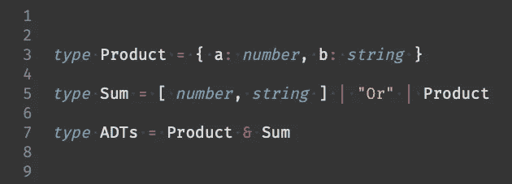
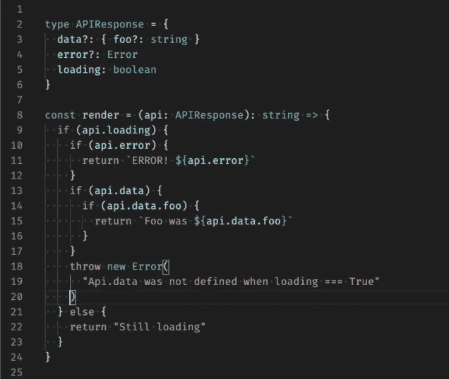
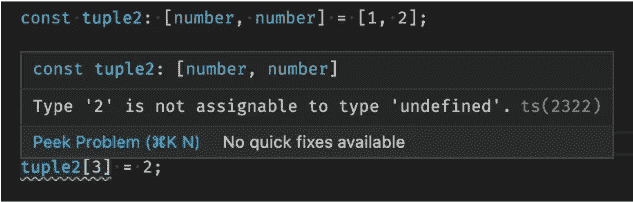
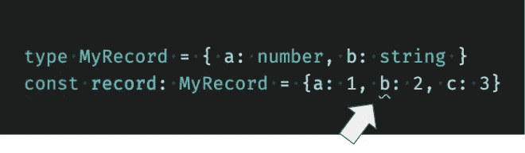
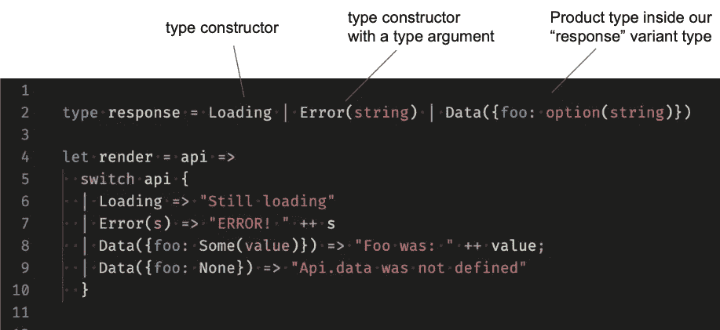
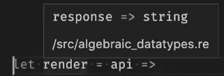
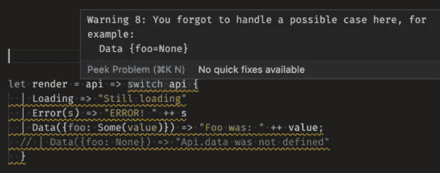
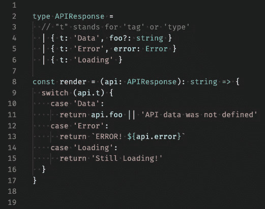

# TypeScript 中代数数据类型(ADT)的实用介绍

> 原文：<https://itnext.io/practical-introduction-to-algebraic-datatypes-adts-in-typescript-1cb6952e4c6d?source=collection_archive---------2----------------------->

## 产品类型？求和类型？变种？工会？…用打字稿？！



您可能已经在代码中使用了 ADT。

代数数据类型或 ADT 是特定种类的复合类型或类型组合。ADT 的主要类别是**产品类型**和**总和类型**。重要的是，它们允许你在编译时使用你的类型系统表达强大的思想，这样你就可以编写安全、健壮的代码，在运行前捕捉错误。

然而，在我们深入研究乘积和求和类型之前，让我们从一个没有 ADT 的小编码问题和解决方案开始。假设我们有一段前端代码，它必须根据 API 响应呈现一些文本。为了简单起见，让我们省略像发出 API 请求或像 React 这样的库。让我们只关注这个问题:根据响应呈现不同的东西。



API 响应= >文本

简单吧？除了我们的 API 响应有惊人多的情况要处理(高[圈复杂度](https://en.wikipedia.org/wiki/Cyclomatic_complexity))。大量嵌套的 if 语句和抛出的错误…如果我告诉你它包含一个 bug，你要多久才能发现它(或者告诉我我错了)？编译器能告诉你是否错过了一个分支吗？我们在处理所有可能的案件吗？

在我们用 ADTs 重构这段代码之前，让我们先学习一些基本的构建模块，所以我们要准备好锤子和钉子。

# ADTs:产品类型

产品类型本质上是其他类型的容器，一个有*字段的*东西*。* **元组**和**记录**是最常见的产品类型。它们都是包含字段*的类型，字段*包含一些其他类型。特定产品类型的所有值都包含相同的字段集。

TypeScript 支持**元组**，也可以认为是固定长度的类型化数组。它们也是类型安全的，所以如果你访问一个 2 元组的第三项或者试图将一个字符串设置为一个数字字段等，你会得到编译错误。



一个“[数字，数字]的二元组”有两个总是数字的字段。

TS 中的记录可能有点夸张，但是您肯定可以创建行为非常接近记录的结构。大致的想法是，一个元组有编号的字段，一个记录有命名的字段。所以你可以只使用一个对象文字，和元组一样，类型系统支持你:



记录{ a: number，b: string }有两个字段 a 和 b，它们总是一个数字和一个字符串。其他的都是编译错误。

那么为什么这些被称为产品类型呢？这就把我们带到了类型论、范畴论、数学:“一个产品类型的所有可能值的集合*就是它的字段类型的所有可能值的集合的集合论乘积，即* [*【笛卡尔积】*](https://en.wikipedia.org/wiki/Cartesian_product) *”。也许我们现在可以坚持使用元组和记录。*

# ADTs:总和类型

虽然[联合类型](https://www.typescriptlang.org/docs/handbook/unions-and-intersections.html)非常接近，但 TypeScript 并没有真正的 Sum 类型。如果产品类型是字段的容器，那么 Sum 类型就像是可能性的容器。一个*东西*要么是*这个*要么是*那个*但不能两者都是。在 TypeScript 中，具有类型 string 或 number 的联合类型确保该类型的任何值都是字符串或数字:

```
type Thing = string | number // string or number
```

为了看到 Sum 类型的更强大的版本，我们需要改变我们的语言。让我们在最初问题的背景下看一个来自 ReasonML(或现在的 ReScript)的代码示例:



“响应”是加载、错误或数据的总和类型。“api”属于响应类型(自动推断)。

这里有几个新概念，请多包涵。“响应”类型是我们的求和类型，在 ReasonML/ReScript 中称为“变量类型”。它类似于 TS 联合类型，不同之处在于我们需要将可能的类型打包到类型构造函数中，如“Loading”或“Error”。



类型推断可以计算函数的签名。

“render”函数接受一个名为“api”的参数，该参数实际上属于 response 类型。这是由类型系统自动推断的。

很酷的一点是，我们可以使用[模式匹配](https://en.wikipedia.org/wiki/Pattern_matching)通过使用 switch 语句来调查响应的内容。如果响应正在加载，那么它将匹配第一个分支，输出将是“仍在加载”，如果是错误，那么我们可以打印“错误！{s}”。我们知道 s 是一个字符串，因为响应类型有错误(字符串)。如果我们没有处理 Sum 类型的所有可能性，类型系统也可以计算出来:



哎呀！你没有检查 foo 是否没有值！

那么为什么称之为求和型呢？再一次，有点理论性，但是我们开始了:*“一个和类型的所有可能值的集合是集合论和，即它的变体的所有可能值的集合的* [*【不相交的联合】*](https://en.wikipedia.org/wiki/Disjoint_union) *。”。*因此，这次它不是像 Product type 中那样是其字段的笛卡尔乘积，而是可能性的总和。如果这没有任何意义，不要担心。为了本文的目的，理解理论方面是不必要的。

# 回到最初的问题，现在用 ADTs

所以，现在我们已经学习了基本的 ADT，是时候将它们应用到我们最初的问题中，看看我们是否能摆脱这种令人讨厌的 if-else 混乱。



比原来的干净安全多了。

“APIResponse”是不同记录的联合类型。虽然不是一个完全合适的 ADT，但对于我们的用例来说，它很好地模拟了 Sum 类型。

“render”使用一个常规开关来模拟匹配 Sum 类型的模式。我们使用特殊字段“t”来提供一个[标记的联合](https://en.wikipedia.org/wiki/Tagged_union)。

TypeScript 实际上足够聪明，可以在编译时解决几个问题:

*   **开关盒必须处理所有的标签**，*如果你添加一个新标签，编译器会告诉你*。
*   **开关盒中的分支能够识别应该使用哪个记录。** *例如，“。foo”仅在 case“Data”分支 while”中可用。错误”仅在“错误”分支中可用。*
*   **Render 必须返回一个字符串，以便正常检查所有返回语句。** *果然不出所料。*

# 结论

我们现在已经通过一个实例介绍了 ADTs: Product 和 Sum 类型。通过几个基本的构建块，我们能够在 TypeScript 中将一个复杂的 if-else 场景重构为一个漂亮的模式匹配，该模式匹配于一个带标记的并集(如果您愿意，可以称为某种类型的 Sum 类型)。结果是清晰、安全的，并且可以很好地容忍像添加/删除病例这样的变化。

# 额外收获:关于 Sum 类型示例中的选项(字符串)

Option 是几种语言中非常常见的求和类型。使用我们的标记联合，TypeScript 中的基本定义可能是这样的:

```
// TypeScript
type Option<T> = { t: 'Some', value: T } | { t: 'None' }// OCaml / ReasonML / ReScript - a bit shorter
type option<'a> = Some('a) | None
```

所以它是一个 sum 类型，要么包含一个值，要么不包含。然而，类似于 TypeScript 中的可空值，在具有适当 ADT 的语言中通常根本没有“null ”,因为不需要它。毕竟，这是一个十亿美元的错误。当某些东西可能没有定义时，只需使用选项类型和模式匹配 Some(x) | None 分支并相应地采取行动:

```
let do_it = opt => switch (opt) {
  | Some(value) => "Yay, got {value}"
  | None => "Value was not defined"
}
```

其他类似于 Option 的非常有用的工具包括:Result，要么，…甚至 List。它们的共同点是它们都可以实现为 Sum 类型。哦，他们也是单子。但这不是一个关于单子的帖子。或者是？；-)

# 额外收获:你可以看看 TS 图书馆

与下一级匹配的标记联合和开关盒模式:

*   [https://github.com/gvergnaud/ts-pattern](https://github.com/gvergnaud/ts-pattern)

先进，但功能强大。函数编程符合 ADTs:

*   https://github.com/gcanti/fp-ts
*   【https://github.com/gcanti/io-ts 