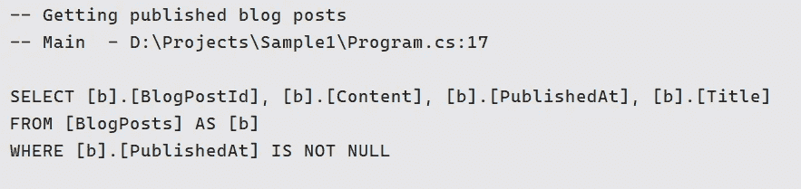

# EF 核心中实用的查询标记

> 原文：<https://itnext.io/practical-query-tagging-in-ef-core-ad0b38fa3436?source=collection_archive---------2----------------------->



示例查询标记！

EF 核心中的[查询标签](https://docs.microsoft.com/en-us/ef/core/querying/tags)是什么？

> 在 EF 核心 2.2 中有介绍。该功能有助于将代码中的 LINQ 查询与日志中捕获的生成的 SQL 查询相关联。使用新的`TagWith()`方法注释 LINQ 查询。

```
var publishedBlogPosts = dbContext.BlogPosts
    .Where(b => b.PublishedAt != null)
    .TagWith("Getting published blog posts")
    .ToList();
```

当 EF 用`TagWith`方法生成 SQL 时，它也将标签作为注释包含在查询中；因此，调试和分析查询可能会更容易。

```
-- Getting published blog postsSELECT [b].[BlogPostId], [b].[Content], [b].[PublishedAt], [b].[Title]
      FROM [BlogPosts] AS [b]
      WHERE [b].[PublishedAt] IS NOT NULL
```

## 如何让它更实用？

调试和分析都是为了获得更多的信息。我们可以通过[调用者信息属性](https://docs.microsoft.com/en-us/dotnet/csharp/language-reference/attributes/caller-information)轻松访问成员名称、代码行和源文件。

现在看看我的扩展方法:

它从编译器中检索方法名、文件路径和行号，并将其应用于任何`IQueryable<T>`。

**用法举例:**

```
var publishedBlogPosts = dbContext.BlogPosts
    .Where(b => b.PublishedAt != null)
    .TagWithSource("Getting published blog posts")
    .ToList();
```

生成的 SQL 将如下所示:

```
-- Getting published blog posts
-- Main  - D:\Projects\Sample1\Program.cs:17SELECT [b].[BlogPostId], [b].[Content], [b].[PublishedAt], [b].[Title]
      FROM [BlogPosts] AS [b]
      WHERE [b].[PublishedAt] IS NOT NULL
```

这种做法有一些限制，例如在从`BaseRepository`继承的情况下，您将获得基类的信息，而不是派生类的信息。

## 结论

查询标记是 EF Core 的一个很好的特性，将它与调用者信息结合起来对于调试来说是非常好的。