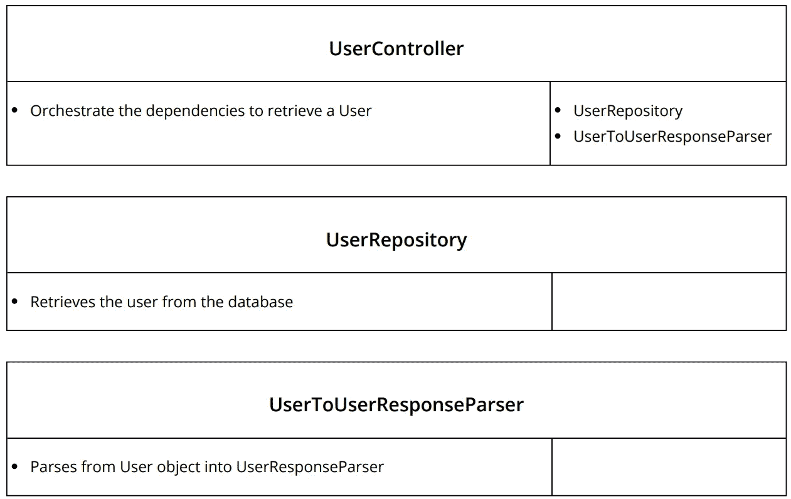
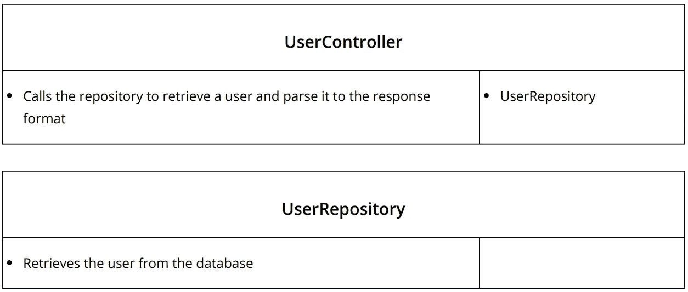

# TDD 实践课程 3 —班级协作

> 原文：<https://itnext.io/practical-tdd-3-9a76b3e045d8?source=collection_archive---------5----------------------->

在以前的帖子中，我解释了为什么 TDD 可以帮助你成为更好的开发人员，以及如何进行基本的 TDD 的两个实践课程([第一课](https://medium.com/@raphaelyoshiga/practical-tdd-first-lesson-1c689fffe4ec)，[第二课](https://medium.com/@raphaelyoshiga/practical-tdd-lesson-2-d9d48283b0c4))。现在，我将通过课堂教学协作，开始用 TDD 更接近真正的应用程序开发。

照片由 [Unsplash](https://unsplash.com/search/photos/collaboration-drawing?utm_source=unsplash&utm_medium=referral&utm_content=creditCopyText) 上的 [rawpixel](https://unsplash.com/photos/IJFnMSGY_bM?utm_source=unsplash&utm_medium=referral&utm_content=creditCopyText) 拍摄

在前面的场景中，测试是简单的数据测试，给定一个输入，就会有一个输出。但是在现实生活中，应用程序并没有那么简单，它们是由多个类组成的，这些类相互协作来完成期望的功能。

## 场景

假设我们有一个用户控制器，它需要调用用户存储库来获取用户，然后调用解析器来构建响应。基本合同:

示例的合同

如果我们试图测试 UserController 的实现，首先要测试的是控制器正在从存储库中获取用户。大概是这样的:

使用模拟测试(最小起订量)

在这个测试中，我们调用控制器，并验证使用正确的 id 调用了用户存储库。由于我们不想使用真正的存储库，我们需要模拟它，您可以通过实现接口或使用模拟框架来手动完成。对于这个例子，我将使用最小起订量。

在这之后，我们需要确保从存储库中检索到的用户调用解析器，所以它看起来像这样:

对于我们来说，存根存储库的结果，我们**设置它**，因为当它接收到那个 id 时，它返回用户对象。

但是等等，我们还需要从控制器返回那个用户，所以我们需要测试解析器的结果是否返回给客户机，而不是验证调用是否已经进行:

这样一步一步来，我们最终得到了这样一个文件:

你看到冗余了吗？例如，第一个测试“GetUserFromRepository”只测试对存储库的调用，但是这个调用已经被接下来的两个测试覆盖了。对于“ParseUserFromRepository”也是一样，最后一个测试也包括了协作，所以它们是多余的。清理之后，代码看起来像这样:

为什么我显示慢的方式？因为知道慢路径对你来说很重要，所以当你走得快时，你知道你没有错过测试覆盖率。

我们必须处理的另一个常见场景是处理异常。假设我们需要处理来自用户存储库的异常，如 UserNotFoundException。

# 匹配参数

值得一提的是，之前的测试使用等式来匹配参数。前夫;前妻;前男友;前女友

这些只是简单的相等比较，所以值类型在值级别进行比较(例如 int ),引用类型在内存中的指针处通过 equals 的默认实现进行比较。您可以覆盖相等比较以进行自定义比较。

匹配参数的另一种方法是使用 mocking 框架工具来完成。这些是特定于 Moq 的，但在其他框架中也会有它们的对等物:

## 有吗

它基本上匹配任何 int 类型的东西。**一般来说，它。代码中的 IsAny 意味着缺乏覆盖率**,因为测试任何东西都会通过，所以即使是错误的值也会通过测试。它主要在测试负面场景时有用，例如:

UserControllerShould > notcallrepositoryidfidlowerthanone

这将验证如果 id 小于 1，存储库甚至没有被调用。

## 它是

“It.is”基本上是一种调用参数匹配委托的方法，例如，如果您需要在测试中检查对象内部的属性，这很有用。

# 两种类型的 TDD

关于 TDD 和设计应该如何发生有两种基本观点。一个是经典的 TDD，因为几乎没有预先设计，您只需从测试中驱动整个实现。另一种选择更为人所知的是“模仿者”或伦敦学派的 TDD，这是你在开发之前已经设计好的地方，因为你要模仿一些东西。哪个更好？

老实说，它们都有其优点和特定的场景。根据我的经验，商业应用程序通常需要相当多的类协作，所以我发现自己更多地使用“模仿者”风格。

## CRC 卡

设计的一个技巧是 CRC 卡(类-责任-协作)，在这里你描述你需要的每一个特定业务特性的类。在描述中，您将拥有:

*   这个名字——想想就好
*   简言之，这就是责任
*   它的亲密合作者。

CRC 卡为例

用 https://echeung.me/crcmaker/[创建的图表](https://echeung.me/crcmaker/)

当使用 CRC 卡时，我已经使用真正的卡来绘制这些东西，伟大的事情是，然后你可以很容易地重新排列它们，向其他开发者解释事情。

## 一个单一责任被打破的例子

从根本上说，单一责任原则是我们开发人员应该努力遵循的，它意味着类和对象应该只有一个改变的理由。以下是一个违规示例:

分解的单一责任—用[https://echeung.me/crcmaker/](https://echeung.me/crcmaker/)创建的图表

如果没有解析器，现在控制器需要做所有的事情，实现如下所示:

控制器的测试也应该是这样的:

这个问题的一个很大的迹象是在测试中，它同时测试行为和数据，通过断言协作和返回对象的单独属性。在实现中，也有问题的暗示，因为控制器正在实例化响应本身。

## 结论

我希望这能帮助你踏上 TDD 之旅，这将为使用 TDD 开发真实世界的应用程序提供一个非常基本的工具集。下一步将是学习外-内 TDD，或双环 TDD，我以前在这里[解释过。](https://medium.com/asos-techblog/atdd-acceptance-test-driven-development-at-asos-81577568e4f2)

源代码也可以在[这里](https://github.com/RaphaelYoshiga/TDD)找到。

下一个 TDD 资源:

*   [为什么 TDD 会改变你的开发者生活](https://medium.com/@raphaelyoshiga/why-tdd-will-change-your-developer-life-b0bf234e15ac)
*   [实用 TDD —第一课](https://medium.com/@raphaelyoshiga/practical-tdd-first-lesson-1c689fffe4ec)
*   [实用 TDD —第二课](https://medium.com/@raphaelyoshiga/practical-tdd-lesson-2-d9d48283b0c4)
*   [验收测试驱动开发。带 Specflow 的网络核心](/acceptance-test-driven-development-in-net-core-with-specflow-dcb17fb7a893)