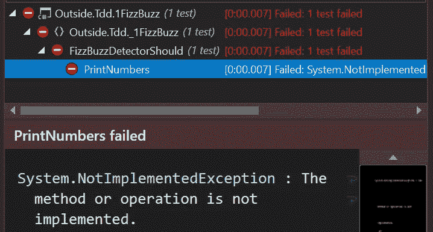
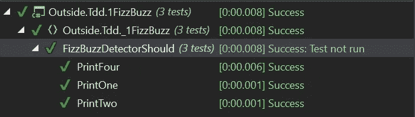
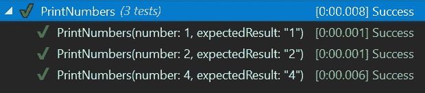

# 实用 TDD —第一课

> 原文：<https://itnext.io/practical-tdd-first-lesson-1c689fffe4ec?source=collection_archive---------5----------------------->

图片由[Shutterstock.com](https://www.shutterstock.com/download/confirm/684725344?src=zvWnUqavjaFpsQUYZNvT5Q-1-8&size=medium_jpg)

如果你正在尝试学习 TDD，这个系列就是为你准备的。在第一课中，我们将从基础开始，将 TDD 应用到一个简单的小问题中。不涉及类协作的东西，只有简单的输入和输出。

我是一名. net 开发人员，所以这个例子将使用 xUnit 和。net 核心，但是你可以用任何语言来把握概念。你可以从[这里](https://github.com/RaphaelYoshiga/TDD)下载最终解决方案。

这是第一课，所以我会讲得很慢，不抄近路。

## 规则

在本课中，我们将尝试遵循的唯一规则是 TDD 规则:

*   除了通过失败的测试之外，你不应该写生产代码
*   除了通过失败的测试所必需的，你不应该写更多的产品代码。
*   你不应该写更多的测试，而应该让它因为正确的原因而失败。

所以让我们把这个应用到 [FizzBuzz Kata](http://codingdojo.org/kata/FizzBuzz/) 中——写一个程序打印从 1 到 100 的数字。但是对于三的倍数打印“嘶嘶”而不是数字，五的倍数打印“嗡嗡”。对于 3 和 5 的倍数的数字，打印“FizzBuzz”。

鉴于这些要求，你认为第一个测试应该是什么？

我个人的观点是总是从最简单的开始，然后再去更难的部分。所以对于 TDD 形，我将从“打印从 1 到 100 的数字”开始，那些不是“嘶嘶”或“嗡嗡”的数字应该被简单地打印出来。

## 打印数字功能

首次测试执行

运行测试，看它是否失败。

那么现在，我如何让它通过呢？

大多数人都会来到这里，忙不迭地返回“i.ToString():”。那会违反第二条规则。除了通过失败的测试所必需的，你不应该写更多的产品代码。将它解析为字符串并不是使它通过的必要条件，最简单的方法是:

有些人可能认为这太多了。就是在那种情况下，但是跳过去了，不学规矩就会养成坏习惯。

那么接下来呢？继续打印数字:

仍然用最简单的方式传递:

将另一个场景添加到打印中

那么您仍然可以简单地实现:

> 第三次是一种魅力。

## 三角测量

那么现在可以给大家介绍一下**三角测量了。你需要这个模式出现三次，这样你就可以概括它了。**

所以现在我们在:

红色>绿色

所有测试都通过了，太棒了！

三角测量将帮助你避免过早地概括事物。

现在基本概念已经展示出来了，我将开始加速:

## 使用测试用例

在 xUnit 中有两种基本的测试。

*   事实就是事实，就是真理，单一执行。
*   理论是一组论点，会运行多次。

重构我们的测试来使用测试用例将会使它变得简洁:

理论测试执行

## 实现 Fizz 功能

还在遵守规则！首先编写测试:

并且仍然简单地实现:

和前面一样，我们可以得到:

现在我们有足够的三角测量:

经过同样的艰苦工作、测试、失败、重构，我们最终得到了最终结果:

## 结论

即使这个问题很简单，没有测试覆盖，你怎么知道一切都如预期的那样工作呢？您会调试许多输入吗？老实说，我认为你可以用你的时间做更好的事情。

我希望这能帮助你进入 TDD。

当我在将来像这样的更高级的形中取得进展时，请保持关注。

下一个 TDD 资源:

*   [为什么 TDD 会改变你的开发者生活](https://medium.com/@raphaelyoshiga/why-tdd-will-change-your-developer-life-b0bf234e15ac)
*   [实用 TDD —第二课](https://medium.com/@raphaelyoshiga/practical-tdd-lesson-2-d9d48283b0c4)
*   [实用 TDD——第三课课堂协作](https://medium.com/@raphaelyoshiga/practical-tdd-3-9a76b3e045d8)
*   [验收测试驱动开发用。net core 和 Specflow](/acceptance-test-driven-development-in-net-core-with-specflow-dcb17fb7a893)