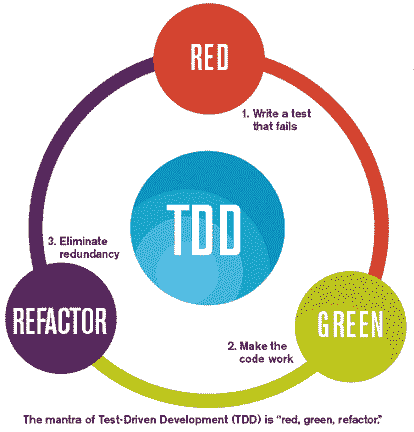
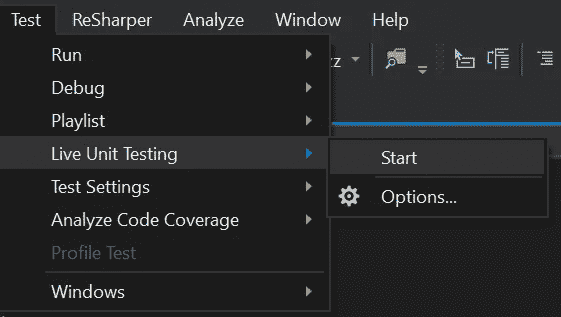
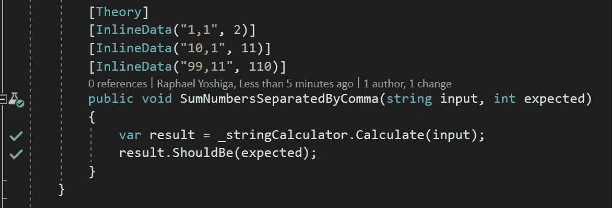

# 实用 TDD —第 2 课

> 原文：<https://itnext.io/practical-tdd-lesson-2-d9d48283b0c4?source=collection_archive---------0----------------------->

照片由[布鲁斯·马斯](https://www.pexels.com/@olly?utm_content=attributionCopyText&utm_medium=referral&utm_source=pexels)从[派克斯](https://www.pexels.com/photo/photo-of-a-woman-thinking-941555/?utm_content=attributionCopyText&utm_medium=referral&utm_source=pexels)拍摄

在[的最后一篇文章](https://medium.com/@raphaelyoshiga/practical-tdd-first-lesson-1c689fffe4ec)，我们用 TDD 做了 FizzBuzz 形。我觉得我展示了相当多的开发过程，但没有解释一些背景概念。在这篇文章中，我将后退几步，用例子展示理论和技巧。

## 测试结构

一般来说，测试通常由三个阶段组成:

*   安排(给定)-设置事物，准备依赖关系，等等。
*   动作(何时)—正在测试的动作
*   断言(Then) —验证结果

当编写测试时，将测试分成这些步骤是很有用的。例如:

这将有助于可读性和你写测试时的心态。

> 这些部分的注释仅供学习之用，不包括实际生产代码中的注释，仅使用空格进行逻辑分隔，如下所示:

## 红色、绿色、重构

当实践 TDD 时，你将进入一个循环，你编写测试，运行预期的失败，你使它通过，然后你重构它。可视化:

TDD 周期—图像[源](http://hanwax.github.io/assets/tdd_flow.png)

以我开始的[弦计算器形](https://github.com/garora/TDD-Katas/blob/master/KatasReadme.md)为例

> 字符串计算器要求:
> 
> 用 int Add(字符串数字)方法创建一个简单的字符串计算器。该方法可以接受 0、1 或 2 个数字，并将返回它们的总和(对于空字符串，它将返回 0)。例如“1”或“1，2”

当测试一个简单的场景时，一个位数返回其解析为整数的值。

过程是这样的:

*   测试“1”返回 1，失败>硬编码条件并返回 1 >通过
*   测试“155”是否返回 155 >失败>硬编码 155 >通过
*   测试“9”是否返回 9 >失败>硬编码 9 >通过

然后代码看起来像这样:

所以在这一点上，重构对我来说是完美的，我得到了很好的覆盖，一切都是绿色的，重构让我:

尽管一般来说你想尽可能经常地做这三个阶段，但是在这种情况下，我不能重构太多，直到我在抽象之前得到模式三次。

记得试着做 3 个阶段，TDD 初学者往往会进入红>绿，红>绿，红>绿>大规模重构的很多循环。

为了对抗以前的习惯，我通常将 devs 放入:

## TDD 时钟游戏

照片由[乔丹本顿](https://www.pexels.com/@bentonphotocinema?utm_content=attributionCopyText&utm_medium=referral&utm_source=pexels)从[派克斯](https://www.pexels.com/photo/shallow-focus-photography-of-hourglass-1095602/?utm_content=attributionCopyText&utm_medium=referral&utm_source=pexels)拍摄

这个游戏是一场简单的时间赛跑，开发者有几分钟的时间来思考他们下一步要做什么，他们可以选择:

*   添加更多的测试用例并继续实现
*   重构

一旦他们开始编码，我们就给他们设置一个计时器，(2-5 分钟待定)如果他们决定添加更多的测试用例，他们需要:

*   要添加测试，失败它
*   实现它，让它通过。

如果他们不能按时完成并提交，我们可以:

注意，开发人员只能在测试通过的情况下提交。

这个游戏很好地让开发人员想到小而简单，足以将问题分解成如此小的任务，以至于他们可以有如此短的迭代。此外，它拒绝大规模重构，因为如果你做了大规模的改变，你很可能会打破东西，超时运行。

## 测试也值得小心

有时会发生这种情况，TDD 的 3 个周期被应用到产品代码中，但是测试从来没有看到重构周期。测试代码和产品代码一样重要，它是文档，是你重构的安全网。如果测试变得臃肿，你可能会到了不理解和不信任它们的地步，那么很多 TDD 的好处就失去了。

在我使用字符串计算器的过程中，我的测试看起来是这样的，你能看出它有什么问题吗？

主要的事情是设置中的重复，例如，初始化 StringCalculator。有了 Xunit，我们可以做到:

> 对于像行为和断言这样的小事，我甚至不介意不把它们分开。

## 的奖金。net 开发人员

我希望在这之前，你已经养成了运行测试以使它失败的习惯，实现它，然后运行它们以使它们通过。

如果你学会了键盘快捷键，这应该不会太难，但是…让我向你介绍一下实时单元测试:

在 visual studio 中启用实时单元测试

实时单元测试是让 IDE 在每次检测到代码变化时自动运行测试。这 3 个周期仍然存在，唯一的区别是 IDE 将为您运行测试。这就是测试失败的原因:

Visual Studio live 单元测试测试失败

当他们经过的时候:

Visual Studio live 单元测试通过测试

这可以大大加快你的发展。

# 结论

关于这篇文章，我希望给你更多的理论知识，以及如何应用到实践中。我们讨论了测试结构的理论，TDD 循环，重构测试的重要性，以及。网芯。

你可以从[这里](https://github.com/RaphaelYoshiga/TDD/blob/master/Outside.Tdd.1FizzBuzz/StringCalculatorShould.cs)下载字符串计算器。

如果你正在阅读这个系列，我很乐意帮助你学习卡塔，把 GitHub 库发给我，我可以查看它们，看看我是否能给出什么好的见解。干杯。

下一个 TDD 资源:

*   [为什么 TDD 会改变你的开发者生活](https://medium.com/@raphaelyoshiga/why-tdd-will-change-your-developer-life-b0bf234e15ac)
*   [实用 TDD —第一课](https://medium.com/@raphaelyoshiga/practical-tdd-first-lesson-1c689fffe4ec)
*   [实用 TDD——第三课课堂协作](https://medium.com/@raphaelyoshiga/practical-tdd-3-9a76b3e045d8)
*   [验收测试驱动开发用。net core 和 Specflow](/acceptance-test-driven-development-in-net-core-with-specflow-dcb17fb7a893)