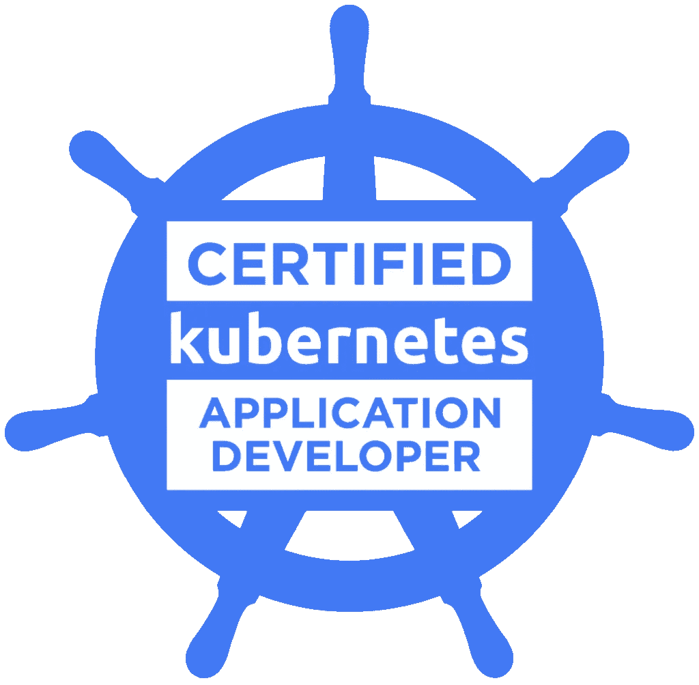
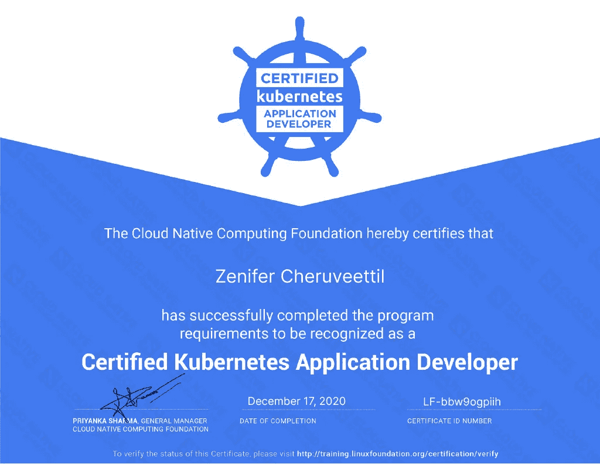

# 通过 CKAD 认证考试的实用技巧

> 原文：<https://itnext.io/practical-tips-for-passing-ckad-exam-6cbdf2d35cb1?source=collection_archive---------2----------------------->



## Kubernetes 认证

## 来自[云本地计算基金会](https://www.cncf.io/)的令人垂涎的[认证 Kubernetes 应用程序开发员](https://www.cncf.io/certification/ckad/)考试的准备技巧。

我已经在 kubernetes 工作了将近两年，我认为现在是验证我的技能的好时机。所以我参加了[云本地计算基金会](https://www.cncf.io/)的[认证 Kubernetes 应用开发者](https://www.cncf.io/certification/ckad/)考试并获得了认证。这篇文章的目的是分享我准备和参加考试的经验。



考完试等待了 36 个小时！

# **准备考试**

已经有一些好的资源可以帮助你做准备。你可以查看 https://github.com/dgkanatsios/CKAD-exercises 提供的全套练习。另一个非常有用的来源是[https://www . kata coda . com/liptanbiswas/courses/ckad-practice-challenges](https://www.katacoda.com/liptanbiswas/courses/ckad-practice-challenges)下给出的练习题。

但是如果你对 kubernetes 本身不是很熟悉，那么你应该考虑参加一些关于考试主题的培训。查看 CNCF 的[培训页面](https://www.cncf.io/certification/training/)了解最新优惠。通常，他们有结合认证注册和培训的套餐，通常比单独购买更便宜。

另一个划算但体面的选择是[来自](https://acloudguru.com/course/certified-kubernetes-application-developer-ckad)[*acloudguru.com*](http://acloudguru.com)的认证 Kubernetes 应用开发者(CKAD)课程。本课程包括几个视频讲座和实验练习，涵盖了考试的全部课程。考试的课程可以在这里找到。

如果你想更详细地了解 kubernetes，最好的书可能是 Marko Lukš的[Kubernetes in Action .](https://www.manning.com/books/kubernetes-in-action)

# **熟能生巧**

这对于 CKAD 考试来说再正确不过了。仅仅观看视频或参加培训并不能保证你在这次考试中取得成功。

> 如果你对命令行不是很在行，特别是对 [kubectl](https://kubernetes.io/docs/tasks/tools/install-kubectl/) 不是很在行，你很可能会失败。

实际考试包括 19 个问题，需要在 2 小时内回答，这意味着回答每个问题平均需要 6 分钟左右。不同的问题有不同的权重，所以为了达到 66%的及格分数，重点回答那些得分较高的问题确实有意义。

为了进行实践，您可以安装由任何公共云提供商(如 AWS 或 google)提供的托管 Kubernetes 服务。或者，您可以在笔记本电脑上安装一个单节点集群，使用任何流行的轻量级 kubernetes 解决方案，如 [k3s](https://k3s.io/) 、 [microk8s](https://microk8s.io/) 或 [minikube](https://github.com/kubernetes/minikube) 。

关于您的实践环境有几个问题——尽管考试中涵盖的主题与平台和提供商无关，但某些功能的实际实现并不是平台中立的。

下面是一些可能会有所不同的功能，具体取决于您的环境。

**服务和网络**

Kubernetes 的目标是抽象出所有底层的[复杂网络配置](https://kubernetes.io/docs/concepts/cluster-administration/networking/)，这些配置是动态提供容器工作负载(Pods)所必需的。由于这些神奇的功能，当您添加或删除服务时，您不需要配置 NAT、DNS 或 iptables。您还可以无缝地添加更高级别的抽象，如负载平衡器，而不必深入了解 HTTP 协议或反向代理设置。但是[每一个抽象都会在某一点上泄露](https://www.joelonsoftware.com/2002/11/11/the-law-of-leaky-abstractions/)并且不同厂商提供的各种网络插件在功能和性能上有所不同。

*网络服务策略*是考试课程中包含的功能之一，但其实现依赖于底层的[网络插件](https://kubernetes.io/docs/concepts/extend-kubernetes/compute-storage-net/network-plugins/)。对 Kubernetes 中网络的详细讨论超出了本文的范围，但是请检查您的集群平台是否由支持网络策略配置的 [CNI 插件](https://github.com/containernetworking/cni)支持。

我主要使用 [Azure Kubernetes 服务](https://azure.microsoft.com/en-us/services/kubernetes-service/)进行练习，默认情况下，该服务使用不支持网络策略的 [kubenet 插件](https://kubernetes.io/docs/concepts/extend-kubernetes/compute-storage-net/network-plugins/#kubenet)来构建集群。因此，我不得不使用更高级的插件，如 [Azure CNI](https://docs.microsoft.com/en-us/azure/aks/concepts-network) 或 [calico](https://www.projectcalico.org/) 来构建一个支持网络策略的集群(我发现 Azure CNI 有 bug 可以达到这个目的，但那是另一回事了)。

另一个可能依赖于底层平台的网络特性是使用类型为 [NodePort](https://kubernetes.io/docs/concepts/services-networking/service/#nodeport) 的服务。例如，AKS 不支持这种功能，所以您可能想检查一下您选择的平台是否支持它。

但是对于实际的考试，您不需要担心这些细节，因为我们保证会为您提供一个具有完成手头任务所需的所有必要功能的集群。作为 kubernetes 开发人员，您的工作就是了解如何利用实现的抽象。

**持久性**

坚持占课程的 8%,所以你可能不想错过它。但是配置一个[持久卷](https://kubernetes.io/docs/concepts/storage/persistent-volumes/)或[存储类](https://kubernetes.io/docs/concepts/storage/storage-classes/)可能是平台相关的，这取决于您想要如何配置底层磁盘存储。

这里也是为了实际的考试，您将只被要求使用诸如`hostPath`之类的配置来配置独立于平台的[持续卷](https://kubernetes.io/docs/concepts/storage/persistent-volumes/)。

# 时间管理的实用技巧

成功通过考试不仅需要一些好的经验和对 kubernetes 域和`kubectl`的熟悉，还需要大量的时间管理。下面的列表给了你一些在实际考试中节省时间和减少错误的建议。

## **别名**

当您没有时间重复执行相同的命令或者不想麻烦地搜索命令历史时，UNIX [alias](https://en.wikipedia.org/wiki/Alias_(command)) 是您的好朋友。你应该在考试开始的时候定义一些别名，这样你可以尽量减少打字错误，同时节省一些宝贵的时间。使用这些快捷方式没有什么不好意思的，因为测试的是 kubernetes，而不是快速打字。

以下是我最喜欢的一些命令别名:

```
zen@Zenifers-MBP ~ % alias k=kubectlzen@Zenifers-MBP ~ % alias kgp="k get pods"zen@Zenifers-MBP ~ % alias kns="k create ns"zen@Zenifers-MBP ~ % alias kgtx="k config get-contexts"zen@Zenifers-MBP ~ % alias kctx="k config set-context --current --namespace"
```

## 自动完成

kubectl 提供了[自动补全](https://kubernetes.io/docs/tasks/tools/install-kubectl/#enabling-shell-autocompletion)，这有时会派上用场。但是我对依靠这个有一种复杂的感觉，所以我在考试的时候没有使用它。一般来说，能够使用这个功能需要安装 *bash-completion。*一般来说，我不会认为这是安装在一个不熟悉的远程系统上，在那里我只能进行有限的访问。我也不会认为我有权利在那里安装它。

鉴于你有 19 个独立的任务要执行，并且你必须频繁地在集群之间切换，这种能力的好处在考试期间并不是那么高。如果你在考试中需要参考命令，学习如何简洁地使用`kubectl explain`。最后，记住你甚至有可能在考试时使用[命令参考页](https://kubernetes.io/docs/reference/generated/kubectl/kubectl-commands)！

## 编辑

考试期间你将不得不在很大程度上依赖文本编辑器。您将需要它来定义要创建的新对象，以及使用`kubectl edit` 命令编辑集群中的现有对象。

如果你像我一样是第六教堂(T4)的成员，那么你不需要做任何事情。在考试环境中，默认编辑器通常是 vim，我也是如此。但我也读过一些考生的故事，他们通过设置环境变量`KUBE_EDITOR`指向纳米来配置他们的环境使用纳米*。*

## 笔记本

您的考试环境包含一个基于 web 的记事本，您可以在整个考试过程中使用它。你可以用任何你想要的方式来使用它，但是我发现做以下事情非常有用:

*   一旦设置了别名，您应该在控制台上打印它们，并将所有别名命令复制到此记事本中。如果由于某种原因，您与终端断开连接，或者意外刷新了终端，那么您会得到一个新的终端会话，并且您的旧别名会丢失。但是你的记事本内容仍然完好无损，你可以把它复制到终端上，省去了重新输入的麻烦。也许您可以通过在 bash 概要文件中设置别名来解决这个问题，但是我没有这样做。
*   为了节省打字和减少错误，请将您最常用的命令复制到记事本上，以便重复使用。例如:

```
k run nginx --image=nginx --dry-run=client -o yaml > filename.yaml
```

## 验证答案(提示:聪明地使用 busybox)

在回答问题的过程中检查你所做的动作的正确性是一个很好的做法。如果你犯了一个错误，你可能会得零分。

根据问题的不同，您将不得不使用标准的`kubectl`命令或简单的 shell 命令来验证您的答案。但是有时您将不得不使用临时 pod 来执行集群内部的操作。这就是 [busybox 映像](https://hub.docker.com/_/busybox)派上用场的地方。

有几种方法可以使用它，比如首先创建一个 busybox 映像，然后登录到容器，执行您的测试命令，验证输出，然后删除 pod。但是这些步骤可以组合起来写成下面的简明形式:

```
k run  busybox-client-pod --image=busybox -it --rm --restart=Never -- <_your_command>
```

例如，您可能已经为 nginx 部署创建了一个 ClusterIP 类型的服务，现在您想要检查您是否可以通过新服务访问公开的 pod。在这种情况下，您将旋转如下所示的 busybox pod 来在您的服务 IP 上运行`wget -O-`。

```
 zen@Zenifers-MBP ~ % k expose deploy busybox-demo --port=80service/busybox-demo exposedzen@Zenifers-MBP ~ % k get svc -o wideNAME           TYPE        CLUSTER-IP   EXTERNAL-IP   PORT(S)        AGE    SELECTORbusybox-demo   ClusterIP   10.2.0.96    <none>        80/TCP         8s     app=busybox-demozen@Zenifers-MBP ~ % k run  busybox-client-pod --image=busybox -it --rm --restart=Never -- wget -O- 10.2.0.96:80Connecting to 10.2.0.96:80 (10.2.0.96:80)writing to stdout...
...</html>-                    100% |********************************|   612  0:00:00 ETAwritten to stdoutpod "busybox-client-pod" deleted
```

## 在 cmd vs args 上下定决心

我个人喜欢使用自以为是的 API，它最小化了用户的精神空间需求。不幸的是，在容器中执行命令并不是其中之一。

有几种不同的方式来实现从一个容器中打印出一个目标。这非常类似于使用 docker 的`ENTRYPOINT`和`CMD`命令的细微差别(参见我关于那个主题的[要点](https://gist.github.com/sensei-wu/bc853aba775fa5ddedd1e24d08ddd768))。

所以在 kubernetes 中，下面所有的都是从容器中打印 *hello* 的有效方法。

**v1:**

```
spec:containers:- args: - /bin/sh - -c - "while true; do echo hello; sleep 10;done" image: busybox name: cmd-demo
```

**v2:**

```
spec:containers:- args: [/bin/sh, -c, 'while true; do echo hello; sleep 10;done'] image: busybox name: cmd-demo
```

**v3:**

```
spec:containers:- command: ['/bin/sh'] args: [-c, 'while true; do echo hello; sleep 10;done'] image: busybox name: cmd-demo
```

如果您的命令是多行 shell 代码片段，事情可能会变得有点混乱。vim 不支持 yaml 这一事实也不会让您的生活变得更轻松。因为在这两个小时里会有很多其他的事情要担心，你可能想用上面的一种方法来使用*命令*或*参数*来避免考试中的混乱。

## 命令式与陈述式

对于现实生活中的项目，你应该主要使用基础设施作为代码，并避免使用命令式命令来构建系统，但在考试期间，你不应该回避命令式命令。对于一些操作，命令性命令提供了在集群中创建和修改对象的全部功能，您应该充分利用它。

当无法使用命令性命令创建或修改所需对象时，应使用`--dry-run=client -o yaml > filename.yaml` 选项生成一个文件。然后你可以根据你的需要调整它，执行`k apply -f filename.yaml`。

## 给参考文档的部分添加书签

考试期间，你可以打开一个额外的标签，其网址仅限于 https://kubernetes.io/[的域名和子域。为了方便参考，你可以考虑把它的一部分加上书签。例如，我知道创建一个持久卷需要定义一个 yaml 文件。那么将文档的这一部分(](https://kubernetes.io/)[https://kubernetes . io/docs/tasks/configure-pod-container/configure-persistent-volume-storage/# create-a-persistent volume](https://kubernetes.io/docs/tasks/configure-pod-container/configure-persistent-volume-storage/#create-a-persistentvolume))加入书签以便快速访问可能是有意义的。请记住，如果你能在 2 小时内像这样节省 5 次时间，你就有可能用它来回答一个额外的问题。

# 考试不需要什么

就 CKAD 考试而言，有些事情你不需要担心。以下是其中的一些:

*   设置集群—这仅与 [CKA](https://www.cncf.io/certification/cka/) 考试相关
*   配置对 docker hub 或注册表的访问——可以提取所有映像，而无需担心注册表或凭据
*   熟悉使用 docker——了解更多关于 docker 的知识肯定不会有坏处，但不是必需的
*   kubernetes 考试课程范围之外的对象——不需要担心诸如`Ingress`、`StatefulSets, LoadBalancer, ClusterRole`等东西。
*   集群或节点网络配置—可能会要求您定义[网络策略](https://kubernetes.io/docs/concepts/services-networking/network-policies/)，但不会要求您设置或配置[网络插件](https://github.com/containernetworking/cni)、VNETs 等。
*   掌舵命令和部署——一切只发生在`kubectl`身上

# 结束语

通过测试需要至少几天的集中准备。总的来说，我可能在 4-5 周内花了大约 40 个小时来准备这次考试。这包括观看大约 5 小时的 cloudguru 课程视频和做一些实验。但是我不得不承认，我偶尔会做得比通过认证所要求的更过分，比如玩 [ResourceQuotas](https://kubernetes.io/docs/concepts/policy/resource-quotas/) 、 [StatefulSets](https://kubernetes.io/docs/concepts/workloads/controllers/statefulset/) 和 [Pod 安全策略](https://kubernetes.io/docs/concepts/policy/pod-security-policy/)。

> 这个考试主要是关于速度的，所以不要依赖你在考试中查阅官方文档的能力。文档只是帮助你使用 kubernetes api，而不是在考试时学习概念，因为你没有足够的时间在每道题 6 分钟左右的时间里学习概念。

如果您是一名开发人员或 devops 工程师，那么实际操作并完全熟练使用 kubernetes 命令可以被认为是能够开发和部署应用程序的先决条件。

如果你是一名软件或基础架构架构师，该怎么办？获得管理 kubernetes 部署的实践技能仍然很有价值。但是 CKAD 仍然是一个面向开发者的测试。你必须非常熟悉实现，但不一定要熟悉底层的抽象。

> kubernetes 平台的真正复杂性来自于这样一个事实，即尽管不需要任何专业知识就可以在几分钟内启动一个集群，但要使相同的集群真正投入生产需要大量的艰苦工作。

kubernetes 开发人员与 kubernetes 解决方案架构师之间的区别在于，通过处理真实用例(如从头开始设计集群，以及解决安全性、高可用性、业务连续性和总拥有成本等问题)获得更深入的理解。为了达到这个目标，你必须超越 CKAD 测试的主题。CNCF 提供两种更高级的认证——CKA 的和 T2 的【CKS 的——涵盖了其中的许多主题。

我将很快分享我使用 Azure kubernetes 服务设计和实现 Kubernetes 集群的经验，以及 **kubernetes 技能能力矩阵**的后续帖子。