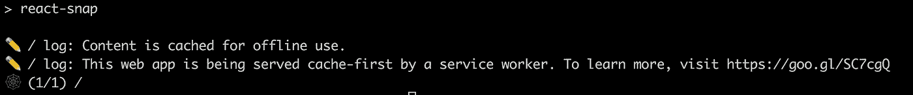
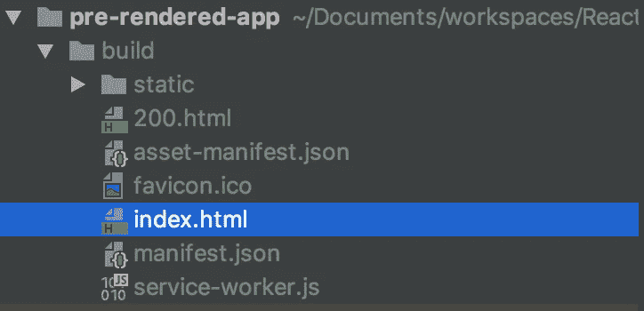
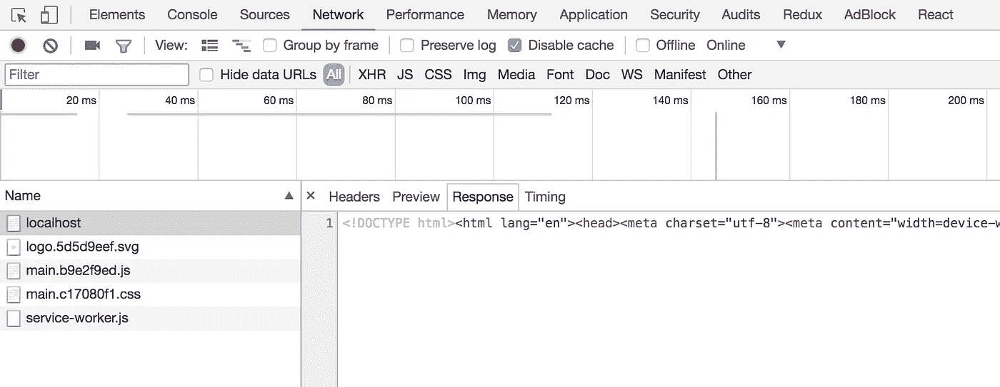

# 使用 react-snap 预渲染 React 应用程序

> 原文：<https://itnext.io/pre-rendering-your-react-application-with-react-snap-234e2408ed39?source=collection_archive---------1----------------------->

如果你想提高网站的搜索引擎优化性能，并使其对搜索引擎可见，那么预渲染 React 应用程序是非常有用的。大多数搜索引擎机器人不执行客户端 javascript 代码，这使得 React 制作的网站在搜索引擎结果中不可见。

即使谷歌说它正在执行客户端 Javascript 代码，它最好也能被其他搜索引擎看到。这个问题的一个解决方案是在服务器端预先渲染你的页面，然后把这个 html 文件返回给客户端或者搜索引擎机器人。

在本教程中，我将提到使用 [react-snap](https://github.com/stereobooster/react-snap) 预渲染你的应用程序。如果你想尝试不同的项目，你也可以尝试类似的选择，如[反应快照](https://github.com/geelen/react-snapshot)、[准备](https://github.com/graphcool/prep)或[预渲染-spa-插件](https://github.com/chrisvfritz/prerender-spa-plugin)。那么，我们开始吧。

首先，我们将使用 [create-react-app](https://github.com/facebook/create-react-app) 创建一个新的 react 应用程序。如果不知道怎么做，可以先看[这个教程](https://medium.com/@ahmetkapusuz/react-series-1-create-your-first-react-application-5aad15625da0)。

我正在用下面的命令创建应用程序:

```
create-react-app pre-rendered-app
```

然后转到应用程序文件夹，运行“npm start”来查看是否一切正常，您应该能够看到 react 应用程序示例的主页。

现在我们将安装 react-snap 作为开发依赖项。

```
npm install --only=dev react-snap
```

然后在 package.json 文件的 scripts 字段下添加以下行。

```
"postbuild": "react-snap"
```

您的 package.json 应该有如下所示的脚本部分:

```
"scripts": {
  "start": "react-scripts start",
  "build": "react-scripts build",
  "test": "react-scripts test --env=jsdom",
  "eject": "react-scripts eject",
  "postbuild": "react-snap"
}
```

现在更改 src/index.js:

```
**import** React **from** 'react';
**import** './index.css';
**import** App **from** './App';
**import** { hydrate, render } **from** 'react-dom';
**import** registerServiceWorker **from** './registerServiceWorker';

**const** rootElement = document.getElementById('root');
**if** (rootElement.hasChildNodes()) {
    hydrate(<App />, rootElement);
} **else** {
    render(<App />, rootElement);
}
registerServiceWorker();
```

所有配置都做好了！让我们建立，看看会发生什么。

```
npm install
npm run build
```

构建完成后，您将看到 react-snap 被执行并打印出一些类似于下面的日志。



构建之后，您可以使用 serve 命令为您的应用程序提供服务。如果没有安装，您可以通过命令“npm install -g serve”进行安装。

```
serve -s build
```

现在您的应用程序将在 5000 端口上提供服务，您可以在 [http://localhost:5000](http://localhost:5000) 上访问它。

你可以在构建文件夹下看到预渲染的 index.html 文件，你原来的 index.html 文件也被重命名为 200.html。



预渲染 index.html 文件

你也可以在 localhost:5000 页面打开 Chrome Developer Tool，进入网络选项卡，选择“所有”过滤器。然后刷新页面，您将看到响应本地主机请求的呈现的 html 文件。



你可以从这个 github repo 中获得完整的代码。