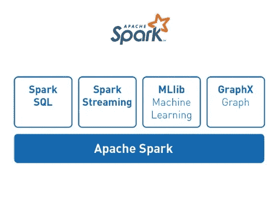
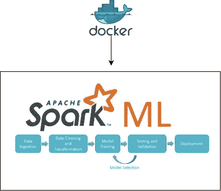
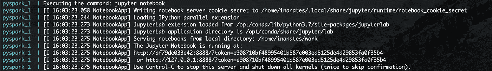
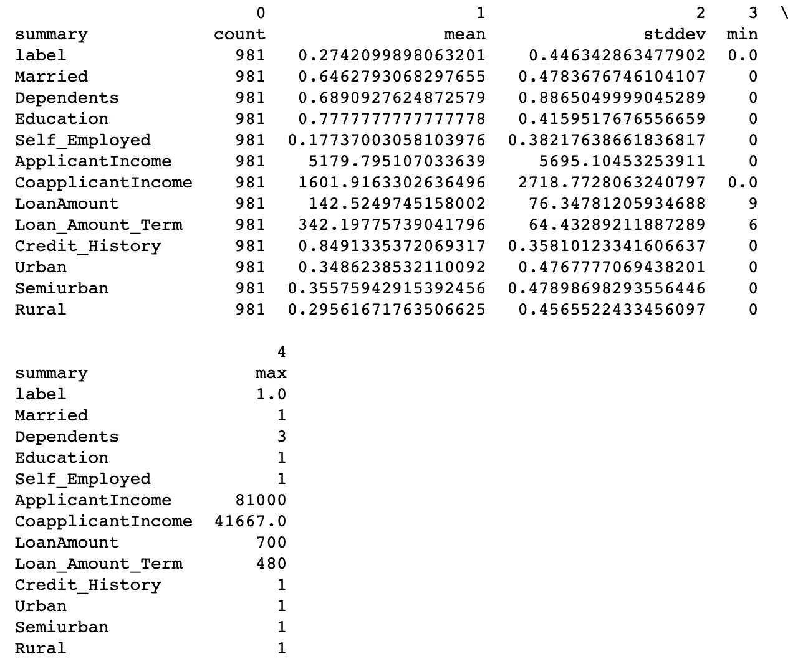
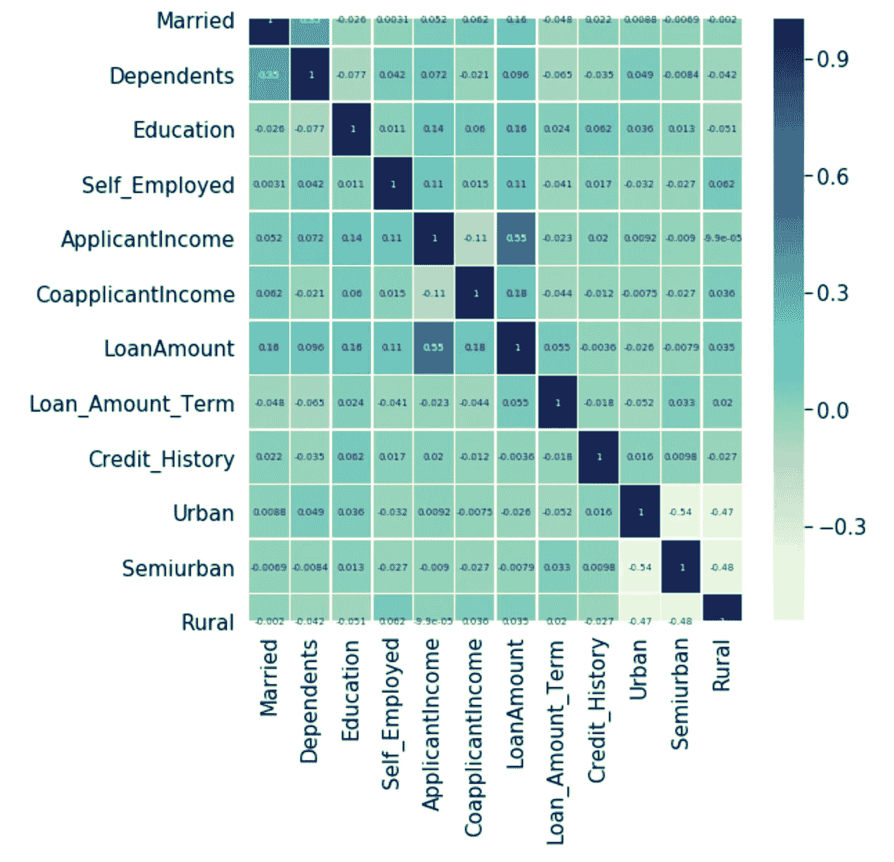

# 用 PySpark ML 和 Docker Part-1 预测信用风险

> 原文：<https://itnext.io/predicting-credit-risk-by-using-pyspark-ml-and-docker-part-1-eef141a50a7e?source=collection_archive---------3----------------------->

**分析关于信用风险的数据集**

信用风险可以解释为由于借款人未能偿还贷款或履行合同义务而造成损失的可能性。基本上，它意味着贷款人可能收不到所欠本金和利息的风险。更高的风险意味着更高的成本，这使得这个话题对许多人来说很重要。在本文中，我们将分析一个关于申请人贷款状态的数据集，并通过不同的机器学习算法对新的申请进行预测。

我们将使用 Spark 在本地分析数据集。我们使用 Spark 的原因是它促进了可伸缩性，并且提供了简单的集成。Spark 不是在一台机器上处理数据，而是使数据从业者能够以更好的规模交互式地处理他们的机器学习问题。

机器学习是一种通过分析数据来自动建立分析模型的方法。在本文中，我们将使用 PySpark 的二进制分类算法进行预测。首先，将使用数据对算法进行训练，这种训练将作为新预测的参考。


[Katarzyna Pe](https://unsplash.com/@kasiape?utm_source=unsplash&utm_medium=referral&utm_content=creditCopyText) 在 [Unsplash](https://unsplash.com/s/photos/machine--learning?utm_source=unsplash&utm_medium=referral&utm_content=creditCopyText) 上拍照

**阿帕奇火花**

Spark 是最重要的大数据技术之一，它为各种情况提供了分布式数据处理引擎。Spark 包括用于流处理、SQL、图形计算以及机器学习的库。它能够在 Java、Scala、Python 和 r 上编写应用程序。Apache Spark 在批处理和流数据方面都具有高性能，是处理大数据机器学习的最重要因素之一。在 Spark 中，您可以将数据分割成分区，然后在集群中的所有节点上并行处理这些分区。



本文将首先在本地分析一个数据集，然后在其上实现二进制分类算法。为了实现我们的算法，我们将通过 Docker 使用 Jupyter Notebook。

**什么是机器学习？**

机器学习是人工智能的一个应用。它基本上可以定义为使系统自动学习并从经验中改进。它是教会机器自己学习的科学。学习过程从训练数据开始，以便深入观察，然后根据我们提供的模式在未来做出更好的决策。



正如我们提到的，Spark 是大数据领域的重要参与者，Spark MLlib 提供了快速的机器学习能力。

# 项目设置

为了访问 Jupyter 笔记本，我们将使用下面的`docker-compose.yml`文件:

docker-compose.yml

这个`.yml`文件将使我们能够访问 Jupyter 笔记本。首先，我们应该打开终端，然后在`docker-compose.yml`文件的同一个文件夹中输入`$docker-compose up`(你可以通过[https://docs.docker.com/compose/install/](https://docs.docker.com/compose/install/)安装`docker-compose`

您可以通过`$docker ps`在终端中查看您正在运行的 docker 容器。这将向您显示正在运行的容器列表。在本教程中，我们有容器图像`.jupyter/all-spark-notebook:latest`和它的`CONTAINER ID`，我们输入终端`$docker logs CONTAINER_ID`:



在这里，您可以找到通过浏览器访问 Jupyter 笔记本的令牌。从那时起，您就可以访问 Jupyter Notebook 并创建一个 Python 项目。

# 导入数据

对于二元分类模型，我们将使用一个关于信用风险的数据集。它包括几个输入，输出将预测是否有资格获得贷款。为了导入数据，我们将使用`PySpark`。

首先，我们开始火花会议:

火花会议

创建 SparkSession 后，我们就可以读取本地数据了:

```
# reading data via Sparkdf = spark.read.csv(“./DataFolder/*.csv”, inferSchema = True, header = True, sep=”,”)
```

在本教程中，我们将两个单独的`.csv`文件放到一个文件夹中，并将它们集成在一起(这些文件必须具有相同的模式和参数类型)。Spark 会自动检测它，并将它伪装成一个文件。如果您分析单个文件，给出文件的路径就足够了。为了通过 Jupyter Notebook 演示该模式，我们键入:

```
df.printSchema()
```

以下是我们数据集的模式:

```
root
 |-- Loan_ID: string (nullable = true)
 |-- Gender: string (nullable = true)
 |-- Married: string (nullable = true)
 |-- Dependents: string (nullable = true)
 |-- Education: string (nullable = true)
 |-- Self_Employed: string (nullable = true)
 |-- ApplicantIncome: integer (nullable = true)
 |-- CoapplicantIncome: double (nullable = true)
 |-- LoanAmount: integer (nullable = true)
 |-- Loan_Amount_Term: integer (nullable = true)
 |-- Credit_History: integer (nullable = true)
 |-- Property_Area: string (nullable = true)
 |-- Loan_Status: string (nullable = true)
```

在此级别，输入变量是 Loan_ID、性别、已婚、受抚养人、教育、自营职业、申请人收入、共同申请人收入、贷款金额、贷款金额期限、信用历史、财产面积。

输出变量是 Loan_Status。输出将代表我们的预测变量。

# 为机器学习准备好数据

在我们的数据集中，有一些变量有二进制或三个不同的值。例如，让我们考虑一下`Property Area`。为了显示`Property Area`的不同值:

```
df.select(“Property_Area”).distinct().show()
```

输出是:

```
+-------------+
|Property_Area|
+-------------+
|        Urban|
|    Semiurban|
|        Rural|
+-------------+
```

如果我们更喜欢将这些值保存为字符串类型，这对我们的机器学习模型来说是很昂贵的。为了提高我们预测的性能，我们通过从`Property_Area`产生三个不同的整数类型属性来更好地修改这个列。

具有二进制值的其他属性稍后也会被修改:

```
df = df.withColumn(‘Married’, when(col(‘Married’)==’No’, 0).otherwise(1))df = df.withColumn(‘Education’, when(col(‘Education’)==’Not Graduate’, 0).otherwise(1))df = df.withColumn(‘Self_Employed’, when(col(‘Self_Employed’)==’No’, 0).otherwise(1))df = df.withColumn('Married', when(col('Married')=='No', 0).otherwise(1))df = df.withColumn('Education', when(col('Education')=='Not Graduate', 0).otherwise(1))df = df.withColumn('Self_Employed', when(col('Self_Employed')=='No', 0).otherwise(1))
```

经过这些修改后，我们有了具有新模式的新数据框架:

```
root
 |-- Loan_ID: string (nullable = true)
 |-- Gender: string (nullable = true)
 |-- Married: integer (nullable = false)
 |-- Dependents: string (nullable = true)
 |-- Education: integer (nullable = false)
 |-- Self_Employed: integer (nullable = false)
 |-- ApplicantIncome: integer (nullable = true)
 |-- CoapplicantIncome: double (nullable = true)
 |-- LoanAmount: integer (nullable = true)
 |-- Loan_Amount_Term: integer (nullable = true)
 |-- Credit_History: integer (nullable = true)
 |-- Property_Area: string (nullable = true)
 |-- Loan_Status: string (nullable = true)
 |-- Urban: integer (nullable = false)
 |-- Semiurban: integer (nullable = false)
 |-- Rural: integer (nullable = false)
```

因为我们已经用三个新属性修改了`Property Area`，所以它必须被删除。而`Loan_ID`是所有客户的唯一属性，在预测中没有作用。对于性能，也应删除:

```
drop_list = [‘Loan_ID’, ‘Property_Area’]df = df.select([column for column in df.columns if column not in drop_list])
```

在实现预测之前，我们最好做的另一个修改是对`Dependents`进行类型转换。我们首先通过`df.select("Dependents").distinct().show()`检查`Dependents`的不同值:

```
+----------+
|Dependents|
+----------+
|         1|
|         3|
|         2|
|         0|
+----------+
```

正如你所观察到的，虽然它有整数值，但它的类型是字符串。为了更好地预测，我们将把它转换为整数，并创建一个新的数据帧`df`:

现在，我们有适当的数据来实现机器学习算法。为了对数据进行统计概述，我们收集数字特征，然后以统计方式对其进行描述:

```
import pandas as pd## gather numerical featuresnumerical_features = [t[0] for t in df.dtypes if t[1] == ‘int’ or t[1]==’double’]
df_numeric = df.select(numerical_features).describe().toPandas().transpose()
```



此外，作为一种统计操作，我们可以生成一个相关矩阵，它可以帮助我们理解特征之间的关系:



**处理数据**

在 Spark ML 中，预测中使用的所有特性都应该是整数类型，或者应该转换为整数类型。现在，我们的数据框架中既有字符串形式的分类特征，也有整数形式的数字特征。分类特征首先将由`StringIndexer`编码，然后通过一键编码，它们将可用于期望连续特征的算法，如逻辑回归。在此转换之前，让我们定义分类和数字特征:

```
# detect categorical columns:categorical_cols = [item[0] for item in df.dtypes if item[1].startswith(‘string’)][:1]# detect numerical columns:numerical_cols = [item[0] for item in df.dtypes if item[1].startswith(‘int’) | item[1].startswith(‘double’)]
```

我们还没有准备好实现我们的机器学习算法。检测数据集中的缺失值是机器学习项目中的另一个重要任务。价值观缺失也可以看作是现实生活的凌乱。缺失值通常有几个原因，如数据输入过程中的人为错误、传感器读数不正确、数据处理流程中的软件错误等。

这将向我们显示哪个要素有多少缺失值:

```
[('Gender', 24),
 ('Dependents', 76),
 ('LoanAmount', 27),
 ('Loan_Amount_Term', 20),
 ('Credit_History', 79)]
```

在本文中，我们用数据集中每个要素的模式和平均值替换缺失值。

上面的脚本列出了缺失值的分类列和数字列:

```
cateogrical columns_miss: ['Gender']
numerical columns_miss: ['Dependents', 'LoanAmount', 'Loan_Amount_Term', 'Credit_History']
```

让我们用每列的众数和平均值来填充这些缺失值:

**使数据可用于机器学习**

此时，我们的数据集中没有缺失值。正如前面提到的，我们将用`StringIndexer`和`OneHotEncoderEstimator`来索引分类列。当`StringIndexer`正在为每个分类特征分配索引时，`StringIndexer`正在将分类列转换为独热编码向量。之后，我们通过转换特征的`VectorAssembler`将所有的特征列放入一个向量中。这个过程可以定义为构建机器学习管道的阶段:

您也可以在 [Databricks](https://docs.databricks.com/applications/machine-learning/mllib/binary-classification-mllib-pipelines.html) 网站上访问该脚本。

**结论**

在本文的第一部分中，我们转换了可用于机器学习算法的信用风险数据集，并对特征进行了分类。这些预处理过程被可视化以具有更好的概观。我们现在正在进行我们的项目。在下一部分中，我们将在 PySpark 中实现一个端到端的分类模型。

**参考文献**

[](https://databricks.com/blog/2016/08/15/how-to-use-sparksession-in-apache-spark-2-0.html) [## 如何在 Apache Spark 2.0 中使用 SparkSession

### 在 Databricks 中尝试这种笔记本通常，会话是两个或多个实体之间的交互。在计算机中…

databricks.com](https://databricks.com/blog/2016/08/15/how-to-use-sparksession-in-apache-spark-2-0.html) [](https://spark.apache.org/docs/latest/ml-features) [## 提取、转换和选择特征

### 本节介绍处理要素的算法，大致分为以下几组:提取:提取…

spark.apache.org](https://spark.apache.org/docs/latest/ml-features)