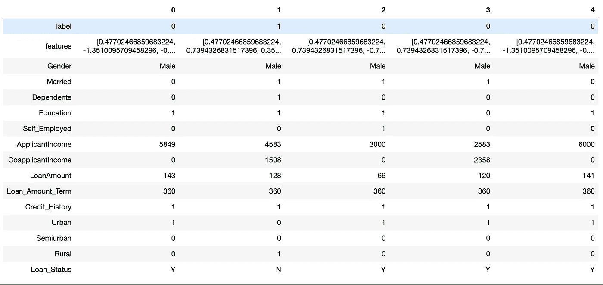
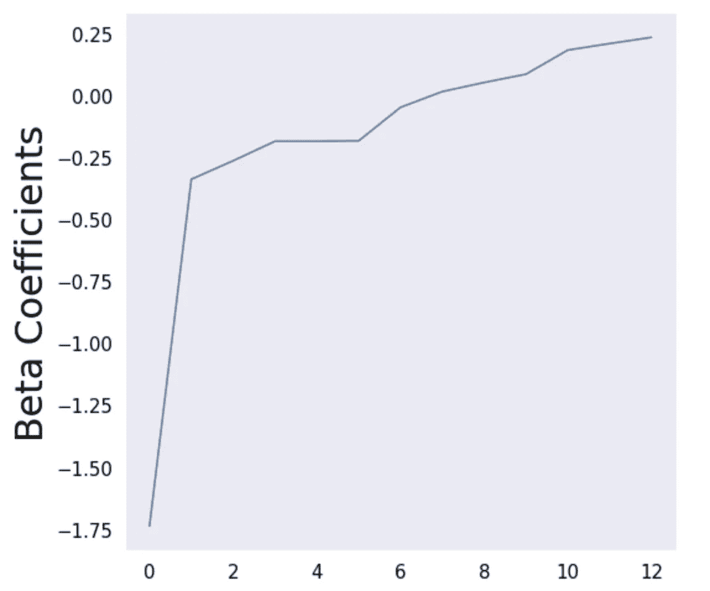
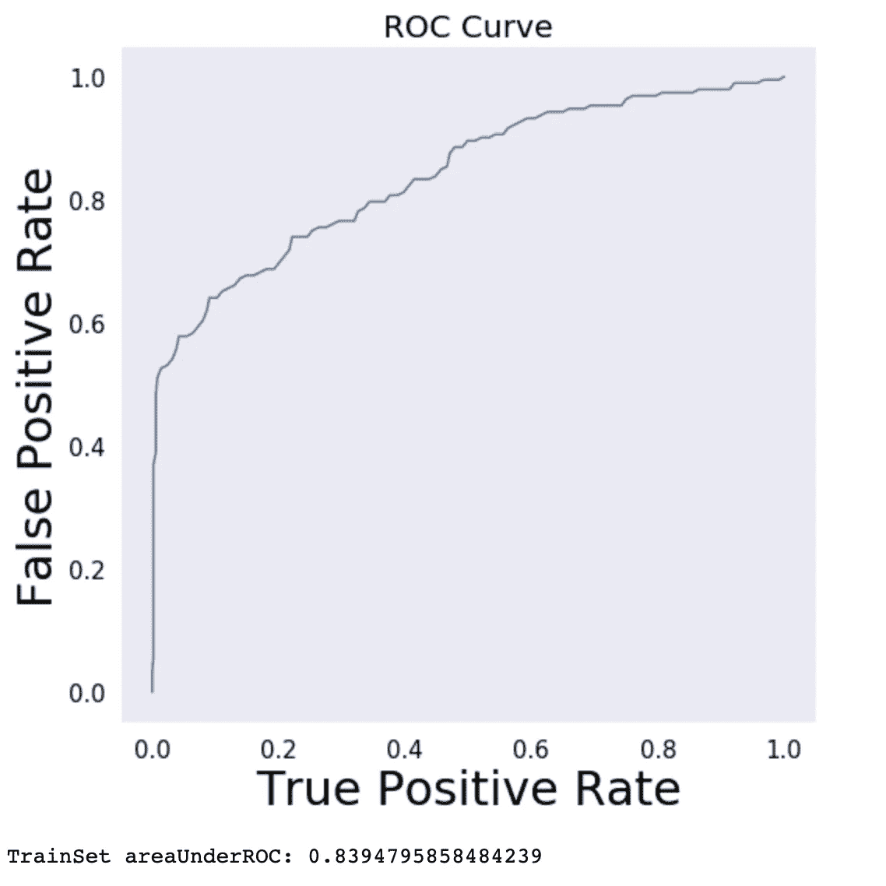
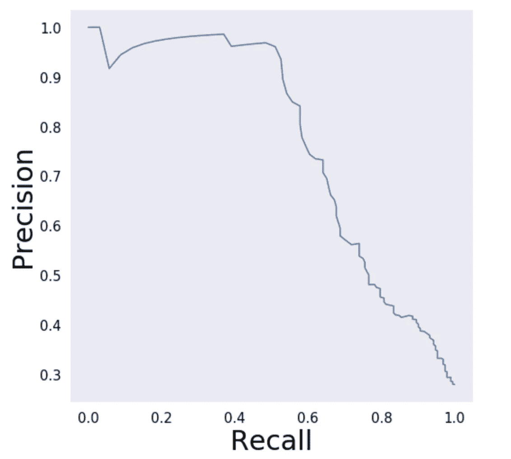
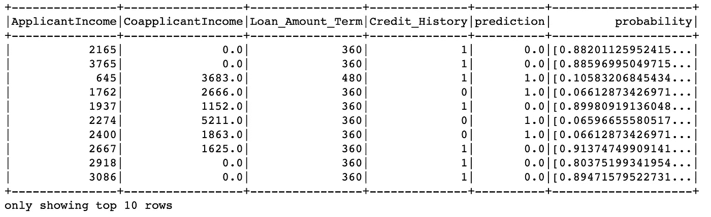
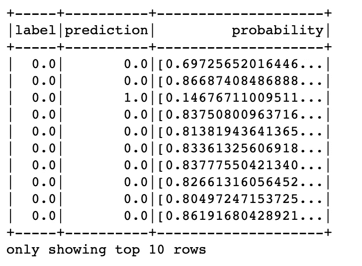

# 用 PySpark ML 和 Docker Part-2 预测信用风险

> 原文：<https://itnext.io/predicting-credit-risk-by-using-pyspark-ml-and-docker-part-2-7d3be25ae5e5?source=collection_archive---------5----------------------->

在我们端到端分类项目的[第一部分](/predicting-credit-risk-by-using-pyspark-ml-and-docker-part-1-eef141a50a7e)中，通过对特征进行分类，信用风险数据集被转换并可用于机器学习算法。在这一部分，将实现各种分类算法来预测`Loan_Status`。


[雷锐](https://unsplash.com/@ray30?utm_source=unsplash&utm_medium=referral&utm_content=creditCopyText)在 [Unsplash](https://unsplash.com/s/photos/machine--learning?utm_source=unsplash&utm_medium=referral&utm_content=creditCopyText) 上拍照

**管道**

在机器学习中，运行不同的算法来处理和学习数据。我们从每个单词创建数字特征向量，然后算法从这些向量和标签中学习。每个流水线包括或者是`Transformer`或者是`Estimator`的阶段。

基本上，一个`Transformer`实现了一个方法`transform()`，它将一个`DataFrame`转换成另一个，通常是通过追加一个或多个列。另一方面，`Estimator`接受数据帧并通过`fit()`方法创建模型。让我们开始构建我们的管道:



管道已经建立，我们准备将数据分成两部分:训练和测试。

```
(train, test) = df.randomSplit([0.7, 0.3], seed = 1)
```

**逻辑回归**

Spark ML 在数据帧之上提供了一组高级 API，使我们能够实现 ML 算法。逻辑回归是预测分类结果的一种众所周知的算法。该算法使用逻辑函数来模拟二元因变量。逻辑回归有不同的类型，如二元，多项式和有序逻辑回归。在本文中，我们使用二元逻辑回归来预测一个二元结果，它有两个分类结果，如是或否。

```
## Logistic Regression
from pyspark.ml.classification import LogisticRegressionlr = LogisticRegression(featuresCol = ‘features’, labelCol = ‘label’, maxIter=100)
lrModel = lr.fit(train)
```

让我们来解释这些系数:

```
import matplotlib.pyplot as plt
import numpy as npbeta = np.sort(lrModel.coefficients)
plt.plot(beta)
plt.ylabel(‘Beta Coefficients’)
plt.show()
```



然后我们画出`ROC` ( **接收器工作特性**)和`AUC` ( **曲线下面积**)。它是检验任何分类模型性能的最重要的评价指标之一。这将为我们提供一个性能测量，这是机器学习的一个基本任务。我们可以将 ROC 定义为概率曲线，AUC 代表可分性的度量。它确保了我们的模型能够区分不同的类。

```
trainSet = lrModel.summary
roc = trainSet.roc.toPandas()
plt.plot(roc[‘FPR’],roc[‘TPR’])
plt.ylabel(‘False Positive Rate’)
plt.xlabel(‘True Positive Rate’)
plt.title(‘ROC Curve’)
plt.show()
print(‘TrainSet areaUnderROC: ‘ + str(trainSet.areaUnderROC))
```



精度和召回显示如下:

```
pr = trainSet.pr.toPandas()
plt.plot(pr[‘recall’],pr[‘precision’])
plt.ylabel(‘Precision’)
plt.xlabel(‘Recall’)
plt.show()
```



让我们在测试集上做一些预测:

```
## make predictionspredictions = lrModel.transform(test)predictions.select(‘ApplicantIncome’, ‘CoapplicantIncome’, ‘Loan_Amount_Term’, ‘Credit_History’, ‘prediction’, ‘probability’).show(10)
```



**二元分类**

`Binary Classification`的任务是预测一个二进制标签。在我们的模型中，我们将预测一个人能否获得贷款。

```
from pyspark.ml.evaluation import BinaryClassificationEvaluatorevaluator = BinaryClassificationEvaluator()
print(‘Test Area Under ROC’, evaluator.evaluate(predictions))
```

ROC 下哪个给出的测试 Ares:*0.86838383831*

**随机森林**

随机森林是一组决策树，每个决策树使用`Mojority of Voting`。该算法通过组合决策树来降低过拟合的风险。

```
## Random Forest Classifierfrom pyspark.ml.classification import RandomForestClassifier# Creating RandomForest model.
rf = RandomForestClassifier(labelCol=”label”, featuresCol=”features”)## train the model
rfModel = rf.fit(train)## make predictions
predictions = rfModel.transform(test)
rfPredictions = predictions.select("label", "prediction", "probability")
rfPredictions.show(10)
```



随机森林预测

```
## evaluate the Rnadom Forest Classifierfrom pyspark.ml.evaluation import BinaryClassificationEvaluatorevaluator = BinaryClassificationEvaluator()
evaluator.evaluate(predictions)print(‘Random Forest Test areaUnderROC: {}’.format(evaluator.evaluate(predictions)))
```

和随机森林试验区:0.84866686767767

**梯度增强树分类器**

梯度增强的树分类器也是一组决策树，它们迭代地训练决策树以最小化损失函数。

```
## Gradient-Boosted Tree Classifierfrom pyspark.ml.classification import GBTClassifiergbt = GBTClassifier(labelCol=”label”, featuresCol=”features”,maxIter=10)pipeline = Pipeline(stages=stages+[gbt])
(traininggbt, testgbt) = df_copy.randomSplit([0.7, 0.3], seed=1)
gbtModel = pipeline.fit(traininggbt)
```

进行预测:

```
from pyspark.ml.evaluation import MulticlassClassificationEvaluatorpredictions =gbtModel.transform(testgbt)# Show predictions
predictions.select(‘label’, ‘prediction’, ‘probability’).show(10)
```


GBT 预言

梯度增强树分类器的评估可以如下进行:

```
evaluator = BinaryClassificationEvaluator()print(“GBT Test Area Under ROC: “ + str(evaluator.evaluate(predictions, {evaluator.metricName: “areaUnderROC”})))
```

导致 *GBT 试验区 ROC: 0.813024203211119* 。

**ParamGridBuilder 和 CrossValidator**

模型选择，也称为调整，在机器学习中有着重要的作用。目标是试图为给定的数据集找到最佳的模型或参数，以提高性能。在本文中，我们将使用五重交叉验证。对于大型数据集来说，这一过程的成本可能很高，因为 Spark 应该检查参数的几种组合。

```
from pyspark.ml.tuning import ParamGridBuilder, CrossValidatorparamGrid = ParamGridBuilder()\
 .addGrid(lr.aggregationDepth,[2,5,10])\
 .addGrid(lr.elasticNetParam,[0.0, 0.5, 1.0])\
 .addGrid(lr.fitIntercept,[False, True])\
 .addGrid(lr.maxIter,[10, 100, 1000])\
 .addGrid(lr.regParam,[0.01, 0.5, 2.0]) \
 .build()
```

然后我们创建五重交叉验证器:

```
cv = CrossValidator(estimator=lr, estimatorParamMaps=paramGrid, evaluator=evaluator, numFolds=5)# Run cross validations
cvModel = cv.fit(train)predict_train=cvModel.transform(train)
predict_test=cvModel.transform(test)
print(“Cross-validation areaUnderROC for train set is {}”.format(evaluator.evaluate(predict_train)))
print(“Cross-validation areaUnderROC for test set is {}”.format(evaluator.evaluate(predict_test)))
```

这导致:

```
Cross-validation areaUnderROC for train set is 0.8361628101944998
Cross-validation areaUnderROC for test set is 0.811416490486258
```

**结论**

最后，本文描述了 PySpark 中基本的二进制分类实现。我们展示了不同的算法来进行比较，并最终应用交叉验证来提高性能。它还展示了 Apache Spark 的效率及其特性。

**参考文献**

[](https://spark.apache.org/docs/latest/ml-pipeline.html) [## ML 管道

### \newcommand{\R}

spark.apache.org](https://spark.apache.org/docs/latest/ml-pipeline.html) [](https://spark.apache.org/docs/latest/ml-classification-regression.html) [## 分类和回归

### \newcommand{\R}

spark.apache.org](https://spark.apache.org/docs/latest/ml-classification-regression.html) [](https://spark.apache.org/docs/latest/ml-tuning.html) [## ML Tuning - Spark 2.4.4 文档

### \newcommand{\R}

spark.apache.org](https://spark.apache.org/docs/latest/ml-tuning.html)