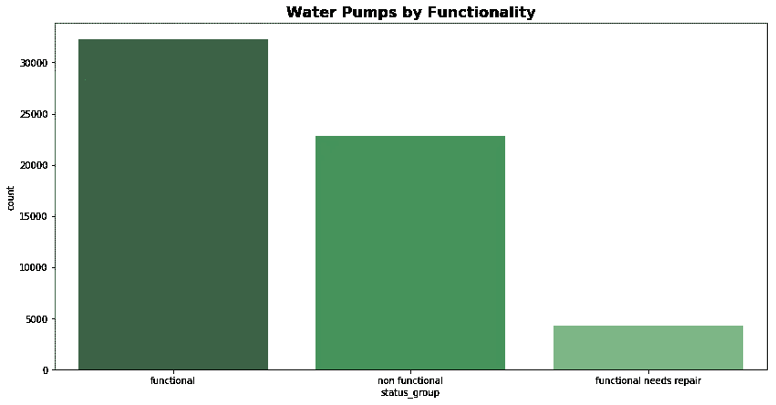
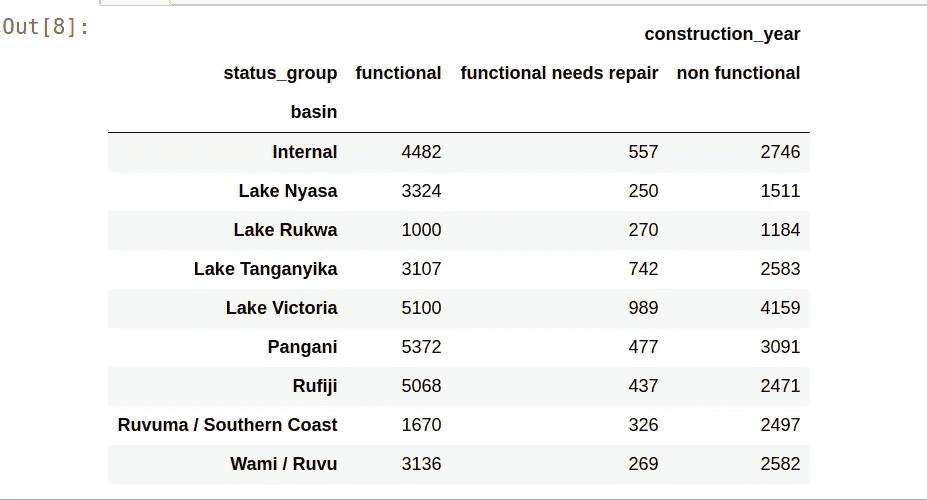
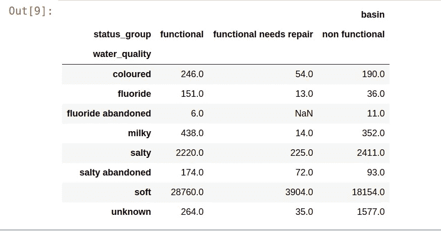
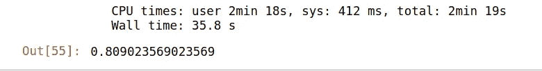
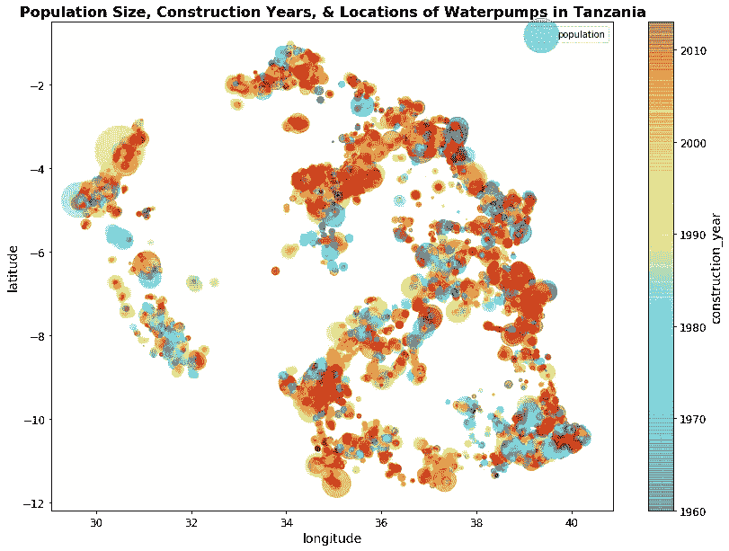
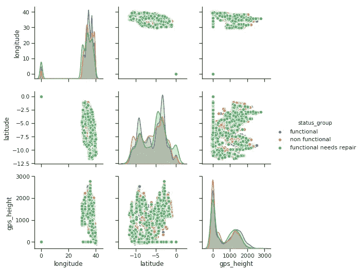

# 使用 Python 中的随机森林和逻辑回归预测坦桑尼亚的功能水泵

> 原文：<https://itnext.io/predicting-functional-water-pumps-in-tanzania-using-random-forests-and-logistic-regression-in-ffa04b0617f2?source=collection_archive---------7----------------------->

对于同一数据集的基线模型和初始逻辑回归，请参见本文末尾第二个附加的 jupyter 笔记本

坦桑尼亚马拉河流域，当地的孩子们在抽取地下水。安娜·莱默斯 2016[http://maraselva . FIU . edu/en/周六早上打水/](http://maraselva.fiu.edu/en/fetching-water-on-a-saturday-morning/)

[这一整周，我都在为课堂上的 Kaggle 挑战赛](https://www.kaggle.com/manjulamishra/water-pumps-random-forest-model-and-plots)处理坦桑尼亚的水泵数据。“坦桑尼亚的水泵”是一个有趣的数据集。目标变量由三类水泵组成:功能性水泵、非功能性水泵和需要维修的水泵。这是一个如何准确预测类别的经典分类问题。挑战在于我们能否预测哪些泵在工作。

数据集大小不错，但需要认真清理。除了几个数字变量，大多数特征都是分类的。考虑到缺少的值的数量，数字特性没有太大的帮助。然而，它们足够重要，不能被丢弃。另一方面，与数字特征相比，分类变量没有很多缺失值，但几乎每个变量都代表至少数百个类别。例如:特征*‘wpt _ name’*有 45600 种类型的名称。在随附的笔记本中，您将看到:

1.  手动清理，因为我想手工挑选代表最多信息的类别数量(也是为了防止我的笔记本电脑崩溃)。
2.  熊猫分类变量的虚拟编码
3.  决策树模型
4.  随机森林模型
5.  很酷的可视化效果！
6.  附 jupyter 笔记本。

让我们先来看看功能正常、不正常或需要维修的泵的数量:

我们还可以在不同的流域划分不同等级的水泵:

另一个有趣的发现是根据水的类型检查功能:

让我们来看一些手动清洁的例子(更多信息，请参见随附的笔记本):

**决策树:**

**随机森林:**

这是一个不错的测试准确度分数。我不想过分拟合这个模型，因为它是一个 Kaggle 竞争的意思，我们不会知道我们的预测对地面真相的准确性，直到私人董事会的结果出来。很高兴地告诉大家，[私人排行榜](https://www.kaggle.com/c/ds1-predictive-modeling-challenge/leaderboard)上的准确度分数(射频准确度分数:0.80846)与我的[公共排行榜](https://www.kaggle.com/c/ds1-predictive-modeling-challenge/leaderboard)(射频准确度分数:0.8090235)非常一致。

笔记本上的一些很酷的视觉效果:

基线模型和逻辑回归在下面的附加笔记本中:

1.  带模式的基线
2.  阶级不平衡
3.  只有数字特征的逻辑回归
4.  编码分类特征后的逻辑回归
5.  具有编码分类特征并使用来自 sklearn 的标准标量的逻辑回归