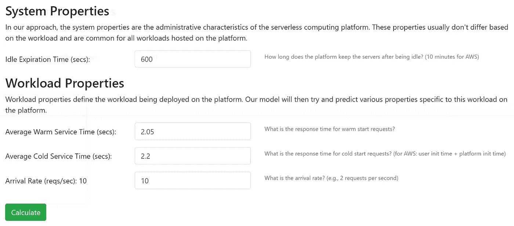
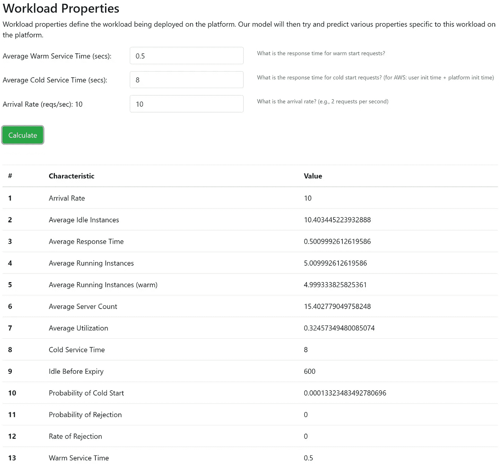
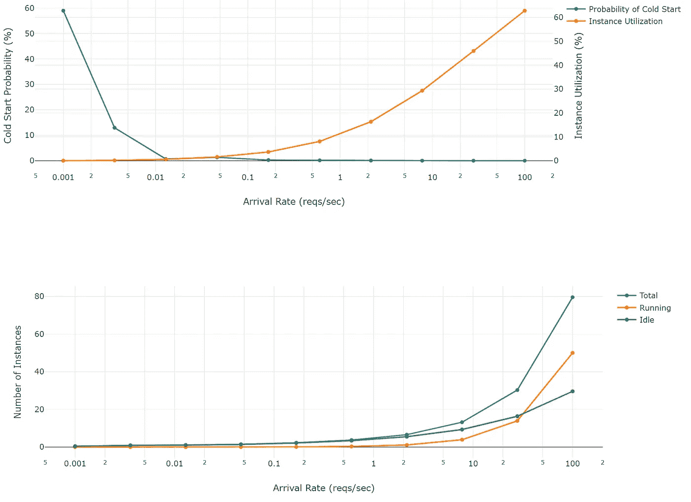
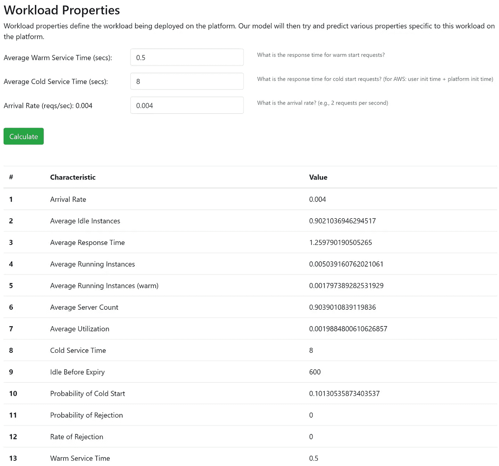
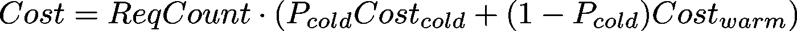

# 预测不同工作负载强度下无服务器工作负载的成本和性能

> 原文：<https://itnext.io/predicting-the-cost-and-performance-of-serverless-workloads-under-different-workload-intensities-ef8e2cd895ba?source=collection_archive---------1----------------------->

巴德·赫利松在 [Unsplash](https://unsplash.com?utm_source=medium&utm_medium=referral) 上的照片

无服务器计算是云计算未来最有前途的趋势。截至 2020 年，所有主要的云提供商都提供各种各样的无服务器服务。不同云提供商提供的一些 FaaS 产品有 AWS Lambda、Google Cloud Functions、Google Cloud Run、Azure Functions 和 IBM Cloud Functions。如果您想使用您当前的基础设施，您也可以使用开源替代方案，如 OpenFaaS、IronFunctions、Apache OpenWhisk、Kubeless、裂变、OpenLambda 和 Knative。

在[的上一篇文章](/autoscaling-patterns-in-serverless-computing-you-should-know-about-9d8c5d00d324)中，我重复了主要云服务中使用的最重要的自动伸缩模式，以及它们的优缺点。在这篇文章中，我将使用一个性能模型来预测不同工作负载强度(根据每秒请求数)的按请求扩展的无服务器平台(如 AWS Lambda、IBM Cloud Functions、Azure Functions 和 Google Cloud Functions)的关键性能特征和成本。我还将在最后包含一个模拟器的链接，它可以生成更详细的见解。

# 性能模型

性能模型是“根据消耗的资源、资源争用以及由处理或物理限制引入的延迟来定义提议的或实际的系统操作方式的重要方面的模型”[来源](https://www.encyclopedia.com/computing/dictionaries-thesauruses-pictures-and-press-releases/performance-model)。因此，使用性能模型，您可以“预测”您的服务的不同特征将在不同的设置中如何变化，而不需要为它们执行昂贵的实验。

我们今天将使用的性能模型来自我最近的一篇名为“[无服务器计算平台性能建模](https://research.nima-dev.com/publication/mahmoudi-2020-tccserverless/)”的论文。你可以尝试我的模型的一个[交互版本](https://nima-dev.com/serverless-performance-modeling/)，看看你能从它那里期待什么样的信息。

# 先决条件

在开始之前，我们需要做一些事情来提取性能模型所需的信息。此处介绍的模型旨在需要用户最少的输入来进行预测。这些输入基本上可以归类到“系统属性”中，这些属性只取决于你使用的平台(AWS Lambda，或者 GCP 云函数，等等)。)，或者“工作负载属性”，这取决于您在平台上运行的实际工作负载。以下是互动模型网站的输入截图:

用户需要向性能模型提供的输入属性以及一些默认值。

您需要提供的唯一系统属性是“空闲过期时间”，这是无服务器平台在您最后一次请求之后，终止它并释放它的资源之前，将保留您的函数实例的时间量(要了解更多信息，您必须阅读我的文章，尤其是系统描述部分)。好消息是，这是所有工作负载的固定值，您不需要考虑，对于 AWS Lambda、Google Cloud Function 和 IBM Cloud Functions 是 10 分钟，对于 Azure Functions 是 20 分钟。

接下来你需要的是你的函数的冷/热响应时间。目前，获得这个值的唯一方法是在平台上实际运行代码，并测量响应时间。当然，有[工具](https://github.com/alexcasalboni/aws-lambda-power-tuning)可以帮助你，但是我还没有使用过它们，所以，如果你能在评论中告诉我它们怎么样，我会很高兴。像 [AWS Lambda Power Tuning](https://github.com/alexcasalboni/aws-lambda-power-tuning) 这样的工具也可以告诉你不同内存设置的响应时间，这样你就可以检查哪个符合你的 QoS 保证。

**可选:**如果您想测量响应时间的第 95 百分位等特征，您还可以保留冷/热响应时间的分布。

**注意:**由于大多数无服务器计算平台(尤其是 AWS Lambda)在其性能方面非常一致和稳定，如果您的冷响应时间和热响应时间彼此非常接近(这通常发生在没有额外库或库很小的 Python/NodeJS 中)，那么您的响应时间不会随着不同的到达率而改变太多，也就是说，这就是您的响应时间！

# 工作负载示例

为了强调所展示的性能模型的重要性，我将使用一个深度学习工作负载的示例，该示例来自“[在无服务器平台](https://doi.org/10.1109/IC2E.2018.00052)中为深度学习模型提供服务，该平台在 AWS Lambda 上为 ResNet 模型提供服务，内存设置为 1.5GB。深度学习模型强调冷/热响应时间之间的差异，因为它们的冷启动请求需要从 S3 存储桶下载模型，提取模型，将其加载到内存中，然后根据输入进行预测。这是针对指定工作负载的性能模型的结果，假设我们每秒钟收到来自用户的 10 个请求:

示例场景的性能模型预测。

正如你所看到的，在这种情况下，冷启动的可能性非常低，你会有一个令人敬畏的表现，你的所有客户都会很高兴！

照片由[J E W E L M I T CH E L L L](https://unsplash.com/@preciousjfm?utm_source=medium&utm_medium=referral)在 [Unsplash](https://unsplash.com?utm_source=medium&utm_medium=referral) 上拍摄

此外，您可以在图表上查看冷启动的概率、实例利用率以及针对不同到达率运行的平均实例数:

现在，如您所知，根据无服务器计算平台的当前价格，像您这样每秒钟获得 10 次点击(每月超过 2600 万次请求)的受欢迎服务很可能不太划算，可能会在您自己的运行 IaaS 的服务器集群上提供。

现在，让我们假设你是一家新成立的公司，用户数量有限，预算紧张，期望很高。你没有一个非常大的用户群，目前，也许每月 10K 请求或每秒 0.004 次请求。然而，您决定利用无限的计算资源和无服务器计算的动态自动伸缩，以防用户群快速增长(这通常是您无法处理的)。此外，每月 100 万次请求的免费等级听起来也不错。以下是此到达率的性能模型结果:

每秒 0.004 个请求或每月 0.004 个 10K 请求的示例应用程序的结果。

如您所见，现在的结果非常不同，因为我们的请求中大约有 10%是冷启动请求。在这里，我们可以看到我们的平均响应时间，我们有机会更改内存配置，以确保我们达到用户期望的响应时间。让我们假设这个性能对于您的应用程序来说已经足够好了，让我们试着计算一下您在月底将会发生的总成本。

# 成本/性能计算

您可能已经知道，无服务器计算产品的定价非常复杂(根据设计？).为了准确起见，我们需要考虑入口/出口费用、数据中心内的网络流量、所选内存配置的每秒计算费用、特定服务(如 DynamoDB 或端到端机器学习)的使用等。为了简洁起见，有许多方法可以简化这一点，使本文简短。在这里，我将使用一种相当简单的方法，这种方法仍然非常准确，但需要您付出更多的努力。

就成本而言，归根结底是冷启动和热启动请求的每个请求的成本。例如，您可以使用 [AWS Lambda calculator](https://aws.amazon.com/lambda/pricing/#Calculator) 来获得特定工作负载的估计值(一次用于热执行持续时间，一次用于冷执行持续时间)，但请确保还添加了数据传输费用或您将从函数中使用的任何其他服务。然后，知道冷启动的概率(将经历函数的初始化步骤的请求的比率)和每个冷/热请求的成本，我们可以计算总成本:

例如，如果我们想用我们的示例工作负载来计算我们的每月成本，请求数(ReqCount)将是:

使用它我们可以得到我们每月的 AWS Lambda 账单的估计。

# 限制

像任何其他数学模型一样，我们今天使用的性能模型也有一些限制和假设，以正确工作。但是，不要太担心它们，因为我们还将引入一个无服务器性能模拟器来解决所有这些限制，但是需要更长的时间(更多的 CPU 周期)来生成结果。

**指数到达过程**

我将在这里介绍的性能模型的第一个也是最重要的限制是，它只能精确地与到达过程的[指数分布](https://en.wikipedia.org/wiki/Exponential_distribution)一起工作。一般来说，到达过程是[随机过程](https://en.wikipedia.org/w/index.php?title=Stochastic_process&oldid=728198050)，它决定到达间隔时间(两个连续到达请求之间的时间量)的分布。

数学证明，如果你有很多用户，每个用户在给定时刻发送请求的概率很低，那么你的到达过程将是指数级的。这基本上使得每个面向消费者的基于网络的产品都可以被这里给出的性能模型精确地建模。然而，如果您使用无服务器来处理批处理任务或 cronjobs，那么这个模型对您来说就不太准确了。在这种情况下，我建议检查一下我的无服务器性能模拟器，这将在后面讨论。

**指数服务流程**

这是另一个随机过程，决定服务器处理每个请求需要多长时间。如果您了解您的服务流程(并且您是随机流程方面的专家)，我建议您看看我的无服务器性能模拟器，我将在后面讨论。

**稳态计算**

此处使用的性能模型仅生成[稳态](https://en.wikipedia.org/wiki/Steady_state)计算，这意味着您仅获得将在长期实现的平均值。为了获得瞬态特性，您需要使用我的[时间性能模型](https://research.nima-dev.com/publication/mahmoudi-2020-tempperf/)或者……您猜对了，性能模拟器。

# 无服务器性能模拟器

这里给出的性能模型在处理时间方面非常快速和高效。但是，如前所述，它有一些局限性。如果这些限制对您来说是一个交易破坏者，并且您想要更准确的性能/成本预测，我们为您创建了一个名为 [SimFaaS](https://github.com/pacslab/simfaas) 的无服务器性能计算器。它是完全开源的，可以免费使用。您可以扩展到达和服务流程，以在其上模拟任何类型的工作负载。在我们的性能模型中计算的所有特性也可以由模拟器生成。

# 参考

*   [无服务器计算平台的性能建模](https://research.nima-dev.com/publication/mahmoudi-2020-tccserverless/) ( [交互模型](https://nima-dev.com/serverless-performance-modeling/)，[预印本](https://pacs.eecs.yorku.ca/pubs/pdf/mahmoudi2020tccserverless.pdf))
*   [SimFaaS:无服务器性能模拟器](https://github.com/pacslab/simfaas) ( [文档](https://simfaas.readthedocs.io/en/latest/))
*   [时间性能建模](https://research.nima-dev.com/publication/mahmoudi-2020-tempperf/)
*   [我的研究页面](https://research.nima-dev.com/)
*   [关于我们实验室(约克大学 PACS 实验室)的信息](https://pacs.eecs.yorku.ca/)

# 关于我

我是阿尔伯塔大学的博士生，约克大学的客座研究员，塞内卡学院的兼职讲师。我日复一日地研究无服务器计算平台，试图找到提高其性能、可靠性、能耗等的方法。，使用分析或数据驱动的方法(对“我要么使用数学要么使用机器学习来建模无服务器计算平台”的花哨说法)。我在这里写的是我在研究期间对一些无服务器计算平台的深入了解的结果。

如果你想更多地了解我，请查看我的[网站](https://nima-dev.com/)或[阅读更多关于我的研究](https://research.nima-dev.com/)。