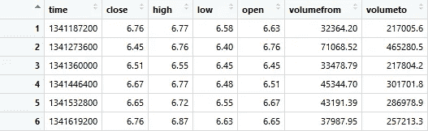
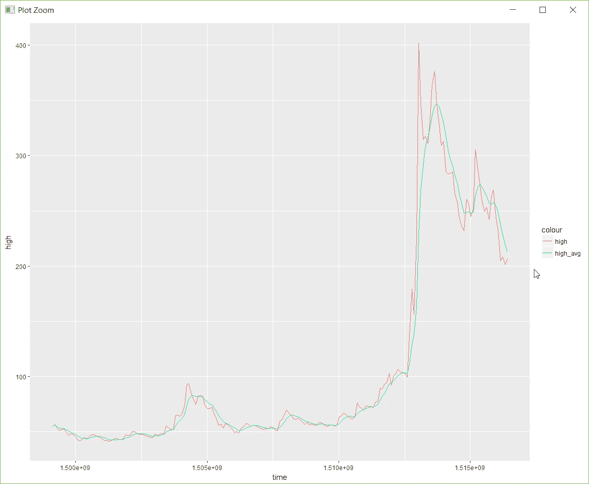
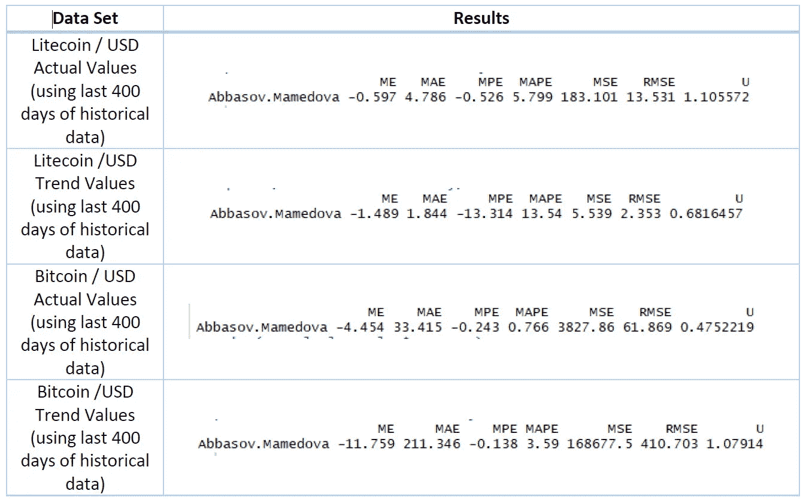

# 用模糊时间序列预测加密货币的价格

> 原文：<https://itnext.io/predicting-the-price-of-cryptocurrencies-using-fuzzy-time-series-in-r-577cba57d43c?source=collection_archive---------5----------------------->

[*点击这里在 LinkedIn* 上分享这篇文章](https://www.linkedin.com/cws/share?url=https%3A%2F%2Fitnext.io%2Fpredicting-the-price-of-cryptocurrencies-using-fuzzy-time-series-in-r-577cba57d43c)

统计学家、心理学家、数据挖掘者和其他学科对金融一直很感兴趣，原因有很多，比如它的盈利能力、它的混乱和它背后的心理学。老实说，金融市场很难预测。这种不可预测性是由于波动造成的，波动是许多参数的函数，如政府的政治决策、本地和全球新闻等。尽管如此复杂，但还是有可以预见的东西，那就是“市场心理”！根据[艾略特波浪原理](https://en.wikipedia.org/wiki/Elliott_wave_principle)等各种研究和原理，金融市场是周期波。在工程中，这被称为周期信号，周期的发生是由于市场背后的心态。举个简单的例子，如果加密货币 X 变得非常昂贵，每个人都想获利并开始出售他们的加密货币。在某种程度上，几乎每个人都是卖家，所以没有兴趣购买。卖家多，买家少，导致加密货币 x 的价格下跌。这种心态以各种形式重复，在数据中形成循环模式。

大量研究表明，这些趋势可以通过机器学习来预测；然而，市场中发生的确切价值和异常行为仍然难以预测。另一方面，许多投资者喜欢趋势预测，因为他们想知道何时买入或卖出。大多数投资者都在寻找利润，确切的价值并不是他们的主要兴趣。我相信 FTS 是趋势预测的好工具，因为其核心的模糊引擎可以处理金融市场主要表现出的不确定性。

一点理论应该足以开始尝试！说到这里，让我们遵循 [CRISP-DM](https://en.wikipedia.org/wiki/Cross-industry_standard_process_for_data_mining) 方法并开始编码。

## 让我们回顾一下我们正在解决的问题

作为 CRISP-DM 的第一步，我们需要了解业务/问题。问题是“利用历史数据预测加密价格或趋势”。

## 让我们阅读并理解这些数据

[Cryptocompare](https://www.cryptocompare.com/api/#-api-data-histoday) 为我们提供了一组丰富的 Rest APIs 来读取加密货币数据。使用他们的服务，我们可以读取比特币(BTC)对美元的价格:

```
library(jsonlite)dataset.btc <- fromJSON("https://min-api.cryptocompare.com/data/histoday?fsym=BTC&tsym=USD&limit=2000&aggregate=1&e=CCCAGG")# head is the old data and tail the new datatail(dataset.btc$Data)head(dataset.btc$Data) 
```



## 让我们来理解数据

以下是数据的描述:

*   时间:数据的 UNIX 时间(它是每日数据)
*   收盘:一天结束时比特币的价格
*   高:特定日期比特币的最高价格
*   低:特定日期比特币的最低价格
*   开盘:当天开盘时比特币的价格
*   成交量来源:交易量来源
*   交易价值

## 让我们准备数据

也许这一步是最重要的一步。**数据准备得越好，预测的质量和准确性就会提高**。我们来看一些可能的数据准备方法:

## 趋势计算

如前所述，在大多数情况下，趋势是更稳定的线，它们的预测更有可能。

r 提供了各种软件包和技术来计算趋势，其中我选择了“pracma”软件包和“movavg”函数来平滑信号和计算趋势，如下所示:

```
require(pracma)dataset.btc$Data$high_avg<-movavg(dataset.btc$Data$high,7,"w") 
```



在上面的图片中，你可以看到红色的 Litecoin 日高价格和绿色的平滑信号，这是价格的趋势。

## 修复 UNIX 时间

下面的函数将把 UNIX 日期转换成人类可读的格式。

```
library(dplyr)library(lubridate)convertUnix <- function(datast){# This function inputs the dataframe discussed above and adds a new column which is conversion of Unix date to human readable dates# Args:#   datast: cryptocurrency dataframe with aforementioned format## Return:#   datast: the same dataset + newly added columndata.frame(datast) %>% mutate(date=as.Date(as.POSIXct(time, origin="1970-01-01")))->datastreturn(datast)}
```

## 差值与实际值

在时间序列预测中，通常的做法是预测变化水平，而不是实际值。这提供了更好的行为洞察力，尤其是在“哪里”或“什么时候”？]实际值超出了界限，达到了以前从未出现过的数字(比如 2017 年比特币的价格达到了历史数据中从未出现过的 18k 美元)。如果计算增量，这些极端值仍然是可预测的(增量表示变化水平)。下面的函数计算这些增量。

```
convertPercent <- function(data){# This function inputs a vector of numbers and returns a vector that is the differences between ith and (i-1)th element# Args:#   data: the numeric input vector and thus not a dataframe# Return:#   data: the percentage of the changesdata= diff(data)/data[-NROW(data)] * 100return(data)}
```

## 让我们对数据进行建模

CRISP-DM 方法的第四阶段是关于建模和预测。我们使用 below 函数来传递实际值或趋势值，以预测加密货币的价格并分析其准确性。

```
FTS_Predict<- function(data,year,month,day,freq){# This function builds a time series and predicts the 5 steps ahead# Args:#   data: the values that should be predicted (trend or actual data)#   year: starting point of the data in terms of year#   month: starting point of the data in terms of month#   day: starting point of the data in terms of day#   freq: frequency to build the time series## Return:#   crypto_predict: the prediction and all attached information (such as accuracy and etc)#Changing format to TScrypto<-ts(data,start = c(year,month,day),frequency =freq )# Finding the best C value by DOC function# Abbasov-Mamedova modelstr.C1<-DOC(crypto,n=7,w=7,D1=0,D2=0,CEF="MAPE",type="Abbasov-Mamedova")C1<-as.numeric(str.C1[1])crypto_predict<-fuzzy.ts2(crypto,n=7,w=7,D1=0,D2=0,C=C1,forecast=5,type="Abbasov-Mamedova",trace=TRUE,plot=TRUE)return(crypto_predict)}
```

## 让我们评估一下结果

在 CRISP-DM 方法的第五阶段，我们进行一些(交叉)验证。测试了以下加密货币，并显示了结果。我们在这里可以得出的结论是，趋势预测比实际值预测的误差更小。



其中:

*   ***ME*** (均值误差): *sum(et)/n*
*   ***MAE*** (平均绝对误差): *sum(|et|)/n*
*   ***MPE*** (平均百分比误差): *sum((et/Yt)*100)/n*
*   *(平均绝对百分比误差):*总和((|et|/Yt)*100)/n**
*   ****MSE*** (均方误差): *sum(et*et)/n**
*   ****RMSE*** (均方根误差): *sqrt(sum(et*et)/n)**
*   ****U*** (泰尔的 U 统计量):*预测的 RMSE/天真预测的 RMSE**

**Yt* 是‘观察系列’。 *Ft* 是‘预测系列’。 *et* 为“残差序列”。 *n* 为样品尺寸。]*

## *结论和未来工作*

*在本文中，我使用模糊时间序列(FTS)来预测加密货币的价格。当进入评估领域时，FTS 是一种有前途的技术，尤其是预测加密货币的趋势。*

*这篇文章的目标是将 FTS 引入密码预测领域，以下步骤仍可作为未来的工作:*

*   *参数调整:*

*在数据准备和建模期间，仍有调整参数的余地。*

*   *融合和增量:*

*我们已经讨论了增量计算和变更的百分比，但是我们后来从未使用过它们。这是因为这是一个更大的方法的一部分，我想结合更多的数据来源进行预测。这将在我的下一篇文章中讨论。*