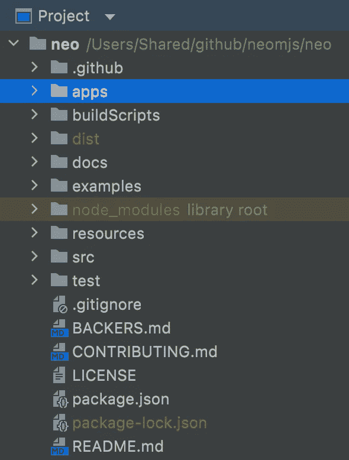
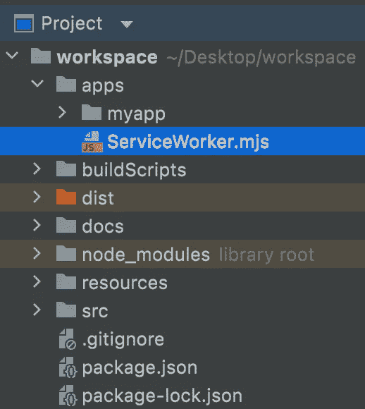

# 对您尚未使用的资产的预测性离线支持

> 原文：<https://itnext.io/predictive-offline-support-for-assets-you-have-not-used-yet-aeeccccd3754?source=collection_archive---------3----------------------->

## 预加载资产，一个服务和应用工作者的爱情故事

如果您关心您的应用程序用户接近实时地在不同视图之间导航，那么这篇文章就是为您准备的。

# 内容

1.  介绍
2.  演示应用程序
3.  远程方法访问
4.  爱情故事
5.  范围界定的困境
6.  JS 模块的服务人员
7.  离线支持
8.  多页面应用程序
9.  多窗口应用程序
10.  neo.mjs v4 版本
11.  在线演示
12.  最后的想法

# 1.介绍

虽然[服务人员](https://developer.mozilla.org/en-US/docs/Web/API/Service_Worker_API)已经存在了相当一段时间，但我主要是在移动范围内看到他们。缓存已经加载的资产是一种常见的做法，但是使用后台下载为下一个导航目标获取资产的主题还没有得到应有的关注。

# 2.演示应用程序

我尽最大努力让这个演示应用程序尽可能简单。这个 2 米长的视频将帮助你快速理解这个想法:

加载初始视图后，我们通过后台下载获取 Alice 的图像，并将其存储在浏览器缓存中，因为我们假设用户接下来很可能会导航到这里。因为我们确实使用缓存资产以防它们可用，所以我们可以接近实时地切换到目标视图，并且在我们首先禁用我们的互联网连接的情况下它也是有效的。

**真实世界用例:**
另一个合适的例子是基于 web 的商店应用程序。假设用户正在查看产品概述页面。使用分析工具或机器学习，你可能已经有了关于最常见的用户旅程的数据，所以你已经知道你的用户下一步最有可能导航到哪里。经过一段时间的延迟后，你现在已经可以为你的 x 个最受欢迎的产品获取资产了。一旦用户导航到那里，转换将几乎立即发生，因为不需要进一步下载资产。

# 3.远程方法访问

为了尽可能方便地与服务人员交流，我们希望能够“直接”触发相关方法:

显然，`Neo.ServiceWorker`既不存在于主线程中，也不存在于应用程序工作线程中。您可以像 RPC 一样考虑这种技术:

 [## 远程过程调用-维基百科

### 在分布式计算中，远程过程调用(RPC)是指计算机程序使一个过程(子例程)执行…

en.wikipedia.org](https://en.wikipedia.org/wiki/Remote_procedure_call) 

主要的区别在于，我们不需要(或不想)在等待响应时阻塞线程。

在我们的服务工作者实现的基类中，我们通过以下方式向特定的目标领域(在本例中为应用工作者)公开方法:

一旦新页面连接到我们的服务工作者，它将通过 post 消息接收新的 API，并在目标线程中注册名称空间。

远程方法访问不限于 SWs，也适用于专用和共享工作线程以及主线程。

如果我们调用一个远程方法，我们将收到作为承诺的返回值，因为内部 post 消息链是异步的。你可以把它想象成 ajax 调用，只是更快一些。

目标方法可以选择异步:

下面是一个不同的示例，展示了一个将被公开的非异步方法:

请注意，无论如何调用它都将保持异步:

`Neo.main.DomAccess.getBoundingClientRect('myId').then(rect => {/* do stuff */})`

可以在这里看一下实现:
[src/worker/mixin/remotemethodaccess . mjs](https://github.com/neomjs/neo/blob/dev/src/worker/mixin/RemoteMethodAccess.mjs)

# 4.爱情故事

想象一下，你需要通过中间的一个人把每一条私人信息传递给你心爱的人。我敢肯定，由于隐私问题和延误，你不会太喜欢它。

这同样适用于我们的服务人员和我们的(专用或共享)应用人员之间的沟通。虽然我们可以通过主线程传递 post 消息，但出于同样的原因，我们希望避免这样做。

我们很幸运，因为 MessageChannel API 是可用的:

 [## 消息通道-Web API | MDN

### 通道消息传递 API 的 MessageChannel 接口允许我们创建新的消息通道并发送数据…

developer.mozilla.org](https://developer.mozilla.org/en-US/docs/Web/API/MessageChannel) 

当我们获得新连接时，我们做的第一件事是建立我们的私人频道:

服务人员不完全是一夫一妻制的类型(不是评判)，但这一点让他们难以置信的强大，因为他们可以并行控制多个应用程序。

甚至同一个应用程序的多个实例也可以连接到它。就像和双胞胎约会一样。从我个人经验来看强烈不推荐:)

对于我们的远程方法访问，这意味着我们可以将方法从一个软件暴露给一个应用程序工作人员，但是另一个方向会有问题，因为我们不能确保到达我们心目中的应用程序。为了处理这个场景，我们需要向所有连接的客户端广播消息。

# 5.范围界定的困境

当 SW 具有范围参数时:

 [## 使用服务人员-Web API | MDN

### 本文提供了有关服务人员入门的信息，包括基本架构、注册和管理

developer.mozilla.org](https://developer.mozilla.org/en-US/docs/Web/API/Service_Worker_API/Using_Service_Workers#registering_your_worker) 

此参数限于字符串。这是非常不幸的:如果我们可以传递一组字符串或正则表达式，我们的生活会更容易。

在 neo.mjs 框架本身内部，我们有以下结构:

理论上我们想把我们的软件文件放到根文件夹中，因为我们确实想控制`apps`和`examples`文件夹。

然而，我们也想使用 [webpack](https://github.com/webpack/webpack) 为我们的`dist/development`和`dist/production`文件夹创建缩小版本。这些文件夹必须是我们的开发模式软件版本的限制。遗憾的是，范围黑名单也不可用。

当初始化`apps`或`examples`的软件时，传递作用域是可能的，但是我担心这会导致先前实例的注销并导致延迟。还没有经过适当的测试。

相反，我在两个文件夹中创建了实例:

我没有将`apps`或`examples`添加到 SW 名称空间中，以确保我们的远程 API 保持不变，并且我们可以轻松地将代码从这些文件夹中的一个复制到另一个，而不会破坏任何东西。

如果我们使用以下内容生成新的工作空间:

**npx 新应用**

在我们的终端内部，我们将得到以下结构:

SW singleton 文件将被放入工作区本身的 apps 文件夹中，我们的构建过程将获取该文件以生成`dist/development`和`dist/production`版本。

这样做的原因是这允许我们扩展和覆盖我们的基类。如果您想自己添加更多的远程方法，可以很容易地做到。

# 6.JS 模块的服务人员

与敬业和共享的员工一样，我们可以使用`type: 'module'`选项，这是我们的开发模式:

我们将只延迟加载这个主线程插件，以防您在 neo-config.json 文件中设置`useServiceWorker: true`或将`ServiceWorker`添加到您的`mainThreadAddons`数组中(或者两者都有)。

然而，这里有一个问题

当你在你的软件文件中改变一个字节的代码(注释也计算在内)时，一个非基于模块的软件将会更新，同样的情况**不**适用于你在你扩展的基类中改变代码的情况。

每次代码更改后，您也需要在扩展类中更改一个字节。我真的希望浏览器供应商能解决这个问题。

# 7.离线支持

正如你在演示视频中看到的，我们的应用程序可以离线工作。原因很简单:

→我们正在将`dist/production`中的每个文件添加到缓存中。

正如在第 5 节中看到的，您可以很容易地在工作区中覆盖缓存路径，以更好地满足您的需求。

# 8.多页面应用程序

服务人员实际上对海洋保护区很有帮助。您可能希望将 SW 文件放在域的顶层，以便为多个嵌套索引文件启用它。

您可以轻松地缓存“静态”资产，如图像和 CSS 文件。

如果您想缓存像库和框架这样的 JavaScript 文件，有一个权衡。

通常，您最有可能使用像 webpack 这样的构建工具，它会创建包含您的应用程序代码和使用的第三方库的包。

由于不同的页面可能使用给定库的不同部分，您需要将其指定为外部依赖项，以确保它将构建到自己的文件中，而不会与您的应用程序相关代码混合在一起。这样，多个入口点可以使用同一个文件，例如托管在 CDN 上的文件。

这里的权衡是，我们将失去每个页面(应用程序)的树摇动方面，因此初始加载时间将增加。但是，从一个页面切换到另一个页面会快得多。

# 9.多窗口应用程序

多窗口应用程序实际上非常类似于多页面应用程序。您可能已经看过多窗口 covid 应用程序演示，我们可以将螺旋的组件树移动到不同的浏览器窗口:

(两点半左右开始)

如果我们在这里添加一个服务人员，我们将缓存图像，当将 DOM 添加到新的浏览器窗口时，所有图像将立即显示。

由于一个多窗口应用程序在一个共享的应用程序工作器中共享所有 JavaScript 相关的资产，我们的框架唯一需要同步的就是增量 CSS 更新。这些也已经到位。

# 10.neo.mjs v4 版本

第 4 版的重点是增加服务人员:

如前所述，远程方法访问和特定于软件的构建已经就绪。

欢迎您在此添加功能请求(如推送通知):

 [## 问题 neomjs/neo

### 关于这个项目有问题吗？注册一个免费的 GitHub 账户来开一期并联系它的…

github.com](https://github.com/neomjs/neo/issues) 

版本 4 没有破坏任何其他 API。实际上没有。从版本 3 迁移应该是小菜一碟。

由于我们的缓存大小有限，我们可以使用存储 API 来添加检查:

 [## 估计可用存储空间| Web | Google 开发者

### navigator.storage.estimate()让你深入了解你的 web 应用'的存储限制。

developers.google.com](https://developers.google.com/web/updates/2017/08/estimating-available-storage-space) 

对应的一个`removeAssets`方法已经作为远程方法暴露在应用领域中。也可以随意添加一个功能请求或 PR。

# 11.在线演示

发展模式:
【neo.mjs/examples/preloadingAssets/index.html 

dist/production:
[neo . mjs/dist/production/examples/preloading assets/index . html](https://neomjs.github.io/pages/node_modules/neo.mjs/dist/production/examples/preloadingAssets/index.html)

# 12.最后的想法

webkit (Safari)团队现在已经完成了对共享工作者的支持，它应该很快就会进入 Safari 技术预览版(一旦我可以测试它，我会写一篇博文)。

Firefox 团队即将完成对 worker 范围内 JS 模块的支持。

一旦这两个功能都上线，这应该是 [neo.mjs](https://github.com/neomjs/neo) 项目的黄金时间。

当然，你现在已经可以使用和学习这个框架了。我最强烈的建议是加入 Slack 频道:

 [## 松弛的

### 编辑描述

join.slack.com](https://join.slack.com/t/neomjs/shared_invite/zt-6c50ueeu-3E1~M4T9xkNnb~M_prEEOA) 

问候&快乐编码，
托拜厄斯