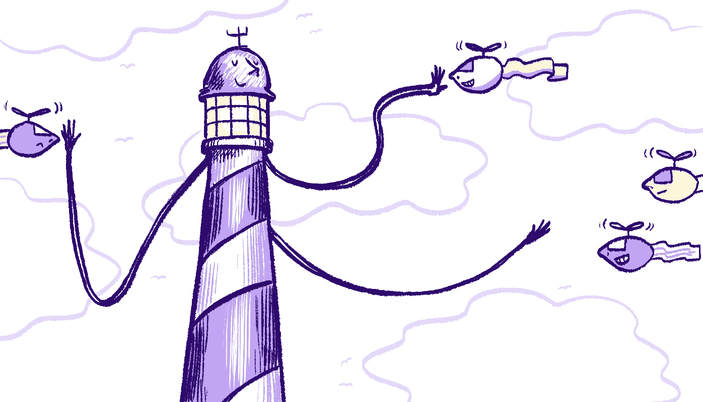

# 先发制人的策略，以提高您的灯塔得分

> 原文：<https://itnext.io/preemptive-tactics-to-improve-your-lighthouse-score-348ca88f392?source=collection_archive---------7----------------------->

图片鸣谢: [fly.io](https://fly.io/articles/lighthouse-how-to-reduce-render-blocking-scripts/)

没有什么比在几个月的辛勤工作后部署您的应用程序，却发现它有一个可怕的 Lighthouse 性能分数更糟糕的了。如果你的应用程序因其低性能指标而被搜索引擎惩罚，或者更糟糕的是，如果你的用户在浏览器加载和解析 3Mb 转基因 JavaScript 所需的 5 秒钟后逃离你的登录页面，那么你在 TDD、DRY、SEO 和其他流行词汇上投入的所有时间都是徒劳的。

网络捆扎机的出现极大地提高了我们的生产力；包管理器的发展使得共享和重用代码变得更加容易；但在这个过程中，我们已经失去了对应用程序大小的控制，我们已经看不到我们的依赖性，我们已经放弃了管理何时加载和执行特定脚本的能力——这只是一个难以理解的聚合填充的大垃圾堆。唉，另一个带有一些神奇配置和大量正则表达式的 webpack 插件不会修复困扰你的应用程序的架构缺陷。

也就是说，你必须在发展的所有阶段考虑你的 Lighthouse 分数:试图回顾性地提高性能是很难的，如果不是不可能的话。以下是我在处理服务器端渲染的单页应用程序时学到的一些经验。

1.  **找回你的 AMD 思维**

异步模块定义是几年前的热门话题，我仍然对我用 AMD 原则编写的代码感到满意。逻辑很简单:当页面的特定部分需要一些 JS 爱时，定义一个模块及其依赖项，等待依赖项加载，然后执行代码。执行流程是透明和可靠的，最重要的是它是高效的——您只在需要的时候加载需要的内容。

假设我们想要显示一个谷歌地图。它对我们的 SEO 没有影响，我们不需要它预先呈现，我们甚至不需要它显示，直到用户向下滚动到我们页面的特定部分。即使你的应用程序没有预渲染，也没有理由让谷歌地图屏蔽你的页面。如果你在使用谷歌地图的页面上运行灯塔检查，你会看到，它对性能有多么可怕的影响。

这里有一个不同的方法(我以前给[写过一篇关于它的文章](/vue-ssr-and-external-dependencies-bce84fbcbe6d))。我使用的是 Vue.js 组件，但这适用于任何前端框架。其思想是只有当组件被挂载时才加载依赖项，并在依赖项被加载时呈现它。

**2。保持** `**<head>**` **灯**

当我们被截止日期赶得很急时，很容易把事情放在`<head>`中继续前进，但即使是一个`<script>`或`<link>`标签也会对性能产生相当大的影响。第三方脚本、字体、样式表——都需要加载和解析，这让用户一直在等待。

**2.1。** `**<script>**`

我上面概述的方法允许您在尝试对其进行操作之前，确保第三方脚本已加载。如果您正在加载一个可以独立执行的脚本，请确保异步并延迟它，使其不阻塞`<script async defer src=""/>`。也就是说，如果有令人信服的理由将脚本放在文档的头部，那么它很有可能会出现在文档的末尾，在结束的`</body>`标记之前。渴望我们的数据的服务，如谷歌分析，会希望你在头部加载他们的脚本，但你会因此受到 Lighthouse 的惩罚。我是一个注重隐私的开发人员，所以我不听:我的首选方法是请求用户允许被跟踪，然后通过附加一个脚本标签异步加载脚本(如我的第一个示例所示)。

**2.2。** `**<link rel="stylesheet" />**`

我发现，添加一个可以忽略的延迟，并在稍后阶段向文档添加一个链接标签，对 Lighthouse 得分有积极的影响。像外部字体和样式表这样的东西会降低你的页面速度，所以如果你可以忍受没有漂亮字体和图标的小延迟，考虑做以下事情:

**3。惰性加载可视资产**

图像和视频嵌入可以大大减少第一次有意义的绘画的时间，它将帮助您的灯塔得分，以消除渲染块，这是在折叠下，也就是说，直到你的访问者向下滚动才可见。在某些情况下，图片可以帮助你的搜索引擎优化，所以你需要在内容和性能之间取得平衡。

说到图像，看看鲜为人知的`srcset`和`decoding`属性。[使用 webpack](https://survivejs.com/webpack/loading/images/) ，通过提供所有 evergreen 浏览器都支持的`srcset`属性，您可以提供一组基于屏幕分辨率的优化图像。这是您在项目开始时需要考虑的事情，并确保您的组件是兼容的。属性可以用来延迟图像的解码，帮助 T7 减少页面的绘制时间。

当涉及到视频和其他嵌入时，请记住，它们中的大多数都带有 JavaScript 和 cookie 包。作为一名注重隐私的开发人员，我更喜欢隐藏视频，直到用户与它交互，即显示一个带有播放按钮的海报图像，并在用户明确决定点击它观看视频时用 iframe 替换它。

也许在处理图像和视频时，最有用的工具是`IntersectionObserver`。我发现，如果你只是在它们被滚动到视图中时才显示它们，这真的有助于你的灯塔得分。

下面是我在 Noah UI 中使用的一些代码，用于延迟图像加载，直到组件被滚动到视图中。当您需要实现无限滚动或发出昂贵的服务器请求时，这也很有帮助。

这只是冰山一角。达到 100%的 Lighthouse 分数并不容易，尤其是当您的应用程序增长时，因此尽早做出与性能相关的架构决策非常重要。仔细检查数百个组件并对其进行追溯性调整并不是一件容易的事情。

我认为我们还应该意识到，捆绑器并不真正适合未来的网络，一旦我们忘记了过去噩梦般的浏览器和服务器，转而使用 ES 模块和 HTTP 2，它们将发挥更小的作用。代码分割和树抖动只能帮助我们这么多——重要的是我们要了解我们的应用程序如何以及何时与第三方交互，以及它们如何消耗浏览器资源——把所有的信心都放在捆绑器上不会让我们的应用程序更高效。