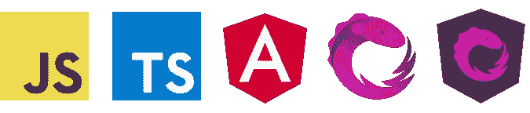
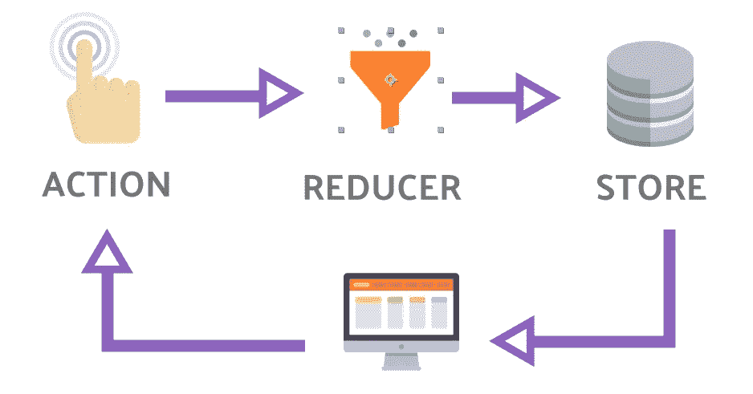
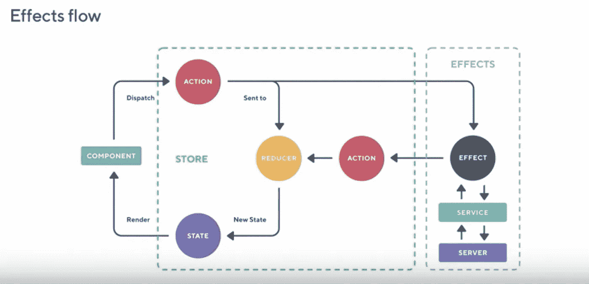

# 用包括 TS、ngRx 和 RxJS 在内的问题准备你的角度面试

> 原文：<https://itnext.io/prepare-your-angular-interview-with-this-quick-and-complete-outline-1e9b5d761166?source=collection_archive---------1----------------------->

## 前端面试

无论你是面试官还是被面试者，这里有一些信息将有助于展示你的技能或确定候选人的能力。

## 我是谁？

我练习 Angular 已经两年多了，在我的团队中，有时我们需要额外的劳动力。我已经决定收集几个来源，创建一个问题列表，以确定受访者的潜力。

*免责声明:当然，这个大纲和这里涉及的技巧完全是自以为是。随意评论你认为对于一个熟练的 Angular 开发人员来说是必须的额外技能。*


Branko Stancevic 在 [Unsplash](https://unsplash.com?utm_source=medium&utm_medium=referral) 上拍摄的照片

Angular 与 React 或 Vue 不同，它是一个广泛的框架，具有许多功能，涉及许多技能。以下是我们将要讨论的要点:

*   Javascript:一切的基础
*   **打字稿**:让我们利用 JS
*   **角度框架**:基础和高级主题
*   **RxJS** :反应式编程呢
*   **HTML / CSS** :可选问题



一套强有力的技能

# Javascript

> **【JS】关键词** `**const**` **和** `**let**` **有什么区别？**

一个很容易开始的问题，你会在这里找到答案(也包括`var`关键词)。

TL；DR : `let`允许你重定义一个变量，而`const`在声明时被初始化，不能被重定义。

> **【JS】如何去除数组中的重复？**

我真的很喜欢这个，因为它在现实世界中有很多应用。此外，它提供了几个答案来确定候选人关于 Javascript 的知识。具有阵列功能的 ES6 版本是:

使用归约数组函数的 ES 6 函数

使用集合结构，我们不能做得更短以获得独特的项目:

使用 Set 对象的函数

> **【JS】给出 3 种声明函数的方法。**

```
function firstVersion() { ... }
const fn = function() { ... }
(arrow, function) => { ... }
```

> 执行这段代码并给出输出。

这是一个非常有趣的练习，可以证明您的范围界定技能。

答案是`20`和`NaN`。

这个练习摘自 Lydia Hallie 的[高级 Javascript 问题列表](https://github.com/lydiahallie/javascript-questions)。你可以用额外的问题来写作。

# 打字稿**【TS】**

> **【TS】什么是 Typescript？**

Typescript 是 Javascript 的一个超集，它根据 OOP 原则增强了代码。

> **【TS】ES6 和 Typescript 有什么区别？**

`any`类型，用户定义的类型，…一个 Typescript 类可以扩展另一个类或实现一个接口，不像 ES6 类封装…

这里有一些比较点:

## 定义

**TS** 想要清除开发错误
**ES6** 在开发时相对更灵活

## 描述

**TS** 是 Javascript 的超级集合(到达它的顶端)。这种免费的开源编程语言是由微软开发和维护的。在构建时，它被编译成 JS
**ES6** 是 ECMAScript (ES)的一个版本，是由 ECMA 国际标准化的脚本语言规范

## 利益

**TS** 支持所有原始数据类型+ `any`、`unknown`、`never` +封装(*私有*、*保护*、*公共字段* )
**ES6** 不支持

## 辖域

**TS** 支持 3 种类型的变量作用域:*全局*，*类*，*局部* **ES6** 仅支持*全局*和*局部*作用域

## 模块

**TS** 允许创建、管理两种类型的模块:内部和外部
ES6 模块，分类为导入模块或导出模块

更多详情:

[](https://www.educba.com/typescript-vs-es6/) [## Typescript 与 ES6 |您需要知道的最有用的 7 个区别

### Typescript vs ES6 指南。在这里，我们还将讨论直接比较、关键差异以及信息图和…

www.educba.com](https://www.educba.com/typescript-vs-es6/) 

> **【TS】一个接口可以扩展一个类吗？**

是的，这是一个例子:

```
class Point {
  x: number;
  y: number;
}interface Point3D extends Point {
  z: number;
}
```

您可以创建一个名为`Point3D`的新接口来扩展`Point`类。

> **【TS】什么是类型守卫功能？**

也许这是一个棘手的问题，但它可以评估候选人对打字稿的了解有多深。

[来自 doc](https://www.typescriptlang.org/docs/handbook/advanced-types.html#type-guards-and-differentiating-types) 的回答。

TL；DR:这是一个自定义的类型检查函数，例如使用对象的属性。

# 角度**【NG】**

> **【NG】最新版本是什么？有什么新鲜事？**

一个展示你对框架感兴趣的好机会。

撰写本文时， **Angular 9.1** 是最新版本，包括如下特性:

*   Ivy:新的视图引擎提供了更快的测试、更小的包大小、模板中的类型检查以及更多更好的改进
*   更好的类型脚本支持(3.8)
*   性能改进和束尺寸减小，…

> **[NG]什么是生命周期挂钩？给它们命名并分类。**

生命周期挂钩是一种在组件生命周期的特定时刻触发的方法。

1.  恩贡昌斯
2.  恩戈尼特
3.  ngDoCheck
4.  ngAfterContentInit
5.  ngAfterContentChecked
6.  ngAfterViewInit
7.  ngAfterViewChecked
8.  恩贡德斯特罗伊

[Doc](https://angular.io/guide/lifecycle-hooks#lifecycle-sequence) 。

> 至少给出两种孩子与父母沟通的可能方式？

*   使用`ViewChild`:这个挺丑但是好用。
    *这里父组件会渲染* `*Message: Hey there from the child!*`

*   使用`EventEmitter`和`Output`装饰器:这个解决方案更简洁，需要用户交互(点击事件)。

*   使用服务:处理复杂通信时的常用方法:

*   使用商店:这种方式可能不相关，因为过度设计，但它可以工作。

> **【NG】ngRx 是什么？描述 Redux 模式。**

就像 Redux 代表 React，Vuex 代表 Vue 一样， [ngRx](https://ngrx.io/) 是一个 Angular 库，允许将商店集成到您的应用程序中。这是一种集中数据和管理数据通过应用程序的方式。因此，你有一个独特的真理来源。

它使用如下的动作、减速器和效果:



来自[https://angularfirebase . com/lessons/redux-from-scratch-angular-rxjs/](https://angularfirebase.com/lessons/redux-from-scratch-angular-rxjs/)



来自[https://blog . imaginea . com/ngrx-introduction-and-its-basic-setup-with-angular/](https://blog.imaginea.com/ngrx-introduction-and-its-basic-setup-with-angular/)

> 说出一些测试库的名字。

[茉莉](https://jasmine.github.io/)，[笑话](https://jestjs.io/)，[柏树](https://www.cypress.io/)，…

# RxJS [RP]

> **【RP】什么是反应式编程？**

反应式编程是一种考虑数据流并处理它以操纵来自一个或几个源的数据的方法。

正如他们在网站上描述的那样:

> RxJS 是一个使用 Observables 进行反应式编程的库，使得编写异步或基于回调的代码更加容易。

> **【RP】一个** `**Observable**` **和一个** `**Subject**` **有什么区别？**

一个`Observable`只是监听数据流，而一个`Subject`可以通过`next`方法将数据注入数据流。

> **【RP】说出一些 rxjs 算子的名字。**

他们有很多。我推荐你 *RxMarbles* 去(重新)发现它们:

 [## Rx marbles:Rx 可观测量的交互图

### 在可观测量上学习、构建和测试 Rx 函数

rxmarbles.com](https://rxmarbles.com/) 

常见的有:`map`、`tap`、`switchMap`、`take`、`withLatestFrom` …

# HTML/CSS

> **【HC】说出一些 CSS 布局概念。**

两个主要布局概念是:

*   *电网系统* ( [更多详情](https://developer.mozilla.org/en-US/docs/Web/CSS/CSS_Grid_Layout))
*   [*Flexbox*](https://developer.mozilla.org/en-US/docs/Web/CSS/CSS_Flexible_Box_Layout/Basic_Concepts_of_Flexbox) *系统*(完整指南[此处](https://css-tricks.com/snippets/css/a-guide-to-flexbox/))

> **【HC】什么是 Flexbox？**

Flexbox 是一种使用灵活的框在 CSS 布局中构建行的方法。

## 参考

[](https://github.com/lydiahallie/javascript-questions) [## lydiahallie/JavaScript-问题

### 我在我的 Instagram 上发布每日多项选择 JavaScript 问题，我也会在这里发布！从基础到高级…

github.com](https://github.com/lydiahallie/javascript-questions) 

# 结尾词…

有些问题看起来很难，但这是测试应聘者好奇心的一种方式。就把面试看作是测试应聘者知识和学习技能的一种方式吧。