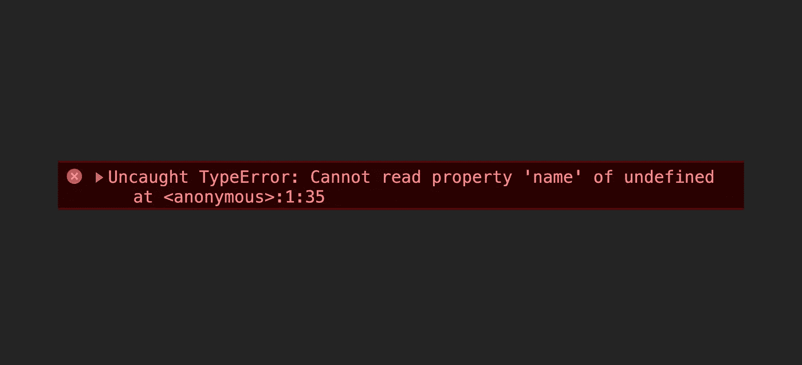
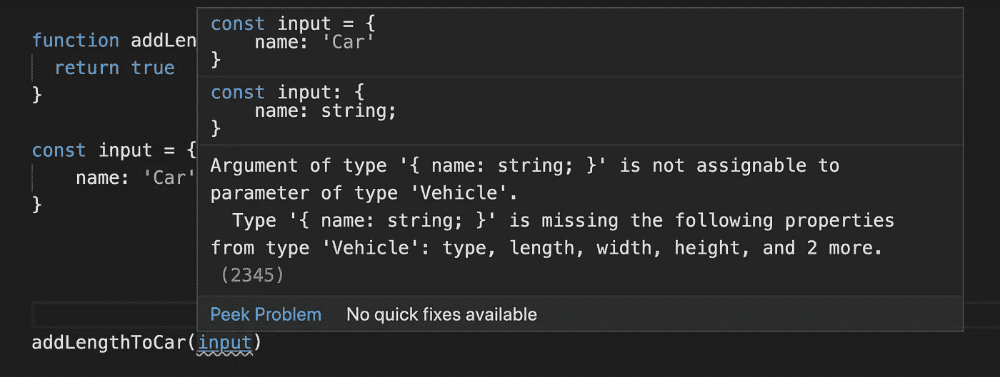

# 用 JavaScript 类+ TypeScript 防止“无法读取未定义的属性”…”错误

> 原文：<https://itnext.io/prevent-cannot-read-property-of-undefined-errors-with-javascript-classes-typescript-a388c1f0ef45?source=collection_archive---------0----------------------->

每个开发 JavaScript 的人都会遇到类似“无法读取 undefined 的属性“…”这样的错误。有一个简单的方法可以防止它们，使用 JavaScript 类。

# ES2015 JavaScript 类

自 ES2015 以来，我们收到了 JavaScript 课程🙌，许多开发人员对此非常满意！在上课之前，我们使用类似模块模式的东西来做类似的事情。

类是创建一组属性和方法的新实例的理想选择。

既然我们已经定义了`class Vehicle`,我们总是知道它有哪些属性。当我们创建一个实例时，它肯定具有这些属性。

现在已知汽车变量具有属性:类型、长度、宽度、高度和车轮。但是我们不知道它的价值。当您将此记录到控制台时，您会发现它们与我们定义的类相同。

当要求平方厘米时，它将是 0。

要更改这些值，我们需要在创建实例时或之后给出它们。

如果您将变量记录到控制台，您将会看到值发生了变化。

## 我们如何防止这种未定义的错误？

当定义一个类时，你给它属性或者方法。所以不需要猜测你在其他地方需要的财产会在那里，因为它会在那里！

# 让我们在 TypeScript 中使它更容易预测🙌

上面的例子是在 TypeScript 中定义的类。但是为什么在 TypeScript 中比普通的 JavaScript 更容易预测呢？

当你定义一个`function`并给它一个参数`car`时。但是你要确保`car`是基于`Vehicle`类的，并且拥有你期望的所有属性。

我们可以保证 TypeScript 会给你一个错误，如果你给它一个像下面这样的常规对象。

该错误将类似于下面的屏幕截图。

这就是我喜欢使用打字稿的原因。它帮助你在开发过程中避免各种错误，而不是在浏览器中发现运行时错误。

# 谢谢你读到这里😉

我希望这个简短的指南能帮助你避免那些恼人的错误，并推动你使用类。

在代码中创建任何对象之前，请三思，并考虑为它创建一个类😉。

> 如果你想在 JavaScript 方面变得更好，我强烈推荐 [Wes Bos](https://medium.com/u/86a55cd7983b?source=post_page-----a388c1f0ef45--------------------------------) 的 [JavaScript 初学者](https://BeginnerJavaScript.com/friend/MRFRONTEND)课程

# 阅读更多

 [## 预算上的前端开发:树莓 Pi 4

medium.com](https://medium.com/dev-together/frontend-development-on-a-budget-raspberry-pi-4-4c917124d348)  [## 给健康开发者的 5 个建议

### 你的身体和大脑需要关注

medium.com](https://medium.com/dev-together/5-tips-for-healthier-developers-ea21d1e826f)  [## 作为开发者，我将在 2020 年使用什么技术

### 我在工作中使用的软件、硬件和其他东西

medium.com](https://medium.com/dev-together/what-tech-i-use-in-2020-as-developer-f3269f857f0e)  [## 开始使用框架和库之前需要的 JavaScript 概念

### 在你熟悉它们之前不要开始

medium.com](https://medium.com/dev-together/javascript-concepts-you-need-before-starting-w-frameworks-libraries-25a325312b5c)