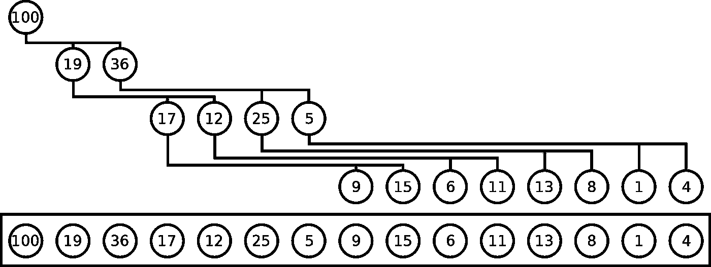

# TypeScript 中的优先级队列

> 原文：<https://itnext.io/priority-queue-in-typescript-6ef23116901?source=collection_archive---------1----------------------->

## 解释了排序的和基于堆的优先级队列

照片由哈尔·盖特伍德在 Unsplash 上拍摄

在编程中使用队列和堆栈来按一定的顺序处理一组项目。这些数据结构或者与*先进先出*或者*后进先出*系统一起工作，在这种系统中，处理顺序总是与插入顺序直接相关。但是，有时您需要对处理顺序进行比插入顺序更多的控制。队列中项目的*优先级*取决于几个外部因素，一些项目将不得不(部分)跳过队列。

这个概念被抽象成一个叫做*优先级队列*的数据结构。优先级队列不同于常规队列，插入的项目具有确定它们何时被`pop`返回的优先级。优先级队列的接口与普通队列非常相似，只是`insert`方法有了第二个参数:优先级。优先级用数字表示。惯例是，较低的数字意味着较高的优先级，并且所连接的项目将比具有较高数字的项目更早被处理。

基本优先级队列的定义

# 实现优先级队列

它们是实现优先级队列的几种方法。我们将从最简单的开始:未排序的列表(在我们的上下文中实际上是 JavaScript 数组)。这里我们使用一个 JavaScript 数组来存储优先级和条目对。在插入时，我们只需将项目推入数组，这意味着数组是按照插入顺序排序的。当我们想要查询下一项时，我们遍历数组并返回优先级最低的项:

基于 JavaScript 数组的优先级队列

当找到最低优先级时，我们可以通过使用`<`或`≤`作为比较运算符来控制先进先出的行为。这个实现的插入速度非常快，但是查询速度有点慢，因为我们必须总是迭代整个数组来找到优先级最低的项。

基于未排序列表的优先级队列的各种方法的性能

# 排序优先队列

围绕线性数据结构实现优先级队列的另一种方法是插入按优先级排序的项目。这意味着`pop`和`peek`总是可以返回第一项，但是`insert`必须迭代内容来找到该项的正确位置。

基于 JavaScript 数组的排序优先级队列

在这里，我们还可以通过在`insert`方法中使用`>`或`≥`比较器，在先进先出和后进先出队列之间进行选择。这个版本的优先级队列查询速度快，但插入速度较慢。哪一个是最佳选择取决于您的用例:您需要快速插入还是快速排队？

基于排序列表的优先级队列的各种方法的性能

还有一个实现提供了良好的插入和查询性能。这使用了基于树的数据结构，而不是线性数据结构。

# 基于堆的优先级队列

堆是存储键值对的二叉树，具有最低键的项位于顶部。在一个堆中，总是有一个*堆顺序:*子节点的键必须大于父节点的键。或者:如果你往下，琴键往上。没有关于左孩子和右孩子排序的规则，就像你在二叉查找树中那样。

堆通常以树的形式显示和推理，但大多数实现实际上使用数组来存储数据。这是可能的，因为我们可以通过对索引进行一些计算来计算节点或子节点的数组索引。与树相比，数组有一个很大的优势:可以获得节点的父节点，这在传统的链接树中是不可能的，因为节点不存储指向其父节点的指针。这极大地简化了构建堆所需的一些代码，尤其是在排序时，您会大量使用父子关系来比较键和交换项(使用数组也容易得多)。

让我们首先为新的优先级队列定义一个基本结构。我们已经可以定义`isEmpty`、`peek`和`size`方法，因为它们只查看根节点，不修改树:

基于堆的优先级队列的开始

你现在应该有的主要问题是:我们如何将一棵树存储为数组？如果你有一棵树，你有多行水平的相邻节点。您获取所有水平行，并将它们一起添加到一个节点数组中。这显示在下图中。

图片取自[维基百科](https://en.wikipedia.org/wiki/Heap_(data_structure)#/media/File:Heap-as-array.svg)

如果你的树除了在最后一行的右边(意味着在数组的末尾)没有空白点，你可以使用基本代数来计算出每一行从哪里开始，哪些节点是相互连接的。我们将把它们作为助手函数添加到我们的优先级队列中，这样我们就可以在剩下的代码中推理出`left`、`right`和`parent`节点。

一些助手将树的概念转化为数组

heap-array 上有两个操作与其他操作不同:`insert`和`pop`。对于这两种情况，我们不仅需要添加或删除一个条目，还需要对数组进行重新排序，使其再次成为一个具有堆顺序的有效堆。

为了插入一个新的节点，我们从把它附加到数组开始。这意味着它确实占据了底部行最右边的空白位置，或者确实开始了新的一行。当我们这样做时，我们保持了树的有效性，并且能够用我们的助手遍历它，但是我们仍然需要恢复堆的顺序。为此，我们将新节点的键与其父节点的键进行比较。如果父节点的密钥比新节点的密钥大，我们就交换它们。重复这个过程，直到我们得到一个当前节点的参数，这个参数有一个更小的键，然后新节点或者新节点在树的顶部。

插入到堆中并恢复堆顺序

为了实现`pop`,我们必须移除数组的第一项并恢复树。删除第一项意味着我们砍掉了树的根节点，只剩下两棵树(之前构成根的左右子树)。这对于树来说不是一个有效的状态，所以我们必须选择一个稍微长一点的路径。我们首先交换数组的最后一项和第一项。这意味着“根”现在在右下角，我们可以通过破坏我们的树来安全地移除它。剩下要做的一件事是恢复堆中的堆顺序。我们通过将当前节点与其最小的子节点进行交换，直到我们再次拥有我们的顺序，从而将我们的新根推向树的下方。

从堆中移除第一项并恢复堆顺序

这样我们就实现了完整的`PriorityQueue`接口，它有一个堆，并且具有良好的插入和查询性能。在基于堆的优先级队列中，插入顺序和具有相同优先级的条目的处理顺序之间没有关系。

基于堆的优先级队列的不同方法的性能

# 结论

在本文中，我们已经了解了什么是优先级队列，以及如何实现它。如图所示，基于堆的优先级队列提供了最佳的整体性能。