# Pritunl:在 Kubernetes 中运行 VPN

> 原文：<https://itnext.io/pritunl-running-vpn-in-kubernetes-55b260b27948?source=collection_archive---------4----------------------->


Pritunl 是一个 VPN 服务器，具有一系列高级安全和访问控制功能。

事实上，它只是 OpenVPN 的一个包装器，以组织、用户和路由的形式向它添加这样的访问控制列表。

任务是在 Kubernetes 中部署一个 Pritunl 测试实例，这样我们可以更仔细地观察它。

现在，我们将使用免费版本，稍后将查看付费版本。差异和费用可以在[这里找到> > >](https://www.saasworthy.com/product/pritunl/pricing) 。

将在 Minikube 中运行它，对于安装，我们将使用来自 Dysnix 的[舵图。](https://www.datree.io/helm-chart/pritunl-dysnix)

# 在 Kubernetes 经营 Pritunl

创建名称空间:

```
$ kubectl create ns pritunl-local
namespace/pritunl-local created
```

添加存储库:

```
$ helm repo add dysnix [https://dysnix.github.io/charts](https://dysnix.github.io/charts)
```

并使用 Pritunl 安装图表:

```
$ helm -n pritunl-local install pritunl dysnix/pritunl…
Pritunl default access credentials:
export POD_ID=$(kubectl get pod — namespace pritunl-local -l app=pritunl,release=pritunl -o jsonpath=’{.items[0].metadata.name}’)
kubectl exec -t -i — namespace pritunl-local $POD_ID pritunl default-password
…
export VPN_IP=$(kubectl get svc — namespace pritunl-local pritunl — template “{{ range (index .status.loadBalancer.ingress 0) }}{{.}}{{ end }}”)
echo “VPN access IP address: ${VPN_IP}”
```

检查豆荚:

```
$ kubectl -n pritunl-local get pod
NAME READY STATUS RESTARTS AGE
pritunl-54dd47dc4d-672xw 1/1 Running 0 31s
pritunl-mongodb-557b7cd849-d8zmj 1/1 Running 0 31s
```

从主 pod 获取登录密码:

```
$ kubectl exec -t -i — namespace pritunl-local pritunl-54dd47dc4d-672xw pritunl default-password
…
Administrator default password:
username: “pritunl”
password: “zZymAt1tH2If”
```

查找其服务:

```
$ kubectl -n pritunl-local get svc
NAME TYPE CLUSTER-IP EXTERNAL-IP PORT(S) AGE
pritunl LoadBalancer 10.104.33.93 <pending> 1194:32350/TCP 116s
pritunl-mongodb ClusterIP 10.97.144.132 <none> 27017/TCP 116s
pritunl-web ClusterIP 10.98.31.71 <none> 443/TCP 116s
```

这里，负载平衡器 *pritunl* 用于客户端访问 VPN 服务器，而*pri tunl-web*cluster IP 服务用于访问 web 接口。

将端口转发到 web:

```
$ kubectl -n pritunl-local port-forward svc/pritunl-web 8443:443
Forwarding from 127.0.0.1:8443 -> 443
Forwarding from [::1]:8443 -> 443
```

打开 [https://localhost:8443](https://localhost:8443) :

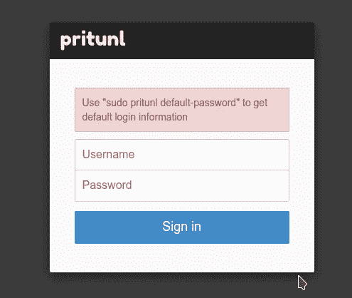

登录并进入初始设置:

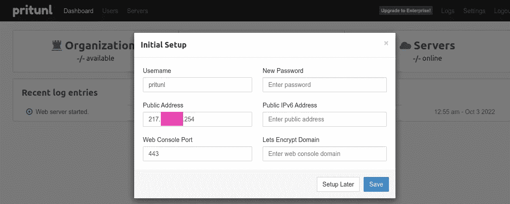

这里，在公共地址中，运行 Prytunl 本身的主机的公共地址将被自动设置，然后它将被替换到客户端配置中作为 VPN 主机地址。

由于 Pritunl 在 Kubernetes 中工作，而 Kubernetes 运行在 VirtualBox 中，VirtualBox 运行在普通家用 PC 上的 Linux 上，因此它不适合我们，但我们稍后会返回到它。现在，你可以让它保持原样。

其余的设定我们还不感兴趣。

# 设置 Pritunl VPN

## 组织，用户

参见[初始设置](https://docs.pritunl.com/docs/configuration-5#initial-setup)。

Go 群用户，Pritunl 有群，但是有完全(付费)版本，我们以后再看。

此外，可以通过组织对用户进行分组。

转到用户，添加组织:


添加用户:

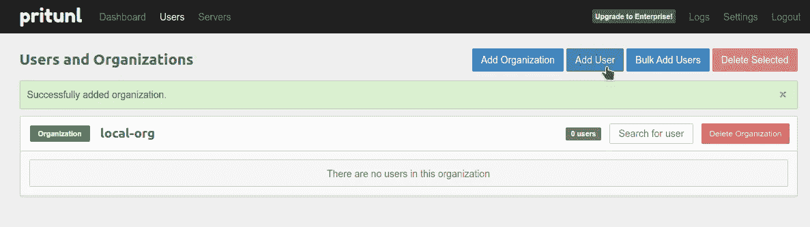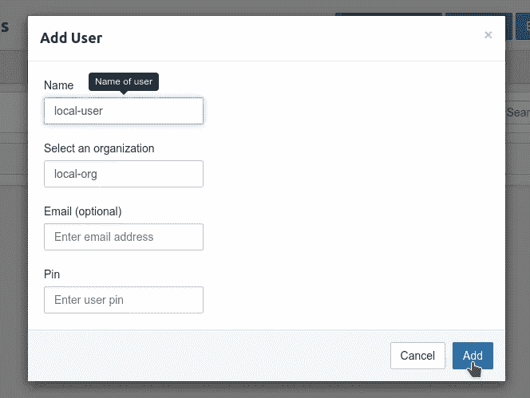

PIN、电子邮件—可选，现在不需要。

## Pritunl 服务器和路由

参见[服务器配置](https://docs.pritunl.com/docs/configuration-3)。

转到服务器，添加新服务器:

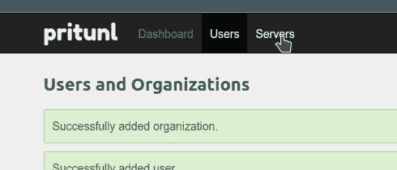

这里:

*   **DNS 服务器**:客户端的 DNS 服务器
*   **端口，协议**:OpenVPN 的端口和协议，它将在 Prytunl“内部”运行，并将接受来自我们用户的连接
*   **虚拟网络**:我们将从地址池中为客户端分配私有 IP 的网络

我会挑出虚拟网络*172 . 16 . 0 . 0*——然后我们的家庭网络、俱吠罗的网络和客户端 IP 将有所不同——调试将更加简单，参见 [IPv4 私有地址空间和过滤](https://www.arin.net/reference/research/statistics/address_filters/)。

同时，这里的服务器端口必须与负载平衡器上的端口和协议相匹配，这一点很重要。

即来自工作机器的请求将通过该路线:

*   **192.168.3.0/24** —家庭网络
*   点击 VirtualBox 网络 **192.168.59.1/24** (参见[代理](https://minikube.sigs.k8s.io/docs/handbook/vpn_and_proxy/#proxy))
*   将转到俱吠罗网络中的负载平衡器 **10.96.0.0/12**
*   负载平衡器将向 Kubernetes Pod 发送一个请求，在那里我们让 OpenVPN 监听 TCP 端口 1194

检查负载平衡器本身:

```
$ kubectl -n pritunl-local get svc pritunl
NAME TYPE CLUSTER-IP EXTERNAL-IP PORT(S) AGE]
pritunl LoadBalancer 10.104.33.93 <pending> 1194:32350/TCP 22m
```

端口 1194 — TCP。稍后我们将处理*待定*状态。

为服务器设置虚拟网络、端口和协议:

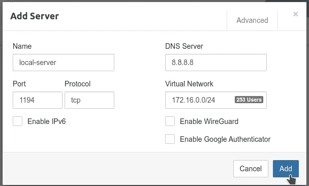

接下来，将组织与其所有用户联系起来:

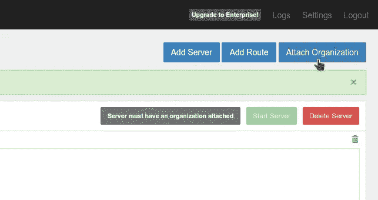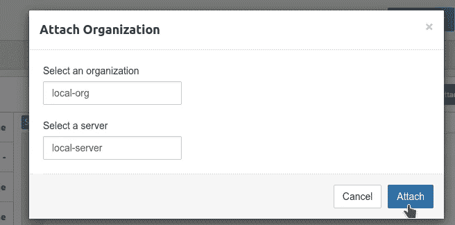

启动服务器:

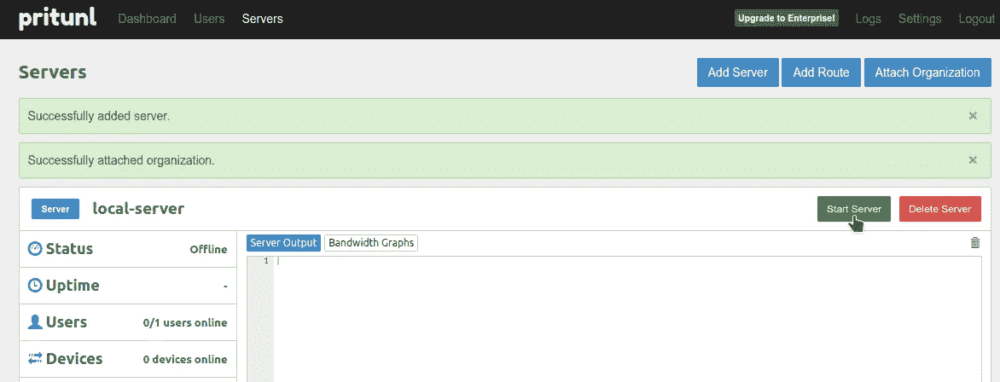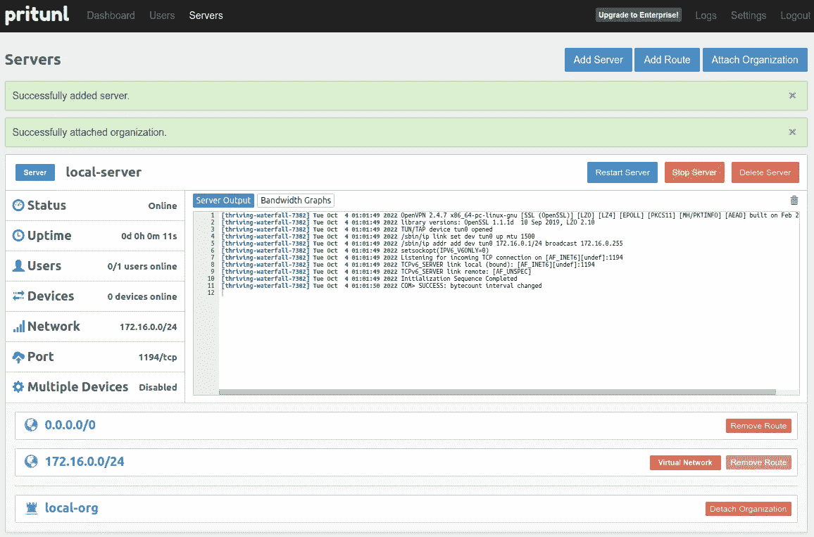

检查 Kubernetes Pod 中的进程和端口—我们在端口 1194 上看到了我们的 OpenVPN 服务器:

```
$ kubectl -n pritunl-local exec -ti pritunl-54dd47dc4d-672xw — netstat -anp | grep 1194
Defaulted container “pritunl” out of: pritunl, alpine (init)
tcp6 0 0 :::1194 :::* LISTEN 1691/openvpn
```

让我们去修理 LoabBalancer。

## 迷你库贝隧道

参见 [Kubernetes: Minikube，以及一个处于待定状态的负载平衡器](https://rtfm.co.ua/en/kubernetes-minikube-and-a-loadbalancer-in-the-pending-status/)了解全部细节，现在只需调用`minikube tunnel`:

```
$ minikube tunnel
[sudo] password for setevoy:
Status:
machine: minikube
pid: 1467286
route: 10.96.0.0/12 -> 192.168.59.108
minikube: Running
services: [pritunl]
errors:
minikube: no errors
router: no errors
loadbalancer emulator: no errors
…
```

检查负载平衡器:

```
$ kubectl -n pritunl-local get svc pritunl
NAME TYPE CLUSTER-IP EXTERNAL-IP PORT(S) AGE
pritunl LoadBalancer 10.104.33.93 10.104.33.93 1194:32350/TCP 139m
```

`EXTERNAL-IP`现在具有正确的值，因此检查连接:

```
$ telnet 10.104.33.93 1194
Trying 10.104.33.93…
Connected to 10.104.33.93.
Escape character is ‘^]’.
```

返回主设置，指定*公共地址* ==负载平衡器 IP:

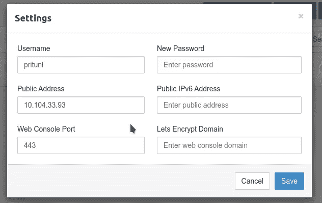

## OpenVPN —连接到服务器

转到用户，单击下载配置文件:

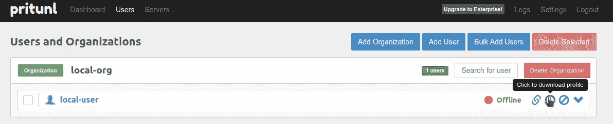

解压缩归档文件:

```
$ tar xfp local-user.tar
```

并使用通用 OpenVPN 客户端进行连接:

```
$ sudo openvpn — config local-org_local-user_local-server.ovpn
[sudo] password for setevoy:
…
2022–10–04 15:58:32 Attempting to establish TCP connection with [AF_INET]10.104.33.93:1194 [nonblock]
2022–10–04 15:58:32 TCP connection established with [AF_INET]10.104.33.93:1194
…
2022–10–04 15:58:33 net_addr_v4_add: 172.16.0.2/24 dev tun0
2022–10–04 15:58:33 WARNING: this configuration may cache passwords in memory — use the auth-nocache option to prevent this
2022–10–04 15:58:33 Initialization Sequence Completed
```

但是现在网络不行了:

```
$ traceroute 1.1.1.1
traceroute to 1.1.1.1 (1.1.1.1), 30 hops max, 60 byte packets
1 * * *
2 * * *
3 * * *
…
```

因为在我们的 VPN 中，到*0 . 0 . 0/0*的路由是通过 VPN 实际工作的同一个主机定向的，所以我们得到了一个“环”。

转到服务器，停止服务器并删除默认路由:

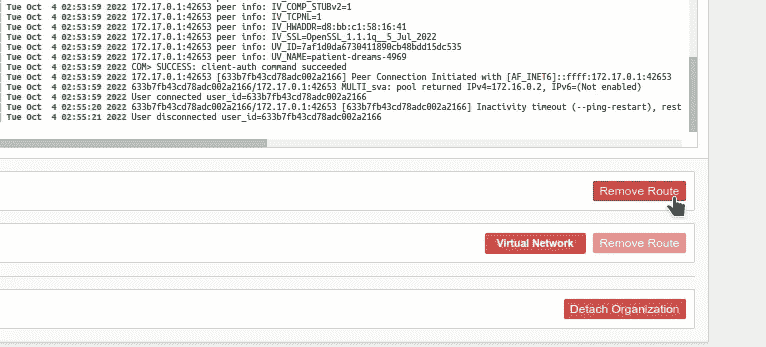

点击*添加路由* —通过我们的 VPN 添加一条到 1.1.1.1 的路由，来自客户的所有其他请求将通过通常的路由:

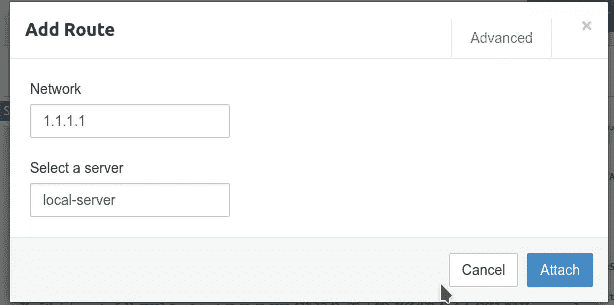

重新启动连接:

```
$ sudo openvpn — config local-org_local-user_local-server.ovpn
```

在本地检查主机上的路由:

```
$ route -n
Kernel IP routing table
Destination Gateway Genmask Flags Metric Ref Use Iface
0.0.0.0 192.168.3.1 0.0.0.0 UG 100 0 0 enp38s0
1.1.1.1 172.16.0.1 255.255.255.255 UGH 0 0 0 tun0
…
```

并检查网络—请求通过了 VPN:

```
$ traceroute 1.1.1.1
traceroute to 1.1.1.1 (1.1.1.1), 30 hops max, 60 byte packets
1 172.16.0.1 (172.16.0.1) 0.211 ms 41.141 ms 41.146 ms
2 * * *
…
```

*“管用！”* (с)

完成了。

*最初发布于* [*RTFM: Linux、DevOps、系统管理*](https://rtfm.co.ua/en/pritunl-running-vpn-in-kubernetes/) *。*