# (可能)最完整的网站开发初学者指南

> 原文：<https://itnext.io/probably-the-most-complete-beginners-guide-to-web-dev-db224236ec74?source=collection_archive---------1----------------------->

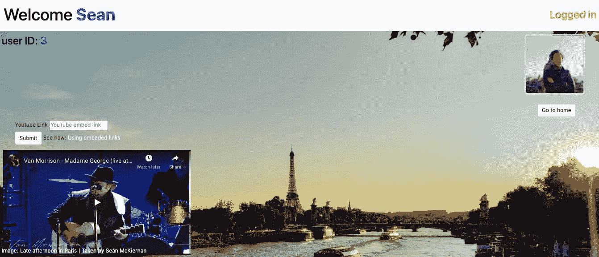

我们将制作一个登录页面

## 或者，对全栈一无所知的人可以选择全栈

我们现在要做的是制作一个运行在本地服务器上的全栈 web 应用。

那是什么意思？

这意味着你将有一个后端(服务器)和一个前端(客户端)，它们将被连接起来。从更实际的角度来说，这意味着你将拥有一个能够存储个人用户数据并根据用户请求显示不同数据的网站。想象一个非常非常简单的脸书。

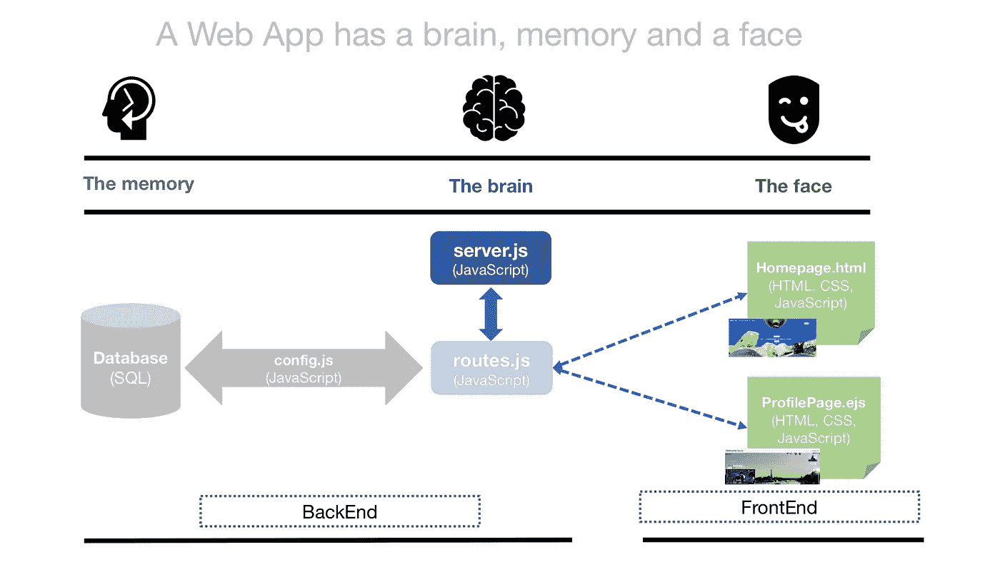

这是我们将要建造的基本布局。资料来源:塞恩·麦基尔南

对于服务器，我们将使用 **node.js** 和 **express** ，客户端将运行在 **EJS** 模板引擎上。我们将有一个 **mysql** 数据库和**谷歌认证登录**。最后，我们将使用 **Javascript** 和**查询**来让前端和后端进行对话。

我是谁？

不久前，我和你一样，对网络开发一无所知。大多数的指导者都假定你的知识水平是你第一次学习时所没有的，所以我在这里把我身后的梯子放下一点，牵着你的手通过它。

Caveats

我不是专家。很可能有更好、更有效的方法来实现我们在这里建立的东西。然而，原则是坚实的，总的来说，如果你能理解这里所做的一切，你将在构建自己的 web 应用程序的道路上走得很远。如果你想确定你所学的是 100%的最佳实践，我建议你去参加一个网络开发训练营。

S应付

Web 应用程序托管在服务器上，即“大脑”。这个服务器可以是你自己的电脑，也可以在亚马逊数据中心或其他地方。你会注意到，在本指南中，我使用了本地主机——这意味着我使用我自己的电脑。因此，这个 web 应用程序没有连接到互联网，它只存在于我的本地主机服务器(也就是说，我的电脑)的范围内。我们称之为**开发，**将服务器旋转到一个在线主机(像 AWS)会将它投入**生产**。网站开发的技能是在开发中学习的，因此我们在这里不考虑生产。

本指南是为 **mac 用户设计的。这对 Windows 用户应该也有帮助，但是你可能需要做一些额外的谷歌搜索，特别是设置你的工具。**

C颂库

这里是这个项目最终版本的链接- **你可以在这里** 下载最终版本的所有文件[](https://github.com/mckiersey/TeachingFullStackDev/tree/master/FullStackDev)

# **内容**

## **1.简介—工具**

## **2.构建大脑:服务器**

**2.1 安装**

**2.2 第一行代码**

## **3.构建大脑:routes.js 文件**

**3.1 构建大脑:建立理解**

## **4.学会微笑:用 routes.js 连接大脑和脸**

## **5.使用 Google 身份验证登录**

## **6.内存:创建数据库**

## **7.学习记忆:将数据推送到数据库**

## **8.构建您的应用**

**8.1 查看个人资料并登录**

**8.2 编辑个人资料**

**8.3 注销**

## **9.漂亮脸蛋:它应该是什么样子**

## **10.附录:进一步阅读和资源**

## **1.介绍**

## **工具**

## ****Visual Studio 代码****

**如果你没有 VS 代码，[现在就下载](https://code.visualstudio.com/)。它是编写代码的最佳编辑器。**

**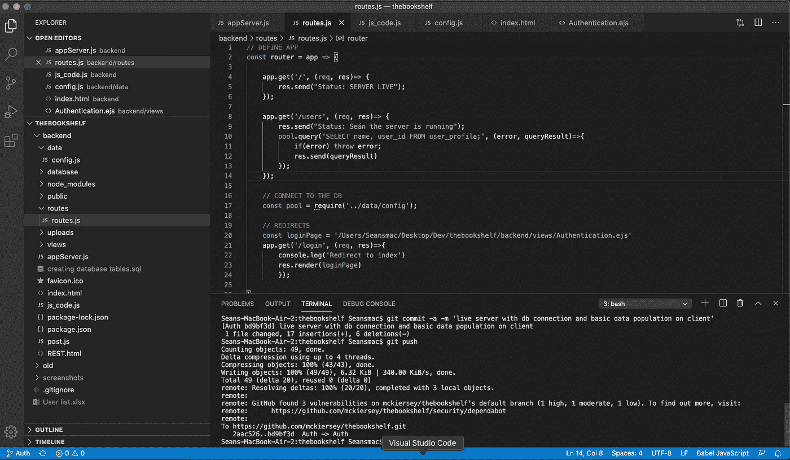**

**一开始看起来很吓人，但你会明白的**

## ****端子****

**这是终端，也称为控制台。如果你以前没有使用过它，它可能是一个可怕的地方。的确如此。但它也非常方便，一旦你学会了几个命令，你就能顺利地通过它。**

****如果你在 windows 上，你必须下载 git bash****

**[https://gitforwindows.org](https://gitforwindows.org)**

**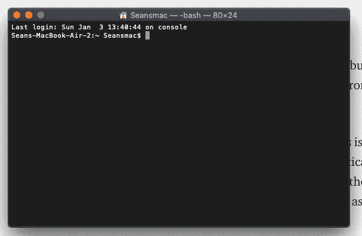**

**终端(或控制台)也可能是一个可怕的地方，但是一旦你掌握了它的窍门，你就会觉得自己是一个合法的程序员**

**您可以使用`ls`来查看“列表”您刚刚导航到的文件夹的内容**

**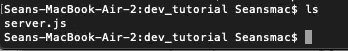**

**我在这个文件夹中只有 server.js 文件**

## ****饭桶****

**我在这个项目中广泛使用了 Git 和 Github。如果你不想要，你就不需要它，但它是我所有代码存储的地方，也是你将会找到这个项目最终版本的地方。至少了解 Git/Github 对于初学者来说很重要。**

**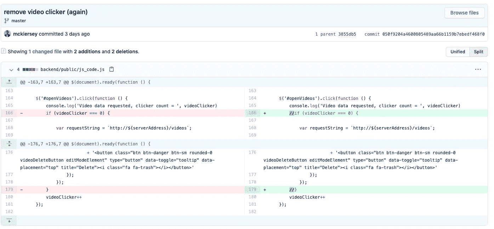**

**我在 git 上做得越好，我就越欣赏它——它对你的需求来说并不重要，但是你以后会明白为什么**

## **2.构建大脑:服务器**

## ****获取设置****

**编码生活中的一个事实是，下载和安装运行代码所需的工具就像你以后会遇到的任何实际编码问题一样困难。令人沮丧的是，当你下载这些东西时，你肯定是个初学者，根本不知道自己在做什么。虽然这确实让你很好地掌握了解决编码问题的关键 *Google It* 方法，但开始会很难，所以我会尽量让它变得简单。**

## **2.1 安装**

> *****Location: Terminal - >我将使用这些“Location”标志来帮助您定位到应该在*** 中的哪个工具或文件**

**Node.js-最重要的工具**

**请注意，以下列表是本[指南](https://www.sitepoint.com/npm-guide/) *的摘要**

1.  **在这里下载 node.js **安装程序** (Mac 或 Windows) [。](https://nodejs.org/en/download/)**
2.  **通过在终端中键入`which node`来检查它是否已经安装，然后键入`node --version`——您应该会看到类似下面的内容**

```
$which node
/usr/bin/node$node --versionv12.15.0
```

***如果这些步骤不起作用，我还在 WhatsApp 聊天记录中与帮助我开始这一切的朋友一起找到了[这个指南](https://www.sitepoint.com/npm-guide/)。最后，如果都失败了，你可以试试[官方节点安装](https://nodejs.dev/learn/how-to-install-nodejs)。**

**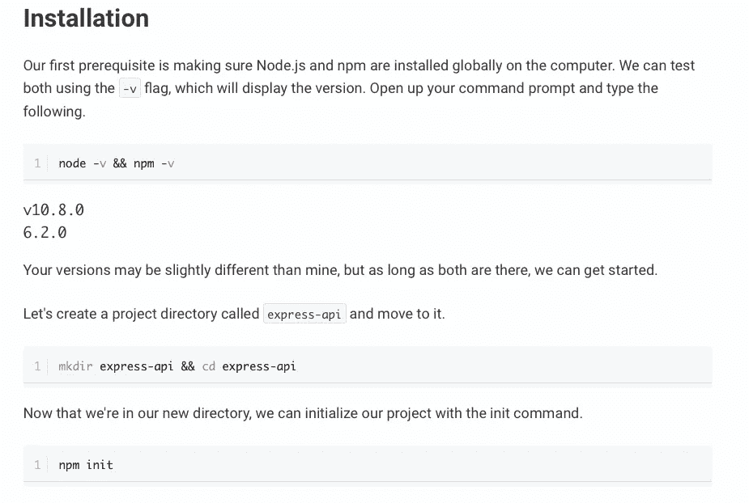**

**这本指南是我学习这一切的第一步**

**您不需要确切地知道 node 是什么或做什么——但它基本上是让您的 javascript 代码运行的东西——支持上面模式中的“大脑”。安装节点后，您需要导航到终端中的一个文件夹。例如，您可以执行如下操作:**

**导航到桌面**

**`cd Desktop`**

**在桌面上创建一个新的文件夹(你也可以很容易地用标准的方式点击右键——但是在终端上获得基本的流畅性是很好的，因为我们会经常使用它)**

**`mkdir WebDev`**

**导航到这个文件夹(显然你可以随意命名)**

**`cd WebDev`**

**然后初始化节点**

**`npm init`**

**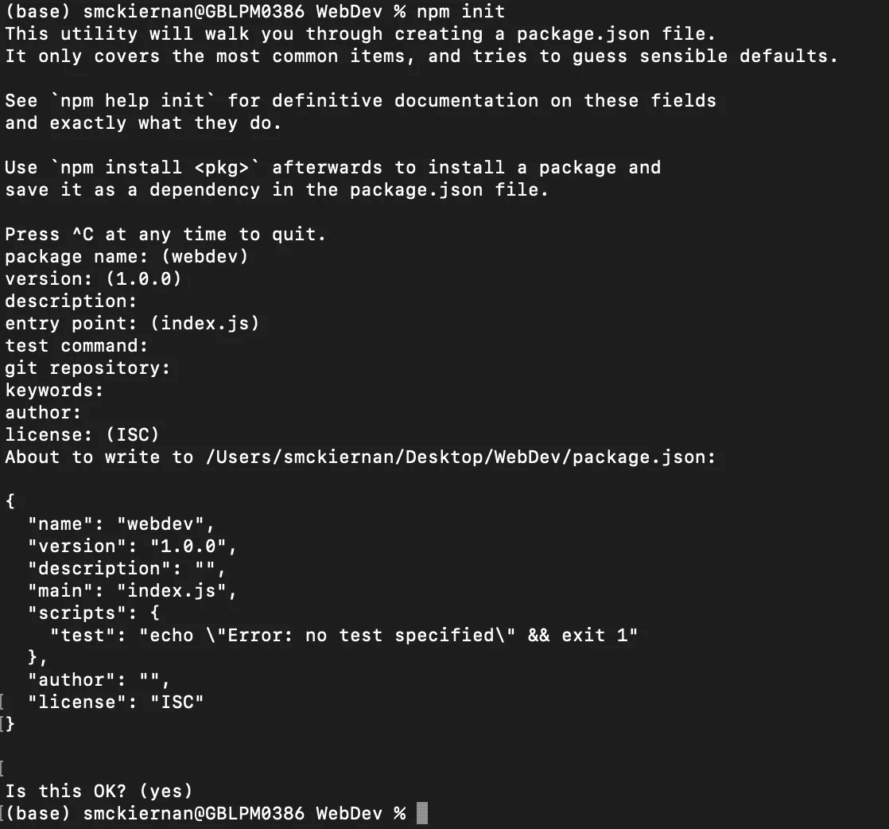**

**这就是上面给你的样子。一旦在 npm init 上按下 enter，就一直按下 enter——这意味着您接受节点应用程序的默认选项，这很好。**

## **要获得设置服务器的额外帮助:[请阅读下面的指南](https://code.tutsplus.com/tutorials/code-your-first-api-with-nodejs-and-express-set-up-the-server--cms-31698)**

**现在我们需要安装我们将要使用的其余工具(包):将所有这些安装命令一次性复制并粘贴到您的终端中(总是在同一个文件夹- `WebDev`)**

```
npm install express 
npm install google-auth-library 
npm install request
npm install mysql                                                 npm install ejs 
npm install body-parser
```

*****先不说:关于节点的好讲解，请看这个*** [***视频的前 10 分钟***](https://www.youtube.com/watch?v=fBNz5xF-Kx4)**

**2.2 第一行代码**

**祝贺你，如果你已经做到这一步，你现在可以开始写一些代码了！**

**正如在简介中提到的，我们将使用的工具之一是 VS code——这绝对是最好和最常用的代码编辑器，所以只要让你的生活变得简单并使用它。**

**让我们在 VS 代码中创建一个新文件，并将其命名为 server . js——再次(并且总是)确保您位于上面创建的`WebDev`文件夹中。**

**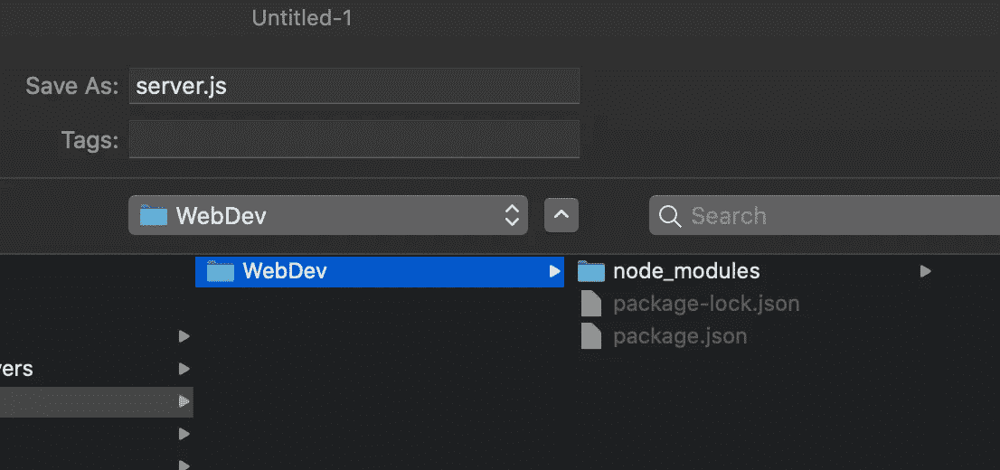**

**将新的 server.js 文件保存到 WebDev 文件夹中**

> *****位置:server.js*****

```
server.js
```

**(`js`表示这是一个 javascript 文件；我们将大量使用 javascript)**

**javascript 中的注释:**

```
// Two forward slashes ("//") creates comments in javascript
```

****定义一些变量开始****

**这是怎么回事？**

**一开始很难理解，但基本上你是在说，我们需要一个叫做`express`的工具，当我们在本文件后面写`express`时，这就是我们所指的工具——实际上你可以在下一行看到，当我们将我们的应用定义为 express()时。接下来我们设置`port`——我认为这有点像一个邮箱；这是我们放置服务器的地方(默认值是 80)。然后`path`就像上面的 express 一样，只是我们将使用的另一个工具。**

****启动服务器的代码****

**如果您暂时没有获得 javascript，不要太担心。刚入门的时候看起来很乱。但是，即使你不太明白，我也建议你不要复制粘贴——通过自己编写代码，你能学到更多的东西，这是令人惊讶的。**

> *****位置:端子*****

**让我们启动服务器！我们使用命令**节点**和我们刚刚创建的服务器文件管理器的名称。**

```
node server.js
```

**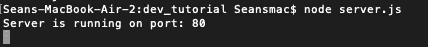**

**好了，如果你已经做到这一步，你已经在你的电脑上创建了一个服务器！一个合理的下一个问题可能是“什么是服务器？”。**

**服务器基本上是你网站的大脑。客户端，或前端可能被认为是你的网站的脸。大脑(服务器)向面部(客户)发送情绪(数据)，然后面部微笑或皱眉。最基本的客户机不是动态的，所以不需要服务器——它们永远不会改变。这些都是基于 HTML 文件。然而，因为我们使我们的页面动态，我们将使用 **EJS。** EJS 是一个模板引擎，是制作动态网页(或“面孔”)的简单方法之一。你可能听说过 React 或 Vue 等；这些实现了同样的事情，但是工作方式不同，超出了我们的范围。**

> *****地点:homepage.html*****

**回到你的 Vs 代码编辑器，打开一个名为 homepage.html 的新文件，保存在你的服务器所在的文件夹中。好的，如果你注意了上一段，你会知道创建一个 html 文件意味着我们在创建一个静态网站，这有点违背了整个目的。**

**目前还好，我们只是让这个页面先在浏览器中运行，然后让它动态化。所以你需要做的第一件事就是添加一些基本的 HTML 代码。**

**酷，让我们看看它在浏览器中是什么样子；在 Finder 中右键单击它，然后在浏览器中打开它**

**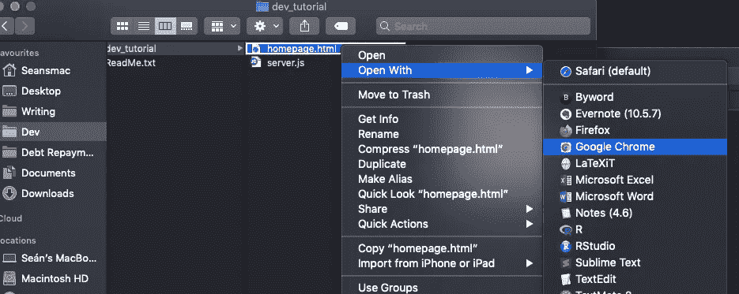**

**如果这是你第一次这样做，这有点令人兴奋**

**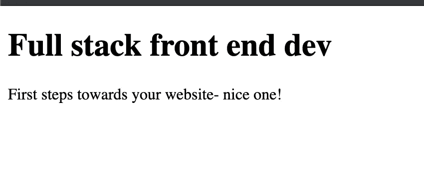**

**您应该在浏览器中看到什么**

## ****让我们入股****

**所以，到目前为止，我们的 web 应用程序有两个完全不同的元素；首先我们让服务器运行起来——我们的后端，然后我们写了一个简单的 html 文档，这是我们前端的开始。**

**现在我们想连接这两者——我们想让*在服务器上托管*html 页面。这不会改变它的外观，但是会改变文件从哪里加载*。如果你在浏览器中查看你的 html 页面的地址栏，它只显示了一个文件路径，看起来并不令人印象深刻。我们要做的是交换这个，以便从服务器调用数据，这是在真实的互联网上发生的事情。***

**因为我们使用本地服务器，所以我们将使用 **localhost。但是如果你使用亚马逊服务器来托管一个真正的在线网站，原理是完全一样的****

## **3.构建大脑:路线。JS 文件**

> *****位置 routes.js*****

**回到 VS 代码，创建一个名为 **routes.js 的新文件，**将下面的代码写入这个新文件**

**你可以在有文字的地方写任何你喜欢的东西，随意摆弄它——写你的名字通常很有趣。这样做也是了解这些机制如何相互作用的好方法。**

> *****位置:server.js*****

**现在让我们回到服务器——此时我们的 routes 文件被搁置，脱离了您的项目。我们需要确保您的服务器知道它在哪里。只有两行(基本上是告诉服务器 routes.js 文件在哪里，然后告诉它使用 routes.js 文件)**

**这是服务器现在的样子**

> *****地点:终点站*****

**好的，回到终端，再次启动你的应用程序:**

**(以防它仍然从上次开始运行，使用 ctrl + c 结束上次会话)**

```
node server.js
```

**现在，在 web 浏览器中打开一个新窗口，键入以下内容:**

```
[http://localhost](http://localhost):80/
```

**运气好的话，你将会看到以下内容！**

**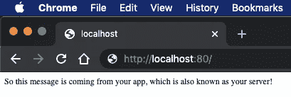**

**认出这条信息了吗？**

# **3.1 构建大脑:建立理解**

## **Skippable:让我们建立一点理解**

**请随意跳过这一部分，但是如果您对正在发生的事情不是非常清楚，您应该发出更多的服务器 get 请求。如果到目前为止您一直在复制和粘贴，我会鼓励您改为阅读和键入——通过逐字键入别人代码，您会学到惊人的东西。**

**好了，首先我们来关闭服务器:`ctrl + c`**

> *****地点 routes.js*****

**好的，现在让我们回到 routes 文件夹——这是我们进行 get 请求的地方。你知道如何使用“/”来导航到网站的各个部分吗？这就是我们用这些 get 请求在 routes 文件夹中构建的基本内容。**

**将它直接添加到第一个 get 请求下(上面代码片段中的第 7 行)**

```
app.get('/lyrics', (request, response)=>{
        response.send("And that smell of sweet perfume comes drifting through The cool night air like Shalimar")
    });
```

**保存该文件，然后再次启动服务器(node server.js)。回到你的浏览器，在地址栏中输入**

```
[http://localhost](http://localhost):80/lyrics
```

**你应该看看乔治夫人的歌词。如果您再次这样做，那么停止服务器，将以下代码添加到 routes.js 中，保存更改并重新启动服务器**

```
app.get('/name', (request, response)=>{
response.send('hey [put your name here], are you getting the hang of this yet?')})
```

**需要记住的是，这些消息来自服务器。但是我们不必只显示信息，关键是我们可以显示很多东西，包括图片、视频和整个 html 文件。**

# **4.学习微笑:用路线连接大脑和脸。射流研究…**

## **回到叙述:使用服务器显示我们的 html 文件**

**因此，仍然在 routes 文件中，我们将添加一个新的 get 请求**

> *****位置 routes.js*****

****不要只是复制粘贴这个**，如你所见，文件路径是 html 文件在*我的*电脑上的存放位置。您需要将此路径更改为您的计算机-见下文。**

**要获得你的文件路径，右击(在 Finder 或 Vs 代码中并复制路径)**

**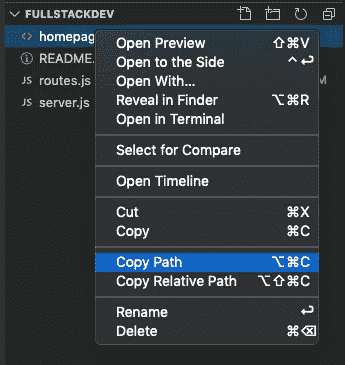**

**不要复制相对路径——您需要完整的路径**

**一旦你做到了这一点，我们再次做我们的小服务器舞蹈。确保它已经停止(终端中的`ctrl + c`)，保存 routes.js 中的更改，启动服务器(`node server.js`)，然后返回浏览器。这次在地址栏中输入这个**

```
[http://localhost/home](http://localhost/home)
```

**您应该会看到之前的 html 页面。这次你不是像在 Word 或 Excel 中那样简单地加载文件，而是通过路由器从你的服务器上传来的。差别是微妙的，但是现在这个 html 文件被托管在一个服务器上，你所要做的就是把你的本地服务器换到一个在线服务器上，你就可以拥有你的 html 网页了！**

**为了清楚起见，让我们给 HTML 文件添加一些内容。**

**您不必重启服务器就能看到这些更改，只需确保 html 已保存并重新加载您的网页。**

# **5.使用 GOOGLE 身份验证登录**

**严格来说，这不是全栈 web 应用程序核心框架的一部分，但它增加了一点专业性——实际上，如果你想构建任何有用户和密码的东西，你需要专业级的安全性。**

**幸运的是，这实际上非常简单，我们将主要按照谷歌自己的指南来做这件事。此外，虽然这个[视频教程](https://www.youtube.com/watch?v=KwOmVpd1DUA&t=804s)有点过时，但它做得很好，对懒人来说很好。由于谷歌指南非常全面，我不打算详细介绍这一部分。**

**第一步:阅读谷歌指南**

**【https://developers.google.com/identity/sign-in/web/sign-in **

**步骤 2:创建凭据**

****

**创建凭据**

**第三步:选择网络应用**

**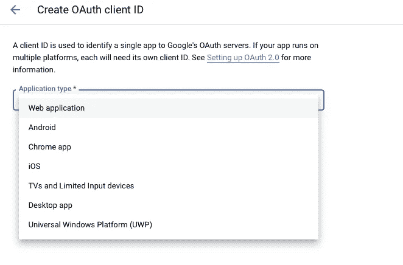******

**添加一个名称，并将您的本地主机复制/粘贴到授权的 JavaScript 源框中:**

```
[http://localhost](http://localhost:80)
```

**步骤 4:单击 OAuth 同意屏幕选项卡**

**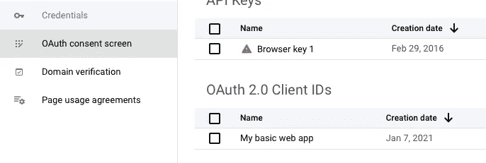**

**第五步:让你的应用成为外部应用(尽管对我们来说这可能并不重要)**

**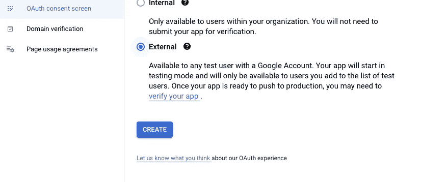**

**第六步:输入姓名和电子邮件地址**

**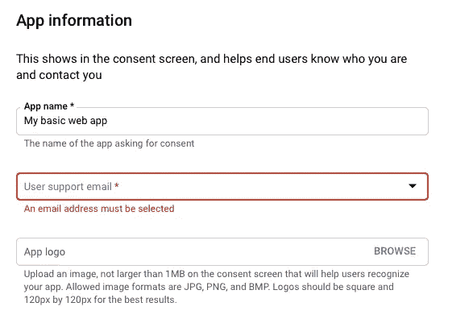**

**第 7 步:点击“添加或删除范围”并添加用户电子邮件和用户资料**

**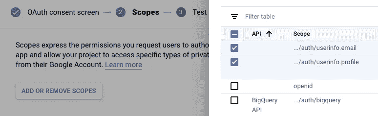**

**这意味着，一旦用户登录，您就可以从他们的帐户中获取这些详细信息**

**确保向下滚动复选框，单击更新，然后保存并继续**

**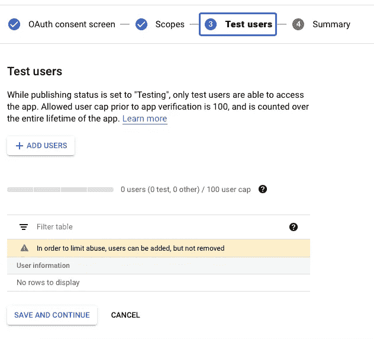**

**继续测试用户部分**

**步骤 8:返回 VS 代码**

**按照 Google 指南中的说明，我们需要在页面中添加以下代码。从这里复制您的客户 ID**

**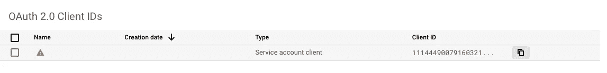**

> *****地点:homepage.html*****

**粘贴到这里**

**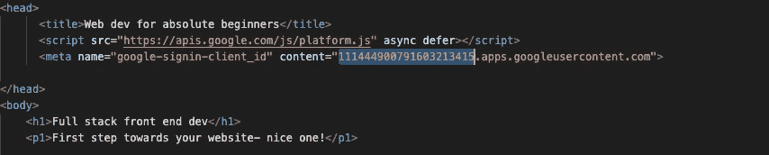**

**添加一个登录按钮，谷歌好心给你这样做的代码**

```
<div class=”g-signin2" data-onsuccess=”onSignIn”></div>
```

**综合起来，你应该有这样的东西**

**如果你重启你的服务器(再次，ctrl +c，然后 node server.js)，你的网站应该开始成型了！**

**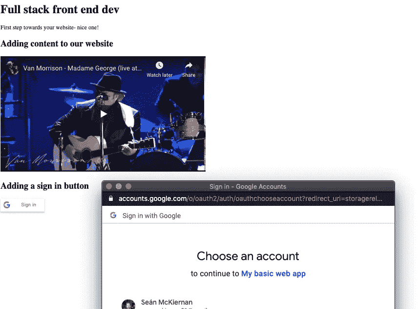**

**一旦你登录，你应该注意到按钮文本变成了在中登录的**——非常酷！****

# ****6。内存:创建数据库****

**我们需要创造“记忆”。这看起来有点抽象，如果你喜欢，你可以用软件让事情变得更具体，但最终我认为这可能会分散对机制的注意力，所以我们将坚持使用基本的抽象方法。**

## **位置:终端**

**编辑:安装 Mac 版 mysql 的另一种方式(可能更简单)**

1.  **安装[自制软件](https://brew.sh/)(仅限 Mac 大约需要五分钟)**
2.  **使用自制软件安装 mysql:**

```
brew install mysql
```

**3.然后运行其他步骤，如下所示**

```
brew install mysql-server
sudo mysql_secure_installation
mysql.server start
```

**4.运行 sql**

```
mysql -u root -p
```

**当步骤 4 中出现提示时，输入您在步骤 3 中选择的密码。**

**首先，安装[MySQL](https://www.positronx.io/how-to-install-mysql-on-mac-configure-mysql-in-terminal/)——你可以遵循这个链接指南(这似乎也是一个简单的设置方法)。这部分有点难写，因为我已经在电脑上安装了好几年了，不记得具体怎么做了。所以我找到了一个看起来不错的资源。如果不行，查一下 StackOverflow 或者 Reddit(如果找到更好的解决方案请在下面评论！)**

```
sudo apt update
sudo apt install mysql-server
sudo mysql_secure_installation
```

**[](https://stackoverflow.com/a/14235558/6065710) [## Mac 使用终端安装并打开 mysql

### 在 MacOS 中，Mysql 的可执行文件位于/usr/local/mysql/bin/mysql 中，您可以使用…

stackoverflow.com](https://stackoverflow.com/a/14235558/6065710) 

> 要让 mysql 运行，请键入:

```
mysql -u root -p
```

然后，当提示输入密码时，输入(注意，终端在输入密码时不会显示您已经输入了字符，即不会显示**或任何内容)

```
root
```


在顶部，你可以看到它有 Seans-MacBook-Air，表明我像往常一样在我的电脑里。但是在底部显示 mysql，这表示我现在可以编写 sql 命令了

**对于那些不熟悉的人来说，在 SQL 上快速靠边站:**

SQL 是一种“查询语言”,几乎在任何地方的公司都可以使用。这是一种简单且高度逻辑性的语言，允许用户从数据库中提取信息。基本语法如下:

```
SELECT [variable_1], [variable_2]..., [variable_n]
FROM [database_name]
WHERE [variable_n] = [some condition];
```

(显然，您可以按 ENTER 键启动 SQL 命令)

比如说

```
SELECT user_name, user_email
FROM full_stack_database
WHERE user_age = 29;
```

**创建我们的数据库**

```
show databases;
```

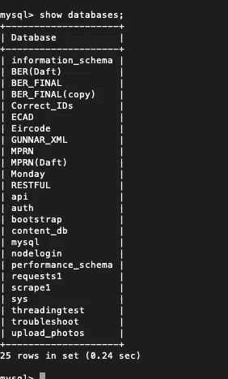

我有很多来自其他项目和学习/测试的其他数据库，但是你仍然会看到一两个默认的数据库。

我们将创建一个新的，如下所示:

```
CREATE DATABASE fullstack_db; 
```

容易的事

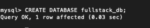

这是我们这个项目的数据库，在数据库中你可以有任意多的表。

让我们首先确保我们正在使用我们刚刚创建的数据库

```
use fullstack_db;
```

…然后在数据库中创建一个表。

```
CREATE TABLE `user_profile` (
 `user_id` int(11) unsigned NOT NULL AUTO_INCREMENT,       `google_user_id`   varchar(50)   DEFAULT '', 
 `first_name`      varchar(50)   DEFAULT '', 
 `full_name`       varchar(50)   DEFAULT '',
 `email`           varchar(50)   DEFAULT '',
 `profile_picture` varchar(1000) DEFAULT '',
  PRIMARY KEY (`user_id`)
) ENGINE=InnoDB DEFAULT CHARSET=utf8;
```

将上述内容复制并粘贴到您终端的 mysql 中，如下所示:

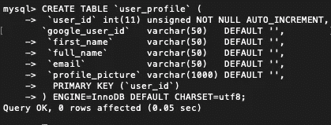

您在这里所做的是定义一个空表——我喜欢把它想象成一个仓库。你需要按照准确的规格制作仓库中的所有货架，以便它们与交付的货物相匹配，一切都合适。在这种情况下，商品是数据，货架是字段(列)。

让我们添加第二个表，这个表用于用户将要添加的内容。

```
CREATE TABLE `user_content` (`content_id` int(11) unsigned NOT NULL AUTO_INCREMENT,
  `user_id` int(11) DEFAULT NULL,
  `content` varchar(500) DEFAULT NULL,
  `content_type` varchar(500) DEFAULT NULL,
  `content_desc` varchar(500) DEFAULT NULL,
  `content_position` int(11) DEFAULT NULL,
  PRIMARY KEY (`content_id`)
) ENGINE=InnoDB DEFAULT CHARSET=utf8;--
```

要退出 mysql 框架，请键入(如果出错，只需删除表 user _ profile 并重新开始-简单)

```
exit
```

**让我们来盘点一下**

我们有一个空的数据库，这意味着我们有地方存放数据，但现在我们需要弄清楚这些数据来自哪里，然后我们需要一种方法将这些数据实际上放入数据库。首先让我们得到数据，然后我们可以回来把它插入数据库。** 

# **7.学习记忆:将数据推送到数据库**

****7.1 获取数据****

**我们要用什么数据？在上面的表格中，我们有一个用户 id 字段、一个姓名字段和一个个人资料图片字段。让我们填写这些字段。**

> *****地点:homepage.html*****

**澄清一下，在这里我只是按照谷歌的指导，复制/粘贴他们的代码。这段代码是用 javascript 编写的，所以我们必须使用 script 标签来告诉浏览器这是 javascript，如下面的代码片段所示。**

**复制并保存后，继续刷新浏览器(这不是服务器端的更改，所以不需要重启服务器)。现在打开开发者工具(Safari:option+command+c；Chrome: option + command + j)并且一旦你点击登录，你应该会在控制台上看到你的谷歌账户的信息！**

**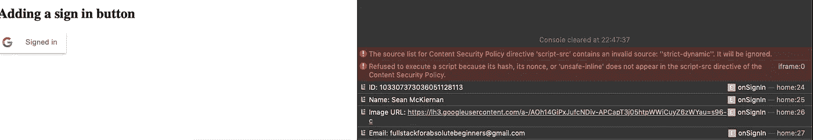**

**您可以看到我在右边(按钮)登录，我的 Google 帐户详细信息打印在浏览器控制台中。**

**为了了解这里发生了什么，让我们在控制台中打印一些东西。在 homepage.html 的第 22 行添加以下代码**

```
console.log("This is a message BEFORE extracting my Google data")
```

**在第 30 行加上这个**

```
console.log("And this is a message AFTER extracting my Google data")
```

**并将它添加到两个**

```
console.log('and here's a message about nothing')
```

**现在，同样的，保存 html 文件并刷新页面**

**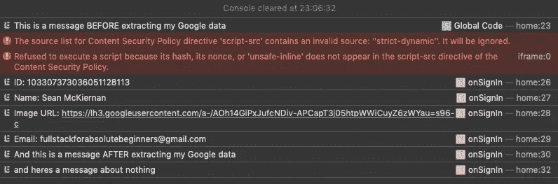**

**您可以在红色警告文本上方看到您添加的第一行(您可以忽略它)**

**现在应该清楚的是 **console.log** 只是一个打印语句，只要你把它放在一个 **<脚本>** 标签之间，你就可以在浏览器控制台中打印出任何你想要的东西。**

> *****位置:config.js*****

**创建另一个新文件，这次名为 config。在这个文件中，我们配置了到内存的链接——在这个例子中是我们的 mysql 数据库，名为 fullstack_db。**

**简单地说，配置文件配置到数据库的连接。您可以在第 6–9 行看到我们添加了之前制作的数据库的详细信息。这是相当技术性的，你真的不需要了解正在发生的事情的细节。**

> *****位置:server.js*****

**我们还需要在我们的服务器文件中添加几行代码，这将使我们将要构建的所有连接能够实际工作。**

# **8.构建您的应用**

**我们将分三个部分来做这件事。我为每个部分都做了一个可视化的模式，以帮助对代码发生的事情有一个全局的了解。**

1.  **查看个人资料并登录**
2.  **编辑个人资料**
3.  **签名登记离开**

## ****8.1:查看个人资料&登录****

**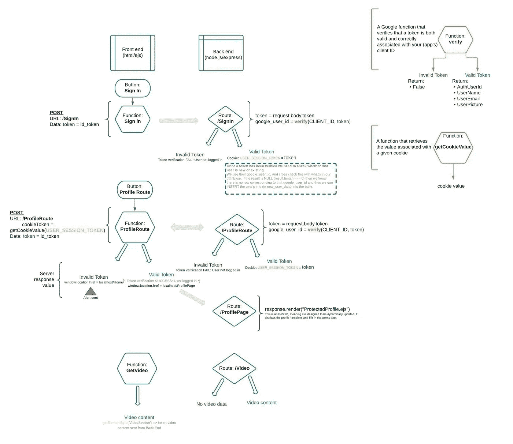**

**资料来源:塞恩·麦基尔南**

**点击此处查看完整的[图](https://lucid.app/publicSegments/view/9d0ddbcb-f89f-4551-8970-a6d45dd3a803/image.jpeg)**

> *****地点:homepage.html*****

**现在我们已经到了最后阶段，我们将稍微回顾一下之前的工作，让事情变得更专业一些。以前一切都是为了让事情运转起来，现在是为了交付一个非常接近真正的 web 应用程序的东西。**

**首先，我们来简化一下主页。稍后我们将添加 CSS，所以不要担心它现在看起来有点糟糕。**

**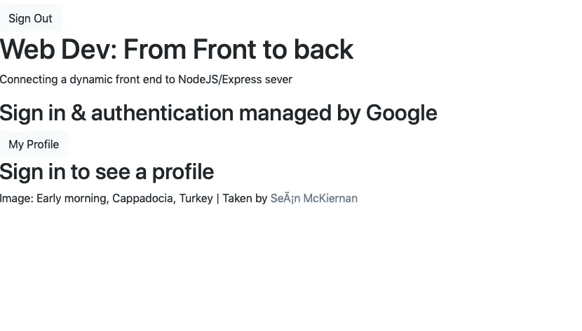**

**下面的代码将构建这个页面。需要注意两件事:我们添加了 jQuery 和 Bootstrap。bootstrap 仅用于格式化所使用的按钮，jQuery 将在稍后我们向该页面添加 Javascript 时使用。**

**这里我们将 Javascript 添加到主页。您可以看到下面编写的代码与本节开头的图表中的代码相对应。让我们深入了解一下:**

****GetCookieVlaue****

**我们定义了这个函数，稍后我们将使用它来获取已经存储在浏览器中的 cookie 的值。会话状态代码块就是一个很好的例子，它检查是否有任何值与 cookie USER_SESSION_TOKEN 相关联。**

****奥斯吉宁****

**我们以前见过这个，除了这里更工业化一点。该函数为我们提供用户的 google id (id_token ),并将其发送到后端。这个函数由上面代码片段中的 SignInButton 触发。**

****ProfileRoute****

**这是一个 POST 请求——它将 cookie 从浏览器发送(POST)到后端，如果此令牌被确认为有效，我们将通过以下代码重定向到用户的个人资料页面:**

**`window.location.href = ProfileUrl`**

****签出****

**我们稍后将回到这一点。**

**`Aside: What is a token?`**

**令牌是身份验证的主力。如果你有一张有效的车票(即没有过期，并且是正确的火车票/乘车票等),就把它想象成一张盖章的车票。)然后就可以获得访问权了。这篇文章很好地概述了。正如您将在下面看到的，令牌从 Google(在这种情况下)、服务器/后端和浏览器/前端来回传递。**

**好了，现在我们跳到后端。**

> *****位置:routes.js*****

**所有前端 javascript 都是无用的，除非它能与后端的东西对话。代码被很好地注释了，所以结合我上面画的图，你应该有可能梳理出发生了什么——但是让我把你的注意力吸引到几个重要的点上。**

****谷歌认证****

**第 5–36 行之间的代码大部分直接取自谷歌指南。我添加的是一些注释和从令牌获取用户详细信息所需的代码。如你所见，这些信息存储在“有效载荷”中。**

****/首页****

**这条路径允许您键入 localhost:80/ **Home** ，您实际上会看到一些东西。你可以看到机制相当简单。如果这个请求被发送到后端，它会找到 homepage_file 并在响应中将其发送回来。换句话说，它告诉浏览器显示文件。**

****/签到****

**您可以在第 57 行看到，我们获得了在前端发送的登录 post 请求。你在这里看到的正斜杠实际上是浏览器的 URL 中的内容。**

**基本上，这里发生的是我们使用上面定义的**验证**函数。这告诉我们从前端发送的令牌是否有效。如果它实际上是有效的，我们首先在浏览器上将这个令牌设置为 cookie。这一点很重要，因为从现在开始，我们将把这个 cookie 用于我们做的其他事情。**

**接下来，我们获取所有用户数据——同样是从那个**验证**函数中获取的。然后，我们检查 user_profile 数据库中是否已经存在具有该 google_user_id 的人。如果有，我们就发送一个响应告诉前端用户已经存在，如果没有，我们就把他们的所有数据插入 user_profile 数据库。每个用户都有一行，由他们唯一的 google 用户 id 标识，但是我们也使用行号来生成他们的应用程序 ID。所以第一个 google 用户 id 与 app 用户 1 相关联，以此类推。**

****/ProfileRoute****

**用户按下**我的档案**按钮后，该路线被触发。如上所述，这会在前端执行 **ProfileRoute** 函数。这个后端链接首先验证由 **ProfileRoute** 函数发送的令牌。接下来，它使用**验证**函数来获取用户的 google Id，然后依次使用该 Id 来查找用户的应用程序 Id。**

**`A Note on IDs`**

**我们在这个项目中使用两个 id。用户的 Google Id 是从用户通过 google sign in 登录时获得的 id_token 生成的。当这个令牌在后端得到验证时，它的有效载荷的一部分是用户的 Google Id。但是最好不要显示这些 ID，用户(和他们的个人资料)应该有一个应用 ID。这个 ID 是在他们第一次登录时生成的——用户 1 是第一个登录的用户。这两个 id 在 user_profile 表中是关联的，我们稍后将在安全逻辑中使用这个事实。**

****/profile route【ctd…】****

**一旦找到相应的应用程序用户 Id，我们就乒乓返回到前端进行重定向。如上所述，如果令牌已经被成功验证，则用户被重定向到 ProfileUrl。**

****/个人资料页面****

**如果您阅读 ProfileUrl 的代码，您会看到它基本上由三部分组成 1) localhost + 2) /ProfilePage + 3)？user_id=。我们所有的请求都会有第一部分；第二部分标识后端的相关路由。第三部分称为参数——它允许我们在请求中发送一个用户 Id。**

**同样，您可以通过在浏览器中键入该 URL 来手动完成此操作。事实上，这就是你查看朋友个人资料的方式——他们将自己的用户 Id 发送给你，你将它添加到 URL 的末尾。**

**正如您在代码中看到的那样，/ProfilePage 使用在请求查询中找到的 user_id，并使用它在 user_profile 表中找到相关的行。然后，它从该行获取所有数据(姓名、个人资料图片等。)并将其与个人资料页面一起发送:**

**`response.render("ProfilePage.ejs,{...});`**

**`Note: What is EJS?`**

**EJS 是一个“模板引擎”:它创建的文件——模板——看起来与普通的 HTML 文件非常相似，除了某些部分，它们是可以动态更新和改变的占位符。它是 react 之类的东西的一个非常基本的版本，这些东西通常用于专业设置中。一个 EJS 文件被“渲染”,可以用一组数据来渲染，就像你在上面第 143–146 行看到的那样。这些单独的数据将被“插入”到 ProfilePage 中的相关位置。**

**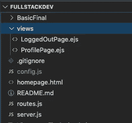**

**所有这些文件和文件夹都在 FULLSTACKDEV 中 views 文件夹包含所有 EJS 文件，重要的是，它与 server.js 文件在同一个目录中**

**还要注意，默认情况下，服务器会在一个名为“views”的文件夹中查找你的 EJS 文件——所以一定要遵循这个文件夹结构(你可以在我的 git repo 中看到我的文件夹结构)。**

> *****位置:ProfilePage.ejs*****

**下面是 ProfilePage.ejs 文件。为了简单起见，我特意去掉了 CSS 样式和一些 Javascript 函数——我们稍后再讨论。在这里你需要知道什么？**

**注意在一些行中我们有有趣的%标记，比如在第 16 行:**

**`<%=data.name%>`**

**这就是我上面提到的‘槽’。第 143–146 行上从后端发送的数据进入这个槽。在这种情况下，是用户名。**

**需要指出的其他一些有趣的事情是:我们像以前一样定义相同的 GetCookieFunction，并像以前一样使用它。我们获得了个人资料页面的 ID——正如我们所知，它与代码为:**

**`var urlParams = new URLSearchParams(window.location.search); var user_id = urlParams.get('user_id);`**

**最后，我们请求加载与该用户/配置文件 ID 相关的视频内容。这条路线是在后端的第 163 行定义的。**

## **8.2:编辑配置文件**

> *****位置:ProfilePage.ejs*****

**该图总结了代码中的要点，并在代码下面进行了描述。**

**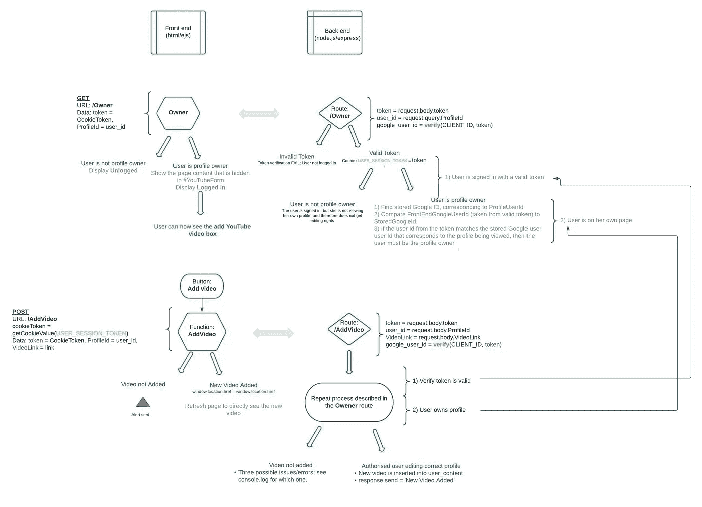**

**资料来源:塞恩·麦基尔南**

**点击这里查看完整的[图](https://lucid.app/publicSegments/view/2ffc1e47-4af1-4682-aff2-2f154951d113/image.jpeg)**

**仍然在配置文件页面和 Javascript 部分，编写以下代码。下面我解释它的作用。**

****车主路线****

**这个路径的目的是检查正在显示的页面是否为用户所“拥有”。我们通过比较两件事来做到这一点:页面的 ID，也是用户的 ID，可以在浏览器 URL 中找到。**

**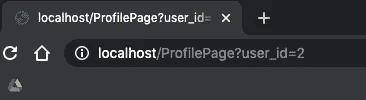**

**像基本上任何社交媒体网站一样，任何人都可以通过简单地改变 URL 来查看任何页面——实际上，这允许用户向他们的朋友发送他们页面的链接，而他们不是用户。这也意味着任何用户都可以看到任何其他用户的页面。**

**URL 为我们提供了页面/用户 ID。然后，我们希望将这个 ID 与登录用户的 ID 进行比较(假设他们实际上已经登录)。正如我们之前看到的，用户的登录状态是由 Google 令牌管理的，我们将它作为令牌存储在 **SignIn** Route 中。综合起来，我们可以将正在查看的页面的用户 ID 与登录用户的相关 Google ID 进行比较。如果它们匹配，那么该页面的“所有者”正在查看该页面，因此我们以取消隐藏添加 YouTube 视频框的形式授予他们编辑权限。**

****添加视频路线****

**这个路径的目的是使用户能够用内容填充她的页面。特别是在这种情况下，YouTube 视频(虽然在现实中，没有什么可以阻止用户把其他任何东西)。**

**其机制很简单:我们在前端检索用户在表单上提交的数据，并将这个“视频链接”与令牌和 ProfileId 一起发送。然后，将 VideoLink 添加到 user_content 表中对应于 ProfileId 的行上。**

**然而，这其中的细节要复杂一些。尽管通过**所有者**路径(如上)提供了安全性，确保编辑页面的能力保持“隐藏”，除非用户是配置文件的“所有者”，但我们希望添加第二个*安全层，通过双重检查用户确实是页面的正确所有者，并且她有权将该配置文件的数据发布到后端。幸运的是，这样做的逻辑与在**所有者**路线中看到的逻辑完全相同——我们将 ProfileId 与从经过验证的令牌中获取的 Google Id 进行比较。如果对应于 ProfileId 的存储的 Google Id 与令牌 Google Id 匹配，则用户拥有该配置文件，因此被允许编辑它。***

## ****8.3:签出****

**我们不会花很长时间的。如果你已经理解了最后几节，这就很容易了。**

**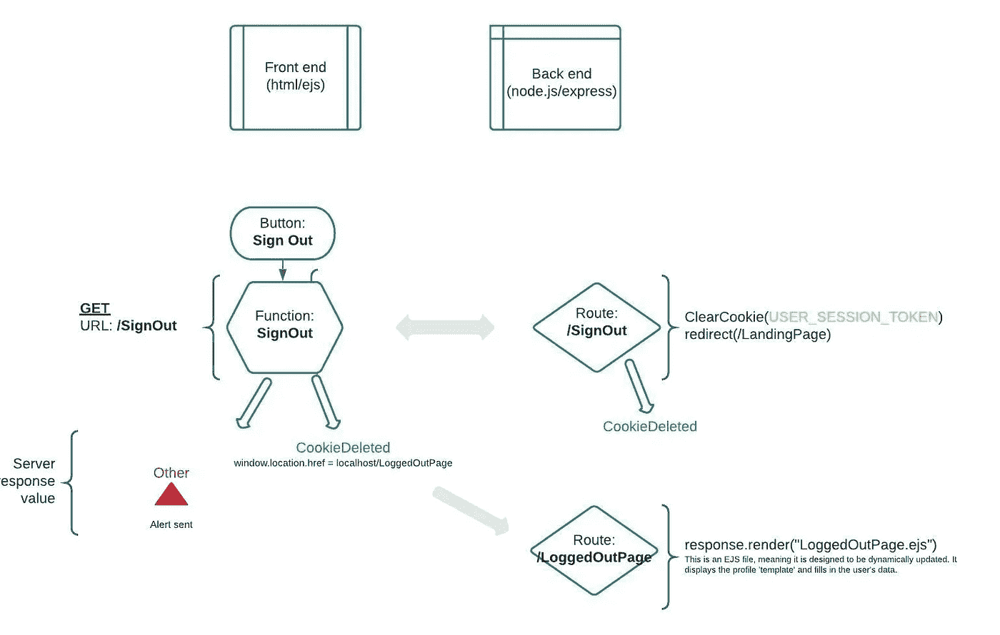**

**点击此处查看完整的[图](https://lucid.app/publicSegments/view/6134b1a8-4a78-4032-ac26-e61f60582cb2/image.jpeg)**

> **地点:Homepage.html**

**将它添加到主页文件的脚本标签中**

> ***位置:routes.js***

**将此添加到 routes.js 文件的末尾**

**这里的基本流程是，用户单击 SignOut，向后端的 **SignOut** 路由发送请求。此路由删除存储在浏览器中的 USER_SESSION_TOKEN cookie，这实际上删除了用户拥有的所有“登录”权限。一旦完成，我们就被反弹回前端，这又将我们重定向到后端的 **LoggedOutPage** 路由。此路径呈现 LoggedoutPage EJS 文件。**

> ***位置:LoggedOutPage.ejs***

**这个页面并不真正必要，所以我们将在**视图文件夹**中快速创建一个文件，如下所示:**

# **最后一步:用 CSS 抛光**

**最后一步，我们将添加 CSS 来添加背景之类的东西，并将所有对象放在正确的位置。CSS 应该放在 html 代码体的`<style>`标签中。请参见下面主页和个人资料的样式**

> ***地点:Homepage.html***

**将此添加到标签之后和**

> ***位置:ProfilePage.ejs***

**将此添加到标签之后和**

# **9.一张漂亮的脸:它应该是什么样子**

**你可以从我的 Github repo [这里](https://github.com/mckiersey/TeachingFullStackDev/tree/master/FullStackDev)下载所有代码的最终版本，如果你对 Git 不太熟悉的话，也可以列出单独的文件**

**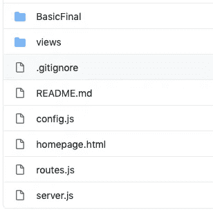**

**我的 Git Repo 中的文件夹结构**

*   **[server.js](https://github.com/mckiersey/TeachingFullStackDev/blob/master/FullStackDev/server.js)**
*   **[config.js](https://github.com/mckiersey/TeachingFullStackDev/blob/master/FullStackDev/config.js)**
*   **[routes.js](https://github.com/mckiersey/TeachingFullStackDev/blob/master/FullStackDev/routes.js)**
*   **【homepage.html **
*   **[ProfilePage.ejs](https://github.com/mckiersey/TeachingFullStackDev/blob/master/FullStackDev/views/ProfilePage.ejs)**

**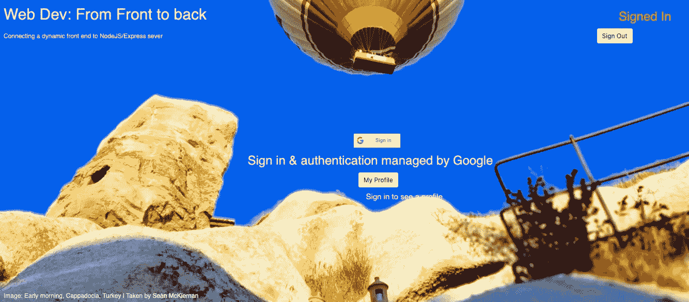**

**成品:主页**

**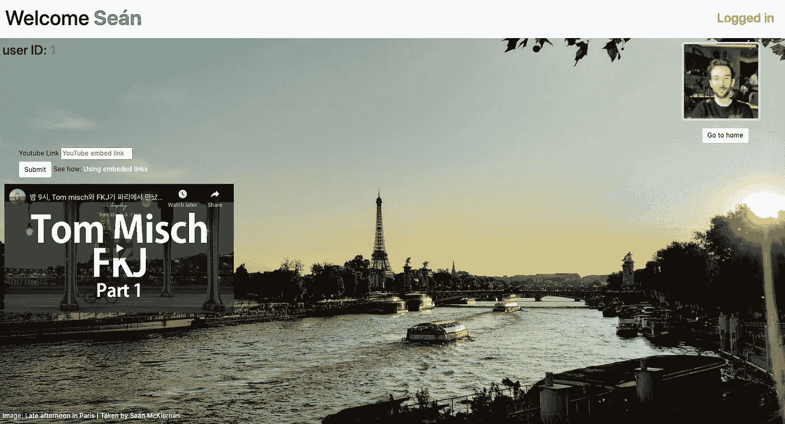**

**成品:用户页面**

# **9.附录:进一步阅读和资源**

## **我是如何学习的(好的指南你可以在这本书旁边/之后阅读)**

## ****设置服务器****

**为了开始使用服务器和进行简单的请求，我一直在参考这个由三部分组成的帖子:**

**[](https://code.tutsplus.com/tutorials/code-your-first-api-with-nodejs-and-express-connect-a-database--cms-31699) [## 用 Node.js 和 Express 编写第一个 API:连接数据库

### 在第一篇教程《理解 RESTful APIs》中，我们学习了什么是 REST 架构，什么是 HTTP 请求方法…

code.tutsplus.com](https://code.tutsplus.com/tutorials/code-your-first-api-with-nodejs-and-express-connect-a-database--cms-31699) 

在浏览完上面的帖子后，这个 YouTube 指南是一个很好的演练。

## **Javascript 和 jQuery**

如果你能越过这家伙的头发，这是一个真正伟大的(和短！)关于 jQuery 如何工作的教程。

## 使用 Google 登录

## **Google Docs:使用 Google sign-in 认证用户 ID 令牌**

[](https://developers.google.com/identity/sign-in/web/backend-auth) [## 使用后端服务器进行身份验证| Google 登录网站

### 如果你在一个与后端服务器通信的应用程序或网站上使用谷歌登录，你可能需要识别…

developers.google.com](https://developers.google.com/identity/sign-in/web/backend-auth) 

## 引导程序

是一个用于轻松构建专业外观网站的框架。你可以在这里阅读更多的相关内容。

## **SQL 注入(安全)**

如何防止 SQL 注入黑客的短片？([此处](https://www.slideshare.net/billkarwin/sql-injection-myths-and-fallacies)也)

sql 注入如何工作的简单示例

[](https://www.w3schools.com/sql/sql_injection.asp) [## SQL 注入

### SQL 注入是一种可能会破坏数据库的代码注入技术。SQL 注入是最常见的…

www.w3schools.com](https://www.w3schools.com/sql/sql_injection.asp) 

让你的网站在真实的互联网上运行超出了本文的范围，但是如果你继续在服务器上托管你的网站(AWS，Digital Ocean 等等)。)您几乎肯定需要一个 SSL 密钥。我花了很长时间才明白如何做到这一点，但一旦我看了这个视频，我就明白了**