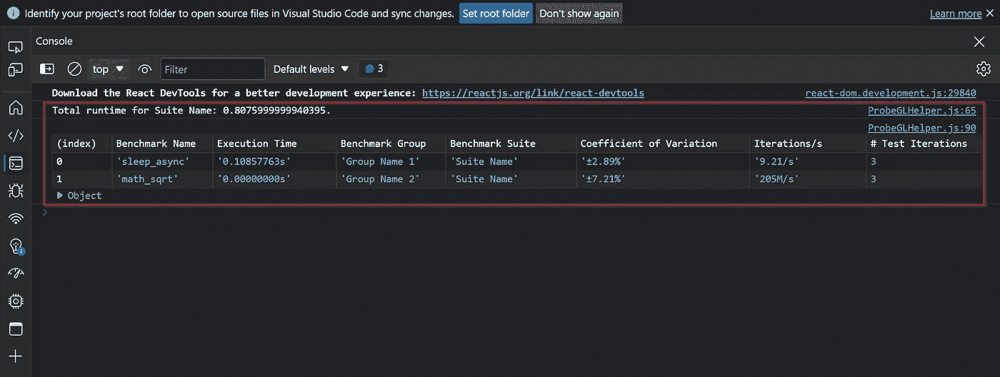

# probe . GL—node . js 中的基准测试

> 原文：<https://itnext.io/probe-gl-benchmarking-in-node-js-2362548d4a99?source=collection_archive---------3----------------------->

*在 Node.js 寻找标杆？我来介绍一下*[***probe . GL***](https://uber-web.github.io/probe.gl/)**——优步制作的 JavaScript 前端调试工具集合。**

**

*由 [Marco Biondi](https://unsplash.com/@marco_biotico?utm_source=unsplash&utm_medium=referral&utm_content=creditCopyText) 在 [Unsplash](https://unsplash.com/s/photos/bench?utm_source=unsplash&utm_medium=referral&utm_content=creditCopyText) 上拍摄的照片*

*[probe.gl](https://uber-web.github.io/probe.gl/) 是优步制作的 JavaScript 前端调试工具集合。 [probe.gl](https://uber-web.github.io/probe.gl/) 有各种各样的工具，但今天我们将重点关注`Bench`，这是一个基准测试工具类，可以轻松创建用于优化和回归测试目的的“微基准”。在这个故事中，我们将构建一个示例 React 应用程序，它实现了 [probe.gl](https://uber-web.github.io/probe.gl/) 基准测试平台。如果你想找到更多关于 [probe.gl](https://uber-web.github.io/probe.gl/) 的文档，你可以去[这里](https://uber-web.github.io/probe.gl/docs)。*

> *注意:您可以在本文的底部看到基准测试的输出。*

# *开始之前*

*在开始之前，我想说明一下，这个故事中的所有代码都可以在 GitHub 这里找到:[*probe GL-benchmark-sample*](https://github.com/danielkon96/probegl-benchmarking-sample)。请随意在您自己的个人和专业项目中使用它，并根据您的需要进行更改。*

# *设置*

*首先，让我们创建一个新的 React 项目*

> *注意:我使用的是节点版本 [v18.12.0](https://nodejs.org/en/blog/release/v12.18.0/)*

```
*npx create-react-app benchmark-react-app
cd benchmark-react-app*
```

*接下来，我们需要将 probe.gl `bench`添加到我们的项目中*

```
*npm install "[@probe](http://twitter.com/probe).gl/bench"*
```

# *示例函数*

*接下来，让我们来看看示例函数。导航到 **App.js** 并创建我们将进行基准测试的两个示例函数:***sample _ function _ sleep _ async***和***sample _ function _ math _ sqrt***。第一个函数休眠 100 毫秒。第二个函数只是调用内置的 Math.sqrt 函数。*

*两个示例函数*

# *先决条件*

*在我们编写基准之前，我们需要完成一些先决条件。在这种情况下，我们需要创建一个名为***probe GL helper . js***的 probe.gl 辅助文件。乍一看，这个文件包含大量代码，您是对的。但是，我会逐行详细描述该文件包含的所有内容。*

*助手文件代码*

*有很多东西要打开。这个帮助文件包含两个主要函数:`customLogger`和`runBenchmarks`。`customLogger` 用于记录我们的基准测试结果。`runBenchmarks` 用于更好地控制我们的基准运行。让我们一行一行地浏览 **ProbeGLHelper.js** 。*

***第 1–7 行:**这些是在两个辅助函数中使用的辅助变量*

***第 9–40 行:**这些函数格式化`customLogger` 输出，以提高可读性*

***第 47 行:**这一行收集了从基准测试返回的所有变量 probe.gl*

***第 49 行:**每次 probe.gl 运行一个基准`customLogger` 被调用，这个 switch 语句被触发*

***第 59 行:**在这一行，我们存储从 probe.gl 返回的[变异系数](https://en.wikipedia.org/wiki/Coefficient_of_variation)，并将其存储在一个名为 cv 的数组中。我们在最终结果表的第 78 行使用这个数组*

***第 61–90 行:**当 probe.gl 完成所有基准测试时，调用该部分。这是`customLogger`构建显示到控制台的表格的地方*

> *注意:您可以在**71–86**行调整基准测试结果的输出*

***第 95–112 行**:在运行基准测试时，这一部分为我们提供了对 probe.gl 的更多控制。例如，第**96–102**行允许您更改每次迭代运行的异步测试数量*(默认情况下，每次迭代运行 10 个异步测试。在这里，我们将其更改为每次迭代 1 次异步测试运行)**

# *创建基准*

*在我们编写基准之前，我们需要在 App.js 的顶部添加以下导入语句*

```
*import React, { useEffect } from 'react';
import { Bench } from '@probe.gl/bench';
import { customLogger, runBenchmarks } from './ProbeGLHelper';*
```

*最后，我们准备写一些基准！让我们首先创建一个名为***sample _ benchmark***的异步函数。下面我将逐行详细描述这个函数包含的所有内容。*

*基准代码*

*更多要打开。这个函数创建了我们的基准！我们来一行一行的过***sample _ benchmark***。*

***第 2–6 行**:这是我们为`Bench`设置选项的地方，包括我们的`customLogger`*

***第 7 行**:初始化 probe.gl 基准线束类`Bench`，传`benchOptions`为参数*

***第 10 行** *(与* ***第 18 行*** *)* :创建一个包含指定基准的组*

***第 11–15 行** *(同样的概念适用于* ***第 19–23 行*** *)* :这里我们给我们的基准测试一个`priority (optional)`、一个`id`、一个我们将要测试的`function`和一个`initFunction`(这个不推荐使用，所以我们传递 null)*

> *注意:add/addAsync 的函数签名是:*

```
*add(priority, id, testFunc, initFunc[Deprecated]) : Bench
addAsync(priority, id, testFunc, initFunc[Deprecated]) : Bench*
```

***第 26 行:**将`bench`传递给我们在助手文件中创建的助手函数`runBenchmarks`。这将运行我们创建的基准。*

# *运行基准*

*现在在函数 ***App*** 中用下面的代码替换所有默认生成的代码。*

*函数 App()代码*

*要启动我们的应用程序，请运行以下命令*

```
*npm run start*
```

*当你打开你的网页浏览器控制台时，你应该会看到类似下面*的截图(如果没有，刷新页面。浏览器有时会在第一页加载时跳过控制台日志)**

**

*控制台截图*

*您已经使用 probe.gl 成功地在 Node.js 中实现了基准测试。如果您有任何问题或者想要使用 probe.gl 查看特定的基准测试场景，请告诉我！*

*如果你遇到任何问题或不清楚的地方，请随时回复。编码快乐，上帝保佑！*