# 具有颤动的程序纹理

> 原文：<https://itnext.io/procedural-textures-with-flutter-efcf546cd1fc?source=collection_archive---------1----------------------->

给软件工程师一个框架/技术，迟早他们会用它来写一个游戏。在这个宇宙中，事情就是这样安排的。给软件工程师一个支持画布般绘图的工具，总有一天你会在上面看到柏林噪声——这是肯定的。

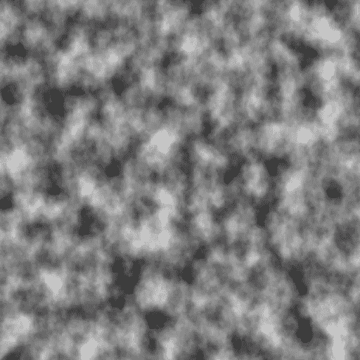

我很幸运地成为这两种说法的受害者，并深入研究了用 Flutter 编写手机游戏，这是一次疯狂的旅程，有其自身的缺点和优点。沿着这些曲折的曲线，我还遇到了以编程方式生成纹理以在 **dart:ui** [画布](https://api.flutter.dev/flutter/dart-ui/Canvas-class.html)上绘制的需要。在这种情况下，成功的算法在复杂性方面与 FizzBuzz 相差甚远，所以我认为这可能值得记录下来并与其他长笛手分享。事不宜迟，我们开始吧。

# **Skia** 支持着色器

好消息是，我们可以在[**SkSL**](https://github.com/google/skia/blob/master/src/sksl/README)**中编写某种[片段着色器](https://www.khronos.org/opengl/wiki/Fragment_Shader)(**Skia 的**味的 [**GLSL**](https://www.shadertoy.com/results?query=&sort=popular&filter=) )在 **Dart** 中以某种方式告诉 **Skia** 渲染它。我们完了，绅士们。故事结束。**

**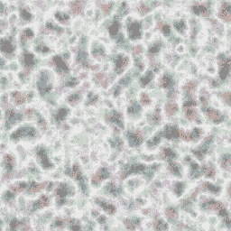****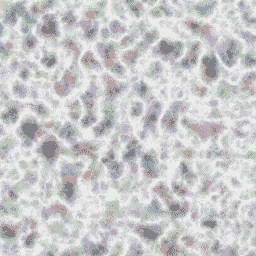****

来自[skia.org](https://skia.org/user/api/skpaint_overview)的湍流“着色器”样本。** 

**这正是我最初的想法。实际上， **dart:ui** 并没有公开任何 API 来构建成熟的 **SkSL** 着色器。而[着色器](https://api.flutter.dev/flutter/dart-ui/Shader-class.html)实例只是一些[内置 **Skia** 着色器](https://github.com/google/skia/tree/master/src/shaders)的浅层包装器。**

**坏消息是，用 Flutter 在程序上生成图像是不可能的。我们完了，绅士们。故事结束。**

**这正是我对这个问题的第二种看法。幸运的是，我错了。**

# **抖动画布和绘制图像**

**[Canvas](https://api.flutter.dev/flutter/dart-ui/Canvas-class.html) 有这个方法， [drawImage](https://api.flutter.dev/flutter/dart-ui/Canvas/drawImage.html) ，它接受一个 [Image](https://api.flutter.dev/flutter/dart-ui/Image-class.html) 对象的实例。因此，如果我们能够以某种方式操纵该对象背后的二进制缓冲区，使其包含特定像素的特定颜色，然后在画布上绘制结果图像，我们就完成了。故事结束了？**

**还没有。仅仅实例化一个新图像并从 [dart:typed_data](https://api.flutter.dev/flutter/dart-typed_data/dart-typed_data-library.html) 包中传递一些东西是不可能的。原因是图像是直接从 [Flutter 引擎](https://github.com/flutter/engine)创建的，它是框架的本地部分，具有对 Dart 代码的互操作。从 Dart 端获取图像的唯一方法是使用[instantiadimagecodec](https://api.flutter.dev/flutter/dart-ui/instantiateImageCodec.html)实用程序。正如您可能猜到的，它不会立即返回图像，也是异步的。大多数资料建议按以下方式使用它:**

**哪个是👌，因为它有很好的文档记录，并且完全按照您的预期工作，尽管比您预期的实例化一个图像所需的代码多两行。**

**上面的例子缺少一个重要的细节，它没有告诉你**字节数据**来自哪里。在程序纹理生成的情况下，这非常重要，因为我们不是简单地从磁盘或网络读取*原始图像源*，而是需要*从头开始在内存中实例化它*。编解码器支持的格式有 JPEG、PNG、GIF、动画 GIF、WebP、动画 WebP、BMP 和 WBMP。如你所见*这里没有原始字节数据*。**

**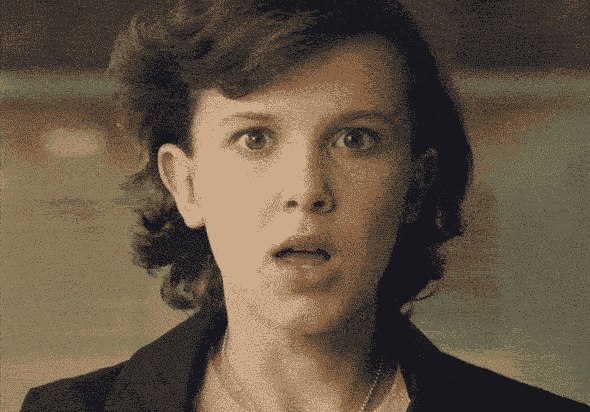**

**幸运的是， **BMP** 和*差不多*像原始字节，对吗？而且大概有一个很好的库可以用 Dart 生成 **BMP** ？长话短说，我已经编写了一个自定义的 BMP 编码器，并开始在我的项目中使用它，然后才意识到有一种更简单，但文档较少的方法来用 **dart:ui** 实例化图像。**

# **⚡️decodeImageFromPixels ⚡️**

**有时候，不管你怎么努力，你就是无法在网上找到一些东西。有时候你只是在找一个错误的东西。我也遇到了这种情况，因为我完全专注于 Image 类中的[文档，这些文档声明您*必须使用***instantiate Image codec**来获取图像实例。但是从字面上看，在**instantiatemagecodec**的源代码下面 48 行，还有另一个函数， **decodeImageFromPixels** ，这是我纯属运气偶然发现的，这个不受上面列出的格式限制，可以接受原始像素数据。多美啊！](https://api.flutter.dev/flutter/dart-ui/Image-class.html)**

**有了它，我们已经可以找点乐子了。这是我将在本文剩余部分使用的操场。**

**生成图像的平台**

**我向您保证，这个例子比复杂性更长。但结果是，你可以运行`flutter create texture_generator`并与上面的源代码交换`main.dart`的内容。运行时，它看起来像:**

**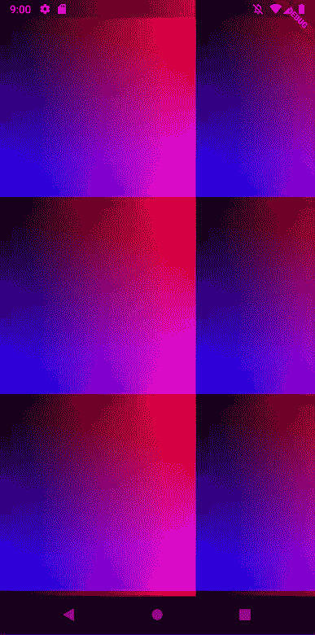**

**一些尚未统一的东西**

**你们中那些处理过着色器的人会立即意识到这个东西在现实中有多糟糕。它运行在中央处理器上。在移动 CPU 上。**

**不太好的原因很简单，GPU 的存在就是为了做这样的事情。所以我们上面做的有点不太合适。所以“自行承担风险”**。****

**用 CPU 渲染(感谢流言终结者)**

**用 GPU 渲染(感谢流言终结者)**

**也就是说，让我们开始调整我们的示例，以获得更实用的东西。在着色器工作流中，通常使用单位矢量坐标而不是绝对值进行操作。**

**这将被呈现为:**

**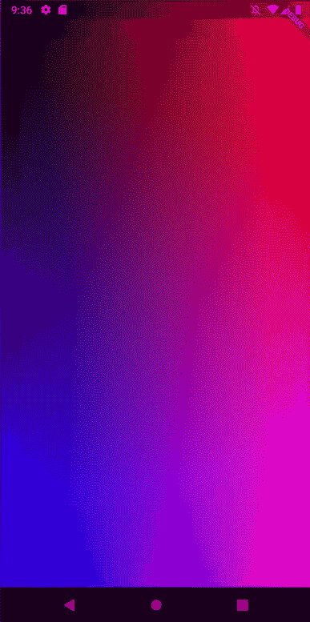**

**我们可以用以下方式对其进行细微的修改:**

**而且它已经可以被真正的应用程序使用了。**

**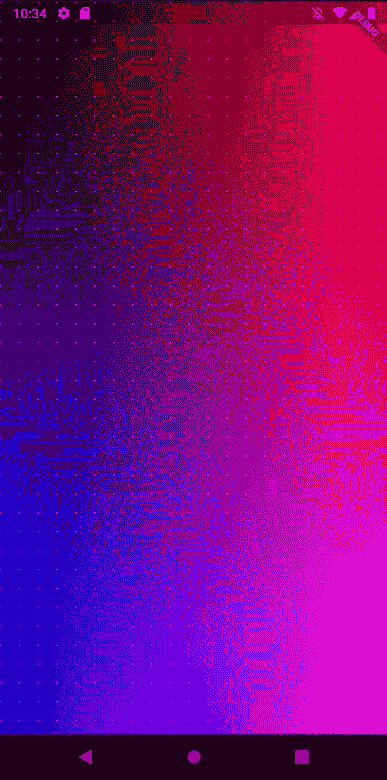**

**带点图案的渐变**

**这种方法的好处是数学上的精确性。因此，如果你需要制作一个像素完美的设计，还能适应所有可能的长宽比和像素密度，这甚至可能是你的一个选择。然而，我们这样做是为了好玩🌕。**

**现在，让我们尝试不同的经典着色器教程:棋盘图案。为了让我们的生活轻松一点，让我们来介绍一个小帮手，将`Vector3`转换成代表`RGBA`颜色的`int`。同类型的`int`，我们在前面的例子中返回，如`Colors.black.value`或`0xffbada55`。**

**现在我们的代码看起来更接近你在实际的着色器教程中所能找到的。从棋盘开始，让我们在 X 轴上画一个渐变。**

**它将在水平轴上绘制一个从黑到白的平滑渐变。**

**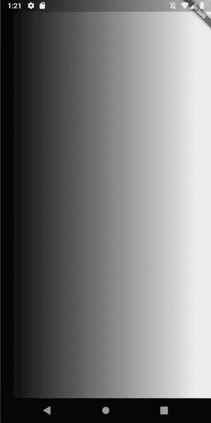**

**尽可能平滑地用于 8 位色彩空间**

**下一步是添加一些重复。一个简单的方法是重新映射我们的`uv`向量，这样当运行从`0`到`Size.width`的像素代码时，它会多次重复`0..1`之间的值。实现这一点再简单不过了，感谢数学！**

**这个函数将返回`Vector3`的小数部分，所以如果我们在其中传递类似`uv.xxx`的东西，它将返回几乎完全相同的东西。但是，如果我们传递一个`Vector(1.1, 2.2, 3.3)`，它将返回`Vector3(0.1, 0.2, 0.3)`，它将总是有单位大小。**

**我们可以通过以下方式利用它:**

**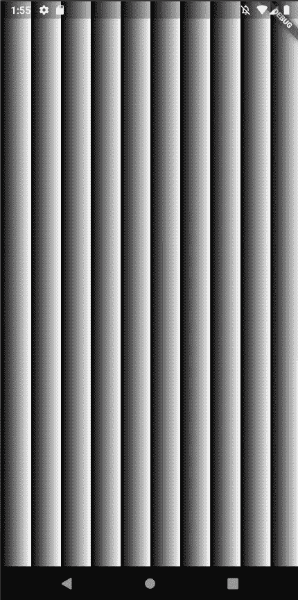**

**请不要在你的应用中直接使用这样的模式🙏**

**现在让我们沿着 Y 轴添加一个重复。为此，我们要缩放单位坐标向量的`x`和`y`分量。我们也为`Vector2`具体介绍一下`frac2`。**

**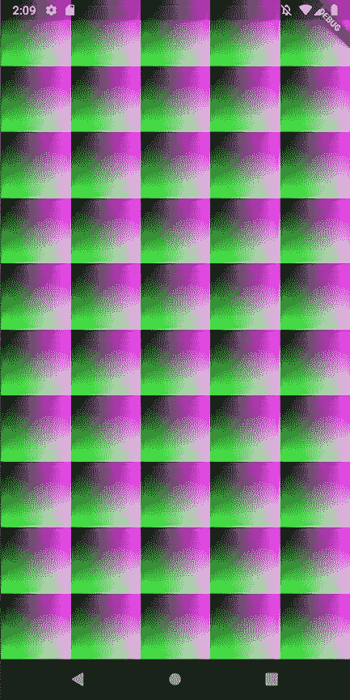**

**里克-莫蒂网格公司**

**太好了！但是如果我们想要正方形瓷砖呢？这也很容易，我们可以根据给定的`Size`的长宽比重新缩放我们原来的`uv`。**

**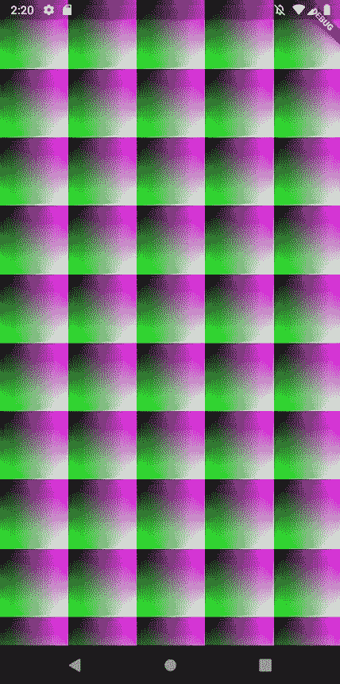**

**“完美的网格并不存在…🤔"**

**尽管已经很酷了，但它还不是棋盘。为了做到这一点，让我们使用我们的`gridUv`坐标。如果`gridUv`代表网格单元的左上或右下四分之一，则返回`0xffffff`和`0xff000000`颜色。**

**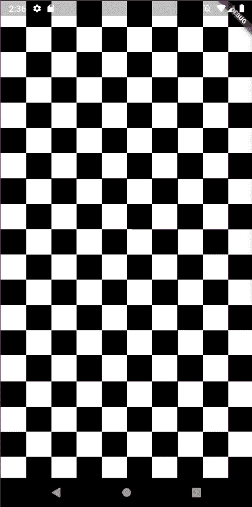**

**那将是一场漫长的象棋比赛！**

**尽管我们能够在移动设备的屏幕上绘制这种带有抖动的东西很酷，并且可以热重新加载，真正完全控制每个像素，但这种模式本身有点无聊。所以让我们更上一层楼吧！**

**[](https://en.wikipedia.org/wiki/Truchet_tiles) [## 瓷砖

### 在信息可视化和图形设计中，Truchet 瓷砖是用图案装饰的方形瓷砖，这些图案不是…

en.wikipedia.org](https://en.wikipedia.org/wiki/Truchet_tiles) 

Truchet tiles 是网格中基于模式或随机重复的图形片段。就像我们现在做的一样！因此，我们可以稍微增加一点趣味的第一件简单的事情是随机交换网格单元的哪些部分是白色的。

让我们渲染一下，然后…

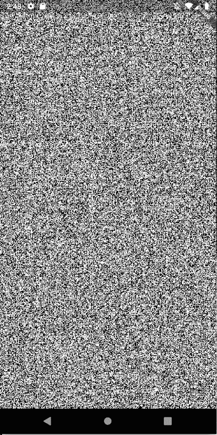

是的，这就是着色器的工作原理。

我们只会听到一堆噪音。这是因为我们的代码是对每个像素单独执行的，我们的`gridUv`抽象仅仅基于输入坐标。

摆脱这种完全随机性的方法是根据图块索引来决定渲染哪个图块。除此之外，我们还可以对输入应用一些伪随机转换，这样就不会经常重复。

看起来`random2`中的数学有点复杂，不清楚它是做什么的。但这正是我们需要的功能。您可以尝试修改它的内容，看看它如何影响我们产生的平铺模式。

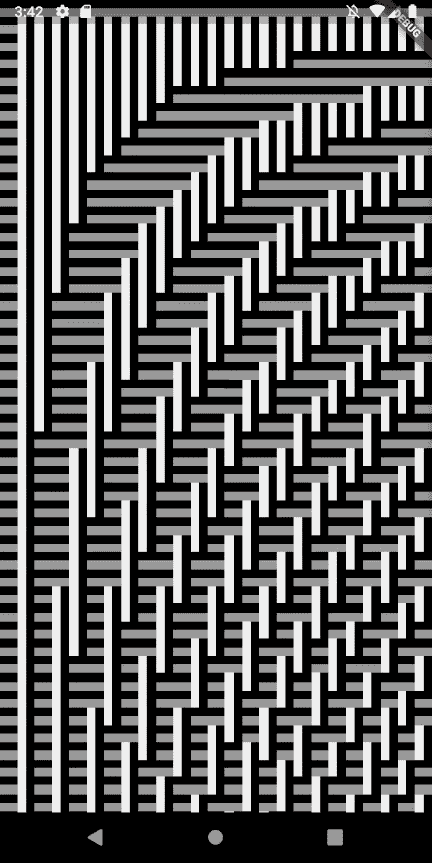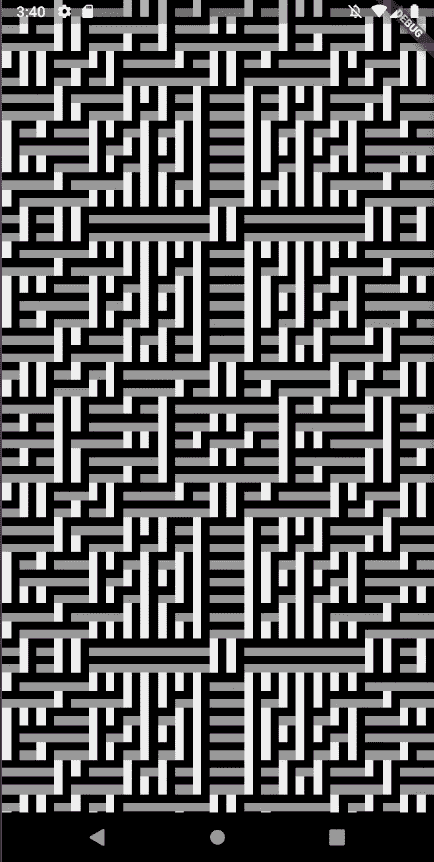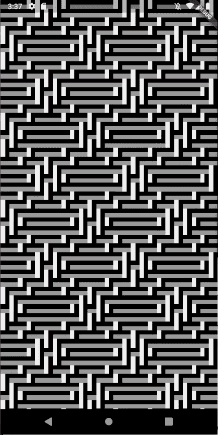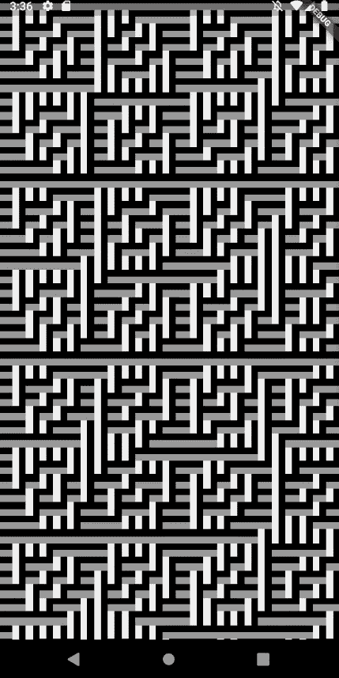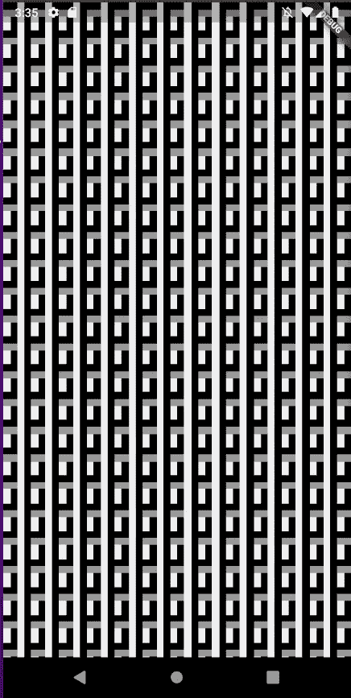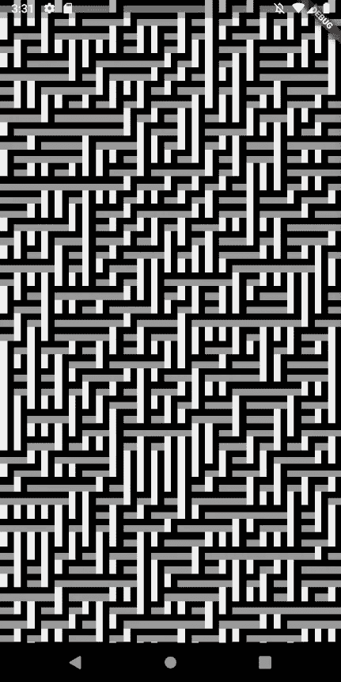

不同 random2 实现产生的各种模式的一些例子

从这里，你可能已经看到，可能性是无穷无尽的。您可以将各种瓷砖填充与各种填充模式相结合，以产生无限数量的纹理。这种伪随机方法的最佳特性之一是它是完全可重复的，因此如果您需要，它在应用程序运行或不同设备之间看起来是相同的。

# 让我们制造一些噪音

在文章的开始，有一些使用 Perlin noise 生成的纹理截图。让我们实现这些吧！

首先，让我们将`[fast_noise](https://pub.dev/packages/fast_noise)` lib 添加到我们的`pubspec.yaml`中。如果你用的是 VSCode，我可以推荐安装`Pubspec Assist`包。使用它，添加一个新的包看起来像这样:

```
Ctrl + P
pubspec
Enter
Ctrl + Shift + P
Add depe
Enter
fast noise
Enter
```

这比你实际输入的时间要长得多:)

安装后，将其导入我们的`main.dart`，我们就可以开始了！

让我们以下面的方式修改`generateImage`。因此，它从 PerlinNoise generator 获取我们像素网格中的颜色，而不是使用`generatePixel`函数。

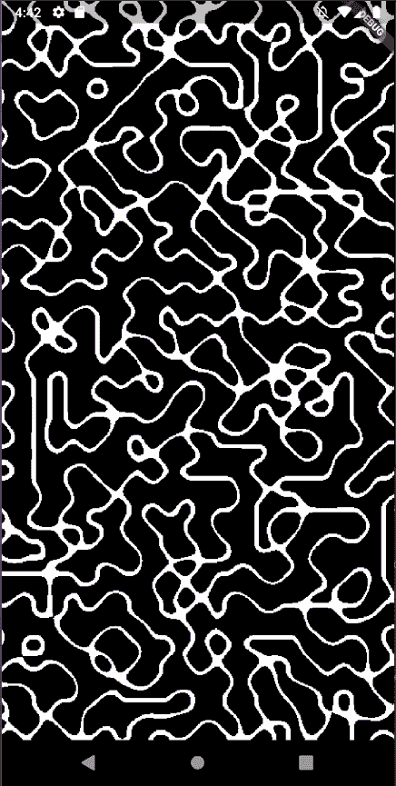

酷炫无尽的柏林虫！

但是这些边缘！呃。幸运的是，我们可以通过颜色间的插值相对容易地解决这个问题。因此，我们不是在黑与白之间进行硬切换，而是在两者之间进行一些平滑处理。这个英雄将帮助我们实现那个名为`smoothStep`的目标，并且是我们已经在使用的`vector_math`库的一部分！

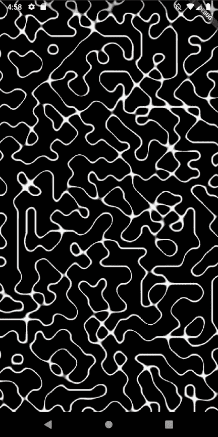

思慕雪！

# 悲伤的部分

不幸的是，即使在一台像样的开发人员笔记本电脑上，生成上面的图像也需要几秒钟。这对大多数应用程序来说太多了。所以总的来说，如果你的用例比文章第一部分中的简单模式更复杂，*我不推荐使用这种方法*。在[这篇文章](https://medium.com/@germansaprykin/opengl-with-texture-widget-f919743d25d9)中清晰地描述了实际要遵循的路径。不幸的是，编写运行 GPU 的实际着色器的能力似乎不会很快为 flutteres[提供。也就是说，需要更少计算的更简单的用例仍然是相对有用的，可以在应用程序中加入一些精确控制的随机性！](https://github.com/flutter/flutter/issues/30763)

# 更新:2021 年 10 月

看起来颤振引擎可能会在即将发布的版本中获得定制的[着色功能](https://github.com/flutter/flutter/issues/58361)🍨！** 

**感谢阅读这篇文章！如果你正在用 Flutter 编写游戏或者做任何与程序图形生成相关的事情，我很乐意在评论中听到你的项目，或者给我写几行到 [av@av.codes](mailto:av@av.codes) 。**