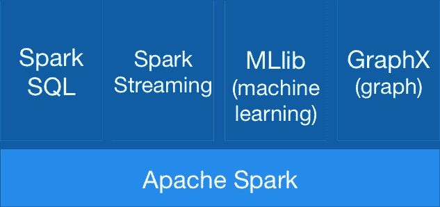
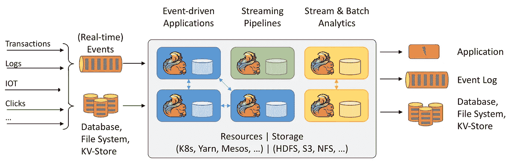
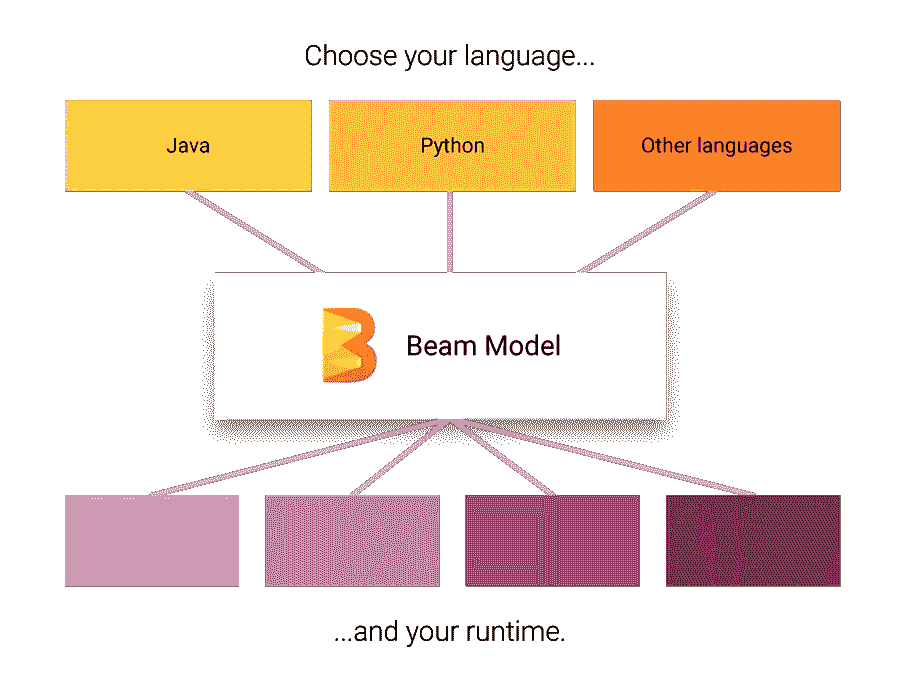

# 大数据处理引擎

> 原文：<https://itnext.io/processing-engines-for-big-data-5827bfad6b02?source=collection_archive---------2----------------------->

托马斯·马丁内斯在 [Unsplash](https://unsplash.com?utm_source=medium&utm_medium=referral) 上的照片

# 介绍

本文基于我之前的文章“ [***大数据管道秘方***](/big-data-pipeline-recipe-c416c1782908?source=your_stories_page-------------------------------------) ”，在这篇文章中，我试图快速概述大数据世界的各个方面。

本文的目标是关注大数据 [**ETL**](https://en.wikipedia.org/wiki/Extract,_transform,_load) 管道的**【T】**，回顾处理大量数据的主要框架。主要焦点将是 Hadoop 生态系统。

但是首先，让我们回顾一下这个阶段是怎么回事。请记住，此时您已经获取了准备进行处理的原始数据。

# 大数据处理阶段

此阶段的目标是使用单一模式清理、规范化、处理和保存数据。最终结果是一个具有良好定义的模式的**可信数据集。**像 **Spark** 这样的处理框架被用来在一个机器集群中并行处理数据。

通常，您需要进行某种处理，例如:

*   **验证**:通过将数据存储在单独的存储器中来验证数据并隔离坏数据。根据您的数据质量要求，在达到某个阈值时发送警报。
*   **争论和清理**:清理你的数据，并以另一种格式存储以便进一步处理，比如用 Avro 替换低效的 JSON。
*   **标准化**和**数值的标准化**
*   **重命名**字段
*   …

请记住，我们的目标是创建一个**可信数据集**，稍后可用于下游系统。这是数据工程师的一个关键角色。**这可以以流或分批的方式进行。**

**批量加工**时，流水线加工可分为**三个阶段**:

## **预处理阶段**

如果原始数据不干净或格式不正确，您需要对其进行预处理。这一阶段包括一些基本的验证，但目标是**为下一阶段准备有效处理的数据**。在这个阶段，你应该尝试**将数据扁平化，并以二进制格式**保存，比如 **Avro** 。这将加速进一步的处理。这个想法是，下一阶段将执行行级操作，而嵌套查询开销很大，因此现在将数据扁平化将提高下一阶段的性能。

## **可信阶段**

在这一阶段，数据被**验证、清理、规范化并**转换为存储在[**Hive**](https://hive.apache.org/)**或另一个数据存储中的公共模式。目标是创建数据所有者理解的可信公共数据集。通常，会创建一个数据**规范**，数据工程师的角色是应用转换来匹配规范，包括验证规则、转换、值的标准化、重命名字段等。**

**最终结果是以 [**拼花**](https://parquet.apache.org/) 或其他易于查询的列格式的数据集。选择正确的分区并优化数据来执行内部查询是至关重要的。**

**您可能希望在此阶段部分预先计算一些聚合，以提高查询性能。**

## ****报告阶段****

**这一步是可选的，但通常是必需的。不幸的是，当使用数据湖时，**一个单一的模式不能满足所有的用例**；这是数据仓库和数据湖之间的一个区别。查询 HDFS 不如数据库或数据仓库高效，因此需要进一步优化。**

**在这个阶段，您可能需要**将数据反规范化**以使用不同的分区存储数据，这样不同的利益相关者就可以更有效地查询数据。这个想法是为不同的下游系统( [**数据集市**](https://en.wikipedia.org/wiki/Data_mart) )创建不同的**视图**。**

**在此阶段，如果不使用 OLAP 引擎，也可以计算聚合。可信阶段不知道谁将查询数据，**这个阶段为消费者优化数据**。如果一个客户端是高度交互的，你可能希望在这个阶段**引入一个快速存储层**，比如一个用于快速查询的关系数据库。或者，你可以使用 [OLAP 发动机](/olap-query-engines-for-big-data-5f17b88d6ebc)。**

**对于流式传输，逻辑是相同的，但它将以流式方式在定义的 DAG 内运行。Spark 允许你加入历史数据流，但是它有一些限制。 [**OLAP 引擎**](/olap-query-engines-for-big-data-5f17b88d6ebc) 更适合将实时数据与历史数据合并。**

# ****处理框架****

**一些可用于处理的工具有:**

## **[**阿帕奇火花**](https://spark.apache.org/)**

**这是最著名的批处理框架。作为 Hadoop 生态系统的一部分，它是一个由**管理的**集群，提供了难以置信的**并行性**、监控和出色的 UI。它还支持流处理([结构化流](https://spark.apache.org/docs/latest/structured-streaming-programming-guide.html))。基本上，Spark 在内存中运行 MapReduce 作业，其性能是普通 MapReduce 的 100 倍。它与 Hive 集成以支持 SQL，并可用于创建 Hive 表、视图或查询数据。它有很多集成，支持多种格式，有一个巨大的社区。它受到所有云提供商的支持。它可以在 Hadoop 集群的 [**YARN**](https://hadoop.apache.org/docs/current/hadoop-yarn/hadoop-yarn-site/YARN.html) 上运行，也可以在 Kubernetes 和其他平台上运行。它有许多针对特定用例的库，如 SQL 或机器学习。**

****

## **[**阿帕奇弗林克**](https://flink.apache.org/)**

**第一个统一批处理和流式传输的引擎，但主要关注于流式传输。可以作为 Kafka 这样的微服务的骨干。它可以作为 Hadoop 集群的一部分运行在 [YARN](https://hadoop.apache.org/docs/current/hadoop-yarn/hadoop-yarn-site/YARN.html) 上，但从一开始就已经针对 Kubernetes 或 Mesos 等其他平台进行了优化。它的**速度极快**并提供实时流，对于**低延迟**流处理，尤其是对于**有状态**流，它比 Spark 更好。它也有 SQL，机器学习和更多的库。它比 Spark 更快，是数据流的更好选择。**

****

## **[**阿帕奇风暴**](https://storm.apache.org/)**

**Apache Storm 是一个免费的开源分布式实时计算系统。它专注于流，是 Hadoop 生态系统的托管解决方案的一部分。它是可扩展的、容错的，保证您的数据将被处理，并且易于设置和操作。**

## **[**阿帕奇萨姆扎**](https://samza.apache.org/)**

**另一个伟大的有状态流处理引擎。Samza 允许您构建有状态的应用程序，实时处理来自包括 Apache Kafka 在内的多个来源的数据。托管解决方案运行在 YARN 之上的 Hadoop 生态系统的一部分。**

****

## **[**阿帕奇光束**](https://beam.apache.org/)**

**Apache Beam 它本身不是一个引擎，而是一个**统一编程模型**的**规范**，它将所有其他引擎集合在一起。它提供了一个可以与**不同语言**一起使用的编程模型，这样开发者在处理大数据管道时就不用学习新的语言了。然后，它为可以在云中或本地运行的处理步骤插入不同的后端。Beam 支持前面提到的所有引擎，您可以轻松地在它们之间切换，并在任何平台上运行它们:cloud、YARN、Mesos、Kubernetes。如果您正在开始一个新项目，我真的建议从 Beam 开始，以确保您的数据管道经得起未来的考验。**

****

# **结论**

**处理引擎是目前大数据领域最著名的工具。作为一名大数据工程师，您将经常使用这些引擎。**您必须了解这些引擎的分布式本质，并知道如何优化、保护和监控它们。****

**请记住，还有一些 [**OLAP 引擎**](/olap-query-engines-for-big-data-5f17b88d6ebc) 提供了查询大量数据的单一解决方案，不需要编写复杂的转换，而是以特定格式加载数据，这使得查询性能更高。**

**对于一个新项目，我真的推荐研究一下 **Apache Beam** ，因为它在所有其他引擎**之上提供了一个抽象，允许你在不改变代码**的情况下改变处理引擎。**

****对于流处理**，特别是有状态流处理，考虑 **Flink** 或 Samza。**对于批量，使用 Spark。****

**我希望你喜欢这篇文章。欢迎发表评论或分享这篇文章。跟随[***me***](https://twitter.com/JavierRamosRod)**进行未来的岗位。****