# 用 Redis 和 Apache Kafka 处理时间序列数据

> 原文：<https://itnext.io/processing-time-series-data-with-redis-and-apache-kafka-4272db0768dc?source=collection_archive---------2----------------------->

## 如何在 Azure 上使用 Kafka、Redis 和 Spring 处理时间序列数据的实例

[RedisTimeSeries](https://oss.redislabs.com/redistimeseries/) 是一个 Redis 模块，它将原生时间序列数据结构引入 Redis。早先构建在有序集合(或 Redis 流)之上的时间序列解决方案可以受益于`RedisTimeSeries`的特性，例如大容量插入、低延迟读取、灵活的查询语言、下采样等等！


[来源](https://oss.redislabs.com/redistimeseries/)

一般来说，时间序列数据(相对)简单。话虽如此，我们还需要考虑其他特征:

*   数据速度:例如，想想每秒来自数千台设备的数百个指标
*   量(大数据):想想几个月(甚至几年)的数据积累

因此，像`RedisTimeSeries`这样的时间序列数据库只是整个解决方案的一部分。你还需要考虑如何*收集*(摄取)*处理**发送*你所有的数据给`RedisTimeSeries`。您真正需要的是一个可伸缩的数据管道，它可以作为一个缓冲区来分离生产者和消费者。

这就是阿帕奇卡夫卡的用武之地！除了核心代理，它还有一个丰富的组件生态系统，包括 [Kafka Connect](https://kafka.apache.org/documentation/#connect) (这是这篇博客文章中介绍的解决方案架构的一部分)、多种语言的客户端库、 [Kafka Streams](https://kafka.apache.org/documentation/streams/) 、Mirror Maker 等。

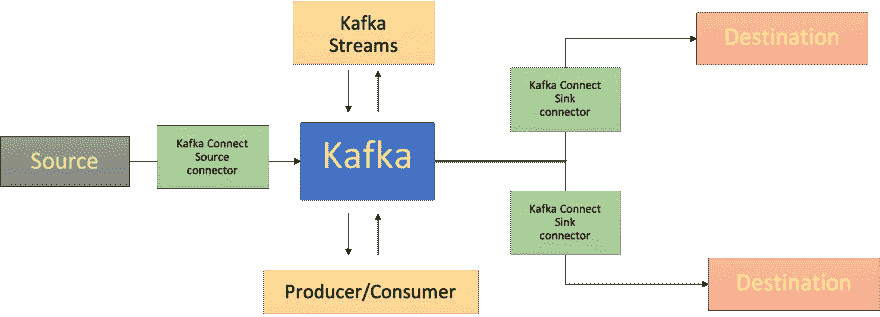

这篇博客文章提供了一个实例，展示了如何使用 Apache Kafka 的`RedisTimeSeries`来分析时间序列数据。

> *GitHub 回购—*[*https://github.com/abhirockzz/redis-timeseries-kafka*](https://github.com/abhirockzz/redis-timeseries-kafka)

让我们首先从探索用例开始——请注意，为了这篇博文的目的，它已经保持简单，但是后续部分

# 设备监控

假设有许多位置，每个位置都有多台设备，您负责监控设备指标，现在我们将考虑`temperature`和`pressure`。我们将把这些指标存储在`RedisTimeSeries`(当然！)并对键使用以下命名约定- `<metric name>:<location>:<device>`。例如，位置`5`的设备`1`的温度将表示为`temp:5:1`。每个时间序列数据点还会有以下标签(元数据)- `metric`，`location`，`device`。这是为了实现灵活的查询，您将在接下来的章节中看到这一点。

这里有几个例子，让你知道如何使用`TS.ADD`命令添加数据点:

```
# temperature for device 2 in location 3 along with labels
TS.ADD temp:3:2 * 20 LABELS metric temp location 3 device 2# pressure for device 2 in location 3
TS.ADD pressure:3:2 * 60 LABELS metric pressure location 3 device 2`
```

# 解决方案架构

以下是该解决方案的概要:

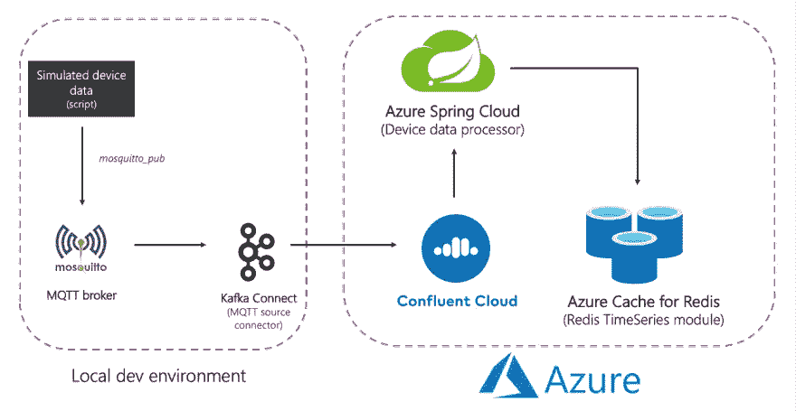

高层建筑

总结端到端流程:

模拟设备数据被发送到本地 MQTT 代理。这个数据由 MQTT Kafka connect source 连接器拾取，并发送到 Azure 中的融合云 Kafka 集群。它由 Azure spring Cloud 中的 Spring 应用程序处理，最终被发送到 Azure 中的 Redis 数据库。

是时候投入进去了！在此之前，请确保您具备以下条件:

# 先决条件

*   Azure 帐户— [你可以在这里免费获得一个](https://azure.microsoft.com/free/?WT.mc_id=data-17927-abhishgu)
*   安装 [Azure CLI](https://docs.microsoft.com/cli/azure/install-azure-cli?WT.mc_id=data-17927-abhishgu)
*   JDK 11 例如用于 [OpenJDK](https://openjdk.java.net/projects/jdk/11/%5D)
*   最近版本的 [Maven](https://maven.apache.org/download.cgi) 和 [Git](https://git-scm.com/downloads)

# 设置基础设施组件

按照文档[为 Redis(企业级)提供 Azure 缓存](https://docs.microsoft.com/azure/azure-cache-for-redis/quickstart-create-redis-enterprise?WT.mc_id=data-17927-abhishgu)，它与`RedisTimeSeries`模块一起提供。

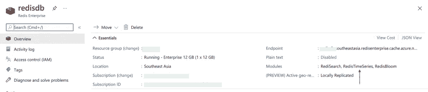

Redis 的 Azure 缓存

在 Azure Marketplace 上提供[融合云集群](https://docs.microsoft.com/azure/partner-solutions/apache-kafka-confluent-cloud/create?WT.mc_id=data-17927-abhishgu)并创建一个 Kafka 主题(例如`mqtt.device-stats`)

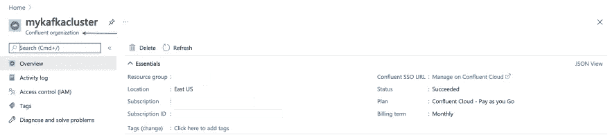

Azure 中的融合组织

您可以使用 Azure 门户或使用 Azure CLI 来提供 Azure Spring Cloud [的实例](https://docs.microsoft.com/azure/spring-cloud/quickstart-provision-service-instance?tabs=Azure-portal&pivots=programming-language-java&WT.mc_id=data-17927-abhishgu#provision-an-instance-of-azure-spring-cloud-1)

```
az spring-cloud create -n <name of Azure Spring Cloud service> -g <resource group name> -l <enter location e.g southeastasia>
```

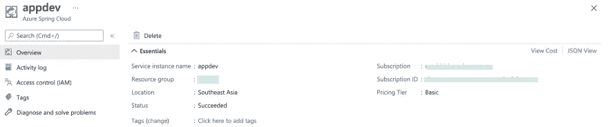

蔚蓝色的春云

在继续之前，确保克隆 GitHub repo:

```
git clone https://github.com/abhirockzz/redis-timeseries-kafka
cd redis-timeseries-kafka
```

# 设置本地服务

这些组件包括:

*   [mosquito](https://mosquitto.org/)MQTT 经纪人
*   [Grafana](https://grafana.com/) 用于跟踪仪表板中的时间序列数据
*   Kafka 与 [MQTT 源连接器](https://docs.confluent.io/kafka-connect-mqtt/current/mqtt-source-connector/index.html)连接

## MQTT 代理

我在 Mac 上本地安装并启动了`mosquitto`代理。

```
brew install mosquitto
brew services start mosquitto
```

您可以[遵循与您的操作系统](https://mosquitto.org/download/%5D)相对应的步骤，或者随意使用[这个 Docker 映像](https://hub.docker.com/_/eclipse-mosquitto)。

## 格拉夫纳

我在 Mac 上本地安装并启动了 Grafana。

```
brew install grafana
brew services start grafana
```

你可以为你的操作系统做同样的事情，或者随意使用这个 [Docker 镜像](https://hub.docker.com/r/grafana/grafana)。

```
docker run -d -p 3000:3000 --name=grafana -e "GF_INSTALL_PLUGINS=redis-datasource" grafana/grafana
```

## 卡夫卡连接

> *你应该可以在刚刚克隆的 repo 中找到* `*connect-distributed.properties*` *文件。替换*`*bootstrap.servers*`*`*sasl.jaas.config*`*等属性的值。**

*首先，[本地下载并解压 Apache Kafka](https://kafka.apache.org/downloads) 。*

***启动本地 Kafka Connect 集群***

```
*export KAFKA_INSTALL_DIR=<kafka installation directory e.g. /home/foo/kafka_2.12-2.5.0>$KAFKA_INSTALL_DIR/bin/connect-distributed.sh connect-distributed.properties*
```

*手动安装 MQTT 源连接器:*

*   *从这个链接下载连接器/插件 ZIP 文件[，并且，](https://www.confluent.io/hub/confluentinc/kafka-connect-mqtt)*
*   *将其提取到 Connect worker 的`plugin.path`配置属性中列出的一个目录中*

> **如果您在本地使用融合平台，只需使用 CLI:* `*confluent-hub install confluentinc/kafka-connect-mqtt:latest*`*

***创建 MQTT 源连接器实例***

*确保检查`mqtt-source-config.json`文件:确保为`kafka.topic`输入了正确的主题名称，并保持`mqtt.topics`不变。*

```
*curl -X POST -H 'Content-Type: application/json' http://localhost:8083/connectors -d @mqtt-source-config.json# wait for a minute before checking the connector status
curl [http://localhost:8083/connectors/mqtt-source/status](http://localhost:8083/connectors/mqtt-source/status)*
```

# *部署设备数据处理器应用程序*

*构建应用程序 JAR 文件:*

```
*cd consumerexport JAVA_HOME=/Library/Java/JavaVirtualMachines/zulu-11.jdk/Contents/Homemvn clean package*
```

*创建 Azure Spring 云应用程序并部署 JAR 文件:*

```
*az spring-cloud app create -n device-data-processor -s <name of Azure Spring Cloud instance> -g <name of resource group> --runtime-version Java_11az spring-cloud app deploy -n device-data-processor -s <name of Azure Spring Cloud instance> -g <name of resource group> --jar-path target/device-data-processor-0.0.1-SNAPSHOT.jar*
```

# *启动模拟设备数据生成器*

*使用脚本将数据发送到本地 MQTT 代理。您可以在刚刚克隆的 GitHub repo 中使用该脚本:*

```
*./gen-timeseries-data.sh*
```

> **它所做的就是使用* `*mosquitto_pub*` *CLI 命令发送数据**

*数据被发送到`device-stats` MQTT 主题(这是*而不是*Kafka 主题)。您可以使用 CLI 订户进行双重检查:*

```
*mosquitto_sub -h localhost -t device-stats*
```

***验证端到端管道***

*在合流云门户查看卡夫卡专题。您还应该检查 Azure Spring Cloud 中设备数据处理器应用程序的日志:*

```
*az spring-cloud app logs -f -n device-data-processor -s <name of Azure Spring Cloud instance> -g <name of resource group>*
```

# *享受 Grafana 仪表盘！*

*在`localhost:3000`浏览 Grafana UI。*

*Grafana 的 Redis 数据源插件可以与任何 Redis 数据库一起工作，包括 Redis 的 Azure Cache。按照这篇博文中的[说明来配置数据源。](https://abhishek1987.medium.com/an-easy-to-use-monitoring-solution-for-redis-5a8a73d56129)*

*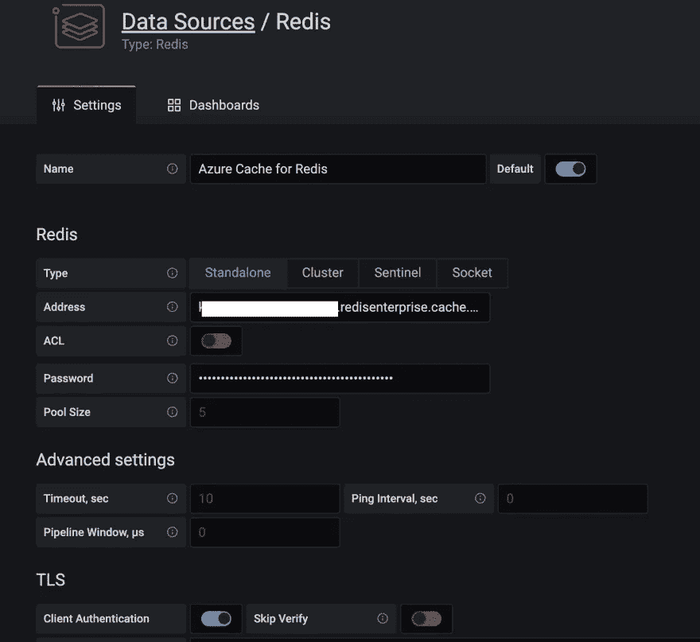*

*Redis 数据源*

*将仪表板导入到您克隆的 GitHub repo 的`grafana_dashboards`文件夹中。*

> **如果您需要有关如何导入仪表板的帮助，请参考* [*Grafana 文档*](https://grafana.com/docs/grafana/latest/dashboards/export-import/#importing-a-dashboard) *。**

*例如，这里有一个仪表板，显示位置 1(使用`TS.MRANGE`)中设备 5 的平均压力(超过 30 秒)*

*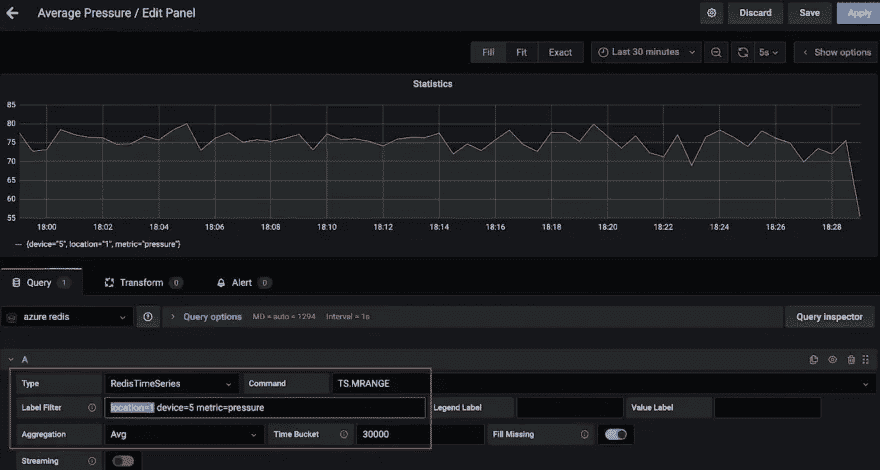*

*跟踪特定位置的特定设备的平均压力*

*这是另一个仪表板，显示了位置 3 的多个设备的最高温度(超过 15 秒)(再次感谢`TS.MRANGE`)。*

*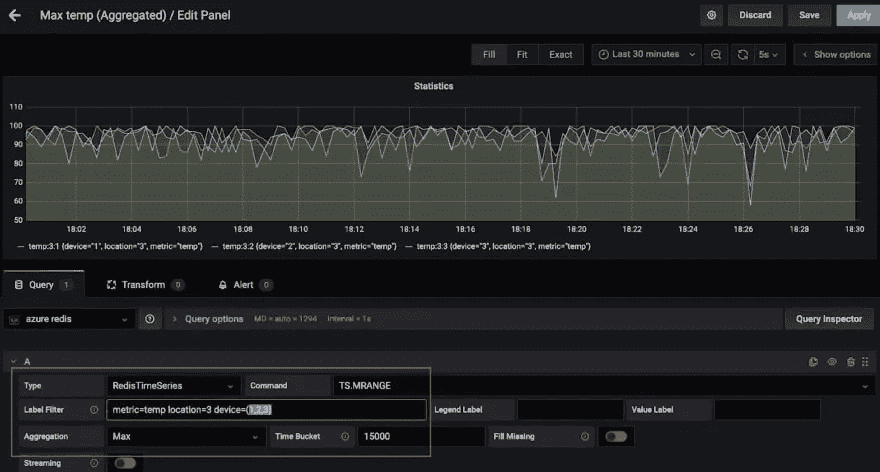*

*用 TS。m 获取一个位置多个设备的最高温度*

# *所以，您想要运行一些 RedisTimeSeries 命令！*

*启动`redis-cli`并连接到 Redis 实例的 Azure 缓存:*

```
*redis-cli -h <azure redis hostname e.g. redisdb.southeastasia.redisenterprise.cache.azure.net> -p 10000 -a <azure redis access key> --tls*
```

*从简单的查询开始:*

```
*# pressure in device 5 for location 1
TS.GET pressure:1:5# temperature in device 5 for location 4
TS.GET temp:4:5*
```

*按位置过滤并获取所有*装置的温度和压力:**

```
*TS.MGET WITHLABELS FILTER location=3*
```

*提取特定时间范围内一个或多个位置的所有设备的温度和压力:*

```
*TS.MRANGE - + WITHLABELS FILTER location=3
TS.MRANGE - + WITHLABELS FILTER location=(3,5)*
```

> *`*- +*` *指的是从开始到最近的时间戳的所有内容，但是您可以更具体一些**

*`MRANGE`正是我们所需要的！我们可以得到多个时间序列并使用过滤器。*

*我们还可以通过某个位置的特定设备进行过滤，并根据温度或压力进一步深入研究:*

```
*TS.MRANGE - + WITHLABELS FILTER location=3 device=2
TS.MRANGE - + WITHLABELS FILTER location=3 device=2 metric=temp*
```

*所有这些都可以与聚合相结合。*

```
*TS.MRANGE - + WITHLABELS FILTER location=3 metric=temp# all the temp data points are not useful. how about an average (or max) instead of every temp data points?TS.MRANGE - + WITHLABELS AGGREGATION avg 10000 FILTER location=3 metric=tempTS.MRANGE - + WITHLABELS AGGREGATION max 10000 FILTER location=3 metric=temp*
```

> **也可以创建一个规则来进行这种聚合，并存储在不同的时间序列中**

*一旦完成，不要忘记删除资源，以避免不必要的成本。*

# *删除资源*

*删除资源:*

*   *[按照文档中的步骤](https://docs.microsoft.com/azure/partner-solutions/apache-kafka-confluent-cloud/manage?WT.mc_id=data-17927-abhishgu#delete-confluent-organization)删除融合云团——你需要做的就是删除融合组织。*
*   *类似地，您也应该[删除 Redis 实例](https://docs.microsoft.com/azure/azure-cache-for-redis/cache-go-get-started?WT.mc_id=data-17927-abhishgu#clean-up-resources)的 Azure 缓存。*

*在您的本地计算机上:*

*   *停止 Kafka 连接集群*
*   *阻止莫斯基托经纪人(例如`brew services stop mosquitto`)*
*   *停止 Grafana 服务(例如`brew services stop grafana`)*

*我们使用 Redis 和 Kafka 开发了一个数据管道来接收、处理和查询时间序列数据。当您考虑下一步并转向生产级解决方案时，您应该考虑更多的事情。*

# *其他注意事项*

*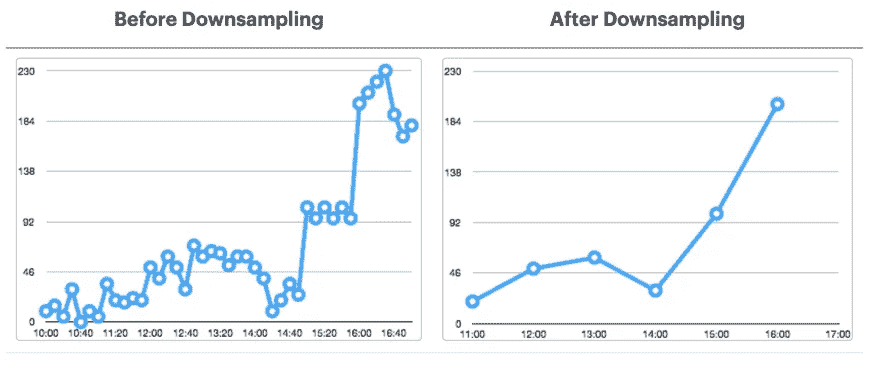*

*来源: [RedisLabs 文档](https://docs.redislabs.com/latest/images/rs/TimeSeries-downsampling1.png)*

***优化** `**RedisTimeSeries**`*

*   *[保留策略](https://oss.redislabs.com/redistimeseries/configuration/#retention_policy):考虑一下这个问题，因为你的时间序列数据点*在默认情况下不会*被修剪/删除。*
*   *下采样/聚合[规则](https://oss.redislabs.com/redistimeseries/commands/#aggregation-compaction-downsampling):你不想永远存储数据，对吧？确保配置适当的规则来解决这个问题(例如`TS.CREATERULE temp:1:2 temp:avg:30 AGGREGATION avg 30000`)*
*   *重复数据政策:您希望如何处理重复样本？确保默认策略(`BLOCK`)确实是您需要的。如果没有，考虑[其他选项](https://oss.redislabs.com/redistimeseries/configuration/#duplicate_policy)。*

> *这不是一份详尽的清单。对于其他配置选项，请参考 `[*RedisTimeSeries*](https://oss.redislabs.com/redistimeseries/configuration/)` [*文档*](https://oss.redislabs.com/redistimeseries/configuration/)*

***长期数据保留怎么样？***

*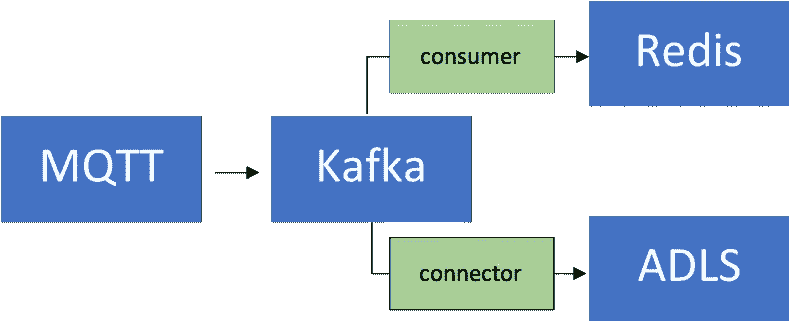*

*数据是宝贵的，包括时间序列！您可能希望对其进行进一步处理，例如，运行机器学习以提取洞察力、预测性维护等。为了实现这一点，您需要将这些数据保留更长的时间，并且为了经济高效，您需要使用可扩展的对象存储服务，如第二代 Azure 数据湖存储(ADLS 第二代)。*

*这有一个连接器！你可以通过使用完全托管的[Azure Data Lake Storage gen 2 Sink Connector for Confluent Cloud](https://docs.confluent.io/cloud/current/connectors/cc-azure-datalakeGen2-storage-sink.html)在 ADLS 处理和存储数据，然后使用 [Azure Synapse Analytics](https://docs.microsoft.com/azure/synapse-analytics/spark/apache-spark-machine-learning-mllib-notebook?WT.mc_id=data-17927-abhishgu#predictive-analysis-example-on-nyc-taxi-data) 或 [Azure Databricks](https://docs.microsoft.com/azure/databricks/applications/machine-learning/?WT.mc_id=data-17927-abhishgu) 运行机器学习，来增强现有的数据管道。*

***可扩展性***

*您的时间序列数据量只能向一个方向移动—向上！您的解决方案必须能够从多个角度进行扩展，这一点至关重要:*

*   *核心基础设施:托管服务允许团队专注于解决方案，而不是建立和维护基础设施，特别是在涉及复杂的分布式系统(如数据库)和流媒体平台(如 Redis 和 Kafka)时。*
*   *Kafka Connect:就数据管道而言，由于 Kafka Connect 平台本质上是无状态的和可水平扩展的，因此您可以放心使用。就如何设计和调整 Kafka Connect worker 集群而言，您有很多选择。*
*   *定制应用程序:和这个解决方案一样，我们构建了一个定制应用程序来处理 Kafka 主题中的数据。幸运的是，同样的可伸缩性特征也适用于它们。就水平比例而言——它只受您拥有的 Kafka 主题分区数量的限制。*

> **整合:不只是 Grafana！* `*RedisTimeSeries*` *还集成了* [*普罗米修斯*](https://github.com/RedisTimeSeries/prometheus-redistimeseries-adapter) *和*[*Telegraf*](https://github.com/RedisTimeSeries/telegraf)*。然而，在写这篇博文的时候还没有 Kafka 连接器——这将是一个很好的附件！**

# *结论*

*当然，您可以使用 Redis 做(几乎)任何事情，包括时间序列工作负载！一定要考虑数据管道的端到端架构，以及从时间序列数据源到 Redis 和其他数据源的集成。*

*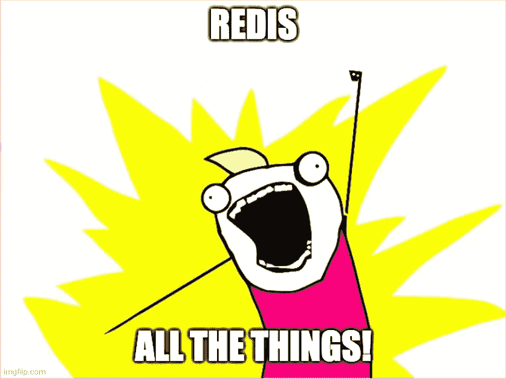*

*Redis 所有的东西！*