# 产品开发过程:从想法到代码

> 原文：<https://itnext.io/product-development-process-from-idea-to-code-dd719968e6ac?source=collection_archive---------1----------------------->

## 一个关于产品开发的故事。

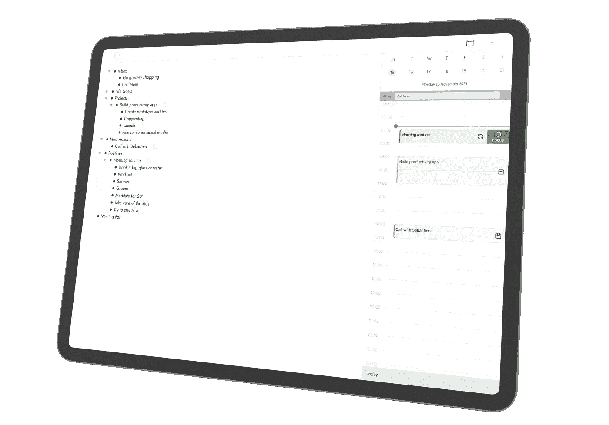

在这篇文章中，我将描述 [focusd](https://focusd.app/) 的产品开发过程，这是一款禅宗生产力应用程序，我目前正与[和](https://twitter.com/theandrecasal)一起开发。

本文中各部分的顺序与我们到目前为止所经历的步骤相对应。但是不要错误地认为这是一个瀑布过程。我们在某些部分来回穿梭，并将继续这样做。希望这篇文章对任何对构建数字产品感兴趣的人，或者只是好奇想知道它包含什么的人有用。

警告:这是一个很长的帖子，所以去喝杯咖啡(或茶🍵)在你潜入之前。

安德烈和我都是独立黑客。我们一起开发产品。我们试图保持精简和斗志昂扬，因为我们没有奢侈的外部资金。我们实际上对获得资助一点也不感兴趣。我们追求的是可持续的增长和自由，而不是不惜一切代价的增长！

# 构思、头脑风暴和设计冲刺

我们以纯粹的头脑风暴模式开始了我们的旅程。我们从[的设计冲刺 2.0 方法](https://dsebastien.net/blog/2021-02-09-design-sprint-2-0-cheatsheet)中获得了灵感，但没有进行全面的设计冲刺。我们黑进了整个过程。

由于我们生活在不同的国家，我们决定使用一个共享的 Figma FigJam 文件。这让我们可以自由地画画，添加便利贴，评论，箭头，颜色，截图等等。

在本次练习中，我们重点关注:

1.  该应用程序将解决什么问题(即定义我们的挑战)
2.  我们如何解决这些问题(即，研究、寻找灵感和提出解决方案)
3.  我们解决方案背后的流程
4.  记事板制作

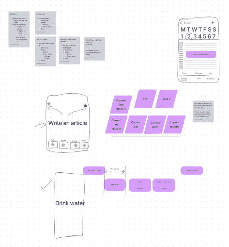

我们的第一次头脑风暴输出

由于这一步骤，André和我对我们着手修复/构建的内容达成了共识，并且我们探索了解决我们注意到的问题的潜在方法。

因为我们正在构建一个产品来解决我们自己的一些痛点，所以我们不需要通过许多访谈来找出要解决什么问题；我们已经知道了。作为注重效率的人，我们经常浪费时间和精力在不同的工具之间切换，用于记笔记、时间阻塞等。这是我们关注的一个问题。另一个原因是，我们已经找到了集成日历的解决方案(耶)，但还没有集成现有日历的解决方案(奈)。最后一个问题是，生产力领域的许多工具充满了各种功能，通常在让我们集中注意力方面表现不佳。专注对生产力至关重要。所以我们决定也要解决这个问题。

长话短说，构思阶段是关键的阶段。它有助于确定要解决的问题，快速探索潜在的解决方案，最重要的是，创建一个共同的理解。

# 想法验证

最初，我试图说服 André，在制造产品之前，我们需要尝试并验证这个想法。但很快，我同意安德烈的观点，即我们实际上是在搔自己的痒处。这款产品是一款我们都乐意为之付费的产品。如果我们在乎，那么我们肯定不是孤独的。我目前正在寻求从我的数字生活中清除杂乱。使用更少的工具对我来说是一个明显的胜利。

因此，我们没有试图验证我们的想法，而是决定专注于否定我们对业务的一些假设。无论如何，我们希望在接下来的几个月内完成我们的第一笔销售；不是两年后。

最终，即使这个项目失败了，我们也会学到很多东西(例如，用 Figma 设计，构建更好的登录页面，从零到编码更快，等等)，我们也会为自己构建一些有用的东西。

# 团队组织和文档

所有项目都需要最低限度的组织和文档。我们一开始创造了一个轻松讨论的空间，有几个渠道:#建立受众、#竞争、#一般、#接受采访的人、#生产力和#随机。

在文档方面，我们决定使用共享的概念空间。在这个空间里，主页列出了我们“共享思想”中最重要的事情:

这些都是简单的列表，让我们可以很容易地对我们的工作进行优先排序，并在会议之间快速恢复我们共享的精神背景。现阶段不需要更好的问题跟踪系统！

除了这些优先级列表，我们还为项目的各个方面创建了页面:

*   商业模式
*   营销(例如，文案、登录页面、社交媒体等)
*   核心概念和普遍存在的语言
*   主意
*   合作
*   基础设施(例如，DNS、子域等)
*   用户界面
*   UX
*   …

稍后，该空间还将保存产品文档、内部文档(例如，我们的流程、技术细节等)等。

这个空间是我们这个项目唯一的真实来源。这是进入*和其他一切*的入口。

接下来我们需要一个共享的密码数据库。这对安全性至关重要。我们不希望到处复制密码，并通过 Slack 和其他通信渠道共享这些密码。

# 共享密码数据库

接下来我们需要一个共享的密码数据库。这对安全性至关重要。我们不希望到处复制密码，并通过 Slack 和其他通信渠道共享这些密码。

# 有待完成的工作(JTBD)

在构思阶段之后，我们已经创建了一个[用户故事地图](https://www.amazon.com/User-Story-Mapping-Discover-Product/dp/1491904909?tag=dsebastien00-20)。用户故事地图对于探索不同的*工作要做*特别有用。如果你不知道 JTBD，那么一定要去[看看这篇文章](https://hbr.org/2016/09/know-your-customers-jobs-to-be-done)。我们用 Miro 创建了我们的，因为它对那些有很大的支持。

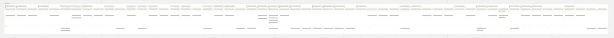

我们的整个用户故事图

用户故事地图强调用户故事，而不是产品特性。有一些重叠，但是*故事是以用户和目标为中心的，这对于优先级排序*更有意思！

对于每个用户故事，我们考虑了所需的不同步骤(即每个*活动*的步骤):

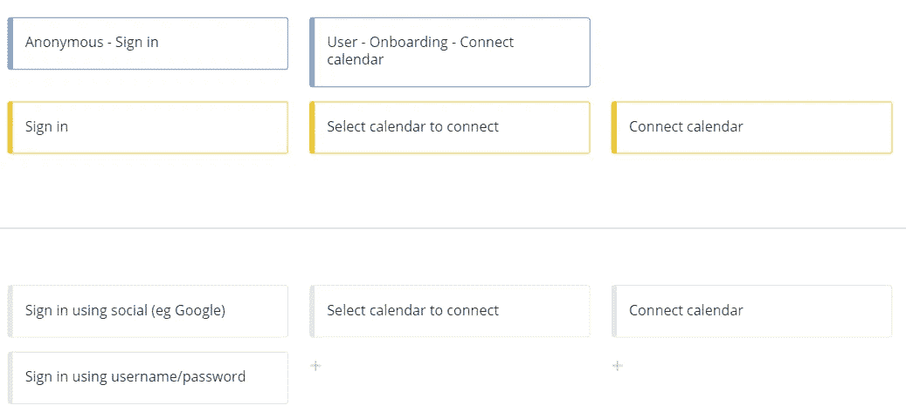

用户故事和步骤

这里是第一个例子:已经有帐户的匿名用户需要登录。他们可以使用社交或用户名/密码来实现。

这是第二个:经过认证的用户需要通过入职流程。当他们这样做时，他们首先必须选择一个要连接的日历，然后连接该日历。一旦完成，我们的应用程序将开始同步内容。所以具体的故事有不同的步骤。

还有一个更复杂的问题:笔记模式下的认证用户可以安排一个例行程序或一个计划。为此，他们(1)选择想要安排的项目点，(2)将其拖放到日历上进行安排，并定义日期/时间/持续时间。最后，他们(3)确认，然后我们的应用程序(4)在他们的日历上创建事件，(5)创建日历事件和用户大纲之间的链接。

*每个用户故事从一个相当高的角度描述了一项工作*。这里大多忽略了技术细节；那是以后的事。

用户故事是水平排列并放在一起的，它们描述了整个用户旅程。从他们到达登录页面的那一刻，到他们使用各种功能来实现特定目标的那一刻。一切都应该在那里，包括数据导出，帐户删除，推荐等。

最后，在纵向上，我们为每个版本/里程碑创建一行。对于这个特定的项目，我们保持事情简单，我们只需要 MVP(即我们现在需要的)和 Backlog，用于可以等待的想法和事情:

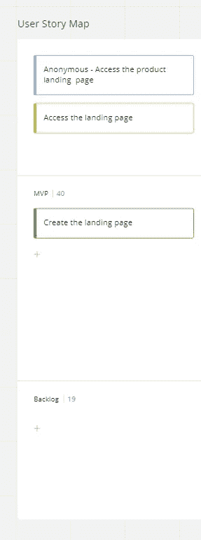

发布由水平车道表示

由于这些通道，我们可以轻松地准备(和维护！)一个产品路线图。我们已经完成了一次优先级排序练习，但是每次发现新信息(例如，功能请求、新想法等)时，我们都会细化该图。通过以这种方式组织故事，我们可以很容易地看到我们接下来需要关注什么，并清楚地看到我们当前的进展(例如，通过改变每个故事的颜色)。

用户故事映射是一种非常有用的技术，可以深入到旅程的不同部分，演员和他们要做的工作，并作为一种可视化优先级和路线图的方式。

# 用户体验(UX)设计

至此，我们对问题有了清晰的认识，以及最初想要关注的不同故事。下一步是设想我们产品的用户体验(UX)。

安德烈和我都不是 UX 或 UI 设计师，但我们已经学会欣赏 Figma。此外，我们每个人都带来了自己的感受，并利用了我们以前的经验。例如，我带来了我在研究和撰写我的开发概念系列的第二卷时获得的知识:[客户需要什么](https://developassion.gumroad.com/l/DevConcepts-Volume-02-WhatClientsNeed)。

我们首先从一个非常高的角度思考客户之旅:

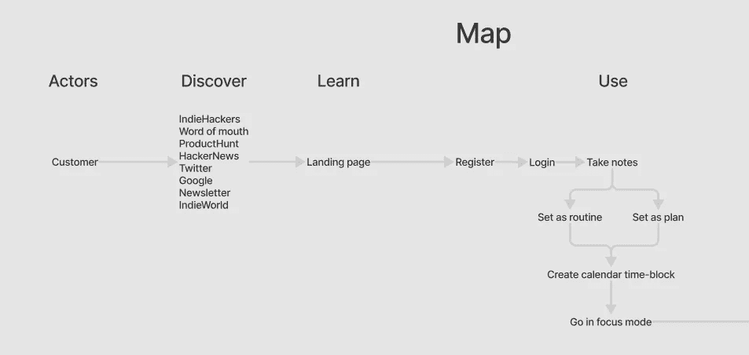

用户旅程地图

这帮助我们澄清了一些关于人们如何从听说我们的产品到使用它的功能的想法。这也是我们故事板的起点。

接下来，我们再次从高层次的角度探讨了需要完成的工作:

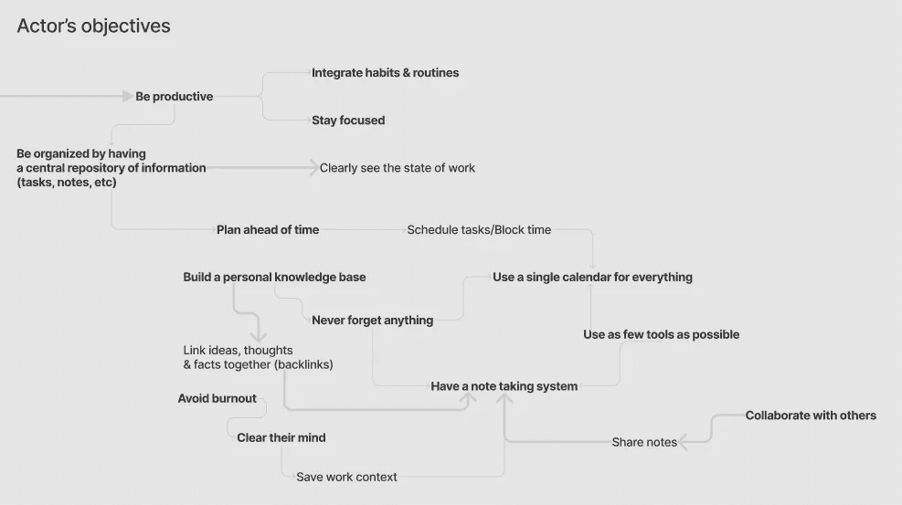

探索动机和目标

这让我们更清楚地了解了在 UX 工作期间需要关注的重要方面。然后，我们总结了主要特征:

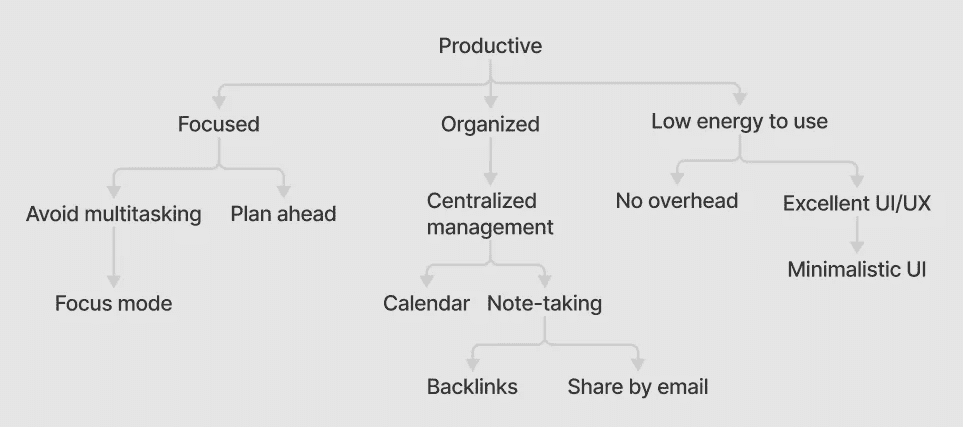

我们选择关注的 UX 特色

也许这对专业的 UX 设计师来说是异端邪说，但这对我们了解应该注意什么和避免什么显然是有用的。

接下来，我们看了信息架构。这有助于我们识别和唯一命名主要概念、它们的属性和关系。我们将我们的发现反映在我们的概念空间中，以定义我们的*无处不在的语言*:

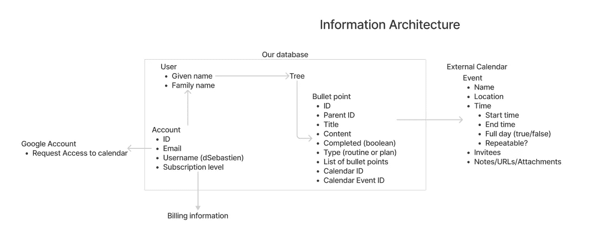

信息架构第一次迭代

这显然是许多迭代的第一步。

在那之后，我们一头扎进了 ux 作品的核心，体验本身！我们创建了一堆原型，每个原型都专注于要完成的特定工作。自从我们有了用户故事地图，我们很容易检查我们是否忘记了考虑重要的元素。

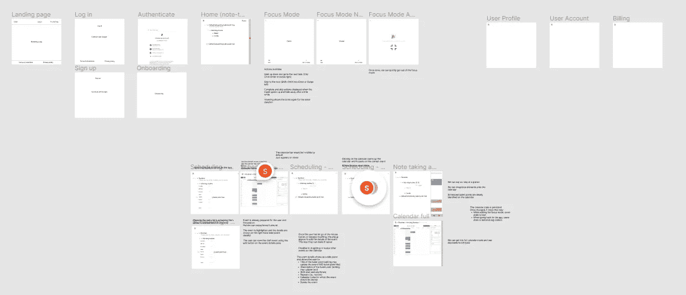

整个 UX

让我们更仔细地看看其中的两个。第一个是我们的聚焦模式:

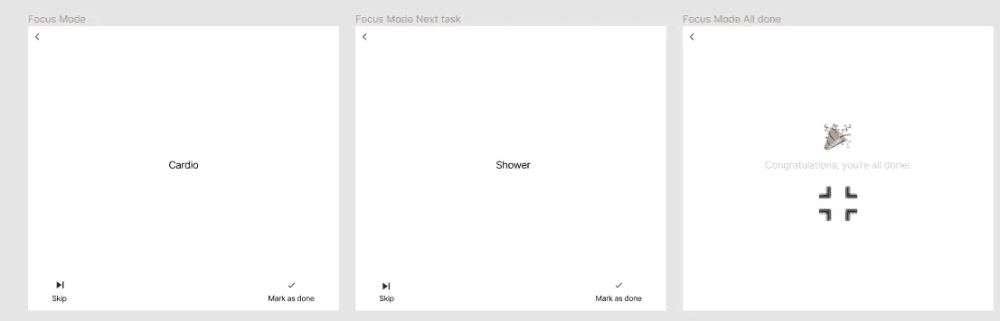

聚焦模式

如你所见，我们对极简主义很认真😂。在我们的“最终”UI 原型中，UI 甚至更少。

第二个是我们的日历集成:

日历集成

对于这一个，我们设想在侧面集成日历，使大纲中的要点与日历上的事件容易关联。从 UX 的角度来看，这是一个巨大的进步。通过允许用户显示/隐藏日历，他们可以使产品适应他们当前的活动。如果他们把日历藏起来，他们就可以专注于做笔记。如果他们表现出来，那么他们可以专注于计划他们的一天或看接下来会发生什么。最后，通过扩展日历，他们可以专注于自己的周/月，专注于大局。

最后，我们通过使用 Figma 创建一个交互式原型来验证体验的*合理性*:

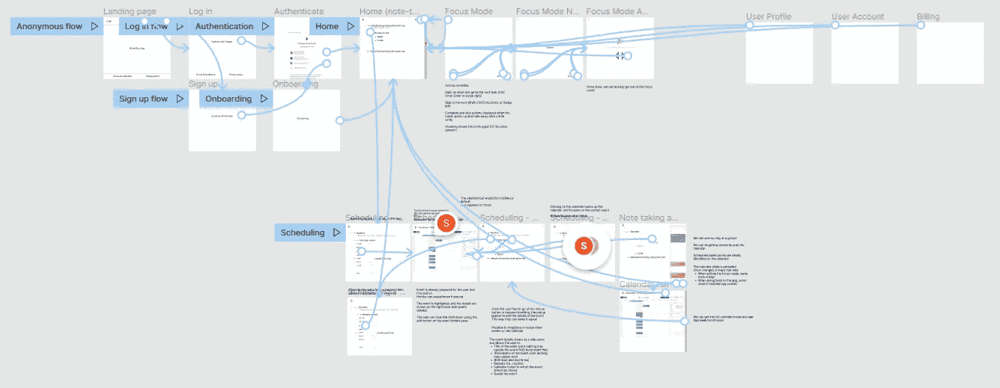

我们在 Figma 的 UX 原型

这需要一点时间，但很值得努力。在我们开始考虑 UI 工作之前，它就帮助我们解决了大量的问题。以后解决这些问题的成本会高得多。

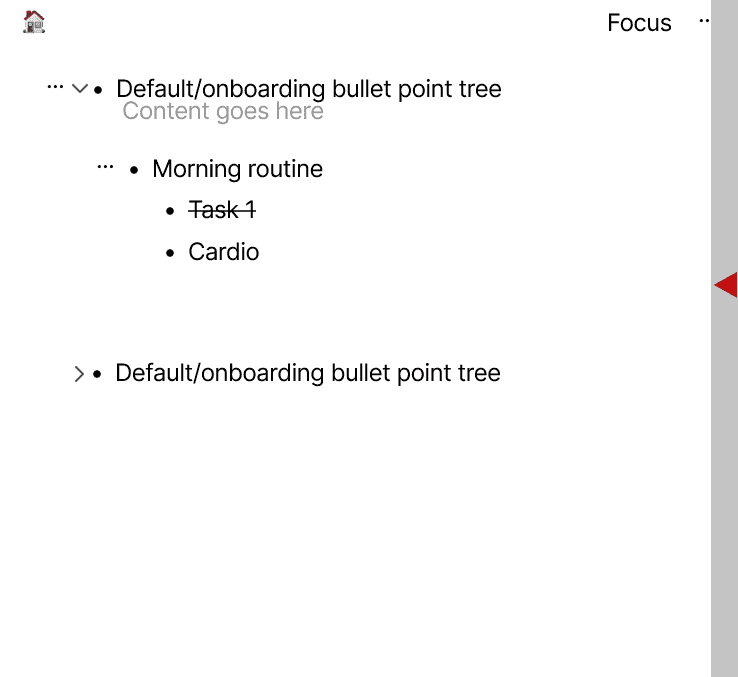

我们的互动 UX 原型

在这一点上，我们对体验的感觉有了一个清晰的想法，我们已经有了可以展示和验证的东西。

# 客户对话

遵循来自[妈妈测试](https://amzn.to/3IFLrvp)的想法，我们也和一些人进行了讨论，以获得*对其他人在生产力方面面临的问题的感受*。事实上，上下文切换对许多人来说是一个问题。但是我们没有提到我们的想法，因为我们还没有东西要卖。

# 用户界面(UI)开发

一旦我们对 UX 有了清晰的概念，我们就把注意力转向用户界面。这一次，我们在关注其他问题:颜色、排版、外观、组件和变体…

我们从设计主屏幕开始，然后开始逐个提取组件。我们一直在学习如何使用 Figma，所以这对我们来说是一个很好的练习。一旦我们理解了如何在原型模式中正确地使用组件和集成变体之间的转换，我们就开始乐在其中。

我们一个接一个地设计我们的组件。标题、面包屑、上下文菜单、大纲、项目符号、进度指示器、日历、日历事件等。在这样做的同时，我们巩固了我们的设计系统，并确保了整个界面的一致性。

不久，我们拥有了一整套可重用组件:

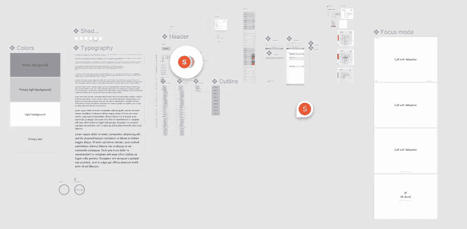

我们的 UI 组件概述

在没有意识到的情况下，我们实际上为 Figma 设计了一些相当复杂的东西。简单的组件很好，但是大纲绝不是简单的组件。这种递归对 Figma 来说是个问题。但是我们找到了解决办法，我们不会让这阻止我们！我们只是使用占位符组件开辟了一条道路。

用户界面工作是至关重要的，因为它让我们真正想象应用程序会是什么样子。这是我们肯定可以跳过的，但我们不想这样做。这样做是目光短浅的。在我们的 UI 练习中，我们不断发现初始 UX 的问题，我们反复多次以达到既有用又赏心悦目的效果。

UI 设计是一个真正的强迫功能，让我们对我们实际能交付的东西变得更加现实。

由于我们使用的是 Figma 的免费层，我们总共被限制为 3 个设计文件，并且不能使用共享库。所以我们决定将 UI 的所有设计标记重新组合到一个文件中。

构建软件比在像 Figma 这样的工具中创建用户界面要昂贵得多。UI 设计是可延展的，很容易改变。更不用说编码了。这就是为什么我们花了大量的时间在这部分工作。第二个好处当然是，我们拥有一切可用于开发的资源。我们知道我们的组件及其变体，我们可以导出 SVG 中的图标和其他资产，等等。此外，我们可以随时回来修改，甚至在有了预算后把设计交给专家。

# 用户界面原型

一旦我们完成了 UI 的大部分工作并拥有了可重用的组件，我们就开始着手创建 UI 原型。我们希望在构建之前能够使用实际的 UI。此外，我们希望创建一个介绍视频来展示该工具，并给人留下一个非常好的印象。

然后，我们添加了 UI 组件之间的转换，以使它们具有交互性。顺便说一下，这是 Figma 真正的杀手锏:

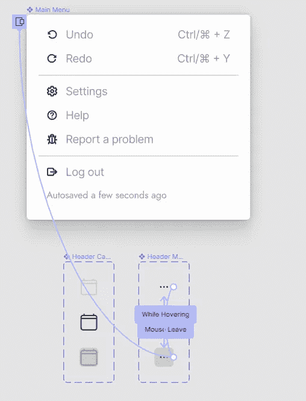

UI 组件交互

然后我们写了一个脚本来讲述一个故事。一个人愿意度过富有成效的一天的故事。该脚本描述了我们将在视频中采取和展示的所有步骤。然后，我们为故事中的每一步创建了一个“框架”。

由于我们的组件和变体，创建屏幕相当简单。Figma 通过组合组件实例轻松组装复杂的 ui:

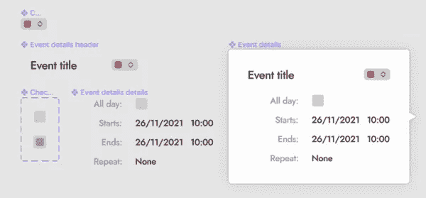

成分组成

一旦屏幕准备好了，我们简单地添加了过渡和动画来使它看起来更好:

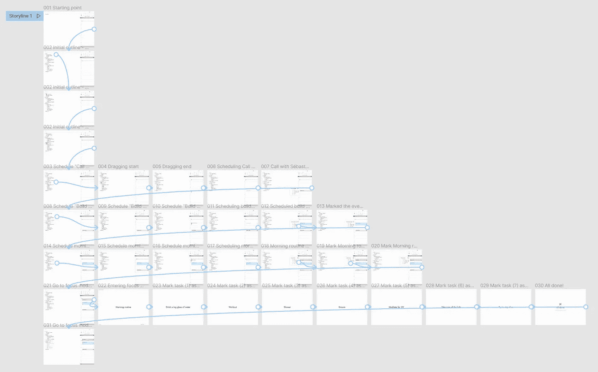

UI 故事板

# 视频介绍

最后，感谢 UI 原型，我们能够记录一个相当令人信服的(希望😂)视频:

我们为 focusd 制作的介绍视频

这是我们可以轻松分享以收集反馈的内容。当然，在 Mom 测试之后，我们对收到的积极信号保持谨慎。在这一点上，我们的目标仅仅是为这个项目增加我们的观众，建立一个社区，边走边学。

# 选择产品名称并获取域名

命名很难。作为一名软件工程师，这是我最喜欢的句子之一。因为真实所以好玩。命名真的很难。这很难，因为好名字一定有很多特质。名字必须清晰易懂，不容易被误解，等等。

我们有一个正在制作的产品，但它还没有名字。迄今为止，它的代号是“生产力应用”。清晰，但不是很有纪念意义。我们列出了 20 多个域名，添加了我们的投票，调查了域名的可用性，以及这些域名是否有商标。你可以想象，我们想出的大多数名字都已经有人取了。

为了帮助我们，我们使用了像 [Namelix](https://namelix.com/) 和 [Namesnack](https://www.namesnack.com/) 这样的工具。对于商标检查，我们必须查看不同的国际数据库，如 USPTO、BOIP 和 WIPO。

当然，域名是伴随名字的关键元素。选择和获得域名实际上与选择产品名称密切相关。我甚至认为域名的可用性是最具决定性的因素。

为了探索域名的可用性，我们使用了[谷歌域名](https://domains.google.com/)和[域名](https://domain.garden/)

# 社区建设

凭借我最近作为一名社区新手的经历，我学会了欣赏在线社区带来的快乐和好处。

我是在读了 Arvid Kahl 的书:[嵌入式企业家](https://amzn.to/35bTzFh)之后，才开始把社区建设当成自己的一项活动。在那本书里，为了避免常见的陷阱，Arvid 从一开始就提出了一个建立受众的强有力的案例:“建立它，他们就会来”。我认为这本书是对 Eric Ries 的书( [The Lean Startup](https://amzn.to/33QHOnw) )的一个非常有用的补充，这本书更侧重于验证。顺便说一下，另一个很棒的读物是萨希尔·拉文吉亚的:[极简主义企业家](https://amzn.to/3G7Ju9q)。Sahil 还建议通过首先创建/加入社区并与业务一起发展来扩大受众。显然，两人都知道自己在说什么。第二，它*感觉*正确。这就是为什么它现在是我推荐给每个建筑产品的人的东西。选择你的利基市场，在你的业务旁边建立一个观众群，并创建或加入社区。

当 André和我决定参与这个项目时，我知道我想建立一个关注生产力的社区。大约 20 年来，我一直在探索和试验提高效率的技术，所以现在我可能有一两件事要和我的网友分享；-)

这就是为什么我们迅速启动了 [focusd 社区](https://join.slack.com/t/focusdgroup/shared_invite/zt-113gxeetf-kXTPA8Y9NyHVj1Wj3Rdd~A)。不仅仅是产品本身的社区。相反，我们希望它成为所有生产力爱好者的空间，无论他们是否喜欢/使用 focusd。我们只想互相帮助，帮助人们更好地利用他们最宝贵的资源:他们的时间❤️.

# 候补名单

由于我们的项目还没有建立，我们需要一种方法来跟踪谁真正对这个项目感兴趣。我们需要创建一个等候名单。最简单的选择是建立一个邮件列表。为此，我们选择使用 [ConvertKit](https://convertkit.com/) 。它们提供了易于使用的工具来创建订阅表单、分析受众、向订阅者发送电子邮件以及 API。

等候名单至关重要，因为它是我们订户收件箱的入口。能够出现在某人的邮箱中是非常宝贵的，我们不想错过这个机会。

对于我们来说，等待列表将非常有用，可以让我们分享关于我们进展的新闻，关于我们正在构建的社区的新闻，并真正开放整个流程。我把等候名单上的人视为粉丝、支持者和朋友！🙏

除了社区和邮件列表，另一个方面是社交媒体营销。出现在社交媒体上并不是一个真正的选择。我个人选择了自创品牌，但是我的产品也需要自己的空间。到目前为止，我们已经有了自己的 Twitter 账户，以后我们会扩展到在不同的社交媒体平台上保留名字。

接下来，这将给我们更多的空间与我们的观众进行讨论，提供更多的方法来发现潜在客户，并分享关于产品的新闻。

同样，社交媒体存在需要检查一些用户名是否可用。为此，我们使用了[名称检查器](https://www.namecheckr.com/)。

# 文案、登录页面和徽标设计

有了最初的 UX 和用户界面，我们几乎拥有了登陆页面所需的一切。我们希望在发布之前有令人信服的视觉效果。因为我们不想仅仅描述这个想法，我们想*展示*它。

我们唯一缺少的是应用程序的标志。所以我很快用 Figma 的牛逼[矢量绘图工具](https://help.figma.com/hc/en-us/articles/360040450213-Vector-Networks)创建了一个:

focusd 的标志

当然，相对于销售文案，logo 只是一个细节。所以我们在这方面投入了更多的努力。我们将 André的经验与[互联网智慧](https://marketingexamples.com/)相结合，以读者为中心，谈论优势而非特点，提供生动的支持细节和视觉效果。

在复制之后，我们专注于创建登陆页面本身。像往常一样，有许多选项可供选择。从历史上看，我总是喜欢自己做一切事情:我很久以前的博客的自定义主题，我的新网站的设计，我公司的网站，等等。凡事亲力亲为的好处是完全掌控。但缺点也是完全控制，以及它创造的无限摆弄大量细节的机会。

另一种方法是使用现成的 HTML 模板来创建登录页面。但对我来说，这导致了大量的挫折。我看到了代码，却苦于不喜欢它的风格、混乱、缺乏恰当的命名等等。这让我很难过。而且这也和你一个人做所有的事情一样有缺点。

最后，在光谱的另一端，有一个我们决定去做的选择:像 [Carrd](https://try.carrd.co/c7yysy1c) 或 Webflow 这样的 SaaS。我选择 Carrd 是因为它是由独立黑客制作的，我更愿意支持像我一样的其他网络企业家。像 Carrd 这样的服务的好处在于它们是所见即所得的解决方案。创建一个站点，选择一个现成的主题，使用编辑器添加/编辑/删除元素，定制颜色、外观和感觉等。使用这个感觉很自由。我没有花几天时间，而是花了大约一天时间就完成了。我有移动支持，邮件列表集成，分析集成，它是托管的，我可以使用我的自定义域。

我并不是说自制网站不好，但对于像我这样的工程师来说，它们是浪费时间为了技术而技术的完美借口。

该登录页面的当前目标是吸引更多人加入等候名单和我们的社区。当然，这对应于我们未来销售漏斗的顶部。但这是一笔双赢的交易。加入我们的人可以听到并影响产品开发的一切。另一方面，我们可以互相分享知识和想法。这就是我喜欢观众和社区建设的原因。两者是不同的，但是两者都包含了对每个人的好处。

我们一准备好就发布了[我们的登陆页面](https://focusd.app/)，在周围分享，收集反馈，并保持迭代。随着开发的深入，我们将继续这样做。

# 启动营销职能

受众建设、社区建设和数字营销齐头并进。现在我们的登陆页面已经登陆(双关语)，我们可以与我们的朋友、同事、熟人、社交网络、社区和“可怕的”陌生人分享链接。这有助于我们扩大受众，将好奇的人带入我们的社区，并收集更多的反馈。

滥发链接是无效的，即使与搜索引擎优化相结合。人们大多不在乎。事实上，我们只想要合适的人来关心，所以我们正在仔细考虑我们接触谁，我们试图吸引谁。

这就是内容营销发挥作用的地方。为了吸引我们的理想客户，我们需要创建有用的内容，并在适当的位置分享。内容需要让我们成为领域专家，同时也是真正友好和有爱心的人。不是假的，是谦虚的，分享我们知道的，分享我们的想法，和对未来的梦想。

我们正在开发一款产品，我们真诚地希望它能在日常生活中帮助人们。他们选择我们的工具对我们来说意味着整个世界。但是我们让他们相信我们的工具是好工具的唯一方法是向他们展示我们对这个主题有清晰的想法。关于生产力的清晰概念。关于如何做智能笔记的清晰思路。清楚地了解为什么时间阻塞是必要的。清楚地了解如何将所有这些结合在一起，让人们更加专注，更有效率。

但是仅仅有专业知识是不够的。既然我们正在构建一个产品，我们也需要让人们相信我们不是像崇拜巫师那样摆弄代码。不，我们必须让他们相信我们是真正的软件工匠，我们来这里是为了建立一些坚实的东西。一些完美的，经得起时间考验的东西。很难做到这一点。

到目前为止，您可能已经明白了本文的最终目的。不仅仅是产品开发。这也是为了展示我们的专业知识和意图。这是为了证明我们是认真的、负责任的，我们全心全意地投入到这个项目中。这不仅仅是一个有趣的副业。这是我们正在努力建立的企业。

在这个阶段，我们只是想提高正确受众的意识(例如，独立黑客社区、以生产力为中心的子网站、技术 Twitter 等)。我们不打算在这一点上全力以赴。但是我们最终会到达那里，因为我喜欢写作和分享知识；-)

# 商业模式和定价策略

到目前为止，我主要关注技术方面。但数字产品也需要清晰的商业模式和定价策略。这里有数不清的选择，每个商家都不一样。这是商业中创造力也很重要的一部分，即使乍看起来不像。

因为这篇文章已经很长了，所以我将这个话题留待以后讨论。

对于 focusd，我们决定包括一个免费层，但以一种温和、不唐突和尊重的方式限制记笔记的一面。一旦我们构建了产品的这一部分，我们将会探索这一点。我们目前的想法是限制免费用户每月可以添加的要点数量。一旦他们达到了限制，我们会在他们每次回到应用程序时委婉地提醒他们这个限制。

我也想把这个应用程序建成一个开源项目，因为我是开放解决方案的忠实信徒。也就是说，这是我们和安德烈还没有决定的事情。所以我们走着瞧！

# 从想法到代码

在这个阶段，我们有 UX，用户界面，交互式原型，一个等待列表，一个域名，一个登陆页面，一个标志，一个名字，一个域名。少了什么？下一步是什么？当然是产品啦！

产品并不总是需要我们写代码。如今，NoCode 和 LowCode 风靡一时。有很多像 [Bubble](https://bubble.io/) 这样的解决方案可以帮助开发者用更少(或者没有)的代码来构建产品。但是就我们的产品而言，我非常确信我们应该自己来生产。这有两个原因:(1)我们包括大纲视图，以及(2)我们希望大纲视图和日历之间，以及日历和用户的实际日历(例如，Google Calendar)之间有强的交互。我不认为 NoCode 工具可以让我们构建一个 outliner 或轻松地构建日历所需的集成。但我很高兴在这一点上被证明是错误的(我真的不是一个 NoCode 专家！).

我们的下一步是考虑解决方案架构(即大的构造块):

*   使用什么前端技术
*   如何构建用户界面？对于这一部分，好消息是我们的设计工作为我们提供了一个非常坚实的起点
*   使用什么后端技术
*   依赖哪些通信协议
*   使用哪种数据存储
*   要实现哪些架构模式
*   等等

接下来，我们还需要组织开发。我们将使用 git，因为它是事实上的标准，但是我们有多种托管选择(例如 Github 或 Gitlab)。

我们将需要选择一种编程语言(最有可能是 TypeScript，但我有偏见)，库和框架。我们需要开始考虑数据结构、数据模型、查询类型、API、测试等等。这一切都将从原型开始，探索产品的不同方面。大纲视图、日历、日历集成等的原型。我们将一步一步地将特性集成到产品中，这将需要我们讨论分支模型、代码审查过程、代码质量检查等。

我们将需要讨论基础设施和托管(例如，Docker/Kubernetes、AWS/Azure/GCP)、持续集成(CI)、持续部署/交付(CD)、发布管理、支持流程、维护、产品文档、支付等。

长话短说，我们将有*吨*要考虑。但最重要的是，我们需要务实。因为这个项目只有我们两个人，我们手上的时间有限，而且有很多工作要做。这也是构建自举产品的一个关键方面。它是关于交付用户真正需要的东西，高质量，尽可能高效，并且不牺牲制作的乐趣。相当大的挑战！

# 结论

在这篇文章中，我解释了从餐巾纸上的想法到产品制作的不同步骤。在这一点上，我们不知道这是否是正确的方式，但这是我们感觉很好的方式。经过上一次创业经历后，我学会了倾听自己的直觉。你也应该这样！

最后，如果这篇文章教会了你什么有用的东西，我希望你能分享给大家；这将真正帮助我们走出❤️，如果你对这篇文章或 focusd 有任何意见、反馈或想法，请不要犹豫，联系我。我的 DM 在 Twitter 上公开了，欢迎您加入我的社区:)

今天到此为止！✨

# 关于塞巴斯蒂安

大家好！我是塞巴斯蒂安·迪布瓦。我是一名作家、创始人和首席技术官。我撰写关于编程(TypeScript、Web、React、Angular、NestJS 等)、个人知识管理、个人组织和生产力的书籍和文章。我也制作可爱的数码产品🚀

如果你喜欢这篇文章并想阅读更多类似的内容，那么就订阅[我的时事通讯](https://newsletter.dsebastien)并查看我的 [Dev Concepts 关于软件开发的电子书集](https://dev-concepts.dev)🔥。

你可以[在 Twitter 上关注我](https://twitter.com/dSebastien)🐦

如果你想讨论，不要犹豫加入我的社区:[软件工匠社区](https://dsebastien.net/blog/2021-11-12-personal-knowledge-management-community)、[个人知识管理社区](https://dsebastien.net/pkm-community)和[聚焦生产力社区](https://join.slack.com/t/focusdgroup/shared_invite/zt-113gxeetf-kXTPA8Y9NyHVj1Wj3Rdd~A)

*原载于 2022 年 1 月 25 日*[*【https://dsebastien.net】*](https://dsebastien.net/blog/2022-01-25-product-development-process)*。*