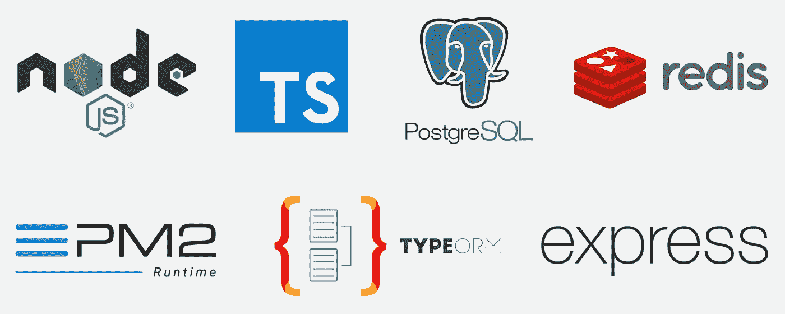
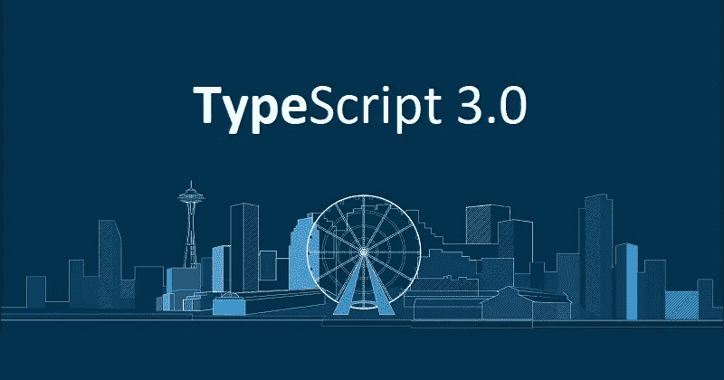
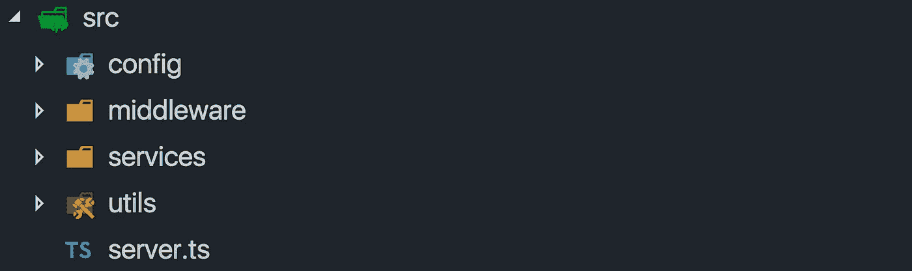
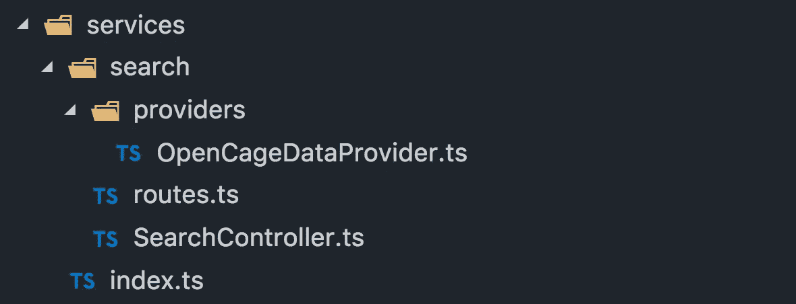
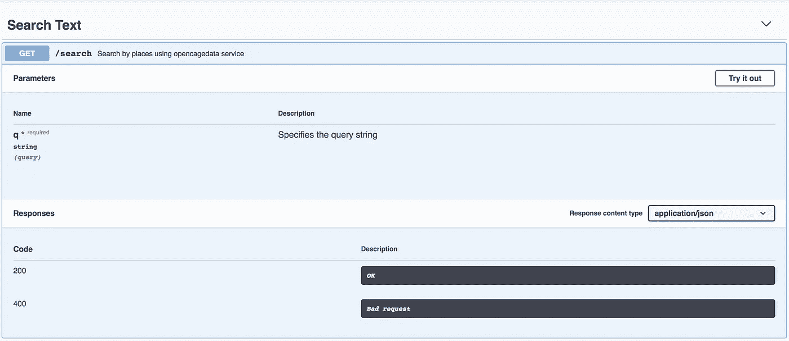
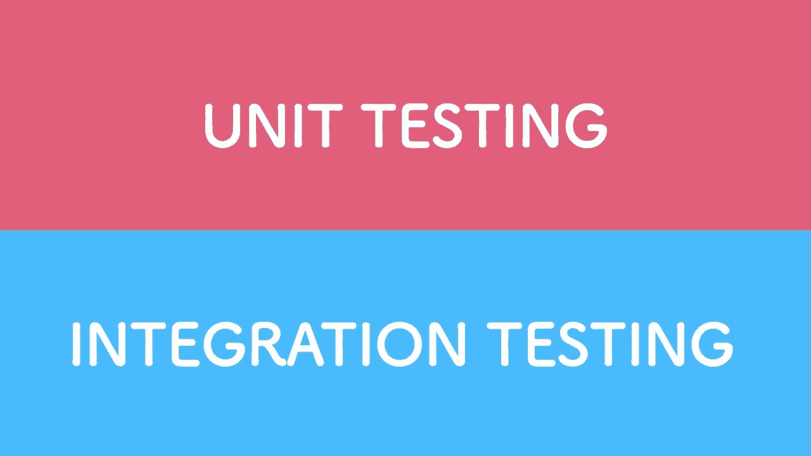

# 使用 TypeScript、PostgreSQL 和 Redis 设置生产就绪 Node.js REST API

> 原文：<https://itnext.io/production-ready-node-js-rest-apis-setup-using-typescript-postgresql-and-redis-a9525871407?source=collection_archive---------0----------------------->



一个月前，我开发了一个简单的搜索 API。它所要做的就是从第三方服务和我们的数据库中抓取一些数据，将所有数据组合起来，然后返回给客户端。这两天听起来是个不错的任务。但是构建一个服务需要的远不止这些。它包括缓存、日志记录、处理各种错误、管理节点实例、安全性、监控，如果能实现来自 [Node.js 最佳实践](https://github.com/i0natan/nodebestpractices)的大多数模式，那就太好了。

本教程假设您熟悉 Node.js 和 Express。还有，你需要非常基础的打字稿知识。如果你没有，先在 5 分钟内检查[的打字稿。确保你有](http://www.typescriptlang.org/docs/handbook/typescript-in-5-minutes.html)[最新的 Node LTS 版本](https://nodejs.org/en/download/)。

虽然有几十种不同的 Node.js 设置，但只有少数几个覆盖了 PostgreSQL 并完全使用 TypeScript。

因此，在深入研究代码之前，让我们先定义一下我们的技术堆栈:

1.  **严格模式的打字稿**。必须显式指定所有类型。
2.  **快递**。上一个版本完全支持 async/await，所以在我们的路由/控制器中没有回调和明确的承诺。
3.  **PostgreSQL** 。这次是关系数据库。让我们看看它有多容易使用。
4.  TypeORM —用 TypeScript 编写的强大的 ORM，支持迁移，活动记录，有一个优秀的查询生成器等等。
5.  **温斯顿**——一个几乎所有事情的记录者:)
6.  **雷迪斯**。我们将使用这个内存存储进行缓存。这将增加一行额外的代码，从而带来巨大的性能差异。
7.  **PM2** — p [进程管理器](http://pm2.keymetrics.io/)对于 node.js 应用，它包括集群、负载均衡、简单的终端监控和日志管理。

在第一部分中，我们将关注项目结构和构建我们的 API，并添加节点集群。在第二部分中，我们将看到如何在我们的服务之上添加许多很酷的东西:缓存、日志、使用 TypeORM。但是这部分更多的是关于代码。

[这是该零件的最终代码](https://github.com/alexpermyakov/node-rest-api/tree/step.5)。

## 第一步。初始化 TypeScript Node.js 项目。



在 2018 年末，没有理由不对 Node 使用 TypeScript，设置非常简单，所以，让我们开始吧！

让我们创建一个项目文件夹，并将我们的项目命名为 search-api。

```
$ mkdir search-api
$ cd search-api
$ npm init -y
```

接下来，安装 typescript 和 tsc-watch，以便在每次源文件改变时运行我们的服务器。

```
$ npm i typescript tsc-watch
```

tsc-watch 的解决方案很优雅，它在引擎盖下使用了 *tsc -w* ，一旦 TS 编译器编译了所有的更改。它将重启我们的服务器。

让我们将 package.json 中的脚本部分改为:

```
"scripts": {
   "dev": "tsc-watch --onSuccess \"node ./dist/server.js\""
}
```

在运行它之前，我们必须为 TypeScript 编译器创建一个配置。

```
$ npx tsc --init --moduleResolution node --resolveJsonModule --target es6 --noImplicitAny --sourceMap --lib dom,es2017 --outDir dist
```

我们使用[npx](https://medium.com/@maybekatz/introducing-npx-an-npm-package-runner-55f7d4bd282b)——一个 npm 包运行程序，用于本地运行已安装的包，在我们的例子中是 *tsc* 。现在我们在项目根目录下有了一个 *tsconfig.json* 文件。

默认情况下，它监视所有。*中的 ts 文件。/src* 文件夹并在*中编译。/dist* 文件夹。还有，*。默认情况下会排除/node_modules* 。

下一步，我们将创建一个 *server.ts* 文件

```
$ mkdir src && touch ./src/server.ts
```

让我们写一个 sum 函数，每秒钟 *console.log* 一次。将此添加到 *server.ts* 文件中。

```
const sum = (*a*: number, *b*: number) => a + b;
setInterval(() => console.log(sum(2, 3)), 1000);
```

最后，一切都准备好运行我们的命令

```
$ npm run dev
```

它创造了一个*。/dist* 文件夹，在这里你可以找到一个编译好的 *server.js* 文件。在终端中，您将每秒看到新的输出。尝试更改此代码，结果将会更新。这就是我们一起使用 TS + Node 所需的全部内容😃。

如你所见，我们在这里没有使用 *nodemon* 。主要原因是我们不需要它，因为 ts-watch 既编译又重启我们的服务器。同时，一起使用 ts 和 nodemon 可能会非常棘手。我将为我们设置的每个步骤提供一个链接，[这里是第一步](https://github.com/alexpermyakov/node-rest-api/tree/step.1)的代码。

## 第二步。用 Express.js 创建项目结构。


我在很多 express/KOA/哈比神教程中看到的一个东西是一个非常长的 *server.js* 文件。它包括所有的中间件/插件和另一个样板代码。但这不是唯一的问题。我们还需要一个地方来配置数据库，记录器，redisClient，swagger。我们必须决定在哪里以及如何放置我们的路线/控制器/模型。在这种情况下，我们将遵循 Node.js 最佳实践中的[项目结构实践。](https://github.com/i0natan/nodebestpractices#1-project-structure-practices)

听起来相当多，但是这个有那么多吗？我们来想办法吧！

从项目根目录运行此命令:

```
$ mkdir ./src/config ./src/middleware ./src/services ./src/utils
```

项目结构将如下所示:



我们有一个服务文件夹，其中包含应用程序的独立子部分，如用户、产品、订单等。在我们的例子中，它将是一个搜索子文件夹。但是在我们开始之前，让我们用一些经典的中间件来创建 *express* 服务器。

让我们安装最新的 express 版本。然后是用于管理 CORS、响应压缩和项目根节点的 TS 类型的包:

```
$ npm i express@5.0.0-alpha.7 [@types/express](http://twitter.com/types/express) cors [@types/cors](http://twitter.com/types/cors) compression [@types/compression](http://twitter.com/types/compression) [@types/node](http://twitter.com/types/node)
```

注意，我们需要最新的 express，因为它支持 *async/await，*，但它仍然是一个 alpha 版本。另一种方法是使用 [@awaitjs/express](http://thecodebarbarian.com/introducing-await-js-express-async-support-for-express-apps) 模块。

现在让我们创建一个基本的 web 服务器:

注意，这段代码看起来像 100%的 JavaScript。但是都是打出来的，有错误 TS 不会编译。例如，尝试调用 *new express()* 而不是 *express()* ，看看会发生什么😋。

现在我们需要添加我们的中间件。但是不要把它们都放在这里，让我们把它们放在*中间件*文件夹下。

```
$ touch ./src/middleware/common.ts ./src/middleware/index.ts
```

一个 *common.ts* 文件包含中间件，如 cors、压缩和主体解析设置。稍后我们将为日志、安全、缓存等添加中间件。粘贴到*中。/middleware/common.ts:*

在这里，你终于可以看到一些不同。我们所有的中间件包装器都接受*快速路由器*类*。*

在*中。/middleware/index.ts* 我们将导入所有的中间件，为我们的 *server.ts.* 提供一个单一的连接点，并且我们将来会在这里放更多的东西。

为了应用我们的中间件，我们将创建一个获取中间件列表的函数，并将其应用到路由器上。但是之前我们需要在*中放一个 *index.ts* 文件。/utils* 文件夹，所以让我们创建它。

```
$ touch ./src/utils/index.ts
```

applyMiddleware 助手接受我们在 T30 中定义的中间件包装器列表。/middleware/index.ts 和 *express。路由器*。现在一切都准备好了，可以在 *server.ts:* 中使用

它的一个好处是，随着我们添加越来越多的中间件，我们不必更改这些代码。仅在*下创建其文件。/中间件*并在*导入。/中间件/index.ts* 。这是整个故事中最紧张的部分，我只是想让你知道❤️


现在我们需要类似的路由。让我们为我们的搜索服务添加一个基本路由。

```
$ mkdir ./src/services/search && touch ./src/services/search/routes.ts && touch ./src/services/index.ts
```

打开*。/services/search/routes.ts* 并粘贴到此处:

在*。/services/index.ts* 添加它:

现在，我们必须在路由器上应用这个声明性指定的路由，在*中。/utils/index.ts* 。

*applyRoutes* 函数是我们将所有路由添加到在 *server.ts.* 中创建的 express router 实例的地方。现在让我们打开该文件，用一行代码进行更改:

```
import { applyMiddleware } from "./utils";
```

与这个

```
import { applyMiddleware, applyRoutes } from "./utils";
import routes from "./services";
```

并在 *applyMiddleware(中间件，路由器)*之后添加这个调用:

```
applyMiddleware(middleware, router);
applyRoutes(routes, router);
```

一旦完成，它允许我们在*下快速添加新功能。/service* 目录，而我们要做的就是在*中导入他们的路由。/service/index.ts* 。

使用配置创建路由的主要目的是尽可能隔离路由框架(在我们的例子中是 express)。并且还提供了在不改变整个结构和模型/控制器代码的情况下使用 koa 或 hapi.js 的可能性。这里是第二步的代码。

太好了！现在让我们添加错误处理和更多的中间件。

## 第三步。Node.js 和 Express 的错误处理。


这一步可能会非常累人。我们必须仔细考虑每一种错误。它包括客户端和服务器错误、同步和异步、未捕获的异常和未处理的承诺拒绝。

您可以跳过这一部分，直接进入第 4 步。如果你想看一些更令人兴奋的东西，而不是一个有“hello world”的空白页面。但是拥有一个健壮的错误处理允许我们专注于解决我们的实际任务，并确保它不会悲惨地崩溃。因为我们没有时间充分考虑如何捕捉所有这些错误。

我们的目标是实现[错误处理实践](https://github.com/i0natan/nodebestpractices#2-error-handling-practices)的最关键部分。我们需要考虑的是:

1.  捕捉*未捕捉异常*和*未处理拒绝*。
2.  区分客户端错误和服务器错误。
3.  捕捉同步和异步错误，我们不想在控制器代码中加入错误处理。我们希望抛出一个异常，并确保我们专用的中间件会为我们处理它。
4.  创建一个专用的 *ErrorHandler* 类用于单元测试。

处理*未处理异常*和*未处理剔除*都非常重要。如果你遇到这些问题，那么这个节点实例的游戏就结束了——现在你的应用程序处于一种不确定的状态。最好的办法是杀死这个实例，并产生一个新的实例。像 *forever* 或者 *pm2* 这样的工具可以帮我们做到。我们将在第 2 部分介绍 pm2。现在，让我们为 uncaughtException 和 uncaughtException 事件添加处理程序。

来更新一下我们的*。/server.ts* 文件，在导入部分后添加这几行。

```
process.on("uncaughtException", *e* => {
  console.log(e);
  process.exit(1);
});process.on("unhandledRejection", *e* => {
  console.log(e);
  process.exit(1);
});
```

稍后，我们将用一个 logger 实例替换 console.log。

现在，您可以考虑处理客户端和服务器错误了。首先，让我们创建 errorHandlers 中间件:

`$ touch ./src/middleware/errorHandlers.ts`

现在，让我们把它添加到我们的 *errorHandlers.ts* :

对于每个用例，我们有三种不同的错误处理程序:

1.  *处理 404 错误*您在 express 中处理 404 的方式。如果找不到其他东西，就添加一个后备中间件。
2.  *handleClientErrors* 捕捉客户端 API 错误，如错误请求或未授权。
3.  *handleserverrors*我们处理“内部服务器错误”的地方。

一些需要注意的事情:

1.  我们不在其中间件中处理 404 错误——我们直接将其进一步传播给专用的客户端错误处理程序。
2.  链中的下一个— *handleClientErrors* 。我们只对 4xx HTTP 错误感兴趣，如果它不是一个案例，我们就把它向下传播。
3.  最后*handleserverrors*——我们处理错误的最后手段，我们必须在这里处理，否则 *uncaughtException* 处理程序将被调用，该节点流程将结束。


这是一个可行的例子。但是，我们将用于错误处理的 express 中间件和用于每种类型错误的特定逻辑捆绑在一起。这使得单元测试和替换错误处理策略变得几乎不可能。让我们从中间件文件中提取这个逻辑。首先，创建 ErrorHandler.ts 文件:

`$ touch ./src/utils/ErrorHandler.ts`

并将下面的代码添加到我们的*中。/utils/ErrorHandler.ts* :

还有来更新一下*。/中间件/errorHandlers.ts* :

现在，我们有了一个专用的对象，它封装了我们如何管理它的整个逻辑。在第 2 部分中，我们将通过添加日志来改进这段代码。

接下来—让我们创建两个专用的 HTTP4xxError 类，我们将在控制器代码中使用它们。

首先，创建一个 httpErrors.ts 文件:

`$ touch ./src/utils/httpErrors.ts`

将这段代码粘贴到 *httpErrors.ts* 中的*http client terror*抽象类中。它将消息格式化，使其能够被内置的错误对象所理解。

然后，编写 *HTTP400Error* 和 *HTTP404Error* 类的代码:

我们可以这样使用它:*抛出新的 HTTP400Error()* ，错误对象将包含 *statusCode* 和 message。我们不能更改*状态码*字段。然而，我们可以将另一个字符串作为消息或对象传递。这对于像[类验证器](https://github.com/typestack/class-validator)这样的库来说非常简洁，我们将在后面的例子中使用:

*抛出新的 http 400 错误({消息:'密码太短' })*

错误处理器是一种非常特殊的中间件。通常，我们在处理用户路由之前注入中间件。而是错误处理——在我们的控制器中发生了不好的事情之后。或者抛出一个异常，并希望通过我们的错误处理中间件来捕获它。

那就说让我们更新*。/src/server.ts* :

下面是第三步的代码。

这是相当多的，也是最难集中注意力的部分。但是现在我们可以享受它，看看创建一个控制器和自动处理错误是多么容易！

## 第四步。创建搜索服务。


好吧。现在，使用我们已经创建的框架，让我们创建一个搜索 API。非常简单:

1.  它提供了一个 API 端点，比如？q =某处
2.  它向 OpenCage Geocoder 发出请求，接收数据并将其发送回用户。

在这一部分的第 5 步，我们将做像自定义错误检查和 API 文档这样的事情。

首先，让我们为搜索服务创建以下结构:



通过运行这组命令

`$ mkdir ./src/services/search/providers`

`$ touch ./src/services/search/providers/OpenCageDataProvider.ts`

`$ touch ./src/services/search/SearchController.ts`

目前，我们只创建了一个提供商——open cage Geocoder。但是我们可以包含更多，并将结果组合在 *SearchController* 中。我们将在第 2 部分重点讨论它。

我们将使用*请求-承诺*模块来请求打开 cagedata 地理编码器。它支持异步/等待语法，所以让我们安装它:

`$ npm i request request-promise @types/request-promise`

我们来写一个获取数据的函数，打开*。/search/provider/opencagedataprovider . ts*并粘贴它:

这里有几点值得注意:

1.  我们正在使用 OPEN_CAGE_DATA_KEY 环境变量，我们不想在源代码中暴露任何凭证。
2.  我们在这里不使用 *try/catch 来处理错误。*为此，我们使用了专用的中间件。

为了使用环境变量，安装 *dotenv* 模块:

`$ npm i dotenv @types/dotenv`

现在让我们创建*。env* 放在一个根目录文件中，并在那里添加这个变量(或者将 *.env.example* 重命名为*)。源代码中的 env*

`$ touch .env`

粘贴到这里:

*OPEN _ CAGE _ DATA _ KEY = 8c 0892514 e 884 f 09 af 7c 09 a9 b 067 b 02 b*

。/search/*search controller . ts*只是简单地调用我们的提供者，在第 2 部分中，我们将组合添加更多的提供者，并在这里组合结果。

接下来，我们的代码。/search/ *route.ts* :

我们将在[http://localhost:3000/API/v1/search？q =柏林](http://localhost:3000/api/v1/search?q=Berlin.)。接下来，我们的处理程序非常简单。我们向控制器提供一个字符串查询，等待结果并将其发送给用户。这非常重要——我们不想为控制器提供请求和响应对象。这使得我们的代码更难进行单元测试。更重要的是，我们的控制者变成了上帝。哪知这两个*请求*和*响应*的对象无所不知。

下面是第四步的代码。

## `Step 5\. Add more cool stuff: custom error checking and api` 大摇大摆地记录文件。


这是第一部分的最后一步。我们将重点关注:

1.  处理一桩失踪案？q 参数误差
2.  使用 swagger 记录端点

我们将创建一个独特的中间件，而不是在控制器的代码中添加一个检查。创建一个*。/middleware/checks.ts* 文件并添加以下代码:

在这里，我们只检查“q”参数的存在，如果它丢失了，就抛出一个异常。感谢我们的错误处理中间件，我们将在那里抓住它！

让我们加入这个中间件。/search/ *route.ts* :

这种方法非常适用。我们可以将检查授权、添加缓存等事情串联起来。

目前，我们有一个具有特定 URL 结构和错误代码的端点。是时候引入 swagger 来记录我们的 API 了。这是它看起来的样子:



我们将使用 swagger-ui-express 作为中间件来提供文档[http://localhost:3000/API-docs](http://localhost:3000/api-docs)，所以让我们安装这个模块:

`$ npm i swagger-ui-express @types/swagger-ui-express`

然后在*下创建一个 *swagger.json* 文件。/src/config* 文件夹下运行:

`$ touch ./src/config/swagger.json`

现在，在 *swagger.json 中，*我们将记录我们的端点:

为了让它工作，让我们为此创建一个中间件，运行:

`$ touch ./src/middleware/apiDocs.ts`

并添加以下代码:

最后一步，让我们在*中导入这个中间件包装器。/middleware/index.ts:*

就是这个！现在这里有:[http://localhost:3000/API-docs](http://localhost:3000/api-docs)。点击“试用”按钮，你就可以玩了。

这是第五步的代码。

让我们把重点放在阻碍我们在生产中部署它的事情上——缺乏测试、集群和生产配置。

## 第六步。用 Jest 配置单元测试。


让我们看看当前的搜索服务文件夹:


我们将为服务的每个部分创建测试:我们的控制器、路由和提供者。[在这里](https://basarat.gitbooks.io/typescript/docs/testing/jest.html)你可以找到使用 [Jest](https://jestjs.io/) 和 TypeScript 的绝佳指导。我们将介绍它的基础知识。

首先，让我们安装它:

```
npm i jest @types/jest ts-jest -D
```

我们正在安装 *ts-jest* 和 *jest。它允许 *jest* 动态传输文件类型脚本。标记“-D”将其安装为 dev 依赖项。*

其次，在 *package.json* 中添加‘jest’部分:

最后，在*脚本*部分添加“测试”命令，替换为以下命令:

注意，我们传递了'— coverage '标志—它表示应该在输出中收集和报告测试覆盖信息。

这是我们修改后的最终 [package.json](https://github.com/alexpermyakov/node-rest-api/blob/step.6/package.json) 。

现在我们准备运行 jest:

`$ npm run test`

如果我们正确地完成了所有步骤，您将会看到“没有找到测试”错误。这太好了！现在我们已经准备好实际创建测试了。

## 第七步。添加单元测试。

我们需要对服务的三个不同部分进行测试:路由、控制器和提供者。让我们从最后一个开始——这里最底层。我们的提供商负责请求第三方服务—[opencagedata.com](http://opencagedata.com)。

根据定义，单元测试应该是快速的，这意味着我们必须用虚假的数据来模拟真实的请求。我们想要测试我们能控制的东西，想要嘲笑我们不能控制的其他东西。

此外，我们必须考虑适当的错误处理。真正的服务不可用，返回 503 错误怎么办？在这种情况下，拥有测试覆盖率会让我们未来的生活更加舒适。

## 让我们开始吧。

首先，让我们为我们的: *OpenCageDataProvider* 创建一个单元测试文件。

`$ touch ./src/services/search/providers/OpenCageDataProvider.test.ts`

我们将测试来自 *OpenCageDataProvider* 模块的 *getPlaces* 函数，将以下代码复制到我们刚刚创建的文件中:

在这里，我们首先模拟整个*请求-承诺*模块。然后我们**模仿*请求*函数的一个实现**，它被用在我们的 *getPlaces* 函数中。如果你对上面的陈述感到不确定，这篇文章肯定会有帮助！

在这个例子中，我们测试一个空查询，和原始服务一样，它应该以字符串形式返回一个有效的 JSON 对象。空字符串是这里唯一的极限情况:有了 TypeScript，**我们不需要测试像**这样的输入:

`Provider.getPlaces(false)`

`Provider.getPlaces(0)`

`Provider.getPlaces({})`

它根本无法编译！这太棒了— **TypeScript 帮助我们用更少的代码来覆盖我们的方法。**感觉真好。

但是如果真正的服务不可用或者响应不是有效的 JSON 字符串怎么办？让我们添加一个测试来检查这个异常:

很多事情都发生在只有两条线上:

1)这里，我们再次使用 *mockImplementation。但是这次它返回“服务不可用”字符串。*

2)其次[拒绝](https://jestjs.io/docs/en/expect#rejects)帮助我们测试抛出的异常 *SyntaxError。*这是我们为 *JSON.parse* 函数提供无效参数时出现的错误。

3)最后，我们必须将 *await* 关键字放在 expect 之前。因为这个测试是异步的，Jest 必须等到它完成。

一个练习:试着自己为 SearchController 创建单元测试。这和我们现在创造的不会有太大的不同。

## 第八步。下一层:用 Supertest 添加集成测试。



单元测试很重要，但是当涉及到开发 API 时，我们非常需要对我们的 API 端点进行测试。每当我修改代码时，我很快就会厌倦检查 Postman。

我们将使用[超级测试](https://github.com/visionmedia/supertest)作为集成测试工具。有几个好处使它非常吸引人:

*   它非常容易使用，不能再简单了。
*   很适合开玩笑。

## 开始了。

首先，让我们安装*超级测试:*

```
npm i supertest @types/supertest
```

然后，我们正在创建 *routes.test.ts* 文件:

```
$ touch ./src/services/search/routes.test.ts
```

现在，让我们将这段代码添加到 *routes.test.ts* 中:

这太简单了！让我们浏览一下这段代码:

1.  再次，我们模拟请求-承诺，我们不想提出网络请求。
2.  我们创建一个快速路由器，应用所有的中间件、路由和错误处理器，就像我们在 [server.ts](https://github.com/alexpermyakov/node-rest-api/blob/step.6/src/server.ts) 中做的一样。
3.  我们使用来自*超级测试*模块的*请求*功能。注意，我们没有创建 HTTP 服务器。我们只提供快速路由器，supertest 在内部创建。然后用我们的数据发出 GET 请求。
4.  我们得到了一个包含数据和状态代码的*响应*对象。

如您所见，**为 API 创建集成测试并不比为我们的提供者创建单元测试**复杂。但是，这次我们测试了整个中间件链、路由和错误处理程序！

作为最后一步，我们可以为无效查询添加集成测试:

将此代码添加到 *routes.test.ts:*

另外， *supertest* 的巨大优势是可读性——我们可以看到我们传递了什么，结果是什么。测试给了我们信心，现在我们可以继续前进了！

## 第九步。将我们的 API 与 PM2 集群化


您可能知道，Node.js 事件循环只使用处理器的一个内核来执行代码。Node.js 有一个[集群模块](https://nodejs.org/api/cluster.html)来产生子进程——工作进程。它们都共享同一个端口。

但是，我们将使用[PM2——node . js 的进程管理器，而不是直接使用集群模块生成进程。](https://pm2.io/runtime/)它有很好的特性，如负载平衡和自动重启节点实例。

## 装置

PM2 是一个节点包，让我们把它作为本地依赖项安装:

```
$ npm i pm2
```

现在我们必须配置 PM2。yaml 进程文件:

*   指定我们要创建多少个实例。
*   启动应用程序时将执行的脚本
*   将 exec_mode 设置为*集群*，这样 PM2 知道我们想要在各个实例之间实现负载平衡。

让我们创建一个 *pm2.yaml* 文件:

```
$ touch pm2.yaml
```

并粘贴以下代码:

最后，我们必须添加一个命令来运行 PM2 进程文件。在*our[package . JSON](https://github.com/alexpermyakov/node-rest-api/blob/step.9/package.json)中的脚本部分添加下面一行:*

```
*"start": "npx pm2 start pm2.yaml"*
```

*现在，脚本部分如下所示:*

*在运行生产就绪服务之前，我们还需要做一些事情:*

*   *编译。ts 源文件放入*。/dist* 文件夹，这样 PM2 就可以运行我们的。/dist/ *server.js* 文件。*
*   *将 NODE_ENV 指定给生产。*

*实际上，当我们执行`npm run dev`时，我们已经创建了*。/dist* 文件夹。但是我们正在完成开发过程，但是如果我们的同事只想要 npm 克隆并运行它呢？*

*最快的方法是添加 npm 安装后挂钩。每次在 *npm 安装*执行*后运行。*我们所要做的——使用我们的选项运行 TypeScript 编译器，让我们将这个钩子添加到我们的 *package.json 中。*用它更新脚本部分:*

*最后但同样重要的是，我们必须强制我们所有的依赖项使用生产模式。比如[它会把 express.js 的性能提升 3 倍！](https://www.dynatrace.com/news/blog/the-drastic-effects-of-omitting-node-env-in-your-express-js-applications/)*

*让我们把这一行加到我们的。环境文件:*

```
*NODE_ENV=production*
```

*现在，为了在生产中启动 Node.js，我们所要做的就是运行:*

```
*$ npm run start*
```

# *就是这样！*

*如果您有任何问题或反馈，请在下面的评论中告诉我，或者在 Twitter 上 ping 我( [@alex_permiakov](https://twitter.com/alex_permiakov) )。在第 2 部分中，我们将讨论 Redis、PostgreSQL、日志记录等缓存技术。敬请期待！*

## *如果这有用，请点击拍手👏下面扣几下，以示支持！⬇⬇ 🙏🏼*

*以下是我写的更多文章:*

*[](https://medium.freecodecamp.org/how-to-get-started-with-internationalization-in-javascript-c09a0d2cd834) [## 如何开始 JavaScript 的国际化

### 通过调整我们的应用程序以适应不同的语言和国家，我们提供了更好的用户体验。对用户来说更简单…

medium.freecodecamp.org](https://medium.freecodecamp.org/how-to-get-started-with-internationalization-in-javascript-c09a0d2cd834) [](https://medium.freecodecamp.org/15-useful-javascript-examples-of-map-reduce-and-filter-74cbbb5e0a1f) [## 如何用 JavaScript 中的 map()、reduce()和 filter()简化代码库

### 当你读到 Array.reduce 和它有多酷时，你发现的第一个，有时是唯一的例子是…

medium.freecodecamp.org](https://medium.freecodecamp.org/15-useful-javascript-examples-of-map-reduce-and-filter-74cbbb5e0a1f) 

感谢你阅读❤️*