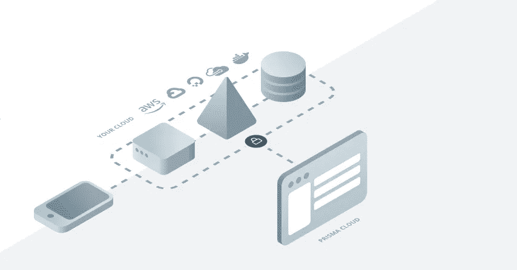

# 生产就绪 Prisma

> 原文：<https://itnext.io/production-ready-prisma-2da868a407dd?source=collection_archive---------1----------------------->



Prisma 拓扑的插图

*免责声明:一般假设您知道 Prisma 是什么，它是做什么的，以及它的好处。要了解更多关于 Prisma 的信息，请访问他们的优秀网站*[*www . Prisma . io*](https://www.prisma.io/)

Prisma 免费提供了一个名为 [Prisma Cloud](https://www.prisma.io/cloud/) 的非常慷慨的开发环境，但是您可能不希望或者不能够将这个环境用于您的生产应用程序。因此，我们将介绍如何在您的应用程序中建立一个高可用性的 Prisma 部署。

# 集装箱化

将您的应用程序封装在一个容器中允许您分离关注点，独立地扩展，并且以可重复的、自包含的和可靠的方式这样做。

容器编排可以通过多种方式实现，但我们将专注于使用 Kubernetes，因为它受到 AWS、Azure 和 Google Cloud 的支持，提供了一种管理部署和扩展这些部署的惯用方法。

Prisma 利用了 docker，这使其在本地或远程 docker 环境中的部署变得非常灵活。

# 数据存储

Prisma 用静态类型和 GraphQL 服务器包装我们的数据库，graph QL 服务器自动为我们的建模数据生成绑定，因此确保我们有一个可靠和可伸缩的数据库是 Prisma 生产实例的关键。Prisma 目前支持 Postgres 和 MySQL，并有一个 MongoDB 测试版。

我们将在基础设施中使用 Kubernetes 和 Google Cloud，因此我们将利用 Google 的 cloud SQL 产品。

如果您希望部署自己的数据库，您应该考虑使用 MySQL 的集群部署，它至少具有主/从关系和复制。

# 定义我们的基础设施

我们将使用 Kubernetes，它利用清单来描述它的资源，其中之一是部署，这将代表我们的应用程序并定义我们的应用程序可以访问的环境变量；其在 Kubenetes 中被表示为一个荚。

我们还将描述我们的 pod 在出现故障时应该如何处理(自我修复)以及应该如何扩展。

```
apiVersion: extensions/v1beta1
kind: Deployment
metadata:
  name: prisma
  namespace: prisma
  labels:
    stage: production
    name: prisma
    app: prisma
spec:
  replicas: 2
  strategy:
    type: **RollingUpdate**
    rollingUpdate:
      maxSurge: 1
      maxUnavailable: 0
  template:
    metadata:
      labels:
        stage: production
        name: prisma
        app: prisma
    spec:
      containers:
        - name: prisma
          image: **'prismagraphql/prisma:1.15'**
          ports:
            - name: prisma-4466
              containerPort: 4466
          env:
            - name: PRISMA_CONFIG
              valueFrom:
                configMapKeyRef:
                  name: **prisma-configmap**
                  key: PRISMA_CONFIG
            - name: DB_USER
              valueFrom:
                secretKeyRef:
                  name: **prisma-cloudsql-db-credentials**
                  key: username
            - name: DB_PASSWORD
              valueFrom:
                secretKeyRef:
                  name: **prisma-cloudsql-db-credentials**
                  key: password        
        - name: cloudsql-proxy
          image: **gcr.io/cloudsql-docker/gce-proxy:1.11**
          command: **["/cloud_sql_proxy",
                    "-instances=mysql-212618:europe-west1:production-prisma=tcp:3306",
                    "-credential_file=/secrets/cloudsql/credentials.json"]**
          securityContext:
            runAsUser: 2
            allowPrivilegeEscalation: false
          volumeMounts:
            - name: **prisma-cloudsql-instance-credentials**
              mountPath: /secrets/cloudsql
              readOnly: true
      volumes:
        - name: **prisma-cloudsql-instance-credentials**
          secret:
            secretName: **prisma-cloudsql-instance-credentials**
```

## 我们的部署清单中的一些细节

```
replicas: 2
strategy:
    type: RollingUpdate
    rollingUpdate:
      maxSurge: 1
      maxUnavailable: 0
```

扩展分为两个不同的方面:部署策略和资源可用性。

我们的部署策略声明了我们希望如何将新图像发布到我们的容器中。默认是通过终止旧版本并发布新版本来重新创建；这通常会导致停机。

选择滚动更新允许我们在保持正常运行时间的同时部署更改，我们还可以暂停部署并恢复或取消它。

关于不同策略的更多信息可以在这里找到:[https://container-solutions . com/kubernetes-deployment-strategies](https://container-solutions.com/kubernetes-deployment-strategies/)

可用性可以定义为能够满足应用需求的最大 pod 数量。我们已经声明了 2 个副本，但是除了这个值之外，只能创建 1 个副本，这样在一次展示中，我们最多可以同时有 3 个活动的 pod。

```
env:
  - name: PRISMA_CONFIG
    valueFrom:
      configMapKeyRef:
        name: prisma-configmap
        key: PRISMA_CONFIG
```

我们引用一个名为 PRISMA_CONFIG 的配置映射，它是 PRISMA 所期望的，以便连接到我们的数据库并定义关于我们的主机的详细信息。

你可以在这里了解更多:[https://www . prisma . io/docs/run-prisma-server/deployment-environments/docker-rt y1/# prisma _ config-reference](https://www.prisma.io/docs/run-prisma-server/deployment-environments/docker-rty1/#prisma_config-reference)

我们可以将配置图定义为 Kubernetes 中的一个资源:

```
apiVersion: v1
kind: ConfigMap
metadata:
  name: prisma-configmap
  namespace: prisma
  labels:
    stage: production
    name: prisma
    app: prisma
data:
  PRISMA_CONFIG: |
    port: 4466
    databases:
      default:
        connector: mysql
        host: 127.0.0.1
        port: 3306
        user: prisma
        password: password123 # make this a lot more complex and secure
        migrations: true
```

## 卷安装和谷歌云代理

我们需要允许我们的应用程序安全地与我们的 Google Cloud SQL 数据库通信，我们可以通过向我们的应用程序部署添加代理 sidecar 来实现这一点。

这将在 Google Cloud 中的 SQL 服务和我们在 Kubernetes 容器中的应用程序之间创建一个安全的隧道。

```
apiVersion: extensions/v1beta1
kind: Deployment
...
spec:
  template:
    spec:
      containers:
        - name: cloudsql-proxy
          image: **gcr.io/cloudsql-docker/gce-proxy:1.11**
          command: **["/cloud_sql_proxy",
                    "-instances=mysql-212618:europe-west1:production-prisma=tcp:3306",
                    "-credential_file=/secrets/cloudsql/credentials.json"]**
          securityContext:
            runAsUser: 2
            allowPrivilegeEscalation: false
          volumeMounts:
            - name: **prisma-cloudsql-instance-credentials**
              mountPath: /secrets/cloudsql
              readOnly: true
      volumes:
        - name: **prisma-cloudsql-instance-credentials**
          secret:
            secretName: **prisma-cloudsql-instance-credentials**
```

我们还安装了一个代表我们的 Google Cloud IAM 凭证的秘密，这样我们就可以通过命令块中的 *credentials_file* 标志来引用它。

```
./cloud_sql_proxy -instances=<INSTANCE_CONNECTION_NAME>=tcp:3306 \
                  -credential_file=<PATH_TO_KEY_FILE> &
```

[https://cloud . Google . com/SQL/docs/MySQL/connect-admin-proxy # start-proxy](https://cloud.google.com/sql/docs/mysql/connect-admin-proxy#start-proxy)

## 管理秘密

保持良好的秘密卫生对健康的生产环境至关重要。Kubernetes 提供了一种安全存储秘密的机制，但是，如果您对存储秘密更加偏执，并且需要能够审计对秘密的访问，那么探索 Hashi Corp 保险库可能是一个好主意，并且超出了本练习的范围。

我们已经引用了一个秘密*prisma-cloud QL-instance-credentials*同样，我们可以在 Kubernetes 中创建秘密作为资源。

```
kubectl create secret generic cloudsql-instance-credentials \
    --from-file=credentials.json=[PROXY_KEY_FILE_PATH]
```

[https://cloud . Google . com/SQL/docs/MySQL/connect-kubernetes-engine # 5 _ create _ your _ secrets](https://cloud.google.com/sql/docs/mysql/connect-kubernetes-engine#5_create_your_secrets)

如果您没有保存 IAM 帐户的 *credentials.json* 文件来访问您的数据库，您可以遵循以下说明:[https://cloud . Google . com/SQL/docs/MySQL/connect-kubernetes-engine # 2 _ create _ a _ service _ account](https://cloud.google.com/sql/docs/mysql/connect-kubernetes-engine#2_create_a_service_account)

# 访问 Prisma

现在，您应该拥有一个包含 2 个 pods 的集群，其中部署了 Prisma，两个 pods 都连接到您的 Google Cloud SQL 数据库。

但是，在将应用程序部署作为服务公开之前，您无法访问 Prisma。这里有更多关于服务的信息:[https://kubernetes . io/docs/concepts/services-networking/service](https://kubernetes.io/docs/concepts/services-networking/service/)

服务是 Kubernetes 的资源，可以用与应用程序其他部分类似的方式来声明。

```
apiVersion: v1
kind: Service
metadata:
  name: prisma-backend
  namespace: prisma
  labels:
    stage: production
    name: prisma
    app: prisma
spec:
  type: NodePort
  selector:
    stage: production
    name: prisma
    app: prisma
  ports:
  - port: 4466
    targetPort: 4466
```

我们选择使用选择器来引用和分组我们的 pod，选择器允许我们抽象出任何发现机制，并确保我们可以在不改变我们的应用基础架构的整体定义的情况下向我们的池中添加额外的 pod。

```
spec:
  type: NodePort
  selector:
    stage: production
    name: prisma
    app: prisma
```

现在，您应该能够通过运行以下命令来查看您的新 Prisma 服务

```
$ kubectl describe services --namespace prisma 
```

我们已经在所有清单中声明，我们创建的任何资源都应该驻留在 *prisma* 名称空间中，记住在任何命令前面加上这个名称空间非常重要。

您也可以将请求代理到您的新服务。

```
$ kubectl port-forward --namespace prisma <the-pod-name> 4467:4466
```

[https://www . prisma . io/docs/1.14/tutorials/deploy-prisma-servers/kubernetes-aiqu 8 ah gha # configuration-of-the-prisma-CLI](https://www.prisma.io/docs/1.14/tutorials/deploy-prisma-servers/kubernetes-aiqu8ahgha#configuration-of-the-prisma-cli)

您应该能够在本地访问 Prisma 实例 http://localhost:4466

这也是测试 pod 的一个很好的方法，因为您指定了代理哪个 pod。

此时，您还将能够使用 Kubernetes 内部 DNS 和服务发现向您的 Prisma 服务发送请求。如果您不想公开暴露它，建议您这样做，您应该确保在您的 *PRISMA_CONFIG 中为 managementApiSecret 值提供一个安全的秘密，并添加 TLS 终止。*

# 公开暴露

如果您*让*向外公开您的 Prisma 实例，您将需要声明一个引用我们服务的入口资源，并通过其节点端口将请求转发到一个可公开访问的地址。

由于我们使用谷歌云，我们可以注册一个静态 IP 地址，确保对我们的入口控制器网络接口的任何更改都不会导致我们无法访问 Prisma 服务。

```
$ gcloud compute addresses create <name-of-ip> --global
```

我们现在可以使用新注册和分配的 IP 地址在 DNS 中创建一个 A 记录。

```
apiVersion: extensions/v1beta1
kind: Ingress
metadata:
  name: basic-ingress
 **annotations:**
 **kubernetes.io/ingress.global-static-ip-name:** **<name-of-ip>**
spec:
  backend:
    serviceName: web
    servicePort: 8080
```

# **总结**

我们已经部署了一个 Prisma 服务器集群，由 Google Cloud 的 SQL 平台提供支持，然后将其作为 Kubenetes 的内部服务公开。

现在，您还应该知道如何使用 Google Cloud 代理访问集群中的特定 pods。

最后，我们希望从外部访问我们的集群，因此我们设置了一个全局静态 IP 地址，并将其分配给一个入口控制器，该控制器使用我们之前定义的服务来支持它。

下一次，我们将研究如何使用 Hashicorp Vault 并使用 LetsEncrypt 添加 TLS/SSL 来使我们的服务器更加安全。