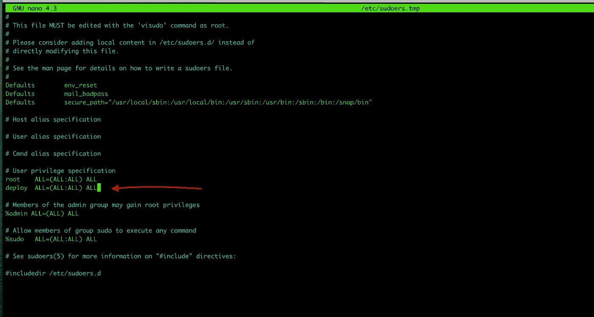
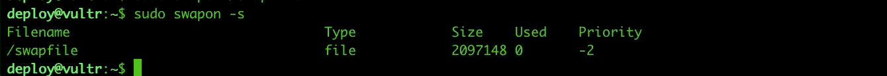

# 生产服务器设置— Vultr 教程[第 2 部分]

> 原文：<https://itnext.io/production-server-setup-part-2-vultr-tutorial-87a6e19f9a2f?source=collection_archive---------8----------------------->

# 第 2 部分—服务器设置:

在我们之前的主题中，我们部署了自己的 VPS，并且能够作为`root`用户通过 ssh 访问它。现在我们需要创建一个部署用户。我们将使用这个*部署用户*而不是`root`来部署我们的应用程序。

创建一个部署用户——让我们将这个新用户命名为`deploy`。我不确定这是否是部署的标准名称，但它很容易记住，所以我们就用它吧！

第一次 SSH 到您的服务器:

```
ssh root@IP-ADDRESS-OF-SERVER
```

运行命令以添加部署用户:

```
$ sudo adduser deploy # any secure password, keep somewhere safe!
```

**添加部署到 sudoers :**

```
$ sudo visudo# an editor will open find a line says
root ALL=(ALL:ALL) ALL# add one with your username below that
deploy ALL=(ALL:ALL) ALL#Type ctrl+x Type Y to the prompt
```



**退出&作为部署用户重新连接到远程:**

```
ssh deploy@xxxx.xxx.xxxx.xxxx
```

> 注意这次我们做了`ssh deploy@xxx`而不是`ssh root@xxx`

**安装用于部署的初始包，**这里我们使用 Nginx 作为 web 服务器

```
$ sudo apt-get install curl git-core nginx -y
```

## **添加交换空间**

```
# Add twice of our server ram
$ sudo fallocate -l 2G /swapfile# Lockdown swap space
$ sudo chmod 600 /swapfile# Setup swapspace
$ sudo mkswap /swapfile# Enable swapspace
$ sudo swapon /swapfile# verify swapspace, should show /swapfile
$ sudo swapon -s
```



## 生成不带密码的 SSH 密钥，将其 pub 密钥复制到您的 git 存储库中:

```
 # on your server
$ ssh-keygen -t rsa

# Copy pub key
$ cat ~/.ssh/id_rsa.pub# Add pub key to Github repo [https://github.com/username/app-name/settings/keys](https://github.com/moseslucas/ocsc-ima/settings/keys)# Test Github access
$ ssh -T git@github.com
```

## 添加授权密钥:

```
# on your server
$ touch ~/.ssh/authorized_keys
$ chmod 600 ~/.ssh/authorized_keys

# on your local machine
$ cat ~/.ssh/id_rsa.pub | ssh deploy@xxx.xxx.xxx.xxx 'cat >> .ssh/authorized_keys'
```

就这样，我们的 VPS 准备好了！该服务器现在已准备好在上部署。