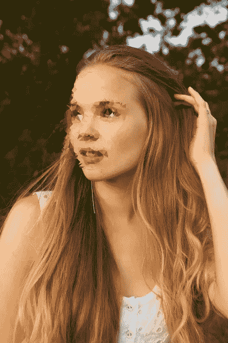
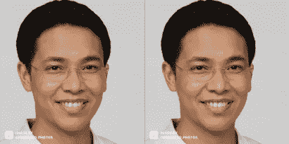
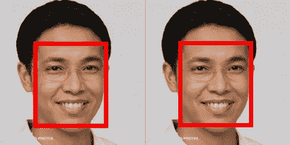
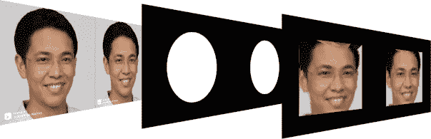
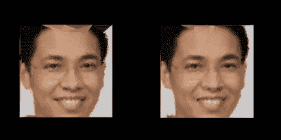
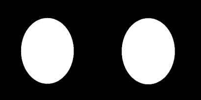
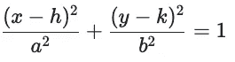
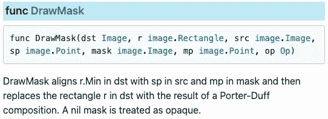
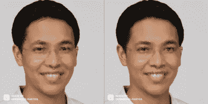

# 个人资料照片、隐私和社交媒体(在 Go 中)

> 原文：<https://itnext.io/profile-photos-privacy-and-social-media-e66a908cd054?source=collection_archive---------2----------------------->

> 在互联网的“美好旧时光”中，匿名是正常的(甚至是被鼓励的)。早期采用者用假名写博客、Hotmail 和 Messenger 账户。你不可能绝对准确地知道一个人的真实身份。如今，如果你的 Instagram、Snapchat 或 Linkedin 上没有个人资料照片，你就会被认为(礼貌地说)是一个不寻常的局外人。

我为个人资料照片建了一个叫 [**Showerglass**](https://github.com/rocketlaunchr/showerglass) 的 Go 包。这是一个舒缓的面部过滤器，你可以欣赏美丽，但不能完全识别这个人。它适用于各种各样的社交应用。

图片来源:[https://unsplash.com/photos/tCJ44OIqceU](https://unsplash.com/photos/tCJ44OIqceU)

我认为这是对个人资料照片的竞争性隐私考虑的一个很好的妥协。它在面上使用 [Delaunay 三角测量](https://en.wikipedia.org/wiki/Delaunay_triangulation)算法来给出*磨砂*淋浴玻璃效果。

为了构建它，我必须学习`[image](https://pkg.go.dev/image)`和`[image/draw](https://pkg.go.dev/golang.org/x/image/draw)` *包的基础知识，我将在下面解释。

[**GITHUB 回购:Showerglass**](https://github.com/rocketlaunchr/showerglass)

# 什么是图像？

事实证明，`image.Image`并不是你直觉上认为的那样。

这只是一个带有 处的*函数* **的接口，它指定了给定坐标的颜色。您可能认为图像是一些位图数据，代表每个 x-y 位置(*像素*)的颜色。**不一定是**。甚至一个数学方程(没有现有的支持数据)也能满足一个`image.Image`。**

**注意:**`image`包确实包含了诸如`image.NRGBA`之类的类型，这些类型实现了带有后台数据的`Image`接口*。*

在下面的教程中，我们将使用这张图片作为我们的*源*。

源图像

src 现在是一个图像。图像

# 检测人脸

[**pigo**](https://github.com/esimov/pigo) 包可以用来检测人脸。它是 100%用 Go 编写的，不像其他使用 *cgo* 绑定 OpenCV 的包。

目标是将 [Delaunay 三角剖分算法](https://en.wikipedia.org/wiki/Delaunay_triangulation)仅应用于那些区域。不幸的是， [**三角形**](https://github.com/esimov/triangle) 包只适用于整个图像。

**pigo** 返回一个包含足够信息的切片`dets`，以确定边界面矩形的位置(显示为红色)。

“检测到的面孔”的位置

我们可以使用这些包围矩形来仅将算法应用于那些区域。

# 行动（或活动、袭击）计划

从左到右:源、遮罩、三角形面

1.  仅从源图像复制每张脸的子图像。
2.  将 Delaunay 三角剖分算法应用于每个子图像(称为“三角剖分”图像)。
3.  假设面是一个椭圆，并在源中每个面的相同位置生成一个遮罩。
4.  **在**源图像上通过蒙版**绘制**三角化图像*以产生最终图像。*
5.  将最终图像返回给用户。

# 三角测量每个面

我们可以将 Delaunay 三角剖分算法应用于整个源图像，并使用上面提到的相同遮罩。然而，该算法计算量很大。

相反，我们只在仅包含面部的较小的子图像上运行该算法。我们不需要复制源图像的任何其他部分，这就是为什么周围呈现黑色(默认颜色)。

公正面孔的三角图像

# 创建遮罩

源中两个面的遮罩

我们需要创建一个遮罩，这样我们就可以在源的 上面的 ***三角形图像中的****绘制人脸。*

*蒙版是黑白图像。白色区域允许画出三角形的图像。黑色区域阻挡了三角化图像的绘制。*

*由于三角化的图像包含矩形的人脸图像，我们需要将白色区域做成椭圆形，以更精确地模拟人脸的典型形状。*

## *椭圆形面罩*

*面具也是一个`image.Image`。如果您从上面回忆起，`image.Image`不需要有支持数据。它可以用一个数学方程来定义。在这种情况下，我们可以创建一个*图像*，其中如果(x，y)坐标被一个椭圆的定义所包围，我们返回白色。否则，我们返回黑色。*

**

*以(h，k)为中心的椭圆方程*

*参见:(作者之兄陶)*

# *将方栓穿过圆孔*

*最后一步是**通过** 蒙版和源上面的**绘制**三角化的图像 ***来创建最终想要的图像。****

*[**平局。DrawMask**](https://pkg.go.dev/golang.org/x/image/draw#DrawMask) 函数正是提供了这种功能。*

**

*画吧。DrawMask 函数签名*

*文档可能会令人费解，所以让我解释一下，以便理解正在发生的事情。*

*`dst`是我们希望`src`被吸引过来的`image.Image`。在我们的例子中，`dst`是源图像，`src`是三角化图像。*

*`mask`是黑白面具。我们要求只有与蒙版白色区域位置相同的`src`区域才在**上绘制****`dst`。其他参数指定如何对齐遮罩、源图像和目的图像的坐标系，使它们保持一致。***

******

***源图像***

******

***应用了滤镜的最终图像***

*****注意:**为了更好地混淆人脸，本例中的`MaxPoints`(算法参数)应该进一步减少。***

# ***示例代码***

***[**GITHUB 回购:Showerglass**](https://github.com/rocketlaunchr/showerglass)***

***为每个检测到的人脸调用`TriangleConfig`回调函数。您需要返回一个`showerglass.TriangleConfig`，并根据`facearea`调整`MaxPoints`和`BlurRadius`。***

***由于一些“检测到的人脸”是误报，您可以返回`nil`不对该区域应用任何过滤器。***

## ***校准***

*   ***更高的`MaxPoints`意味着这张脸看起来更接近原来的样子。***
*   ***更低的`MaxPoints`(除了`0`)意味着更迷惑的脸。***

***基于`facearea`，你需要校准`MaxPoints`以获得想要的*手感*。它既是一门科学，也是一门艺术。***

## ***调整大小***

***这个包也有内置的调整大小功能，可以使用任何算法:Caire，nearest neighborhood，ApproxBiLinear，BiLinear，CatmullRom！***

# ***最后的想法***

***[golang.org/x/image/draw](https://pkg.go.dev/golang.org/x/image/draw)套装是[图像/绘图](https://pkg.go.dev/image/draw)的绝佳替代产品。***

***[**GITHUB 回购:Showerglass**](https://github.com/rocketlaunchr/showerglass)***

## ***其他文章***

*   ***伟大的唐纳德·j·特朗普的创业天才***
*   ***[切片技巧](https://medium.com/@rocketlaunchr.cloud/slice-tricks-in-go-1edc21ae9109)(初学者)***
*   ***[类型转换，&类型断言](https://medium.com/@rocketlaunchr.cloud/type-conversions-casting-type-assertions-fb295430e387)(初学者)***
*   ***[缓存缓慢的数据库查询(正确地说](https://medium.com/@rocketlaunchr.cloud/caching-slow-database-queries-1085d308a0c9))(中级/高级)***
*   ***[取消 Go 中的 MySQL 查询(正确](https://medium.com/@rocketlaunchr.cloud/canceling-mysql-in-go-827ed8f83b30))(中级/高级)***
*   ***[Better Go 语法(igo 项目)](https://medium.com/@rocketlaunchr.cloud/better-go-syntax-igo-project-6678fc65ff68)(高级)***