# 节省流量的方式

> 原文：<https://itnext.io/profile-pictures-in-outsystems-the-traffic-saving-way-5c5f727b1253?source=collection_archive---------0----------------------->

## 如何实现它们并避免不必要的数据流量


OutSystems 非常方便，在快速实现反应式 web 应用程序时，它提供了许多现成的 UI 模式。一个例子是所谓的 *UserInfo* 小部件，它位于页面的右上角。遗憾的是，尽管这个小部件显示了一个占位符图像，但它并没有实现个人资料图片功能。

# 摘要

在本文中，您将了解到

*   如何以简单的方式实现这个缺失的特性，
*   在数据流量方面有缺点的地方，
*   以及如何避免它们。

所以，我们一起来搭建一个小例子 app。

# 你需要什么

如果您想自己跟踪实施情况，您需要:

*   一个外部系统账户(一个[免费的个人环境](https://www.outsystems.com/free-edition/)就足够了)
*   外部系统服务工作室
*   带有开发工具的网络浏览器，用于检查发送的请求(例如 Edge、Chrome、Firefox)

对于本教程，您应该已经有了一些使用外部系统构建反应式 web 应用程序的经验。

# 简单的解决方案

## 向我们的用户添加个人资料图片

在 OutSystems 中，终端用户在*用户*实体中管理，该实体可以在*系统*模块中找到，并且默认情况下作为新的反应式 web 应用程序的依赖项添加。由于这个实体没有提供属性来存储配置文件图片，我们需要将图片存储在其他地方。在旨在生产环境中运行的应用程序中，我们会考虑为这种类型的用户配置文件数据提供单独的基于域的服务，或者从身份提供者(例如 Azure Active Directory)获取配置文件映像。

为了简化本文，我们在示例应用程序中创建了一个单独的 *UserPicture* 实体。由于每个用户只能有一张个人资料图片，我们使用*用户身份*作为*用户图片*的主键，因此我们得到了一对一的关系。

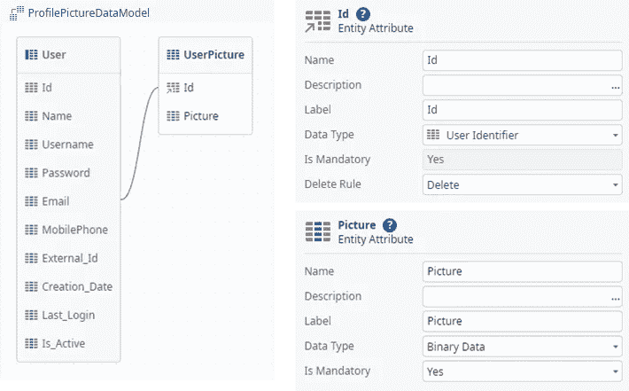

示例应用程序的实体

为了让用户能够更改个人资料图片，我们需要一个带有数据操作 *GetProfilePicture* 的表单来加载当前的图像数据。

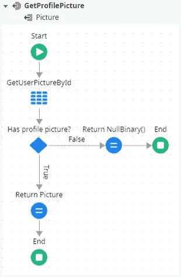

数据操作:GetProfilePicture

接下来，我们在表单上放置一个上传小部件。通过将 widget 的参数*文件内容*设置为 *GetProfilePicture。图片*和*接受*到*图片*，我们得到一个整洁的编辑器，显示当前图片并提供一个上传新图片文件的选项。

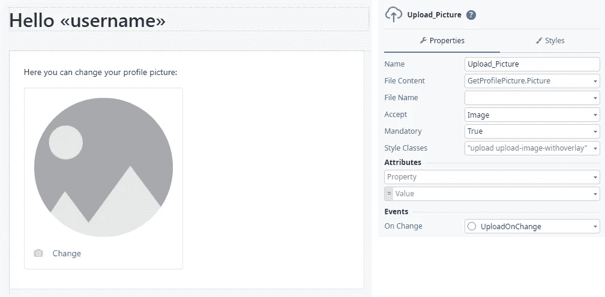

更改个人资料图片的用户界面

正如您在上面的屏幕截图中所看到的，在更改事件上的*的处理程序也被添加到小部件中。这是为了在用户选择新文件时将图像直接保存到数据库中。为了在服务器端实现这个功能，我们实现了一个新的服务器动作 *ProfilePicture_Save* 。*

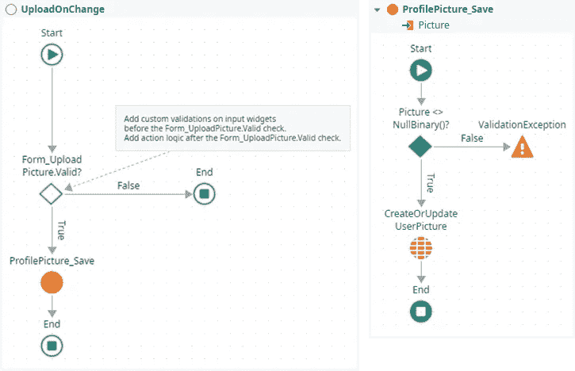

客户端操作 UploadOnChange 和服务器操作 ProfilePicture_Save

为了更好地进行测试，我们还将添加一个服务器动作来删除配置文件图片(如果有的话)。所以我们可以复用 *ProfilePicture_Save* ，将参数 *Picture* 设置为 *NullBinary()* 。为了以后更新 ui，我们可以刷新数据动作 *GetProfilePicture* 。但是为了保存这个服务器回调，我们可以简单地乐观并覆盖这个值，因为它应该是 *NullBinary()* 。

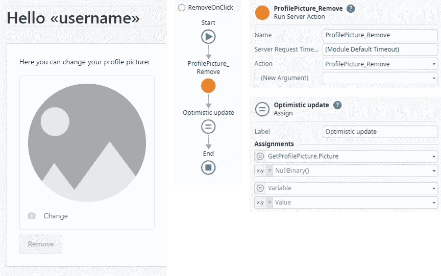

扩展用户界面和客户端操作 RemoveOnClick

设置好这些之后，我们就可以发布和测试我们的应用程序了。

## 在 UserInfo 小工具中显示个人资料图片

目前，用户已经可以更改个人资料图片，但当然它不会显示在右上角的 *UserInfo* 小部件中。为了实现这一点，我们需要相应地扩展 *UserInfo* 小部件。一种简单的方法是将已经实现的数据动作添加到小部件中，并将其输出参数配置为图像小部件的源。这种方法的缺点是，它会在每次页面加载时重新加载，因此配置文件图片总是会从数据库重新加载，并从服务器传输到客户端。正如我的文章标题所说，我们希望避免不必要的流量，所以这不是解决方案。

如果您查看 OutSystems 如何从服务器加载用户名并将其显示在 *UserInfo* 小部件中，您会看到它们将用户名存储在一个客户端变量中，并仅在必要时从服务器请求它。那么，为什么我们不能将配置文件图片存储在一个客户端变量中呢？这带来了 OutSystems 不支持客户机变量的二进制数据类型的问题。如果您在 OutSystems 社区中搜索这个问题的解决方案，您会发现一个简单的解决方案，它将图像编码为 base64，并将结果字符串存储在一个客户机变量中。为了显示图像，字符串再次被解码成二进制数据。

所以，我们暂时这么说吧。为了将另一个请求保存到服务器，我们简单地将现有的服务器动作 *GetUserNameFromServer* 扩展为另一个配置文件图片的输出参数。当然，我们还需要扩展客户端动作 *GetUsername* ，并将接收到的个人资料图片本地存储到一个新的客户端变量 *UserPicture* 。为了更好的可重用性和可维护性，我们将它实现为一个单独的客户端动作，以在客户端存储配置文件图片。

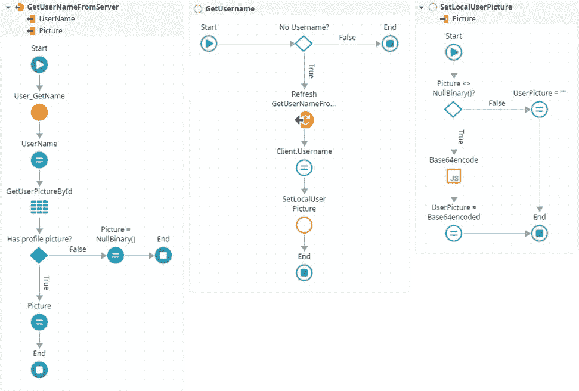

标准小部件和 SetLocalUserPicture 的扩展操作 GetUserNameFromServer 和 GetUsername

显然，我们还需要检索本地存储的个人资料图片，并将其加载到 *UserInfo* 的 image 小部件的 source 参数中。为此，我们使用第二个客户端动作*getlocaluserphoto*，它被配置为一个函数。这允许我们如下图所示修改图像小部件的参数，并直接从客户端动作接收图片。

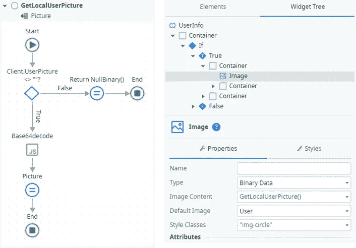

在 UserInfo 小部件中获取 LocalUserPicture 和更改的配置文件图像

为了将二进制数据编码和解码为 base64 字符串，我们可以简单地编写自己的 JavaScript*base64 encode*和 *Base64decode* 。它们包含一个输入和一个输出参数，分别用于接收和返回二进制数据和编码字符串。使用 javascript 中的*窗口*对象的内置 *btoa* 和 *atob* 函数，转换非常容易:

```
// base64 encode:
$parameters.Base64 = window.btoa($parameters. Binary);// base64 decode:
$parameters.Binary = window.atob($parameters.Base64);
```

恭喜，我们已经成功让用户上传了一张个人资料图片，并显示在已经存在的 *UserInfo* 小部件中，而无需重复请求。但是故事还有更多…

# 使用客户端变量是一个聪明的想法吗？

客户端变量不同于普通的屏幕变量，即使在浏览器关闭时也保存在本地存储中，并且在屏幕之间共享。如果您想保留用户偏好或整体上下文，这尤其有用。

这对我们的目的来说太棒了，不是吗？只要客户端变量只在客户端使用，上述解决方案完全可以工作。

## 服务器回调中不必要的数据流量

但是，一旦在服务器端访问了单个客户机变量，默认情况下，所有客户机变量都会随着每次回调被传输到服务器。

为了说明示例应用程序中的行为，让我们创建一个名为 *ResultsPerPage* 的客户机变量，默认值为 10，并在屏幕上添加一个小列表视图。为简单起见，数据动作 *GetListData* 返回 n 个随机生成的密码，其中 n 是 *ResultsPerPage* 的值。

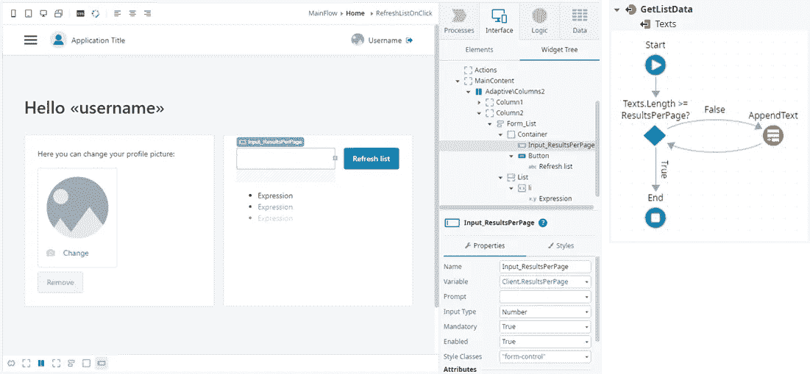

带有列表视图和新数据操作 GetListData 的扩展屏幕

如果我们现在发布这个新的应用程序版本，我们可以在浏览器的开发工具中检查(要打开按 F12)，当我们单击*刷新列表*按钮时，哪些数据被发送到服务器。正如您在 network 选项卡中看到的，所有客户端变量，包括 base64 编码的配置文件图片，都是在每个服务器回调的有效负载中发送的。

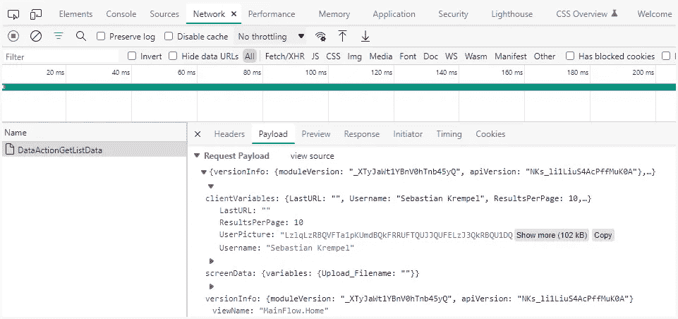

浏览器开发工具中的网络检测

当然，本例中的 102 kB 并不是很大的数据量，但是不必要地传输它是没有意义的。根据应用程序的复杂性和只在本地需要的客户端变量的数量，这可能会很快增加大量不应该传输的数据。

# 更好的解决方案

目标是防止配置文件图片作为客户机变量的一部分随每个请求被发送到服务器。为了实现这一点，我们可以修改已经实现的客户端操作，将图片存储在独立于标准外部系统机制的单独的本地存储项中，该机制也将本地存储用于其客户端变量。

为此，我们首先移除*用户图片*客户端变量，因为我们不再需要它了。之后，我们需要调整客户端动作*SetPictureFromLocalStorage*和*GetPictureFromLocalStorage*的逻辑，如下图所示:

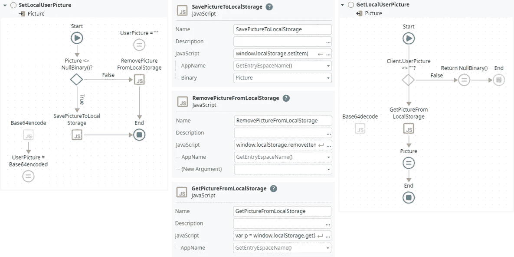

修改了客户端操作，以便从本地存储中存储和加载个人资料图片

从截图的中间部分可以看到，所有三个新的 JavaScripts 都有一个名为 *AppName* 的输入参数。它用于为我们单独的本地存储项的键创建应用程序特定的前缀。如果在同一台主机上部署了多个应用程序，这可以确保每个应用程序都有自己的命名空间。此外，前缀还包含段 *$KeepLocalVars$* 来标识我们的纯本地变量，并将它们与外部系统使用的名称空间区分开来。

要访问本地存储，您可以在 OutSystems forge 中找到 Paulo Ca ao 的组件 [*本地存储 Reactive*](https://www.outsystems.com/forge/component-overview/6978/local-storage-reactive) 。我决定不使用它，因为我们只需要三行简单的代码就可以得到结果，并且可以同时对二进制数据进行所需的编码。

下面您可以找到三个新 JavaScripts 的清单:

```
// SavePictureToLocalStorage
window.localStorage.setItem(
  '$' + $parameters.AppName + '$KeepLocalVars$UserPicture',
  window.btoa($parameters.Binary)
);// RemovePictureFromLocalStorage
window.localStorage.removeItem(
  '$' + $parameters.AppName + '$KeepLocalVars$UserPicture'
);// GetPictureFromLocalStorage
var p = window.localStorage.getItem(
  '$' + $parameters.AppName + '$KeepLocalVars$UserPicture'
);
if (p!==null) $parameters.Binary = window.atob(p);
```

现在让我们重新发布我们的应用程序，并检查网络选项卡。如您所见，现在客户机变量 *UserPicture* 不再被发送到服务器。

## 最后一个问题

当用户注销时，如何清除本地存储项目？答案很简单:绝不！

您不会遇到这种行为问题的原因是，OutSystems 会在注销时清除客户机变量，所以 *Client。用户名*在下一次 *GetUsername* 运行时为空，本地存储的个人资料图片将被覆盖。尽管如此，在注销时主动从本地存储中删除个人资料图片是一个很好的做法。为此，我们只需在*UserInfo*小部件的注销客户端动作中，调用参数*图片*设置为 *NullBinary()* 的*setlocauserphoto*:

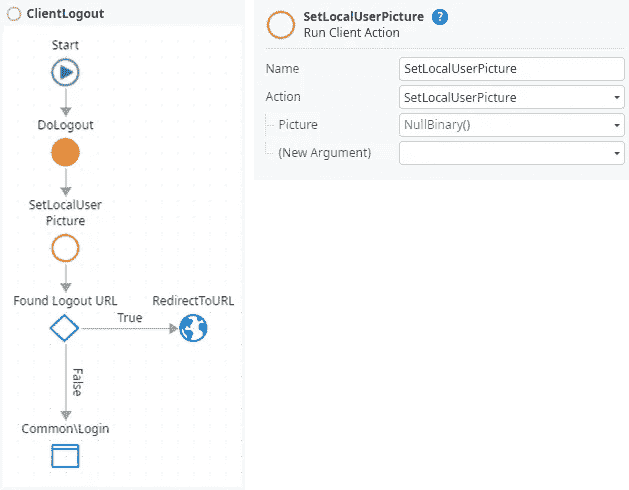

注销时删除本地个人资料图片

我希望这篇文章对你来说是有趣的，我已经谈到了这个话题。如果您有任何未解决的问题或需要我改进的建议，请通过 medium 或我的 [OutSystems profile](https://www.outsystems.com/profile/enrntqhemy/) 联系我。