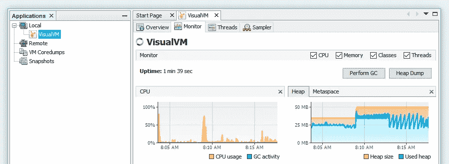
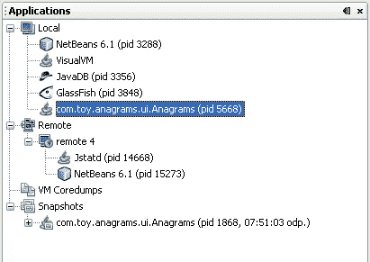

# 使用 VisualVM 远程分析 JVM 应用程序

> 原文：<https://itnext.io/profiling-jvm-applications-remotely-using-visualvm-c0df9816aabf?source=collection_archive---------0----------------------->

## 通过 jstatd 或 JMX 在 VisualVM 和 JVM 应用程序之间进行通信



VisualVM 主窗口

[Java 平台](https://www.oracle.com/java/)是历史最悠久、最著名的桌面和服务器应用开发和部署平台之一。这个平台最重要的组件是 [Java 虚拟机(JVM)](https://en.wikipedia.org/wiki/Java_virtual_machine) ，它负责运行 [Java 字节码](https://en.wikipedia.org/wiki/Java_bytecode)。有几种著名的[编程语言](https://en.wikipedia.org/wiki/List_of_JVM_languages)(例如 Scala、Kotlin、Clojure、Jython、JRuby 和……)编译成 [Java 字节码](https://en.wikipedia.org/wiki/Java_bytecode)，运行在 JVM 之上，并使用这个成熟的运行时环境的功能。Java 平台被用于许多行业，包括制造业、汽车、保险和公共部门，因此，世界上许多桌面和服务器应用程序都运行在 JVM 之上。

# 为什么分析应用程序很重要

根据[维基百科的定义](https://en.wikipedia.org/wiki/Profiling_(computer_programming)):

> 在软件工程中，剖析(“程序剖析”、“软件剖析”)是动态程序分析的一种形式，它测量例如程序的空间(存储器)或时间复杂性、特定指令的使用、或函数调用的频率和持续时间。最常见的是，分析信息有助于程序优化。

分析器帮助我们在运行时甚至在生产中发现诸如内存泄漏、性能问题等问题。通常，我们在开发机器上的开发过程中不会发现这种问题。

# JVM 分析工具

有几个很棒的 JVM 分析器(免费的和商业的)，像 [JProfiler](https://www.ej-technologies.com/products/jprofiler/overview.html) 、 [YourKit](https://www.yourkit.com/java/profiler/) 、 [VisualVM](https://visualvm.github.io/index.html) 和……但是在这篇文章中，我将写关于 [VisualVM](https://visualvm.github.io/index.html) 。

VisualVM 是一个简单、强大、免费和官方的 JVM 应用程序分析工具。从 JDK 版本 6 更新 7 直到 JDK 版本 8 的早期更新都与 Java 开发工具包(JDK)捆绑在一起，但在那之后，它作为一个独立的程序单独发布。通过 VisualVM，您可以连接到本地和远程 JVM 应用程序并监控它们。



VisualVM 应用程序窗口

当你启动 VisualVM 时，所有的本地 JVM 应用程序都被默认识别，但对于远程 JVM 应用程序，你需要通过 [**jstatd**](https://docs.oracle.com/javase/8/docs/technotes/tools/unix/jstatd.html) 或 [**JMX**](https://docs.oracle.com/javase/8/docs/technotes/guides/visualvm/jmx_connections.html) 连接到它们。

# 如何使用 VisualVM 远程分析 JVM 应用程序

有两种方法可以将远程 JVM 应用程序连接到 VisualVM:或者使用 **jstatd** 或者 Java 管理扩展( **JMX** )。

jstatd 程序是一个 RMI 服务器，它与 JDK 捆绑在一起，监控 JVM，并提供一个接口，允许远程监控工具连接到在本地主机上运行的 JVM。您应该在目标机器上启动 **jstatd** ，VisualVM 将连接到它以获取关于远程 JVM 的分析数据。

**JMX** 技术可用于监控和管理任何运行在本地或远程 JVM 上的 JVM 应用程序。

# 如何在目标机器上运行 jstatd 服务器

如果我的机器上没有运行安全管理器，jstatd 服务器需要本地访问权限，并且需要一个用“java.security.policy”系统属性指定的安全策略文件。您应该为 JVM 创建一个安全策略文件(我称之为 tools.policy ),其中包含:

```
grant {
  permission java.security.AllPermission;
};
```

现在，您将能够启动 jstatd 程序:

```
jstatd -p 1089 -J-Djava.security.policy=tools.policy
```

现在 **jstatd** 正在运行，并在端口 1089 等待 VisualVM 来自远程机器的 RMI 协议连接。

这种方法在监控方面有一些限制，比如没有 CPU 使用监控，不能运行采样器和进行线程转储。

# 如何为 JMX 通信准备目标 JVM 应用程序

VisualVM 将自动检测并连接到在 JDK 版本 6 上运行的 JVM 应用程序，或者在版本 5.0 上使用正确的系统属性启动的 JVM 应用程序(但是有[种情况](https://docs.oracle.com/javase/6/docs/technotes/guides/visualvm/jmx_connections.html)visual VM 无法自动发现并连接到 JMX 代理程序)，然后您只需要使用一些系统属性启动 JVM 应用程序:

```
java -Dcom.sun.management.jmxremote
     -Dcom.sun.management.jmxremote.port=1089 \
     -Dcom.sun.management.jmxremote.ssl=false \
     -Dcom.sun.management.jmxremote.authenticate=false \
     *YourJavaAppAndOtherParams*
```

在上面的命令中，*JVM 应用程序被启动，并且通过端口 1089 配置的开箱即用的监控和管理功能以及 SSL 加密和密码验证被停用。*

# *使用 SSH 或 VPN 保护连接*

*如果您在公共网络中，您应该保护 VisualVM 和 JVM 应用程序之间的通信。*

*保护环境的最简单方法是使用 VPN 或安全连接，通过 SOCKS 代理设置 SSH 隧道。你可以点击[这个链接](https://dzone.com/articles/visualvm-monitoring-remote-jvm)了解更多。*

# *每种方法的优缺点*

*我更喜欢 JMX 的方法，因为我们不需要在目标机器上运行任何服务器，而且通过使用 JMX，我们将发挥 VisualVM 的全部能力(在监控能力方面没有限制)。*