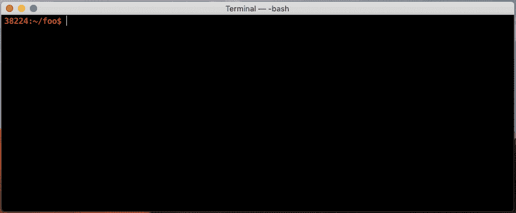
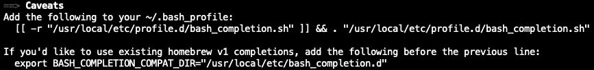
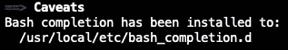

# macOS 上 Bash 的可编程完成

> 原文：<https://itnext.io/programmable-completion-for-bash-on-macos-f81a0103080b?source=collection_archive---------1----------------------->


大多数人都熟悉默认的 Bash 完成功能。你开始输入一个命令，点击*键*，命令自动完成。如果有多个命令与您到目前为止键入的内容相匹配，您可以按两次*键*，Bash 会显示所有可能完成的命令的列表。这同样适用于变量和文件名。

然而，许多人不知道 Bash 支持更高级的完成类型，称为*可编程完成*。这允许定义特定于*命令的*完成逻辑，使用户能够以特定于上下文的方式自动完成子命令、选项和命令的其他参数。想象一下输入`cmd -[tab][tab]`，然后看到该命令所有适用选项的列表。

不幸的是，默认情况下，可编程 Bash 完成在 macOS 上无法顺利工作。然而，这些障碍很容易克服。本文解释了如何做到这一点，以及如何在 macOS 上充分利用可编程 Bash 完成。

# 默认完成

默认的 Bash 完成功能基本上适用于 Bash 的每个版本。这里简单介绍一下(上图)。本质上，它允许自动完成命令名、变量和文件名，如下所示:

```
$ **ec[tab] **            # Completes to**echo**
$ **echo $PA[tab]**       # Completes to**echo $PATH**
$ **cat myfile[tab]**     # Completes to**cat myfile.txt**
```

如果到目前为止您输入的内容有多种可能的完成方式，您可以按两次*选项卡*，将显示一个包含所有可能完成方式的列表:

```
$ **e[tab][tab]**          # Lists all commands starting with "e"
$ **echo $P[tab][tab]**    # Lists all variables starting with "P"
$ **cat my[tab][tab]**     # Lists all files starting with "my"
```

# 可编程完成

在 Bash 版本 [2.04](http://freshmeat.sourceforge.net/projects/bashcompletion) (大约从 2000 年开始)中，可编程完成作为一个新特性被引入。Bash 文档的[可编程完成](https://www.gnu.org/software/bash/manual/html_node/Programmable-Completion.html)部分对此有详细描述。顾名思义，它是一种*可编程*类型的完成，这意味着它允许创建适合各个命令的完成逻辑。

例如，它允许做这样的事情:

```
$ **cmd [tab][tab]**        # Lists all sub-commands of "cmd"
$ **cmd --[tab][tab]**      # Lists all options applicable to "cmd"
$ **cmd sub --[tab][tab]**  # Lists all options applicable to "sub"
$ **cmd sub [tab][tab]**    # Lists all arguments applicable to "sub"
$ **cmd su[tab]**           # Completes to **cmd sub**
$ **cmd --opt[tab] **       # Completes to **cmd --option**
```

正如您所看到的，补全不是通用的，比如默认 Bash 补全的命令名、文件名和变量，而是特定于正在键入的命令(上例中的`cmd`)。

那么 Bash 如何知道在每种情况下什么完成是适用的呢？答案是必须为每个命令定义一个*完成规范*。下一小节将对此进行进一步阐述。

## 完工规范

完成规范(“compspec”)为命令的自变量标记定义了适用的完成。这些参数标记可以是子命令、选项或其他值，包括特定于上下文的值。完成规范负责检查命令行的当前状态，并返回一组可能的完成。

如果一个命令有一个完成规范，并且用户点击这个命令的参数标记中的*标签*，那么 Bash 调用完成规范并向用户显示返回的完成。这些完成的含义(例如，它们是子命令还是选项)对 Bash 是透明的，只有完成规范和命令本身知道。

创建一个完成规范，并将其与内置的`complete`命令绑定在一起。`complete`内置是 Bash 可编程完成特性的主要工具。有两个称为`compgen`和`compopt`的辅助内置组件帮助定义完井规范。Bash 手册的 [**可编程完成内建**](https://www.gnu.org/software/bash/manual/html_node/Programmable-Completion-Builtins.html) 部分描述了这三个内建。

大致来说，`complete`内建就是这样被用来创建一个完成规范并将其绑定到一个命令上的:

```
$ **complete [compspec] [cmd]**
```

现在，如果您键入`cmd [tab]`，Bash 将调用完成规范`compspec`并向您显示返回的完成(在本例中可能是子命令、文件名或其他值)。

我不会在本文中描述如何创建一个完成规范，但是可以在`[complete](https://www.gnu.org/software/bash/manual/html_node/Programmable-Completion-Builtins.html)`内建的文档中找到相关的主要信息。更好的是，有一个非常好的教程叫做 [**创建 Bash 完成脚本**](https://iridakos.com/tutorials/2018/03/01/bash-programmable-completion-tutorial.html) 。

实际上，`complete`很少在命令行上执行，而是包含在一个所谓的**完成脚本**中。完成脚本基本上是一个普通的 Bash 脚本，包含一个或多个针对特定命令的`complete`语句。因此，如果您提供一个完成脚本，那么`complete`命令将在当前的 shell 中执行，并且相应命令的完成将被激活。

## 在现实世界中

现在最大的问题是，所有命令的完成脚本来自哪里？答案是，它们通常是由命令的创建者提供的。

例如，Git 为其`git`命令行工具提供了一个 Bash 完成脚本。它叫做`[git-completion.bash](https://github.com/git/git/blob/master/contrib/completion/git-completion.bash)`。如果您看一下这个脚本，您会看到它定义了许多函数，最后它调用了`complete`内置函数。这些函数定义了实际的完成规范，它们被`complete`语句引用。您还可以看到该脚本使用了`compgen`和`compopt`内置代码。这是大多数 Bash 完成脚本的样子。

您可以下载这个脚本并在您的 shell 中找到它:

```
$ **source git-completion.bash**
```

在那之后，你应该马上就能看到`git`惊人的自动完成功能。这看起来像下面这样:



如您所见，Git 完成脚本提供的完成功能非常有用。它不仅可以节省您的打字时间，还可以节省您在文档中查找子命令或选项名称的时间。

注意在`git add`上下文中点击*标签*是如何显示未被跟踪的*文件列表，而不是被跟踪的文件或在`.gitignore`中的文件。或者在`git remote remove`上下文中点击*标签*如何显示作为可能完成的现有遥控器列表。这些是*上下文特定的*完成的例子，使得可编程完成如此强大。可编程完成逻辑可以任意复杂。*

Git 只是众多提供 Bash 完成脚本的命令行工具之一。例如，`docker`提供了一个 Bash 完成脚本，可以在[这里](https://github.com/docker/cli/blob/master/contrib/completion/bash/docker)找到。或者`kubectl`也有 Bash 完成脚本，它甚至允许用`kubectl`命令:`kubectl completion bash`直接生成。

## 一些并发症

你可能认为你所要做的就是在你的`.bashrc`文件中找到这些补全脚本，你就可以对这些命令使用补全。不幸的是，这并不容易，因为我们现在遇到了一些首先需要解决的复杂问题。特别是，我们需要讨论两点:

1.  许多完成脚本无法在 MAC OS**上使用 Bash 的默认版本**
2.  许多完成脚本依赖于名为[***的第三方项目 bash-completion***](https://github.com/scop/bash-completion)

在这方面，上面的 Git 完成脚本是一个例外。它在 macOS 上开箱即用。然而，如果你试图找到`docker`或`kubectl`完成脚本，你将会很不幸。您至少会得到一个`command not found`错误，并且决不会得到任何有用的完成功能。

这两点都将在下面的两节中讨论。它们可以被视为小障碍，但很容易克服。一旦完成了这些，我将在本文的最后介绍在 macOS 上充分利用编程完成功能的最佳方式。

# macOS 有什么问题？

苹果在 macOS 中包含了一个完全过时的 Bash 版本。准确地说，这是 2007 年的 GNU Bash3.2 版本。如果执行以下命令，您可以看到这一点:

```
$ **bash --version**
GNU bash, version 3.2.57(1)-release (x86_64-apple-darwin18)
Copyright (C) 2007 Free Software Foundation, Inc.
```

苹果不想包含 Bash 的更新版本，因为 GNU Bash 4+(3.2 的继承者)使用 [GPLv3](https://www.gnu.org/licenses/quick-guide-gplv3.en.html) 许可，这与苹果的许可政策相冲突。

问题是 Bash 的可编程补全特性自 3.2 版本以来已经有所发展，今天许多补全脚本利用了 Bash 3.2 不支持的新特性。这意味着这些补全脚本不能在 Bash 3.2 中使用。例如，`docker`和`kubectl`的完成脚本在 Bash 3.2 中不能正常工作。

这当然是个问题。拥有可编程完成的无忧体验的最佳方式是升级 Mac 的默认外壳。这其实很简单，我写了一整篇文章，叫做 [**在 macOS 上升级 Bash**](https://medium.com/@weibeld/upgrading-bash-on-macos-7138bd1066ba)。

在阅读本文之前，我强烈建议您将 Mac 的默认 shell 升级到 Bash 的新版本。只有这样才能确保第三方完成脚本按预期工作。在撰写本文时，最新版本是 [GNU Bash 5.0](https://tiswww.case.edu/php/chet/bash/bashtop.html#CurrentStatus) 。

现在，让我们来讨论实践中关于可编程补全的第二个要点。

# bash 完成项目

bash-completion 项目是一个独立的项目，几乎和可编程 Bash completion 本身一样早就存在了(至少从 2003 年开始)。它独立于 Bash，但已经成为一种标准。它在 GitHub 上维护:

> [**【https://github.com/scop/bash-completion】T21**](https://github.com/scop/bash-completion)

但是它有什么用呢？它实际上做了两件事。

首先，它提供了一个名为`bash_completion`的脚本。你可以在 GitHub 上的这里找到[。它是一个 Bash 脚本，为其他完成脚本提供了便利的功能。](https://github.com/scop/bash-completion/blob/master/bash_completion)

其次，它在`completions`目录中为常用工具提供了一组完成脚本，如`ssh`、`wget`、`curl`、`gzip`等。你可以在 GitHub 的这里看到完整的完成脚本列表[。这些完成脚本通常使用在`bash_completion`脚本中定义的函数。](https://github.com/scop/bash-completion/tree/master/completions)

实际上，`bash_completion`脚本也是`completions`目录中所有完成脚本的来源。这意味着，如果您在您的系统上安装了 *bash-completion* 项目，并获得了`bash_completion`脚本(例如，在您的`.bashrc`文件中)，那么您将立即启用`completions`目录中的所有完成脚本。

如前所述， *bash-completion* 变成了一个标准。这意味着今天不仅项目自己的完成脚本使用在`bash_completion`脚本中定义的函数，而且第三方完成脚本也使用。

这意味着这些第三方补全脚本依赖于 *bash 补全*。换句话说，只有在先前已经获得了`bash_completion`的情况下，获得依赖于 *bash-completion* 的第三方完成脚本才有效。否则，您将得到一个`command not found`错误，因为脚本调用了 Bash 未知的`bash_completion`函数。

例如，上面提到的`docker`和`kubectl`完成脚本就是这种情况。它们调用了几个在`bash_completion`脚本中定义的函数。因此，这些完成脚本依赖于 *bash-completion* 。

您可以将 *bash-completion* 视为 bash 中可编程完成的“操作系统”,并且在真正尝试使用可编程完成之前，您应该在您的机器上安装它。

下一节解释如何安装 *bash-completion。*接下来的部分解释了如何最好地使用第三方命令的完成脚本，以便它们能够与 *bash-completion* 一起正常工作。

# 安装 bash-完成

从*bash-completion*[GitHub 库](https://github.com/scop/bash-completion)的自述文件可以看出， *bash-completion* 可以通过各种包管理器进行安装。其中有[家酿](https://brew.sh/)，我强烈推荐用它在 macOS 上安装软件。

用自制软件安装 *bash-completion* 非常容易:

```
$ **brew install bash-completion@2**
```

> ***注意:****`*@2*`*标记表示 bash-completion 的主要版本 2(在撰写本文时，最新版本是 2.8)，必须用于 Bash 4.1 和更高版本。如果您(希望)将 Mac 上的默认 shell 升级到 Bash 的最新版本，那么这是可以使用的正确版本。如果您仍然使用 Bash 4.0 或更低版本，您必须使用 bash-completion 的版本 1(*`*brew install bash-completion*`*)，但是，请记住，在这种情况下，许多完成脚本将无法在您的系统上工作！**

*要完成安装，您需要采取一些额外的步骤。注意，`brew install`命令的输出包括以下内容:*

**

*第一行来源于`bash_completion.sh`脚本，该脚本又来源于上一节提到的`bash_completion`脚本(该脚本提供了 *bash-completion* 提供的所有功能)。*

*您需要将这一行添加到您的`.bashrc`或`.bash_profile`文件中，以便实际使用 *bash-completion* 。如果你不这样做，就好像你根本没有安装 *bash-completion* 。*

*上面输出中的第二行将`BASH_COMPLETION_COMPAT_DIR`环境变量设置为`/usr/local/etc/bash_completion.d`。这允许您继续为版本 1 的 *bash-completion* 使用家酿公式的遗留约定。*

*约定是`bash_completion`脚本在`/usr/local/etc/bash_completion.d`目录中获得所有的完成脚本。因此，许多家酿公式简单地将它们的完成脚本放到这个目录中，并假设它们将由`bash_completion`提供(如果 *bash-completion* 也已经随家酿一起安装)。执行此操作的公式通常使用以下形式的输出来表明这一事实:*

**

*这非常实用，因为新的自制公式的完成脚本立即开始工作，用户不必在他们的`.bashrc`或`.bash_profile`文件中放入任何东西。但是在 *bash-completion* 的版本 2 中，由于[某些原因](https://github.com/Homebrew/homebrew-core/issues/36377)这个默认行为被删除了(这里是 [pull request](https://github.com/Homebrew/homebrew-core/pull/35992) 删除了这个特性)。然而，幸运的是，现在有了`BASH_COMPLETION_COMPAT_DIR`变量，如果你将它设置为`/usr/local/etc/bash_completion.d`，它允许你重新启用这个特性，如上面`brew install`的输出所示。*

*如果这样做，只需注意在您的`.bashrc`文件中，第二行必须在第一行之前(您必须在获取`bash_completion`脚本之前设置`BASH_COMPLETION_COMPAT_DIR`变量，否则它将不起作用)。因此，您应该将以下内容添加到您的`.bashrc`文件中:*

```
***export BASH_COMPLETION_COMPAT_DIR="/usr/local/etc/bash_completion.d"
[[ -r "/usr/local/etc/profile.d/bash_completion.sh" ]] && . "/usr/local/etc/profile.d/bash_completion.sh"***
```

*让我们看看`brew install`命令实际上安装在您的系统上。 *bash-completion* 安装的基础目录是`/usr/local/share/bash-completion`(假设你的自制前缀是`/usr/local`，可以用`brew --prefix`找到)。*

*`/usr/local/share/bash-completion`目录的内容应包含以下内容:*

*   *`bash_completion`(文件)*
*   *`completions`(目录)*

*第一项是上面提到的`bash_completion`脚本。第二项是包含所有由 *bash-completion* 为常用命令提供的完成脚本的目录，比如`ssh`、`wget`、`curl`以及许多其他命令。*

*由于`bash_completion`在`completions`目录中提供完成脚本，这些完成功能现在应该已经可以工作了。例如，您可以通过键入`wget --f[tab][tab]`来使用`wget`进行测试，这将显示以`f`开头的所有`wget`选项的列表。*

*因为您向您的`.bashrc`文件添加了一个获取`bash_completion`脚本的代码片段，它将在您启动的每个 shell 中获取。这意味着`bash_completion`中定义的函数现在可以用于您安装的任何工具的任何完成脚本。下一节将解释获取和管理这种完成脚本的最佳方式。*

# *使用完成脚本*

*一旦安装了 *bash-completion* ，使用依赖于 *bash-completion* 的第三方补全脚本就很容易了。实际上有多种方法可以做到这一点，在下面的小节中按照用户友好性的递增顺序解释了其中的三种方法。*

## *简单地找到它*

*让我们以`kubectl`命令的完成脚本为例。这个完成脚本可以通过运行`kubectl completion bash`用`kubectl`命令本身方便地生成。*

*在上一节中，我声称在安装了 *bash-completion* 之后，您的系统已经设置好了，因此依赖于 *bash-completion* 的第三方补全脚本可以成功使用。如果这是真的，那么提供`kubectl completion bash`的输出现在应该能够完成`kubectl`。让我们来测试一下:*

```
*$ **source <(kubectl completion bash)***
```

*现在尝试自动完成`kubectl`命令:*

```
*$ **kubectl [tab][tab]**       # Lists sub-commands of "kubectl"
$ **kubectl -[tab][tab]**      # Lists applicable options for "kubectl"
$ **kubectl get -[tab][tab]**  # Lists applicable options for "get"*
```

*有用！*

*现在，您可以对任何完成脚本进行同样的操作。只要找到它(最好给你的`.bashrc`添加一个`source`命令)，这个命令的完成应该开始工作。*

*然而，如果您用 Homebrew 安装了 *bash-completion* ，并且如果您还设置了`BASH_COMPLETION_COMPAT_DIR`变量，则有一种更简单的方法来使用第三方完成脚本，如下一节所述。*

## *简单地放弃它*

*正如我们已经看到的，`bash_completion`脚本在几个位置提供完成脚本。首先，这是 *bash-completion* 项目中的`completions`目录(包含基本命令的完成脚本)。此外，如果您设置了`BASH_COMPLETION_COMPAT_DIR`变量，这也包括您分配给这个变量的目录。*

*如果像推荐的那样，您将`BASH_COMPLETION_COMPAT_DIR`设置为`/usr/local/etc/bash_completion.d`，那么`bash_completion`将在这个目录中获得所有的完成脚本(不管它们是如何到达那里的)。因此，您可以将任何完成脚本放到这个目录中，一旦获得了`bash_completion`脚本(当您的`.bashrc`文件获得源代码时就会发生这种情况)，它就会开始工作。*

*这意味着您可以完成一个命令，而不必向您的`.bashrc`文件添加任何东西！*

*让我们通过将`kubectl`完成脚本放到这个目录来测试它，而不是将它放在`.bashrc`文件中:*

```
*$ **kubectl completion bash >/usr/local/etc/bash_completion.d/kubectl***
```

> *注意，目标目录中的文件名无关紧要。*

*现在，重新启动您的 shell(或来源您的`.bashrc`文件)，并且`kubectl`完成应该工作了！*

*现在这很容易，但是您仍然需要手动将完成脚本放到`/usr/local/etc/bash_completion.d`目录中。正如我们已经看到的，许多自制公式按照惯例将它们的完成脚本放在这个目录中，这给我们带来了管理完成脚本的最方便的方式。*

## *简单地使用自制*

*由于自制公式按照惯例将命令的完成脚本放在`/usr/local/etc/bash_completion.d`中，您甚至不用手动将完成脚本移动到那里。*

*这意味着，如果您安装了这样一个自制公式，那么完成会立即开始工作(也就是说，在重新启动您的 shell 或找到您的`.bashrc`文件之后)，而无需您进行任何进一步的操作！*

*但是请记住，这只有在您在`.bashrc`文件中设置了`BASH_COMPLETION_COMPAT_DIR`变量时才有效，如`brew install bash-completion@2`命令的输出所示。*

# *摘要*

*在这篇文章中，我们涉及了相当多的内容。[可编程完成](https://www.gnu.org/software/bash/manual/html_node/Programmable-Completion.html)是 Bash 的一个特性，它允许定义特定于命令的自动完成。这是通过`[complete](https://www.gnu.org/software/bash/manual/html_node/Programmable-Completion-Builtins.html)`内置的方式与命令绑定的完成规范来工作的。实际上，完成支持通常由命令创建者以完成脚本的形式提供。*

*macOS 包括一个 Bash 的旧版本，它不支持许多现代完成脚本使用的可编程完成特性。因此，在使用可编程补全之前，在 Mac 上安装一个新版本的 Bash 是至关重要的。*

*此外，许多完成脚本依赖于 [*bash-completion*](https://github.com/scop/bash-completion/blob/master/bash_completion) 项目，因此您必须安装该项目。安装 *bash-completion* 的最佳方式是使用[自制软件](https://brew.sh/)。这允许简单地将第三方完成脚本放到`/usr/local/etc/bash_completion.d`文件夹中，在那里它们被 *bash-completion* 获取并自动开始工作。*

*默认情况下，家酿公式将其命令的完成脚本放入`/usr/local/etc/bash_completion.d`，这意味着对于这些命令，如果您还安装了带有家酿的 *bash-completion* ，完成会立即开始工作。*

# *参考*

## *可编程完成*

*   *[**https://www . GNU . org/software/bash/manual/html _ node/Programmable-completion . html**](https://www.gnu.org/software/bash/manual/html_node/Programmable-Completion.html)*
*   *[**https://www . GNU . org/software/bash/manual/html _ node/Programmable-Completion-builtins . html**](https://www.gnu.org/software/bash/manual/html_node/Programmable-Completion-Builtins.html)*
*   *[**https://www . GNU . org/software/bash/manual/html _ node/A-Programmable-Completion-example . html**](https://www.gnu.org/software/bash/manual/html_node/A-Programmable-Completion-Example.html)*
*   *[**http://freshmeat.sourceforge.net/projects/bashcompletion**](http://freshmeat.sourceforge.net/projects/bashcompletion)*
*   ***【https://www.tldp.org/LDP/abs/html/tabexpansion.html】T5[T6](https://www.tldp.org/LDP/abs/html/tabexpansion.html)***

## *****GNU Bash*****

*   ***[**https://www.gnu.org/software/bash/**](https://www.gnu.org/software/bash/)***
*   ***[**https://www.gnu.org/software/bash/manual/html_node/**](https://www.gnu.org/software/bash/manual/html_node/)***
*   ***[**https://tiswww.case.edu/php/chet/bash/bashtop.html**](https://tiswww.case.edu/php/chet/bash/bashtop.html)***

## *****痛击-完成*****

*   ***[**https://github.com/scop/bash-completion**](https://github.com/scop/bash-completion)***

## *****特定命令完成*****

*   ***[https://github . com/git/git/blob/master/contrib/completion/git-completion . bash](https://github.com/git/git/blob/master/contrib/completion/git-completion.bash)***
*   ***[**https://kubernetes . io/docs/tasks/tools/install-kubectl/# enabling-shell-autocompletion**](https://kubernetes.io/docs/tasks/tools/install-kubectl/#enabling-shell-autocompletion)***
*   ***[https://docs . docker . com/docker-for-MAC/# install-shell-completion](https://docs.docker.com/docker-for-mac/#install-shell-completion)***
*   ***[**https://github . com/docker/CLI/blob/master/contrib/completion/bash/docker**](https://github.com/docker/cli/blob/master/contrib/completion/bash/docker)***

# ***附录***

## ***启用和禁用可编程完成***

***默认情况下，Bash 中启用了可编程完成，可以使用以下命令显式地打开和关闭它:***

```
***$ [**shopt**](https://www.gnu.org/software/bash/manual/html_node/The-Shopt-Builtin.html) **-s progcomp**    # Enable programmable completion
$ [**shopt**](https://www.gnu.org/software/bash/manual/html_node/The-Shopt-Builtin.html) **-u progcomp**    # Disable programmable completion***
```

***如果您禁用它，那么所有的完成规范都会被忽略，但是默认的 Bash 完成(如上所述)仍然是活动的。***