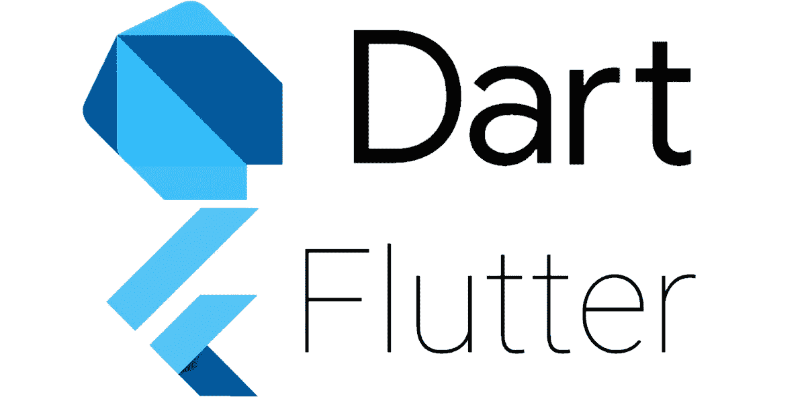
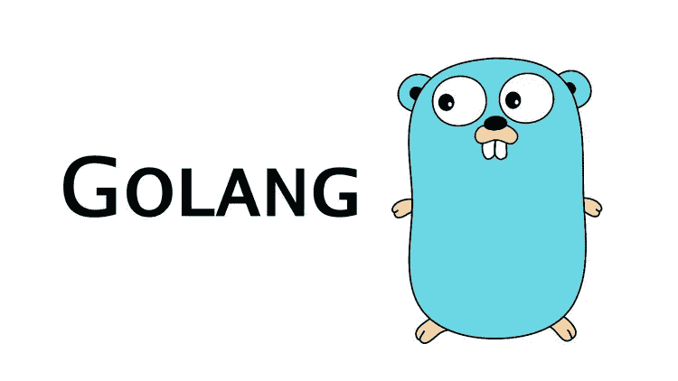
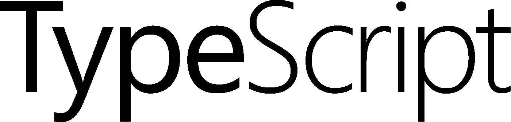

# 未来的编程语言

> 原文：<https://itnext.io/programming-languages-of-the-future-356430609de0?source=collection_archive---------0----------------------->

Python 和 JavaScript 是当今最热门的两种编程语言。然而，他们不可能永远保持领先地位。最终，它们肯定会失宠，就像所有语言一样。这可能会在未来十年左右发生。

什么语言可能会取代它们？这是我的挑战者名单…

## 镖

多亏了 Flutter 框架和 Google 的认可，这种语言迅速流行起来。这类似于让 Ruby 如此受欢迎的驱动力:Rails 框架。

如果谷歌的 Fuchsia 起飞，Dart 将成为它的中心。

## 长生不老药

Elixir 是 Erlang 的衍生产品，它改进了语法，并且同样惊人地支持并发性。作为一门纯粹的函数式语言，它很有可能将这种范式提升到主流。

## 戈朗

另一种 Google 支持的语言 Golang 已被证明是赢家，这要归功于它闪电般的编译速度、简单高效的并发性和非凡的简单性。唯一缺少的是泛型，这个特性已经在路线图上了。

## 朱莉娅

Julia 的优势在于它对数学计算的出色支持。数学友好的语法对数据科学家来说非常棒。如果有任何一种语言可以推翻 Python，这一种绝对是有力的竞争者。

## 科特林

Kotlin 是更好的 Java。事实上，它实际上是 Java 的替代产品。谷歌已经使它成为 Android 开发的一流语言。

## 法罗

Pharo 是 Smalltalk 的现代变体，是一种非常高效的面向对象语言。事实上，Smalltalk 是面向对象编程的典范*和*，它几乎启发了这个星球上的所有其他面向对象编程语言。最后，没有哪种语言比 Smalltalk 更擅长 OOP。

Pharo 也是世界上最简单、最优雅的语言之一。[你可以在 15 分钟内学会 Smalltalk 的全部语法！](https://amber-lang.net/learn.html)

## 锈

Rust 因其内存安全特性而获得认可:借用检查器。这个特性实际上消除了所有与内存相关的编程错误。Rust 承诺更安全的编程。

## 以打字打的文件

TypeScript 是 JavaScript……有好处。它主要增加了静态类型。与 JavaScript 的兼容性使它成为前端 web 开发人员的最爱，因为他们已经知道 JavaScript，他们几乎不需要改变他们的工作流程。

## web 程序集

WebAssembly 是一匹黑马。在未来十年左右的时间里，它可能会衍生出一些上升到顶端的语言。WebAssembly 只是一个编译目标，但是没有理由它不能扩展到 web 领域之外。什么样的基于 WebAssembly 的语言会成为主流？谁也说不准。