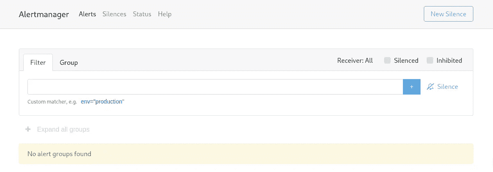
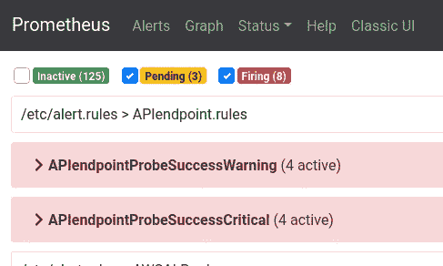
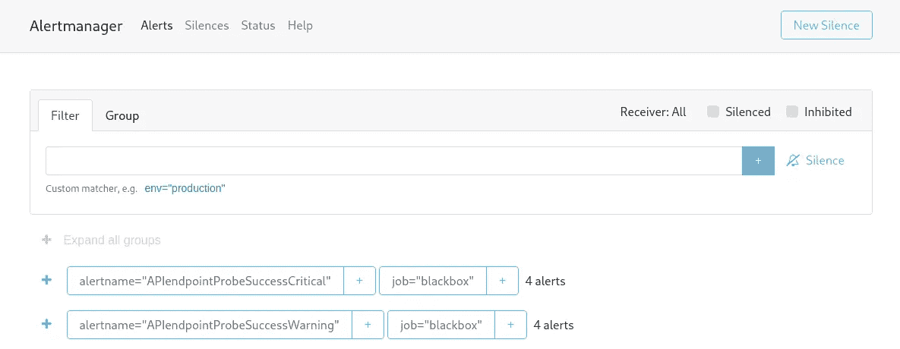
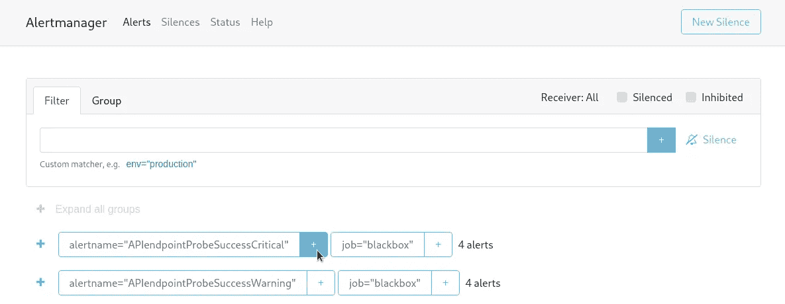
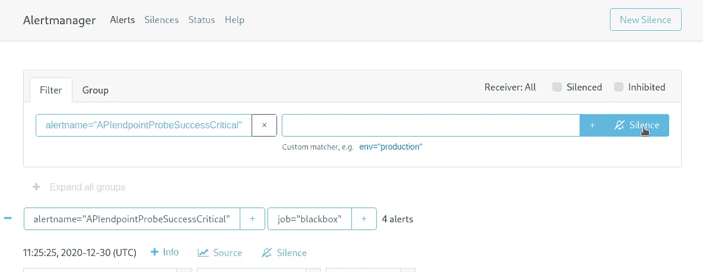
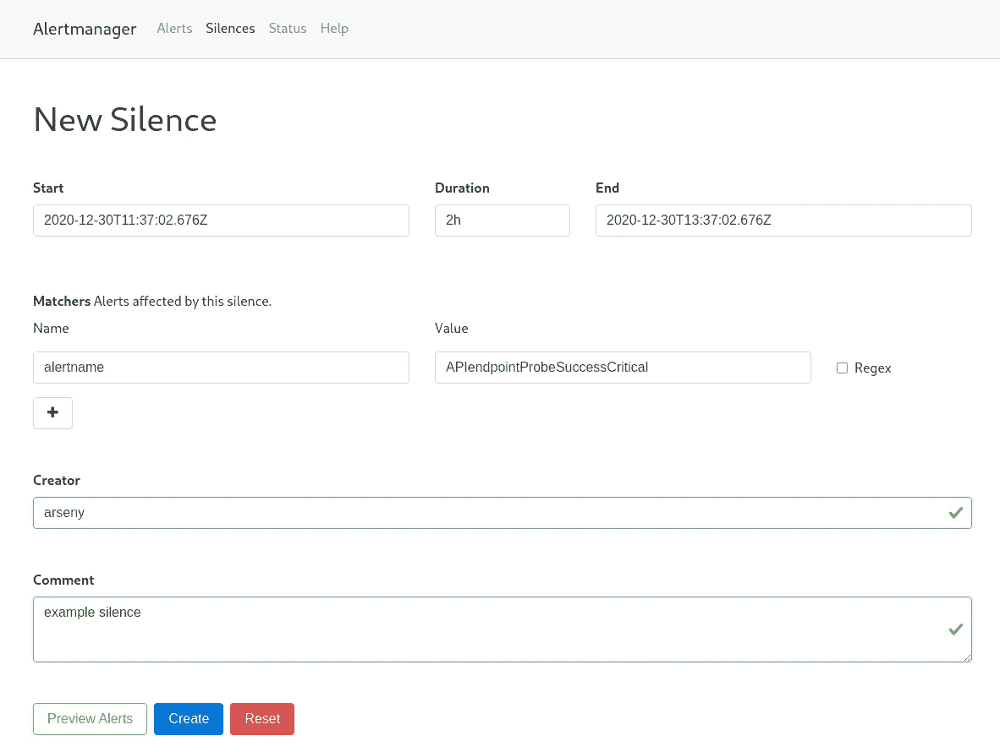
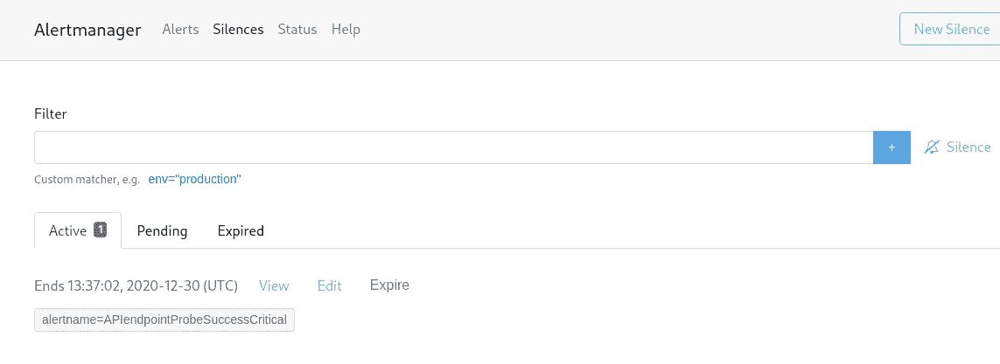

# 普罗米修斯:警报管理器网络用户界面警报沉默

> 原文：<https://itnext.io/prometheus-alertmanager-web-ui-alerts-silence-2d34fbf2d252?source=collection_archive---------0----------------------->


通过 Alertmanager 发送主动警报的频率通过`/etc/alertmanager/config.yml`文件中的`repeat_interval`进行配置。

我们将此时间间隔设置为 15 分钟，因此，我们每隔 15 分钟就会收到一次关于 Slack 中的警报的通知。

尽管如此，有些警报是这样的“已知问题”，当我们已经开始调查或修复它，但警报被重复发送到 Slack。

要静音这些警报以防止它们被反复发送，可以通过将它们标记为“*静音*”来禁用它们。

可以通过 Alertmanager 的 Web UI 使警报静音，参见[文档](https://prometheus.io/docs/alerting/latest/alertmanager/#silences)。

所以，在这篇文章中我们要做的是:

*   更新 Alertmanager 的启动选项以启用 Web UI
*   更新 NGINX 虚拟主机以访问 Alertmanager 的 Web UI
*   将检查并配置 Prometheus 服务器以发送警报
*   将添加一个测试警报来检查如何使其静音

# Alertmanager Web 用户界面配置

我们有了从 Docker Compose 文件运行的 Alertmanager，让我们向`command`字段添加两个参数——一个是为 Alertmanager Web UI 指定 URI 的`web.route-prefix`,另一个是设置完整 URL 的`web.external-url`。

这个完整的网址将看起来像*dev.monitor.example.com/alertmanager*——添加它们:

```
...
  alertmanager:
    image: prom/alertmanager:v0.21.0
    networks:
      - prometheus
    ports:
      - 9093:9093
    volumes:
      - /etc/prometheus/alertmanager_config.yml:/etc/alertmanager/config.yml
    command:
      - '--config.file=/etc/alertmanager/config.yml'
      - '--web.route-prefix=/alertmanager'
      - '--web.external-url=https://dev.monitor.example.com/alertmanager'
...
```

Alertmanager 在 Docker 容器中工作，可从监控主机通过 *localhost:9093* 访问；

```
root@monitoring-dev:/home/admin# docker ps | grep alert
24ae3babd644 prom/alertmanager:v0.21.0 “/bin/alertmanager -…” 3 seconds ago Up 1 second 0.0.0.0:9093->9093/tcp prometheus_alertmanager_1
```

在 NGINX 的 virtualhost 配置中，使用 Alertmanager 的 Docker 容器添加一个新的`upstream`:

```
...
upstream alertmanager {
    server 127.0.0.1:9093;
}
...
```

另外，在这个文件中添加一个新的`location`，它将把所有发送给*dev.monitor.example.com/alertmanager*的请求代理传递给这个`upstream`:

```
...
    location /alertmanager {

        proxy_redirect          off;            
        proxy_set_header        Host            $host;
        proxy_set_header        X-Real-IP       $remote_addr;
        proxy_set_header        X-Forwarded-For $proxy_add_x_forwarded_for;
        proxy_pass [http://alertmanager$request_uri;](http://alertmanager$request_uri;)
    }
...
```

保存并重新加载 NGINX 和 Alertmanager。

现在，打开[*https://dev.monitor.example.com/alertmanager*](https://dev.monitor.example.com/alertmanager)网址，您一定会看到 Alertmanager Web UI:



这里还没有警报—等待普罗米修斯发送新的警报。

## Prometheus:“发送警报时出错”err= "未找到错误响应状态 404 "

Prometheus 服务器中出现新警报后，您可以在日志中看到以下错误:

> caller = notifier . go:527 component = notifier alert manager = http://alert manager:9093/API/v1/alerts count = 3 msg = "发送警报时出错" err= "错误响应状态 404 未找到"

这是因为目前我们将`alertmanagers`设置为:

```
...
alerting:
  alertmanagers:
  - static_configs:
    - targets:
      - alertmanager:9093
...
```

因此，需要通过使用`[path_prefix](https://prometheus.io/docs/prometheus/latest/configuration/configuration/#alertmanager_config)`设置来添加 Alertmanager 的 URI:

```
...
alerting:
  alertmanagers:
  - path_prefix: "/alertmanager/"
    static_configs:
    - targets:
      - alertmanager:9093
...
```

重启普罗米修斯号，再次等待警报:



此时，您也必须在 Alertmanager Web UI 中看到它们:



# 警报管理器:警报沉默

现在，让我们添加一个无声提示来停止发送它们。

例如，要禁用*alert name = " apiendpointprobessuccesscritical "*的重新发送，点击右侧的`+`按钮:



然后按下*静音*按钮:



`alertname`标签被添加到沉默条件中，默认规则为 2 小时，添加作者和描述其被沉默的原因:



点击*创建* —就完成了:



您现在可以通过 API 检查此警报:

```
root@monitoring-dev:/home/admin# curl -s [http://localhost:9093/alertmanager/api/v1/alerts](http://localhost:9093/alertmanager/api/v1/alerts) | jq ‘.data[1]’
{
“labels”: {
“alertname”: “APIendpointProbeSuccessCritical”,
“instance”: “http://push.example.com",
“job”: “blackbox”,
“monitor”: “monitoring-dev”,
“severity”: “critical”
},
“annotations”: {
“description”: “Cant access API endpoint http://push.example.com!",
“summary”: “API endpoint down!”
},
“startsAt”: “2020–12–30T11:25:25.953289015Z”,
“endsAt”: “2020–12–30T11:43:25.953289015Z”,
“generatorURL”: “https://dev.monitor.example.com/prometheus/graph?g0.expr=probe_success%7Binstance%21%3D%22https%3A%2F%2Fokta.example.com%22%2Cjob%3D%22blackbox%22%7D+%21%3D+1&g0.tab=1",
“status”: {
“state”: “suppressed”,
“silencedBy”: [
“ec11c989-f66e-448e-837c-d788c1db8aa4”
],
“inhibitedBy”: null
},
“receivers”: [
“critical”
],
“fingerprint”: “01e79a8dd541cf69”
}
```

因此，该警报不会被发送到松弛时间或其他地方，因为在`"state": "suppressed"`字段:

```
…
“status”: {
“state”: “suppressed”,
“silencedBy”: [
“ec11c989-f66e-448e-837c-d788c1db8aa4”
],… 
```

完成了。

*最初发布于* [*RTFM: Linux、DevOps 和系统管理*](https://rtfm.co.ua/en/prometheus-alertmanager-web-ui-alerts-silence/) *。*