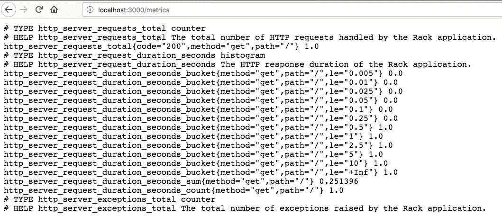
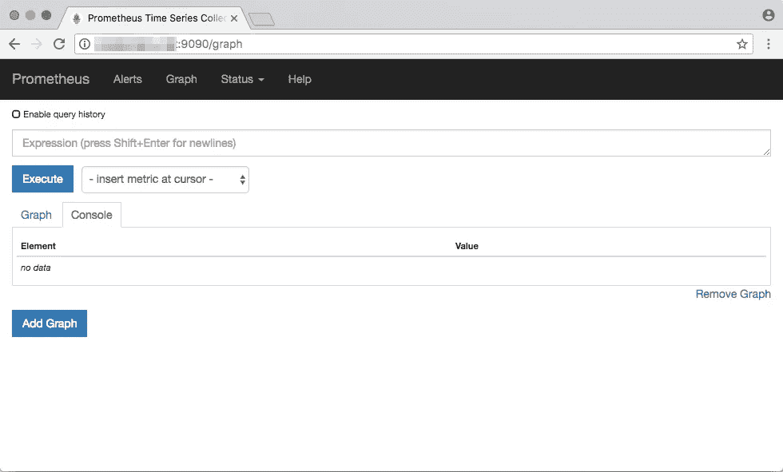

# 初学者的普罗米修斯

> 原文：<https://itnext.io/prometheus-for-beginners-5f20c2e89b6c?source=collection_archive---------0----------------------->

几个月前，我和 Kubernetes 开始了我的发现之旅；非常强大的 DevOps 平台/技术。当我开始深入研究 Kubernetes 如何工作以及如何最好地利用它时，我开始看到“普罗米修斯”这个词在博客上频繁出现。这个“普罗米修斯”是什么？为什么对它大肆宣传？

在这篇博文中，我想给你一个完整的初学者指南，告诉你什么是普罗米修斯，它能做什么，以及如何使用它。在这篇博文中，我不会深究“如何安装普罗米修斯”。相反，我将解释这个平台是如何工作的，你如何使用它，以及它能给你和你的团队带来的好处。

如果你很匆忙(让我们面对现实吧，这些天谁不是这样)，那么请滚动到这个博客的底部，阅读我的“TL；DR；总结”。它以一种简单易懂的格式包含了我在这里介绍的所有内容，只需要花一分钟的时间来阅读。

# 普罗米修斯是什么？

好的，所以在希腊神话中，普罗米修斯是一个不死的泰坦，他违抗诸神的意志，窃取火种并赐予人类；从而创造了文明。

> ***“好吧，酷故事老弟，这跟软件有什么关系？”***

嗯…很像希腊神话中的普罗米修斯(这篇博文的主题)是一个开源的监控系统；旨在让我们了解我们的应用程序和系统是如何运行的。

普罗米修斯最初是由 [SoundCloud](https://en.wikipedia.org/wiki/SoundCloud) 在 2012 年创建的，当时他们认为当前的监控平台不足以满足他们的用例。然而，直到 2016 年，普罗米修斯 v1 的第一版才面向全球发布。

如今，普罗米修斯被认为是云本地计算基金会的成员项目。

> ***“太好了，我现在知道希腊神话和普罗米修斯是怎么开始的；但这是什么？”***

**Prometheus 本质上只是另一个指标收集和分析工具，**其核心由 3 个组件组成:

*   一个 [**时间序列数据库**](https://en.wikipedia.org/wiki/Time_series) ，它将存储我们所有的度量数据
*   一个**数据检索工作器**，负责**从外部来源提取/抓取**指标并**将它们**推入数据库
*   一个网络服务器，提供一个简单的网络接口**用于配置和查询存储的数据。**

如果你和我一样喜欢可视化系统架构，这里有一个图表来帮助解释普罗米修斯架构:

普罗米修斯的建筑及其组成部分([https://prometheus.io/docs/introduction/overview/](https://prometheus.io/docs/introduction/overview/))

## 上图中的几点注意事项

*   **PromQL** —用于从 Prometheus 检索指标的查询语言。我计划将来写一篇详细的博客，向您展示如何使用 Grafana 的度量数据来构建一些强大的仪表板。
*   **警报管理器**—允许我们根据 Prometheus 采样的指标定义警报(例如内存/cpu 使用率过高或请求持续时间出现峰值)
*   **Pushgateway** —为应用和服务提供一种将指标推入 Prometheus 的机制，而不是标准的拉取机制。
*   **服务发现** —Prometheus 在首次设置时只需要很少的配置，并且从头开始设计为在 Kubernetes 等动态环境中运行。因此，它会自动发现正在运行的服务，并尝试对它应该监视的内容做出“最佳猜测”。

# 是什么让普罗米修斯如此与众不同？

在我们继续之前，我想在这里暂停一下，并指出我认为 Prometheus 与您可能已经熟悉的其他监控解决方案之间的一个关键区别:

*   大多数监控系统(Amazon CloudWatch、ApplicationInsights、NewRelic 等。)使用“推动”机制—应用程序/服务器等。(*客户端*)负责将其指标数据推送到集中收集平台(*服务器*)。
*   普罗米修斯颠倒了这个模型；取而代之的是依赖于提供简单 HTTP 端点的应用程序/服务器(目标),其数据检索人员可以从中提取/抓取数据。

# 但我为什么要在乎呢？

简而言之，这种新模式为我们提供了众多优势:

1.  Prometheus 不要求我们在物理服务器上安装任何定制软件或配置，甚至不要求我们在容器映像中安装任何定制软件或配置来收集指标。
2.  Prometheus 不要求我们的应用程序使用 CPU 周期将指标推送到某个集中的收集器。
3.  Prometheus 为我们提供了集中的配置和管理控制台，使我们能够看到数据是何时从每个单独的目标上收集的。
4.  Prometheus 优雅地处理服务故障/不可用。如果目标应用程序宕机，Prometheus 可以记录它无法检索数据。与“推”机制系统相反，我们经常不确定为什么我们没有接收到数据。数据在传输过程中丢失了吗？我们的服务死了吗？谁知道呢。
5.  普罗米修斯利用了一个时间序列数据库，这意味着我们不必有成千上万的个人指标记录；取而代之的是**我们定期拍摄指标的快照，然后测量这些快照之间有多少变化**。这减少了我们度量平台上的网络流量和开销。
6.  对于“拉取”指标不可行的情况(例如:寿命短的作业不会长到被废弃)，Prometheus 提供了一个 Pushgateway，允许应用程序在需要时仍可以推送指标数据。本质上给了我们两个世界最好的东西😃

哦，是的…真的有那么好

# 普罗米修斯度量标准是什么样的？

Prometheus 为其指标定义了一个非常好的基于文本的格式:

普罗米修斯公制格式示例

从上面的例子中可以看出，数据相对来说是人类可读的，我们甚至有`TYPE`和`HELP`装饰器来增加可读性。

该示例显示了 3 个不同的度量标准(`http_server_requests_total`、`http_server_request_duration_seconds`和`http_server_exceptions_total`)，每个都有自己的类型，负责监控应用程序的特定方面。

## 关于该示例，需要注意一些事项:

*   为了简单起见，普罗米修斯的度量类型非常有限。事实上，目前只提供了 3 种类型；这些是`**counter**`、`**gauge**`和`**histogram**`、**、**(稍后将详细介绍这些类型)
*   `TYPE`和`HELP`属性帮助我们为输出中的每个指标提供用户友好的提示。
*   Prometheus 在度量类型中有“**标签**”的概念(将这些视为可以应用于度量以帮助我们的额外维度)。
*   标签使用`{}`语法显示，可以在`**http_server_requests_total**`指标上看到。
*   普罗米修斯[规定了度量](https://prometheus.io/docs/practices/naming/#metric-names)和[的命名约定，以及每种类型使用的具体测量单位](https://prometheus.io/docs/practices/naming/#base-units)。

# **普罗米修斯公制类型**

在撰写本文时，Prometheus 目前只支持三种类型的度量。这些是:

*   **计数器** —简单的[单调递增](https://en.wikipedia.org/wiki/Monotonic_function)型；基本上在你想知道“x 发生了多少次”的情况下使用这个。
*   **标尺** —一种既可以上升也可以下降的度量表示。想想汽车里的速度计，这种类型提供了“x 现在的当前值是多少”的快照。
*   **直方图** —好的，这是一个复杂的直方图，它代表了划分到不同桶中的观察到的指标。可以把这看作是一种跟踪“事情花了多长时间”或“事情有多大”的机制。

## 关于直方图的一个非常重要的注释

好吧，这确实花了我一段时间才弄明白，基本上直方图度量桶是累积的。为了更好地解释这一点，我将分解上例中显示的直方图指标:

*   直方图类型不仅提供分片`_bucket`度量，还提供`_sum`和`_count`度量。
*   在我们的例子中，我们的应用程序只有 1 个请求(因为`_count`显示 1)
*   在我们的例子中，1 请求花了 0.251396 秒完成(因为`_sum`值告诉我们所有请求的总时间)
*   请求已经分成 6 个时间段(因为记得我说过时间段是累积的)。类型上的每个桶代表一个“小于或等于”的时间片，用标签`{le="<time in seconds>"}`表示。

> 该请求花费了 0.251396 秒，因此被计入值大于 0.251396 的所有存储桶中。但是如果在我们的请求中花费了 0.004 秒= >小于 0.005 秒(可用的最小存储桶)，那么每个时间存储桶将显示计数 1。

*   有一个特殊的桶`{le="+Inf"}`,它是一个 *catch all* ,用于比定义的最大桶花费更多时间的请求(在我们的例子中是 10 秒)

# 用公制标签简化事物

如前所述，Prometheus metrics 支持标签概念，为您的数据提供额外的维度。通过有效地使用标签，我们可以从本质上提供对数据的更多洞察，同时管理更少的实际指标。

## **示例场景:**

> 我们希望跟踪应用程序中发生的异常数量。

## 我们该如何解决这个问题？

> 我们可以在代码的每个区域设置一个计数器度量值(`area_x_error_count`)，并在错误发生时递增。这很好，但是有以下缺点:
> 
> 每当我们向代码中添加一个新的区域时，我们必须记住创建一个新的度量标准。
> 
> 我们的指标端点因不同的指标名称而变得非常臃肿。
> 
> 当我们开始查询数据时，编写多个查询来将所有这些错误关联在一起会变得非常笨拙。

## **使用标签的替代解决方案**

> 我们为整个应用程序定义了一个度量标准，并应用标签来表示代码的面积`application_error_count{area="x"}`
> 
> 现在我们不需要在每次添加代码时都记得创建一个新的度量标准
> 
> 我们的指标端点将显示更少的不同指标，数据将仅在应用标签时作为一个分片。
> 
> 我们的衡量标准被合并为一个关键值；这允许我们使用强大的 PromQL 语言创建复杂的图形来表示我们的应用程序是如何运行的。

# 好了，我的数据被删除了…现在怎么办？

一旦你的度量数据进入普罗米修斯，世界就是你的了。Prometheus 提供了自己的用户界面，允许您查询、查看和绘制数据:

普罗米修斯网络界面——在其所有的荣耀中

Prometheus 使用自己的查询语言 PromQL。一种非常强大的语言，它利用直方图等度量类型的力量，为我们提供了一些非常有趣的报告功能。

我不打算在这里深入讨论如何编写查询(因为这是一个初学者的博客)，但如果你有兴趣了解更多，那么[Prometheus 网站确实有一些非常有用的笔记，关于如何开始使用 PromQL 的基础](https://prometheus.io/docs/prometheus/latest/querying/basics/)。

然而，Prometheus 的真正强大之处在于能够将其连接到 Grafana 等强大的仪表板工具和 PagerDuty 等警报系统，为您提供完整的 DevOps 监控解决方案。

我将来还会写一篇博文，关于将 Prometheus 连接到 Grafana 以构建公制仪表板，在那里我会深入了解 PromQL 的更多细节以及如何充分利用您的数据。

# TL；DR；摘要

所以，是的，如果你很忙，不想花时间阅读我的整篇文章，那么这里有一些非常简单的建议:

*   Prometheus 是收集和查询度量数据的一个非常强大的工具。
*   Prometheus 通过应用程序/服务上的 http 端点定期从我们的应用程序中提取/抓取指标。
*   每次 Prometheus 抓取指标时，它都会在 Prometheus 数据库中记录指标数据的快照。
*   使用 PromQL 查询和 Prometheus web UI 或 Grafana 等其他工具，我们可以查询/分析指标数据快照之间的差异，以模拟/表示数据如何随时间变化。
*   使用较少的不同指标名称，但是通过使用标签来确定指标的维度(相信我，您会感谢我的这个技巧)。
*   您只能使用 3 种度量类型(计数器、仪表和直方图)；因此，请为工作使用正确的度量类型。
*   计数器只是递增，并计算某件事发生了多少次。
*   仪表用于跟踪可能上下波动的值，就像汽车上的速度计一样。
*   直方图用于将指标数据分成观察到的桶。
*   直方图是累积的，是最难阅读的度量类型。
*   在命名您的指标时，确保您[遵循普罗米修斯指南。](https://prometheus.io/docs/practices/naming/)
*   确保你[遵循普罗米修斯指导方针，使用正确的度量单位](https://prometheus.io/docs/practices/naming/#base-units)(例如测量时间时总是使用秒)

# 结束语

普罗米修斯是一个令人惊讶的强大的监控系统，从头开始设计，以支持和工作的动态环境；就像库伯内特公司制造的那样。但是，尽管 Prometheus“核心平台”本质上运行在 Kubernetes 上，但非常重要的是要认识到，任何应用程序/基础设施都可以通过暴露一个 web 端点来监控，该端点以 Prometheus 兼容的文本格式提供指标数据。

如今，太多的团队认为监控和性能是事后的想法。老实说，我已经数不清自己加入了多少个团队，并问自己“这东西表现如何？”或者“我们应用的平均响应时间是多少？”结果却是一脸茫然，耸耸肩，表示“我们完全不知道”。

现在再也没有任何借口了。说“哦，我们无法访问日志”或“我们没有时间设置监控”的日子已经一去不复返了，因为如果您的团队正在使用 Kubernetes(老实说，如果您没有，您可能正在拼命尝试迁移到它)，那么 Prometheus 会为您做很多繁重的工作。

一个完整的度量世界正等着你去探索

# 进一步阅读

*   [普罗米修斯第一步](https://prometheus.io/docs/introduction/first_steps/)——从搭建平台的人开始；没有比这更好的开始了
*   健壮感知博客——学习普罗米修斯和 PromQL 技巧和窍门的好地方
*   [Roald Nefs Awesome-Prometheus Github Repo](https://github.com/roaldnefs/awesome-prometheus)——Prometheus 的圣杯资源链接(帮你自己一个忙，将此页设为书签)
*   [普罗米修斯:设计和哲学](https://www.youtube.com/watch?v=QgJbxCWRZ1s&feature=youtu.be)——为什么它是这样的——一个非常有见地的视频，它为什么由建造它的人建造。