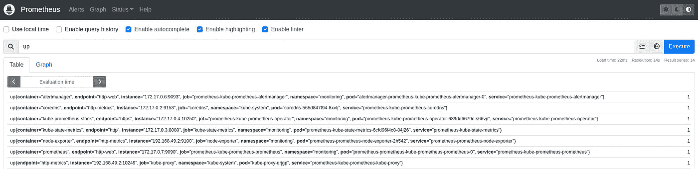
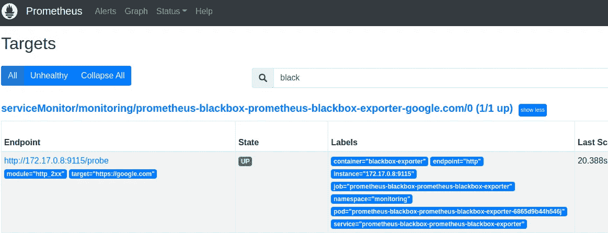
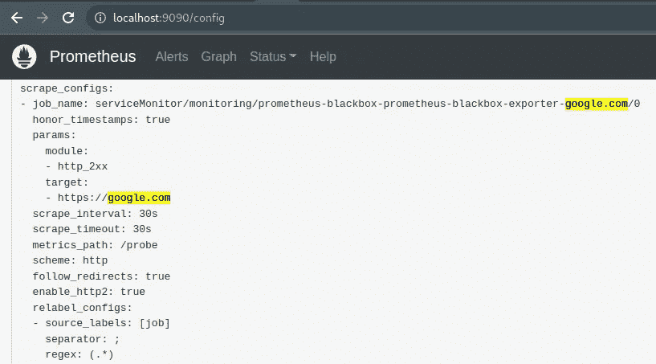
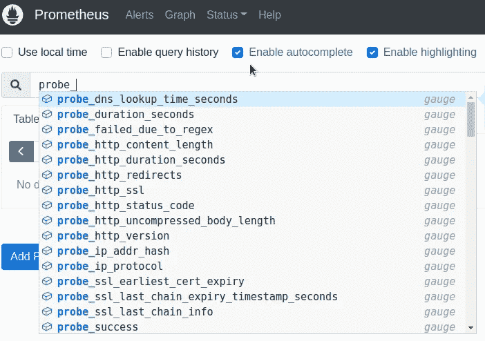
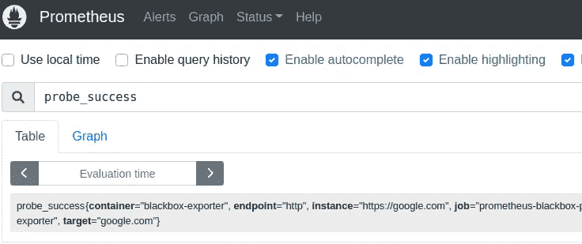
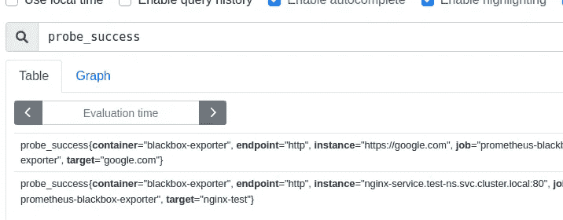
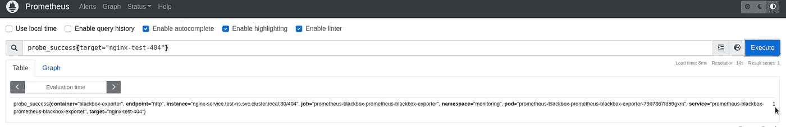
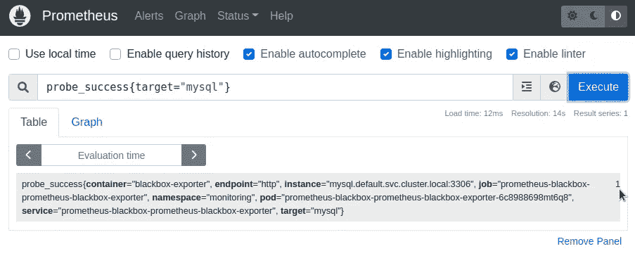
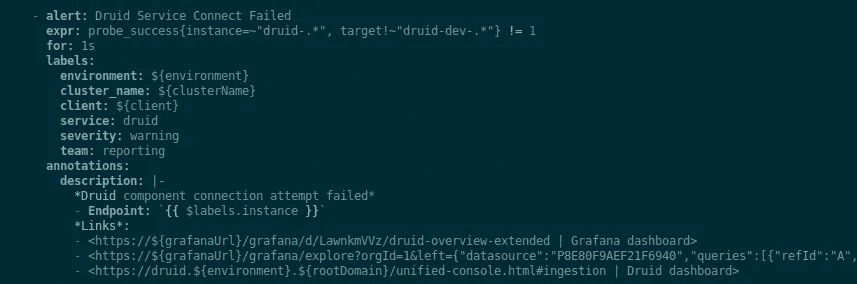

# Prometheus: Kubernetes 使用黑盒导出器进行端点监控

> 原文：<https://itnext.io/prometheus-kubernetes-endpoints-monitoring-with-blackbox-exporter-a027ae136b8d?source=collection_archive---------3----------------------->


blackbox-exporter 是一个可以监控各种端点的导出器——互联网上的 URL、AWS 中的负载平衡器或 Kubernetes 集群中的服务，如 MySQL 或 PostgreSQL 数据库。

Blackbox Exporter 可以给你 HTTP 响应时间统计、响应代码、SSL 证书信息等。

在这篇文章中我们要做什么:

*   在 Helm 的帮助下，将在 [Minikube](https://minikube.sigs.k8s.io/docs/start/) 中部署 [kube-prometheus-stack](https://github.com/prometheus-community/helm-charts/tree/main/charts/kube-prometheus-stack)
*   部署黑盒导出器本身
*   使用 Kubernetes ServiceMonitors 配置端点监控，这将通过[黑盒导出器配置](https://github.com/prometheus/blackbox_exporter)创建
*   将简要概述用于轮询端点的 Blacbkox' `probes`

我们走吧。

# 运行 Kube Prometheus 堆栈

我们将在 Minikube 中完成这个设置，在那里我们将从舵库安装 Prometheus 操作器。

启动迷你立方体本身:

```
$ minikube start
```

添加普罗米修斯图表库:

```
$ helm repo add prometheus-community https://prometheus-community.github.io/helm-charts
helm repo update
```

创建名称空间:

```
$ kubectl create ns monitoring
```

安装`kube-prometheus-stack`图表:

```
$ helm -n monitoring install prometheus prometheus-community/kube-prometheus-stack
```

等待几分钟，直到所有的 pod 变为*运行*:

```
$ kubectl -n monitoring get pod
NAME READY STATUS RESTARTS AGE
alertmanager-prometheus-kube-prometheus-alertmanager-0 1/2 Running 1 (25s ago) 44s
prometheus-grafana-599dbccb79-zlklx 2/3 Running 0 57s
prometheus-kube-prometheus-operator-689dd6679c-s66vp 1/1 Running 0 57s
prometheus-kube-state-metrics-6cfd96f4c8–84j26 1/1 Running 0 57s
prometheus-prometheus-kube-prometheus-prometheus-0 0/2 PodInitializing 0 44s
prometheus-prometheus-node-exporter-2h542 1/1 Running 0 57s
```

查找普罗米修斯服务:

```
$ kubectl -n monitoring get svc
NAME TYPE CLUSTER-IP EXTERNAL-IP PORT(S) AGE
alertmanager-operated ClusterIP None <none> 9093/TCP,9094/TCP,9094/UDP 7s
prometheus-grafana ClusterIP 10.97.79.182 <none> 80/TCP 20s
prometheus-kube-prometheus-alertmanager ClusterIP 10.106.147.39 <none> 9093/TCP 20s
prometheus-kube-prometheus-operator ClusterIP 10.98.222.45 <none> 443/TCP 20s
prometheus-kube-prometheus-prometheus ClusterIP 10.107.26.113 <none> 9090/TCP 20s
…
```

使用`port-forward`打开对服务的访问:

```
$ kubectl -n monitoring port-forward svc/prometheus-kube-prometheus-prometheus 9090:9090
```

打开[*http://localhost:9090*，](http://localhost:9090,)检查是否一切正常:



# 运行黑盒导出器

它的图表存在于同一个存储库中，所以只需安装导出器:

赫尔姆-n 监控升级—安装普罗米修斯-黑盒普罗米修斯-社区/普罗米修斯-黑盒-导出器

检查吊舱:

```
$ kubectl -n monitoring get pod
NAME READY STATUS RESTARTS AGE
prometheus-blackbox-prometheus-blackbox-exporter-6865d9b44h546j 1/1 Running 0 27s
…
```

Blackbox 将其配置保存在 ConfigMap 中，config map 连接到 Pod 并传递默认参数。更多[见此处> > >](https://github.com/prometheus-community/helm-charts/blob/main/charts/prometheus-blackbox-exporter/values.yaml#L120) 。

```
kubectl -n monitoring get cm prometheus-blackbox-prometheus-blackbox-exporter -o yaml
apiVersion: v1
data:
blackbox.yaml: |
modules:
http_2xx:
http:
follow_redirects: true
preferred_ip_protocol: ip4
valid_http_versions:
- HTTP/1.1
- HTTP/2.0
prober: http
timeout: 5s
```

实际上，在这里我们可以看到模块，到目前为止只有一个，它使用`http`探测器向`targets`发出 HTTP 请求，这仍然需要添加。

## 黑盒和服务监视器

为了添加我们想要监控的端点，我们可以使用 ServiceMonitor，请参见此处的配置[>>>](https://github.com/prometheus-community/helm-charts/blob/main/charts/prometheus-blackbox-exporter/values.yaml#L215)。

出于某种原因，这一时刻在 googled 指南中没有得到真正的描述，尽管它非常有用和简单:我们向 Blackbox 配置添加一个目标列表，Blackbox 为每个目标创建一个 ServiceMonitor，Prometheus 开始监视它们。

现在创建一个只有一个端点的文件`blackbox-exporter-values.yaml`——只是为了检查它是否在工作:

```
serviceMonitor:
  enabled: true
  defaults:
    labels:
      release: prometheus
  targets:
    - name: google.com
      url: [https://google.com](https://google.com)
```

如果没有另外指定，Blackbox 使用图表中`values.yaml`的默认值作为[，在这种情况下，将由](https://github.com/prometheus-community/helm-charts/blob/main/charts/prometheus-blackbox-exporter/values.yaml#L233)`[http_2xx](https://translate.google.com/website?sl=uk&tl=en&hl=en&client=webapp&u=https://github.com/prometheus-community/helm-charts/blob/main/charts/prometheus-blackbox-exporter/values.yaml%23L121)`模块执行`GET`请求并检查响应代码:如果收到 200，则检查通过，如果收到另一个，则检查失败。

用新配置更新 Helm 版本:

```
$ helm -n monitoring upgrade — install prometheus-blackbox prometheus-community/prometheus-blackbox-exporter -f blackbox-exporter-values.yaml
```

检查 ServiceMonitor 是否已创建:

```
kubectl -n monitoring get servicemonitor
NAME AGE
prometheus-blackbox-prometheus-blackbox-exporter-google.com 4m43s
```

检查普罗米修斯目标:



对于我们在黑盒配置中指定的每个目标，都会在 Prometheus 中添加一个单独的抓取作业:



并检查黑盒指标:



我个人使用的主要度量标准是`probe_success`，它实际上告诉我们检查是否通过:



这里，在`target`标签中，`metricRelabelings`从黑盒配置的`target`的`name`字段中设置一个值，`instance`标签具有 URL。

## 内部端点监控

太好了——我们去了谷歌，它甚至可以工作。

如何检查集群中的端点？

让我们以 Kubernetes 文档中的 nginx 为例，只是将它的 Pod 和服务部署到我们自己的名称空间，而不是`default`。

创建名称空间:

```
$ kubectl create ns test-ns
namespace/test-ns created
```

使用 Pod 和服务创建一个清单，添加您的`namespace`:

```
apiVersion: v1
kind: Pod
metadata:
  name: nginx
  namespace: test-ns
  labels:
    app.kubernetes.io/name: proxy
spec:
  containers:
  - name: nginx
    image: nginx:stable
    ports:
      - containerPort: 80
        name: http-web-svc
---
apiVersion: v1
kind: Service
metadata:
  name: nginx-service
  namespace: test-ns
spec:
  selector:
    app.kubernetes.io/name: proxy
  ports:
  - name: name-of-service-port
    protocol: TCP
    port: 80
    targetPort: http-web-svc
```

部署它:

```
$ kubectl apply -f testpod-with-svc.yaml
pod/nginx created
service/nginx-service created
```

查看资源:

```
% kubectl -n test-ns get all
NAME READY STATUS RESTARTS AGE
pod/nginx 1/1 Running 0 23s
NAME TYPE CLUSTER-IP EXTERNAL-IP PORT(S) AGE
service/nginx-service ClusterIP 10.106.58.247 <none> 80/TCP 23s
```

更新黑盒配置:

```
serviceMonitor:
  enabled: true
  defaults:
    labels:
      release: prometheus
  targets:
    - name: google.com
      url: [https://google.com](https://google.com)
    - name: nginx-test
      url: nginx-service.test-ns.svc.cluster.local:80
```

更新头盔版本:

```
$ helm -n monitoring upgrade — install prometheus-blackbox prometheus-community/prometheus-blackbox-exporter -f blackbox-exporter-values.yaml
```

再次检查服务监视器:

```
$ kubectl -n monitoring get servicemonitor
NAME AGE
prometheus-blackbox-prometheus-blackbox-exporter-google.com 12m
prometheus-blackbox-prometheus-blackbox-exporter-nginx-test 5s
```

一会儿我们可以检查一下`probe_success`:



一般来说，没有必要以`nginx-service.test-ns.svc.cluster.local`的形式指定完整的 URL——像 *servicename.namespace* 那样设置就足够了，也就是说`nginx-service.test-ns`，但是完整的 URL，在我看来，在标签和提醒中看起来更有用。

## 黑盒导出器模块

一切看起来都很好，直到我们轮询一个总是返回 200 代码的公共 HTTP 端点。

但是我们如何检查其他 HTTP 代码呢？

让我们使用黑盒探针创建自己的模块:

```
config:
  modules:
    http_4xx:
      prober: http
      timeout: 5s
      http:
        method: GET
        valid_status_codes: [404, 405]
        valid_http_versions: ["HTTP/1.1", "HTTP/2.0"]
        follow_redirects: true
        preferred_ip_protocol: "ip4"
serviceMonitor:
  enabled: true
  defaults:
    labels:
      release: prometheus
  targets:
    - name: google.com
      url: [https://google.com](https://google.com)
    - name: nginx-test
      url: nginx-service.test-ns.svc.cluster.local:80
    - name: nginx-test-404
      url: nginx-service.test-ns.svc.cluster.local:80/404
      module: http_4xx
```

在这里的`modules`中，我们指定新模块的名称- *http_4xx* ，它应该使用哪个探测器-`http`，以及这个探测器的参数-使用哪种请求，以及我们认为正确的响应代码。

接下来，在 *nginx-test-404 的目标中，*我们明确指定了模块`http_4xx`的使用。

## 模块测试

让我们看看如何检查模块是否如我们预期的那样工作。

一切都很简单:运行一个测试盒，使用带有`-I`选项的`curl`来检查端点的响应。

对于 TCP 连接，您可以使用`telnet`。

因此，用 Ubuntu 创建一个 Pod，并通过运行`bash`连接到它:

```
$ kubectl -n monitoring run pod — rm -i — tty — image ubuntu — bash
```

安装`curl`和`telnet`:

```
root@pod:/# apt update && apt -y install curl telnet
```

并检查*nginx-service.test-ns.svc.cluster.local:80/404*是否工作，以及它将返回哪个响应代码:

```
root@pod:/# curl -I nginx-service.test-ns.svc.cluster.local:80/404
HTTP/1.1 404 Not Found
404 — as we expected.
```

用新配置更新黑盒:

```
$ helm -n monitoring upgrade — install prometheus-blackbox prometheus-community/prometheus-blackbox-exporter -f blackbox-exporter-values.yaml
```

让我们检查它的配置图—我们在配置文件中指定的模块`http_4xx`是否已被添加:

```
$ kubectl -n monitoring get cm prometheus-blackbox-prometheus-blackbox-exporter -o yaml
apiVersion: v1
data:
blackbox.yaml: |
modules:
http_2xx:
http:
follow_redirects: true
preferred_ip_protocol: ip4
valid_http_versions:
- HTTP/1.1
- HTTP/2.0
prober: http
timeout: 5s
http_4xx:
http:
follow_redirects: true
method: GET
preferred_ip_protocol: ip4
valid_http_versions:
- HTTP/1.1
- HTTP/2.0
valid_status_codes:
- 404
- 405
prober: http
timeout: 5s
```

并在普罗米修斯中检查结果:



`probe_success{target="nginx-test-404"} == 1`——“管用！”(三)

## TCP 连接和数据库服务器监控

我们经常使用的另一个模块是 TCP，它只是试图打开一个到指定 URL 和端口的 TCP 连接。适用于检查数据库和任何其他非 HTTP 资源。

让我们启动一个 MySQL 服务器:

```
$ helm repo add bitnami https://charts.bitnami.com/bitnami
helm install mysql bitnami/mysql
```

找到它的服务:

```
$ kubectl get svc
NAME TYPE CLUSTER-IP EXTERNAL-IP PORT(S) AGE
kubernetes ClusterIP 10.96.0.1 <none> 443/TCP 20h
mysql ClusterIP 10.99.71.124 <none> 3306/TCP 40s
mysql-headless ClusterIP None <none> 3306/TCP 40s
```

更新黑盒配置:

```
config:
  modules:
    ...
    tcp_connect:
      prober: tcp
serviceMonitor:
  ...
  targets:
    ...
    - name: mysql
      url: mysql.default.svc.cluster.local:3306
      module: tcp_connect
```

部署和检查:



## 普罗米修斯警报

关于警报没有什么特别要写的—一切都像任何其他普罗米修斯警报一样是标准的。

例如，我们用下面的警报监视 [Apache Druid](https://rtfm.co.ua/en/apache-druid-overview-running-in-kubernetes-and-monitoring-with-prometheus/) 服务(来自一个带有一些变量的 Terraform 配置的屏幕):



只要检查一下`probe_success != 1`。

# 有用的链接

*   [黑盒导出器探针](https://lyz-code.github.io/blue-book/devops/prometheus/blackbox_exporter/#blackbox-exporter-probes) —更多探针示例

*最初发布于* [*RTFM: Linux、DevOps、系统管理*](https://rtfm.co.ua/en/prometheus-kubernetes-endpoints-monitoring-with-blackbox-exporter/) *。*