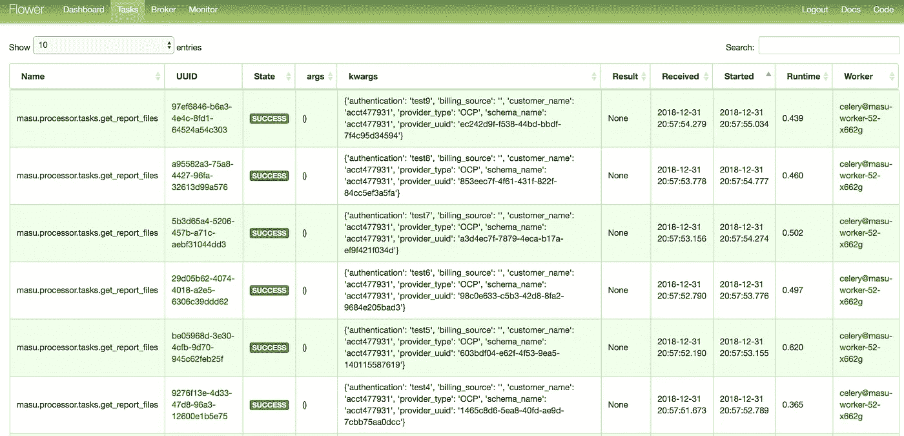
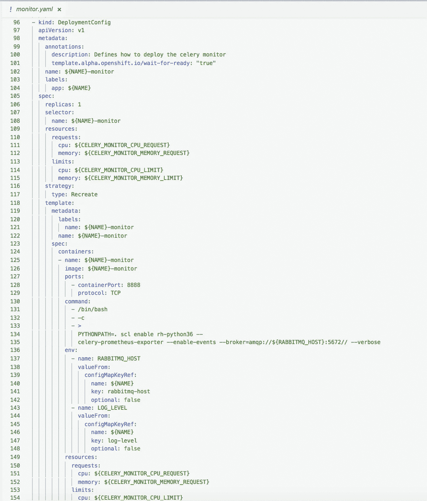
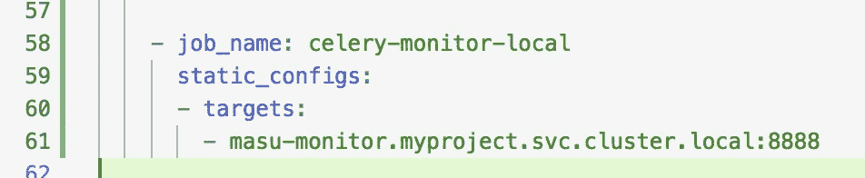
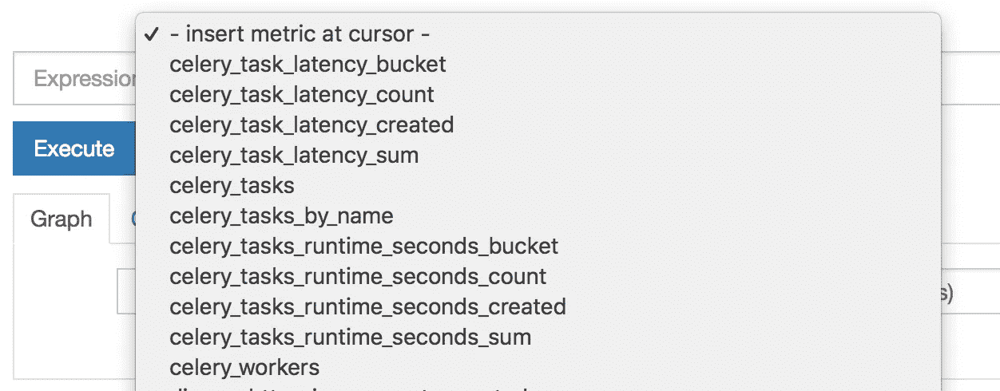
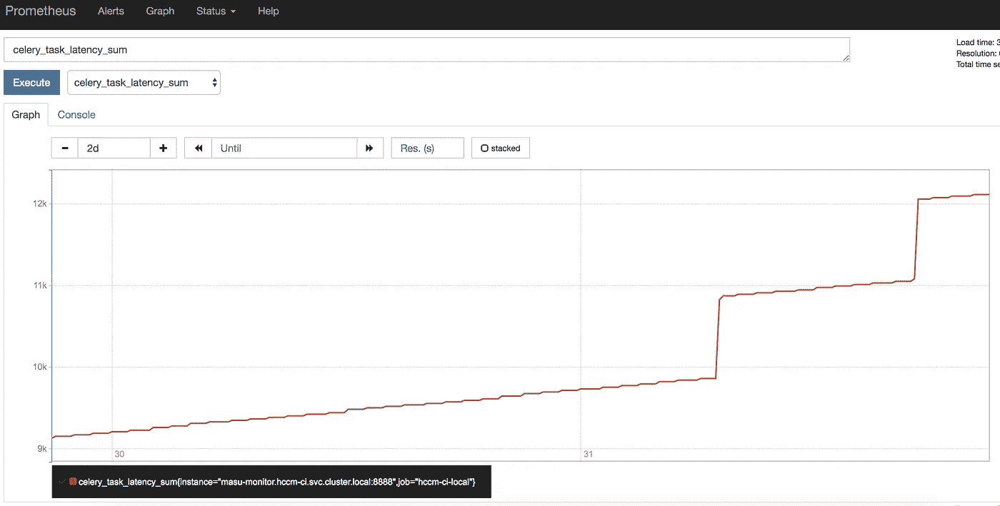
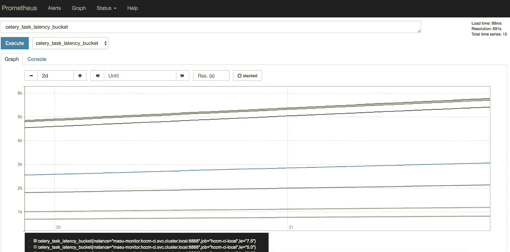
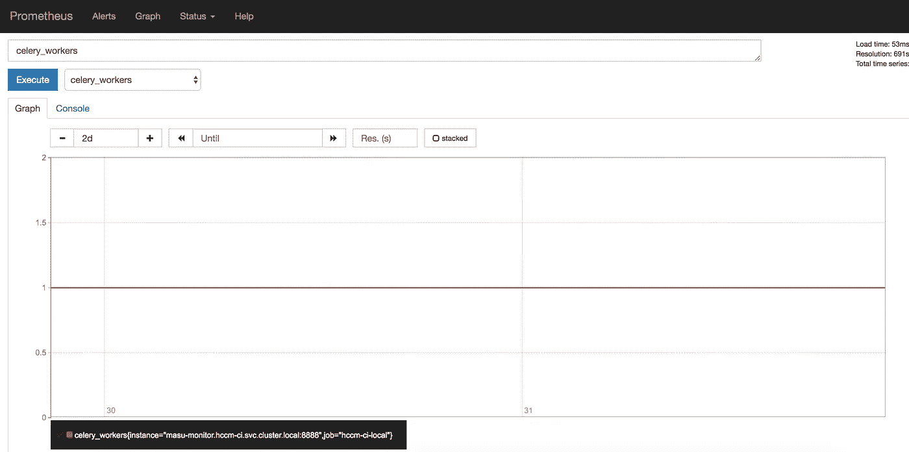
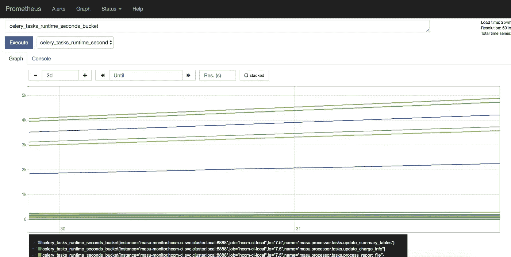

# 芹菜工人的普罗米修斯监测

> 原文：<https://itnext.io/prometheus-monitoring-for-celery-workers-655d089dbd59?source=collection_archive---------0----------------------->

克里斯·利维拉尼在 [Unsplash](https://unsplash.com?utm_source=medium&utm_medium=referral) 上的照片

随着作为一种语言的 Python 在[的流行和作为领先的云原生平台的](https://www.economist.com/graphic-detail/2018/07/26/python-is-becoming-the-worlds-most-popular-coding-language) [Kubernetes 的崛起，你可能很快就会发现自己处于两者的交汇点。在](https://www.computerweekly.com/blog/Ahead-in-the-Clouds/Kubecon-2018-The-rise-and-rise-of-Kubernetes) [Kubernetes](https://kubernetes.io/) 上开发生产级应用程序意味着使用 [Prometheus](https://prometheus.io/) 进行监控和指标收集。 *Prometheus* 是 *Kubernetes* 的监控和警报组件，被运营部门高度利用。

[Python](https://www.python.org/) 提供了一个很棒的库来集成*普罗米修斯*、[普罗米修斯 _ 客户端](https://github.com/prometheus/client_python)。prometheus_client 库提供了基本的度量组件，如计数器、计量器、摘要等。并将该数据存储在集合注册表中。除了这种流行的框架之外，像[Flask](http://flask.pocoo.org/)&[Django](https://www.djangoproject.com/)都提供了扩展([Prometheus-Flask-exporter](https://github.com/rycus86/prometheus_flask_exporter)， [django-prometheus](https://github.com/korfuri/django-prometheus) )，这些扩展构建在客户端之上，以创建开箱即用的有用的预定义指标。

虽然这些模块非常适合 REST API 监控，但您可能会发现自己需要工作进程来执行异步任务，这些任务可以通过触发器启动，无论是 REST、通过消息队列的消息还是预定的心跳。最流行的 python 分布式任务处理实现是[芹菜](http://www.celeryproject.org/)。

# 用一个简单的库监控芹菜

开源再次为监控芹菜提供了一个解决方案。如果你在你的书架上使用*芹菜*有一段时间了，你可能对[花卉](https://flower.readthedocs.io/en/latest/)很熟悉。 *Flower* 是一个针对 *Celery* 的监控应用程序，它提供了一个图形用户界面(GUI ),用于查看计数、趋势和深入负责工人操作的任务/消息。

监测芹菜开花期的任务

*Flower* 是一个很好的调试工具，但是它没有提供警报机制，也没有与 *Prometheus* 集成，从操作的角度来看，这有助于将应用程序的这一部分与其他组件结合起来。幸运的是，芹菜导出器[celery-Prometheus-exporter](https://github.com/zerok/celery-prometheus-exporter)已经存在，它提供了 *Flower* 的许多特性，但是允许与 *Prometheus* 进行理想的集成，以便在应用程序的其余部分的上下文中显示指标。

# 在 OpenShift 上部署芹菜出口商

现在我们有了图书馆，让我们把它建起来并运行起来。用于导出器的 Github 存储库确实提供了一个示例 [Dockerfile](https://github.com/zerok/celery-prometheus-exporter/blob/master/Dockerfile-celery4) ，所以人们可以走这条路线在 [OpenShift](https://www.openshift.com/) 上进行部署；但是，我们将通过一个利用[源到图像(s2i)](https://docs.openshift.com/enterprise/3.0/using_images/s2i_images/index.html) 进行部署的实施来工作。利用 s2i 意味着您可以根据自己的喜好使用 straight *Python* 或在 *Kubernetes* 上进行本地开发。通过两个小步骤，我们将使现有的 *Celery* 应用程序能够被 *Prometheus* 监控。第一步是在现有应用程序上安装依赖项:

*pipenv 安装芹菜-普罗米修斯-出口商*

这将使我们能够重用当前通过 *s2i* 部署的存储库，只需修改部署命令，在启动时启动 celery exporter。

下一步是创建部署模板 YAML。

普罗米修斯芹菜监测应用程序模板

左边的图片来自于[模板](https://github.com/project-koku/masu/blob/master/openshift/monitor.yaml)，它定义了我的团队在 *OpenShift* 部署中使用的监控应用程序。该模板定义了 **BuildConfig** 、 **DeploymentConfig** 、 **ImageStream** 、 **Service** 和**参数**。两个配置参数 **RABBITMQ_HOST** 和 **PROMETHEUS_DIR** 在一个单独的模板中定义，该模板定义了由几个部署的应用程序使用的 [**ConfigMap**](https://github.com/project-koku/masu/blob/master/openshift/configmap.yaml) 。该部署最关键的部分是在 **DeploymentConfig** 中指定的命令:

*celery-Prometheus-exporter-enable-events-broker = amqp://＄{ rabbit MQ _ HOST }:5672//—verbose*

所执行的命令启动在端口 8888 上运行的 [HTTPD](https://httpd.apache.org/docs/2.4/programs/httpd.html) ，这使得指标收集端点可以被 *Prometheus* 所“抓取”。broker 变量允许应用程序连接到您的 *Celery* 代理，在我们的例子中是 [RabbitMQ](https://www.rabbitmq.com/) ，使用 *Celery* 代理中的数据来监控任务的活动。

您将使用 [OpenShift 命令行工具](https://docs.openshift.com/container-platform/3.9/cli_reference/get_started_cli.html)通过以下步骤部署该应用程序:

*oc apply-f $ { open shift _ TEMPLATE _ PATH }*

上述命令将在运行 *oc apply* 命令的项目/名称空间中定义“马谡-监视器-模板”模板。下一步取决于前面提到的*配置图*是否已经创建，但是如果需要的话，您当然可以将必要的配置提取到一个模板文件中。

*oc new-app-template $ { open shift _ PROJECT }/马谡-MONITOR-template \
—param-file = $ {马谡 _ 监视器 _ 环境} \
—param NAMESPACE = $ { open shift _ PROJECT }*

上面的命令引用了两个变量 **OPENSHIFT_PROJECT** 和**马谡 _ 监视器 _ 环境**。 **OPENSHIFT_PROJECT** 变量用于定位模板和共享资源，例如名称空间中的 *RabbitMQ* 。**马谡 _ 监视器 _ 环境**是引用[参数文件](https://github.com/project-koku/masu/blob/master/openshift/monitor.env.example)的变量，该文件为模板内的其他值提供默认变量，如资源请求和限制。

# 普罗米修斯监控在行动

一旦您成功部署了您的应用程序，您就可以高枕无忧，享受监控带来的好处了。部署了上面的监控应用程序*后，Prometheus* 只需配置为从操作端点获取可用的指标。假设您的 *Prometheus* 没有部署在与您的 *Celery* 监控应用程序相同的名称空间中，您可以使用对监控应用程序服务的本地集群引用，如下所述:

Prometheus 配置通过本地集群服务名收集指标

在上面的例子中，“马谡监视器”是**部署配置**的名称。“myproject”是默认参数文件中的项目名称。整行是对本地集群中这个被引用项目的模板中定义的**服务**的引用。

现在，在您的 *Prometheus* 实例中，您应该能够看到以下指标:

普罗米修斯公司提供芹菜规格

芹菜任务潜伏期示例

芹菜任务延迟时段示例

芹菜工人监控示例

芹菜任务运行时示例

在这里，您可以选择对您的应用程序最重要的指标和视图，并创建相关的警报，以便从生产层面深入了解您的异步任务执行情况。

# 摘要

希望这个故事通过几个步骤向您展示了如何为您的*芹菜*应用添加*普罗米修斯*监控。我们介绍了一些可用于集成 Prometheus 的客户端。如何在 *OpenShift* 中部署 *Celery* 监控应用程序，该应用程序利用您的 *Celery* 代理已经维护的数据来收集 *Prometheus* 的指标。最后，我们查看了 *Prometheus* 中所需的配置更新，以便从监控应用程序中获取这些指标，以及从运营应用程序中获取示例指标。