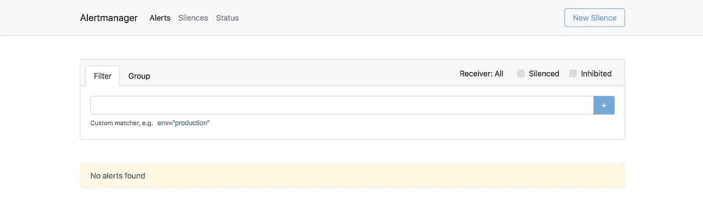
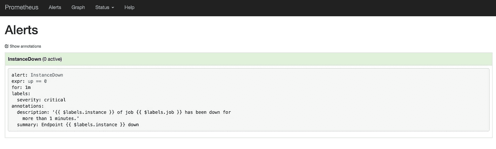
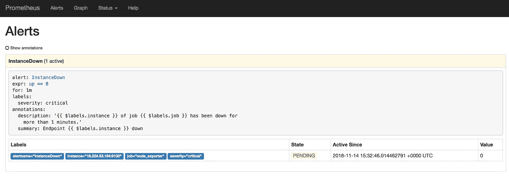
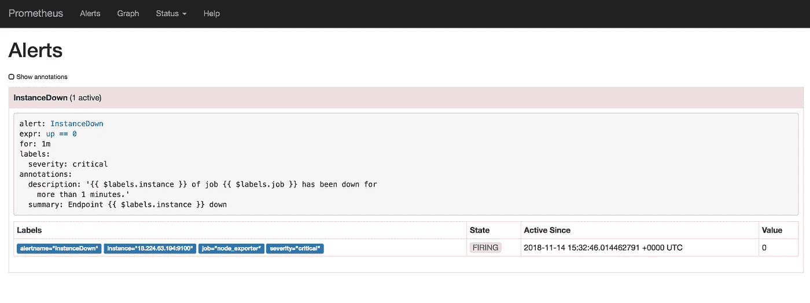
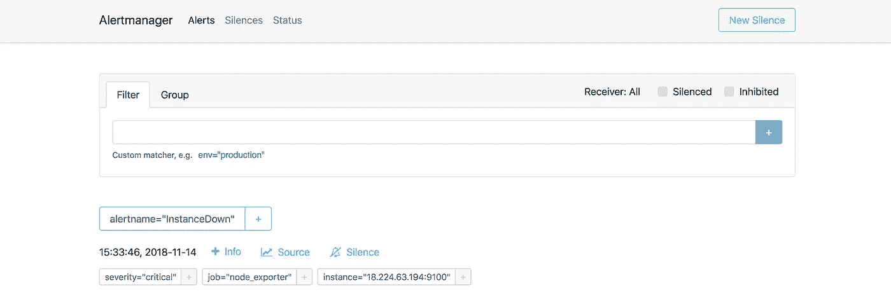

# 带警报器的普罗米修斯

> 原文：<https://itnext.io/prometheus-with-alertmanager-f2a1f7efabd6?source=collection_archive---------0----------------------->


Hugo Jehanne 在 [Unsplash](https://unsplash.com?utm_source=medium&utm_medium=referral) 上拍摄的照片

没有警报，监控是不完整的。我们已经在[上一篇](/monitoring-with-prometheus-using-ansible-812bf710ef43)中看过普罗米修斯的监控。在本文中，我们将讨论使用 ansible 设置警报和 AlertManager。 [AlertManager](https://prometheus.io/docs/alerting/alertmanager/) 是一个单独的二进制程序，处理 Prometheus 服务器发送的警报并通知最终用户。

为了防止停机发生，我们需要依靠监控和警报。监控有助于预测潜在问题或通知我们系统中的当前问题，并提供有关问题的详细信息。警报有助于在问题发生时立即发出通知。警报对于监控至关重要。它们允许团队通过电话、通知或其他媒介来识别问题，以便团队可以快速采取行动，并最大限度地减少关键系统停机时间。在任何系统中，监控和警报都应被视为一等公民。普罗米修斯中的警戒分为两部分。首先，预警规则是在 Prometheus 配置中定义的。如果达到任何警报条件，Prometheus 将向警报管理器发送警报。其次，AlertManager 通过其静默、禁止、分组和发送通知的管道来管理警报。静音是将警报静音一段时间。检查警报是否与活动的静默警报匹配，如果发现匹配，则不发送通知。抑制是指在其他警报已经触发的情况下，抑制某些警报的通知。将性质相似的组警报分组到单个通知中。这有助于防止同时触发多个通知。

Prometheus 的报警设置步骤如下:

1.  设置和配置 AlertManager。
2.  在 Prometheus 上配置配置文件，以便它可以与 AlertManager 通信。
3.  在 Prometheus 服务器配置中定义警报规则。
4.  在 AlertManager 中定义警报机制，通过 Slack、电子邮件、PagerDuty 等发送警报。

让我们使用 Ansible 设置 AlertManager。首先，我们需要创建“alertmanager”用户和用户组，这有助于隔离 AlertManager 服务的所有权并提供安全性。该用户不能修改不属于自己的数据。该用户不能登录实例，只能在实例内部使用。我们使用可变变量来提供灵活性。

```
- name: Creating alertmanager user group
  group: name="{{groupId}}"
  become: true- name: Creating alertmanager user
  user:
    name: "{{userId}}"
    group: "{{groupId}}"
    system: yes
    shell: "/sbin/nologin"
    comment: "{{userId}} nologin User"
    createhome: "no"
    state: present
```

我们将下载并安装拥有 AlertManager 用户所有权的 alertmanager。安装后，清理安装过程所需的所有临时文件。

```
- name: Download alertmanager
  unarchive:
    src: "[https://github.com/prometheus/alertmanager/releases/download/v{{](https://github.com/prometheus/alertmanager/releases/download/v{{) version }}/alertmanager-{{ version }}.linux-amd64.tar.gz"
    dest: /tmp/
    remote_src: yes- name: Copy alertmanager executable to bin
  copy:
    src: "/tmp/alertmanager-{{ version }}.linux-amd64/alertmanager"
    dest: "/usr/local/bin/alertmanager"
    owner: "{{userId}}"
    group: "{{groupId}}"
    remote_src: yes
    mode: 0755- name: Delete alertmanager tmp folder
  file:
    path: '/tmp/alertmanager-{{ version }}.linux-amd64'
    state: absent
```

我们将把 AlertManager 配置文件复制到 AlertManager 服务使用的实例中。

```
- name: Copy config file
  copy:
    src: "{{ role_path }}/files/alertmanager.yml"
    dest: /etc/alertmanager/alertmanager.yml
```

一旦我们设置好运行 AlertManager 的一切，我们将复制 systemctl init 文件来管理它。

```
- name: Copy systemd init file
  template:
    src: init.service.j2
    dest: /etc/systemd/system/alertmanager.service
  notify: systemd_reload
```

下一步是启动 AlertManager，这样它就可以基于更新后的配置文件工作。然后，我们通过在端口 9093 发出 HTTP 调用并确认何时收到 200 响应来检查它是否按预期工作。

```
- name: Start alertmanager service
  service:
    name: alertmanager
    state: started
    enabled: yes- name: Check if alertmanager is accessible
  uri:
    url: [http://localhost:9093](http://localhost:9093)
    method: GET
    status_code: 200
```

到目前为止，我们已经在端口 9093 的实例上运行了 AlertManager。



没有要触发的警报的警报管理器

我们需要配置 Prometheus 服务器，以便它可以与 AlertManager 服务对话。我们将建立一个警报规则文件，它定义了触发警报所需的所有规则。

```
rule_files:
  - alert.rules.ymlalerting:
  alertmanagers:
  - static_configs:
    - targets:
      - 'alertmanagerIP:9093'
```

Prometheus 服务器将跟踪传入的时间序列数据，一旦满足任何规则，就会向 AlertManager 服务触发警报。

```
**alert rule file**
groups:
- name: alert.rules
  rules:
  - alert: InstanceDown
    expr: up == 0
    for: 1m
    labels:
      severity: "critical"
    annotations:
      summary: "Endpoint {{ $labels.instance }} down"
      description: "{{ $labels.instance }} of job {{ $labels.job }} has been down for more than 1 minutes."
```

在上面的示例中，我们将创建一个警报规则来检查实例是否停机，如果停机时间超过 1 分钟，就会触发警报。我们可以使用 Prometheus 档案文件中的“ **promtool** ”工具检查警报文件的语法是否正确。

```
promtool check rules alert.rules.yml
```



没有激活警报的 Prometheus 服务器警报部分

如果任何被跟踪的实例停止运行，就会启动一个处于挂起状态的警报，直到它停止运行超过 1 分钟。



InstanceDown 警报处于挂起状态，直到它关闭超过 1 分钟

一旦实例停机超过 1 分钟，警报就会激活并触发警报管理器。



当实例停机超过 1 分钟时，将触发 InstanceDown 警报

AlertManager 有自己的配置，一旦从 Prometheus 服务器收到警报，我们就可以触发 Slack 警报。

```
global:
  slack_api_url: "https://hooks.slack.com/services/SlackAPI"route:
  group_by: ['instance', 'severity']
  group_wait: 30s
  group_interval: 5m
  repeat_interval: 3h
  routes:
  - match:
      alertname: InstanceDown
  receiver: 'alert-team'receivers:
- name: 'alert-team'
  slack_configs:
  - channel: "#webhook-channel"
    text: "summary: {{ .CommonAnnotations.summary }}\ndescription: {{ .CommonAnnotations.description }}"
```

在这个配置中，我们定义了在触发警报时需要触发的 slack webhook URL。创建 webhook URL 的说明可以在[这里](https://api.slack.com/incoming-webhooks)找到。我们定义“ **group_by** ”，它对相似的警报进行分组。我们添加了“ **group_wait** ”，它为特定的警报组设置发送警报的等待时间。" **group_interval** "定义在发送有关添加到警报组的新警报之前等待的持续时间。" **repeat_interval** "定义在触发已经发送的警报之前等待的持续时间。"**匹配**"检查警报名称，并根据该名称选择要使用的接收器。在这种情况下，我们使用 slack 作为警报接收者，并定义了 webhook URL。

一旦从 Prometheus 服务器收到警报，它将等待 group_wait 时间，然后将其发送给 slack webhook。



AlertManager 收到来自 Prometheus 服务器的警报


从 AlertManager 收到时差警报

完整的代码可以在这个 git 存储库中找到:[https://github . com/MiteshSharma/PrometheusAlertManagerWithAnsible](https://github.com/MiteshSharma/PrometheusAlertManagerWithAnsible)

***PS:如果你喜欢这篇文章，请鼓掌支持*** 👏 ***。欢呼***