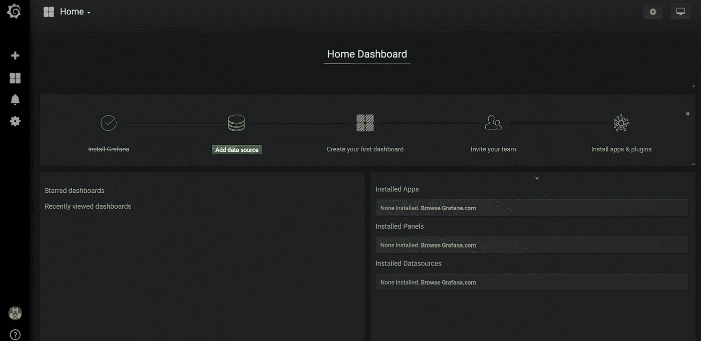
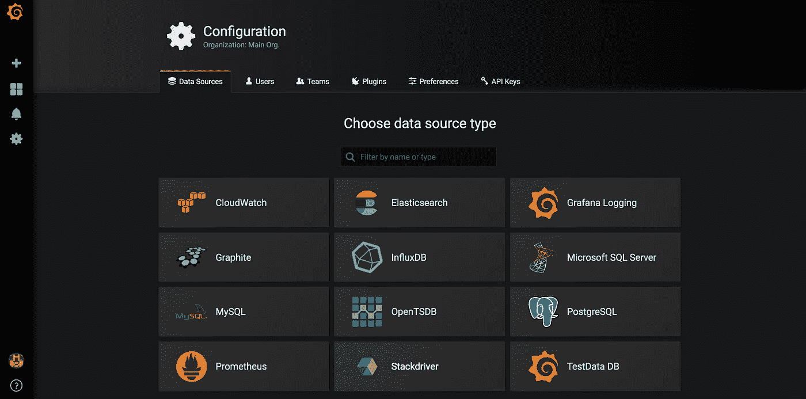
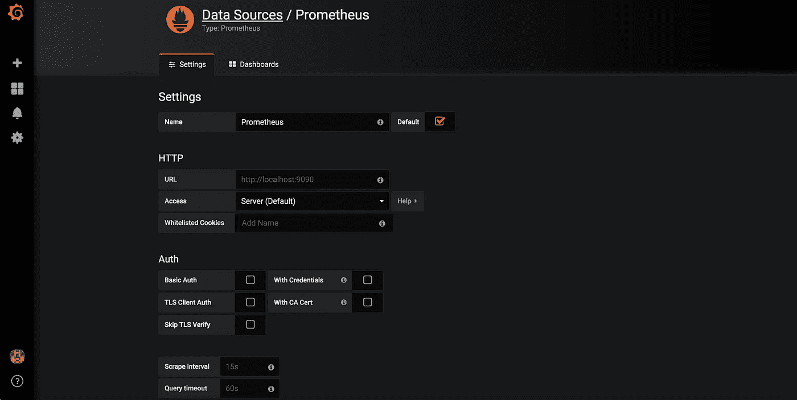
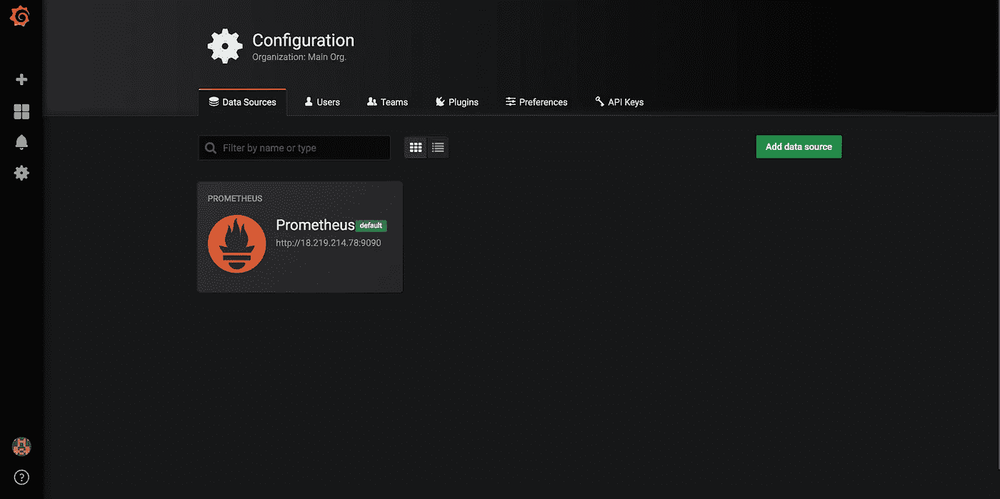
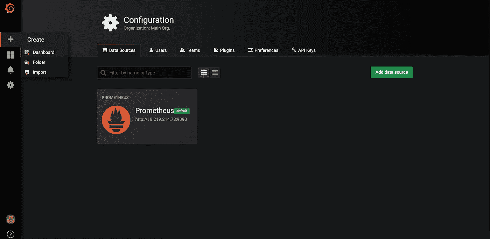
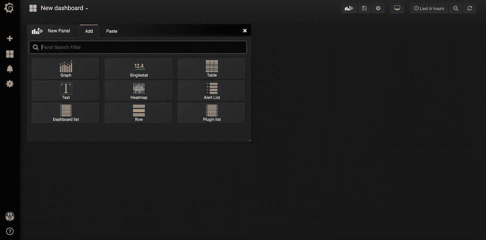
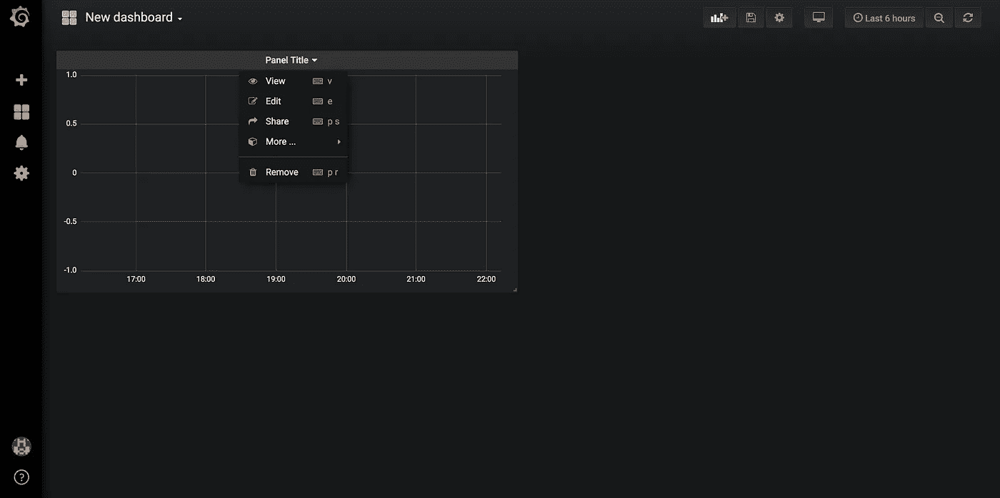
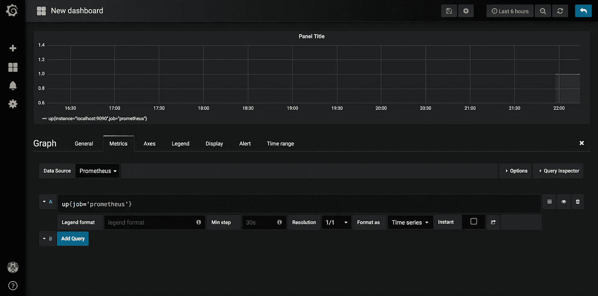
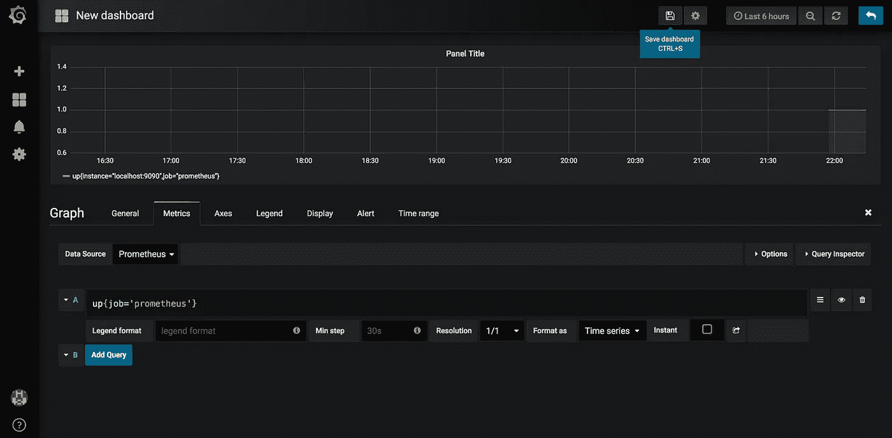
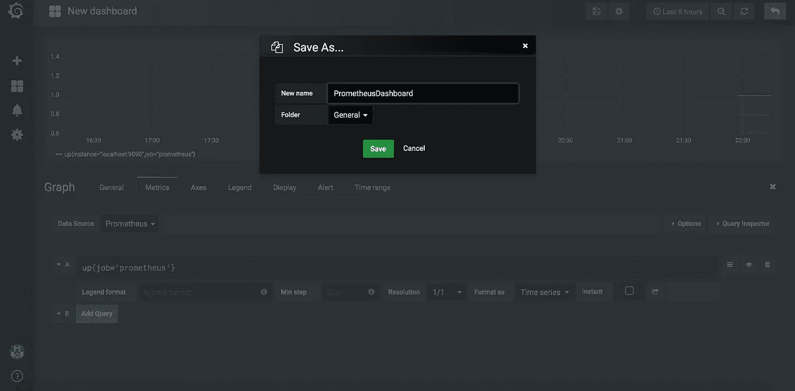

# 普罗米修斯与 Grafana 使用 Ansible

> 原文：<https://itnext.io/prometheus-with-grafana-using-ansible-549e575c9dfa?source=collection_archive---------4----------------------->


斯蒂芬·道森在 [Unsplash](https://unsplash.com?utm_source=medium&utm_medium=referral) 上拍摄的照片

当一个强大的度量收集工具遇到一个令人敬畏的可视化工具时，就会释放出一个有效的监控系统的真正力量。 [Prometheus](https://prometheus.io/) 是一个强大的指标收集和警报系统。Grafana 是最好的可视化工具之一，可以和 Prometheus 一起使用。我们可以在 Grafana 中创建一个包含多个图表的仪表板。Grafana 已经与 Prometheus 进行了开箱即用的集成。我们只需要设置普罗米修斯作为数据源，我们就可以开始了。

在本文中，我们将设置 Grafana 仪表板，它从 Prometheus 服务器获取数据。我们已经看到了如何设置给定链接可以引用的 [Prometheus](/monitoring-with-prometheus-using-ansible-812bf710ef43) 和 [AlertManager](/prometheus-with-alertmanager-f2a1f7efabd6) 。我们将看到 Grafana 设置 Ansible 和数据源设置，这样 Grafana 可以轻松地从 Prometheus 访问数据，我们可以在仪表板中使用这些数据。

Grafana 设置步骤如下:

1.  安装和配置 Grafana
2.  将 Prometheus 数据源添加到 Grafana
3.  从 Prometheus metrics 创建仪表板。

让我们使用 Ansible 设置 Grafana。我们将使用 ansible 的 yum 模块，通过在 [Grafana 网站](https://grafana.com/grafana/download)上找到的链接来安装 Grafana。

```
- name: Install grafana
  yum:
    name: [https://s3-us-west-2.amazonaws.com/grafana-releases/release/grafana-{{](https://s3-us-west-2.amazonaws.com/grafana-releases/release/grafana-{{) version }}-1.x86_64.rpm
    state: latest
```

一旦 Grafana 安装完毕，我们将把 Grafana 配置文件复制到所需的目的地，并重启 Grafana 服务器。

```
- name: "Grafana configuration file copy"
  template:
    src: "grafana.conf.j2"
    dest: /etc/grafana/grafana.ini
  notify: event_restart_grafana- name: "Grafana server started"
  service:
    name: grafana-server
    enabled: true
    state: started
```

一切准备就绪后，我们验证 Grafana 在端口 3000 上是可访问的，端口 3000 是 Grafana 的默认端口。

```
- name: "Check if Grafana is accessible."
  uri:
    url: [http://127.0.0.1:3000](http://127.0.0.1:3000)
    method: GET
    status_code: 200
```

到目前为止，我们已经在我们的实例上安装并运行了 Grafana，我们可以通过使用端口 3000(默认端口)访问所需的 IP 来看到这一点。

使用以下步骤将数据源设置到 Grafana 上的 Prometheus:

1.  转到 [http://grafanaIp:3000](http://grafanaIp:3000)


Grafana 登录屏幕

2.输入用户名“admin”和密码“admin”。单击登录。然后提供一个新密码，该密码将在以后的登录尝试中使用。


Grafana 更新密码屏幕

3.点击屏幕上的“数据源”。



Grafana 数据源屏幕

4.为我们的配置寻找 Prometheus 数据源。



Grafana 数据源选项屏幕

5.单击 Prometheus 数据源并提供以下详细信息:

名称:普罗米修斯
URL:[http://普罗米修斯 IP:9090](http://prometheusIp:9090)基本验证:禁用，因为普罗米修斯服务器上当前已禁用



Grafana Prometheus 数据源屏幕

6.单击添加并测试连接，以验证一切正常工作。一旦完成，我们就有了一个可以使用的 Prometheus 数据源。



Grafana 数据源创建屏幕

一旦我们完成了数据源的设置。接下来，我们需要使用 Prometheus 数据源设置我们的仪表板，这可以通过以下步骤完成:

1.  使用左上角的“+”转到仪表板选项



Grafana 仪表板

2.通过单击“图表”选项，在这个新仪表板中添加图表



Grafana 仪表板屏幕

3.我们在仪表板中创建了一个需要查询和数据源的空图表。这可以通过点击“面板标题”并选择编辑选项来完成



Grafana 图形创建屏幕

4.选择“普罗米修斯”作为数据源。转到查询选项，并在“查询”字段中添加输入 PromQL 查询“up{job='prometheus'} ”,这将绘制一个图形，显示 prometheus 服务器的“up”状态。我们可以根据自己的需要在这里添加任何查询。 [PromQL](https://prometheus.io/docs/prometheus/latest/querying/basics/) 是 Prometheus 使用的一种查询语言。



Grafana 图形选项屏幕

5.完成所有工作后，我们需要保存仪表板以备将来使用。这可以通过点击右上角的保存按钮并给我们的仪表板命名来完成。



Grafana 仪表板图形屏幕



Grafana 保存仪表板屏幕

这样，我们实现了 Grafana 的设置，仪表板从 Prometheus 获取数据。

完整的代码可以在这个 git 资源库中找到:[https://github.com/MiteshSharma/PrometheusWithGrafana](https://github.com/MiteshSharma/PrometheusWithGrafana)

***PS:如果你喜欢这篇文章，请用掌声支持它*** 👏 ***。欢呼***