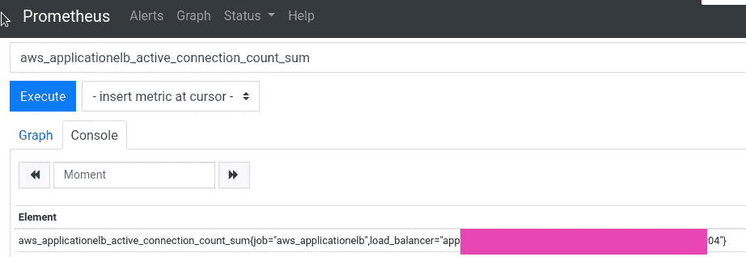
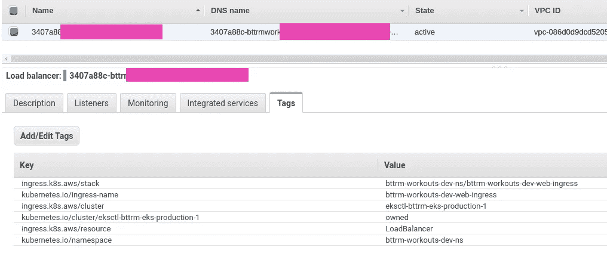
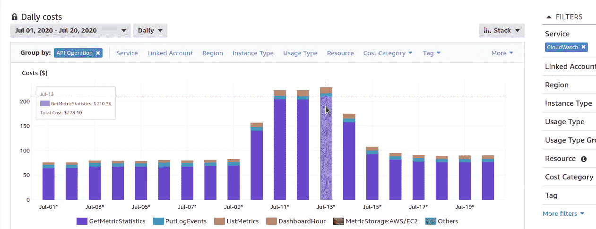
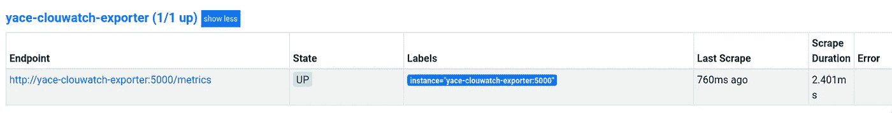
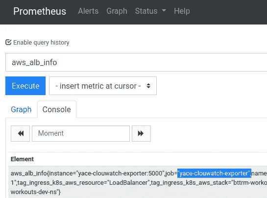
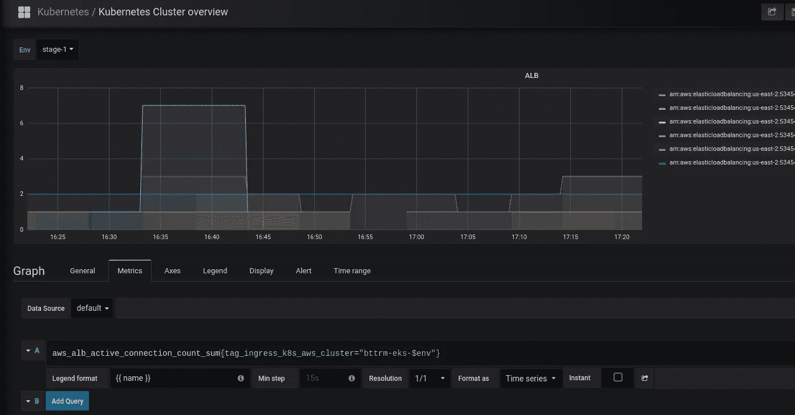
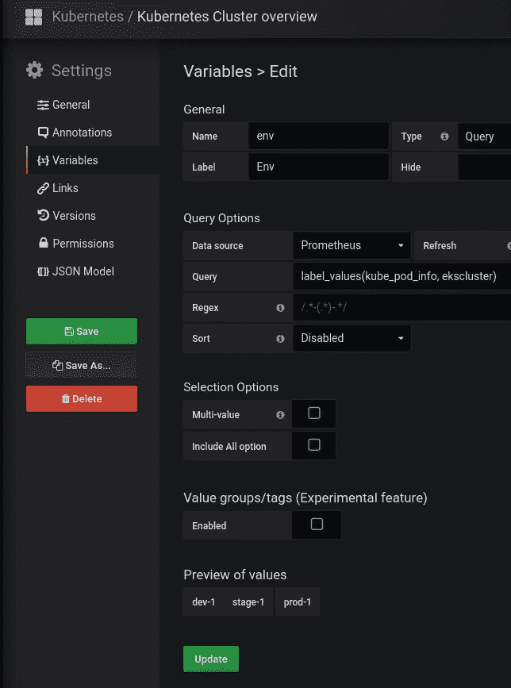

# 普罗米修斯:另一个云观察出口商——收集 AWS 云观察指标

> 原文：<https://itnext.io/prometheus-yet-another-cloudwatch-exporter-collecting-aws-cloudwatch-metrics-806bd34818a8?source=collection_archive---------1----------------------->


目前，为了从 AWS CloudWatch 收集指标，我们正在使用 AWS 自己的`[cloudwatch-exporter](https://github.com/prometheus/cloudwatch_exporter)`，请参见[Prometheus:cloud watch exporter—сборметииикиатикиииатвGrafana](https://rtfm.co.ua/prometheus-cloudwatch-exporter-sbor-metrik-iz-aws-i-grafiki-v-grafana/)帖子(Rus 中的*)，但它有一些不足之处:*

*   它是用 Java 编写的，所以使用监控主机的 CPU/内存
*   不会从资源中抓取 AWS 标签
*   使用`[GetMetricStatistics](https://docs.aws.amazon.com/AmazonCloudWatch/latest/APIReference/API_GetMetricStatistics.html)`方法获取数据
*   只能从一个 AWS 区域收集指标，例如*美国东部-1* 或*欧盟西部-2*

为了缓解这些问题，让我们尝试使用`[yet-another-cloudwatch-exporter](https://github.com/ivx/yet-another-cloudwatch-exporter)`来代替。

# AWS CloudWatch —差距

## 标签

让“默认”导出器不舒服的第一件事是，它不会从 AWS 中的资源获取标签。

例如，应用程序负载平衡器指标将返回唯一这样的标签:


但是，如果您在 AWS 控制台中检查它，您会发现那里有更多的标签:



目前还没有办法使用 Grafana 的标签。

## `GetMetricStatistics` vs `GetMetricData`

默认导出器的另一个问题是用于收集数据的 API 方法— `[GetMetricStatistics](https://docs.aws.amazon.com/AmazonCloudWatch/latest/APIReference/API_GetMetricStatistics.html)`。

两年前出现了一个问题[通过使用 GetMetricData api 而不是 GetMetricStatistics API 来降低 API 操作的成本](https://github.com/prometheus/cloudwatch_exporter/issues/134) —但它仍然没有得到应用。

因此，`[GetMetricStatistics](https://docs.aws.amazon.com/AmazonCloudWatch/latest/APIReference/API_GetMetricStatistics.html)`的问题是它如何收集指标——对于每个指标，您的`cloudwatch-exporter`将导致一个专用的 API 调用。

例如，如果您有 100 个 EC2 实例，每个实例有 10 个指标，那么`cloudwatch-exporter`将每 60 秒执行 1000 次，这将为您带来巨大的开销:



与 AWS `cloudwatch-exporter`不同，`yet-another-cloudwatch-exporter`使用`[GetMetricData](https://docs.aws.amazon.com/AmazonCloudWatch/latest/APIReference/API_GetMetricData.html)` API 调用，这允许我们在一次 API 调用中获得多达 500 个指标。

# 跑步`yet-another-cloudwatch-exporter`

让我们试着旋转它并得到数据。

为导出者创建一个带有 AWS 凭证的新文件，我们将其命名为 *alb-cred* :

```
[default]
aws_region = us-east-2
aws_access_key_id = AKI***D4Q
aws_secret_access_key = QUC***BTI
```

或者，您可以使用 [AWS EC2 实例概要文件](https://rtfm.co.ua/en/aws-iam-users-keys-rotation-ec2-iam-roles-and-jenkins/)，但是它的策略必须具有以下权限:

```
{
    "Version": "2012-10-17",
    "Statement": [
        {
            "Sid": "CloudWatchExporterPolicy",
            "Effect": "Allow",
            "Action": [
                "tag:GetResources",
                "cloudwatch:ListTagsForResource",
                "cloudwatch:GetMetricData",
                "cloudwatch:ListMetrics"
            ],
            "Resource": "*"
        }
    ]
}
```

现在，用导出器的设置创建一个文件:

```
discovery:
  jobs:
  - regions:
      - us-east-2
    type: elb
    enableMetricData: true
    metrics:
      - name: ActiveConnectionCount
        statistics:
        - Sum
        period: 300
        length: 600
```

并使用 Docker 运行它:

```
$ docker run -ti -p 5000:5000 -v /home/setevoy/Temp/alb-cred:/exporter/.aws/credentials -v /home/setevoy/Temp/config.yaml:/tmp/config.yml quay.io/invisionag/yet-another-cloudwatch-exporter:v0.19.1-alpha
{“level”:”info”,”msg”:”Parse config..”,”time”:”2020–07–21T10:59:49Z”}
{“level”:”info”,”msg”:”Startup completed”,”time”:”2020–07–21T10:59:49Z”}
```

检查指标:

```
$ curl localhost:5000/metrics
HELP aws_elb_info Help is not implemented yet.
TYPE aws_elb_info gauge
aws_elb_info{name=”arn:aws:elasticloadbalancing:us-east-2:534***385:loadbalancer/app/fea06ba9-eksstage1mealplan-a584/***”,tag_Env=””,tag_Name=””,tag_Stack=””,tag_ingress_k8s_aws_cluster=”bttrm-eks-stage-1",tag_ingress_k8s_
aws_resource=”LoadBalancer”,tag_ingress_k8s_aws_stack=”eks-stage-1-mealplan-api-ns/mealplan-api-ingress”,tag_kubernetes_io_cluster_bttrm_eks_dev_0=””,tag_kubernetes_io_cluster_bttrm_eks_dev_1=””,tag_kubernetes_io_cluster_bttrm_eks_prod_0=
“”,tag_kubernetes_io_cluster_bttrm_eks_prod_1=””,tag_kubernetes_io_cluster_bttrm_eks_stage_1=”owned”,tag_kubernetes_io_cluster_eksctl_bttrm_eks_production_1=””,tag_kubernetes_io_ingress_name=”mealplan-api-ingress”,tag_kubernetes_io_namesp
ace=”eks-stage-1-mealplan-api-ns”,tag_kubernetes_io_service_name=””} 0
…
```

现在您可以看到，每个指标都附加了所有 AWS 标记。

## `yet-another-cloudwatch-exporter`配置

## `exportedTagsOnMetrics`

如果您不需要所有的标签——您可以使用`exportedTagsOnMetrics`来限制哪些标签将被附加到指标上。

例如，让我们只留下下面的标签:

```
discovery:
  exportedTagsOnMetrics:
    alb:
      - Name
      - kubernetes.io/service-name
      - ingress.k8s.aws/cluster
      - kubernetes.io/namespace
...
```

## `SeacrhTags`

此外，您可以设置一个限制来指定导出器将从哪些资源获取度量——类似于 AWS `cloudwatch-exporter`中的`[tag_selections](https://github.com/prometheus/cloudwatch_exporter#configuration)`。

比方说，我们想从唯一的"*Bt trm-eks-prod-1*" eks cluster 中获取指标。

然后您可以指定*" ingress . k8s . AWS/cluster*"作为标记键，指定" *bttrm-eks-prod-1* "作为它的值:

```
discovery:
  exportedTagsOnMetrics:
    alb:
      - Name
      - kubernetes.io/service-name
      - ingress.k8s.aws/cluster
      - kubernetes.io/namespace
  jobs:
  - type: alb
    regions:
      - us-east-2
    searchTags:
      - Key: ingress.k8s.aws/cluster
        Value: bttrm-eks-prod-1
    metrics:
      - name: UnHealthyHostCount
        statistics: [Maximum]
        period: 60
        length: 600
      - name: ActiveConnectionCount
        statistics: [Sum] 
        period: 300
        length: 600
```

重启并检查它:

```
$ curl localhost:5000/metrics
HELP aws_alb_active_connection_count_sum Help is not implemented yet.
TYPE aws_alb_active_connection_count_sum gauge
aws_alb_active_connection_count_sum{dimension_LoadBalancer=”app/bcf678a9-eksprod1bttrmapps-447a/***”,name=”arn:aws:elasticloadbalancing:us-east-2:534***385:loadbalancer/app/bcf678a9-eksprod1bttrmapps-***”,region=”us-east-2",tag_Name=””,tag_ingress_k8s_aws_cluster=”bttrm-eks-prod-1",tag_kubernetes_io_namespace=”eks-prod-1-bttrm-apps-ns”,tag_kubernetes_io_service_name=””} 112
…
aws_alb_tg_un_healthy_host_count_maximum{dimension_LoadBalancer=”app/bcf678a9-eksprod1bttrmapps-447a/***”,dimension_TargetGroup=”targetgroup/bcf678a9–9b32ce4accea2525b4d/e0f341421a33a453",name=”arn:aws:elasticloadbalancing:us-east-2:534***385:targetgroup/bcf678a9–9b32ce4accea2525b4d/e0f341421a33a453",region=”us-east-2",tag_Name=””,tag_ingress_k8s_aws_cluster=”bttrm-eks-prod-1",tag_kubernetes_io_namespace=”eks-prod-1-bttrm-apps-ns”,tag_kubernetes_io_service_name=”bttrm-apps-backend-svc”} 0
…
```

现在，我们从唯一的一个 EKS 集群中获取指标，并且指标只包含选定的标签。

## 与普罗米修斯一起奔跑

我们在 Docker Compose 下运行我们的 Prometheus 堆栈，所以让我们添加 YACE 导出器:

```
...
  yace-clouwatch-exporter:
    image: quay.io/invisionag/yet-another-cloudwatch-exporter:v0.19.1-alpha
    networks:
      - prometheus
    ports:
      - 5000:5000
    volumes:
      - /etc/prometheus/prometheus-yace-cloudwatch-exporter.yaml:/tmp/config.yml:ro
    restart: unless-stopped
```

现在向 Prometheus 服务器配置添加一个新目标:

```
...
scrape_configs:

  - job_name: 'yace-clouwatch-exporter'
    metrics_path: '/metrics'
    static_configs:
      - targets: ['yace-clouwatch-exporter:5000']
...
```

重启普罗米修斯，检查目标:



指标:



# Grafana 图

现在，我们能够在 Grafana 中使用这些指标，并且能够选择环境，例如*开发*、*阶段*、*生产*(参见 [Grafana: создание仪表板](https://rtfm.co.ua/grafana-sozdanie-dashboard/)、 *Rus* ):



这里的`$env`变量是从我们的标签`ekscluster`中创建的，该标签在从 CloudFormation 创建集群的过程中附加到每个集群上(参见[AWS Elastic Kubernetes Service:a cluster creation automation，part 1–cloud formation](https://rtfm.co.ua/en/aws-elastic-kubernetes-service-a-cluster-creation-automation-part-1-cloudformation/)):



完成了。

# 有用的链接

*   [改进亚马逊云观察的普罗米修斯出口器](https://sysdig.com/blog/improving-prometheus-cloudwatch-exporter/)
*   [用 Prometheus 和 Sysdig 监控 AWS Lambda](https://sysdig.com/blog/monitor-aws-lambda-prometheus/)

*最初发布于* [*RTFM: Linux、DevOps 和系统管理*](https://rtfm.co.ua/en/prometheus-yet-another-cloudwatch-exporter-collecting-aws-cloudwatch-metrics/) *。*