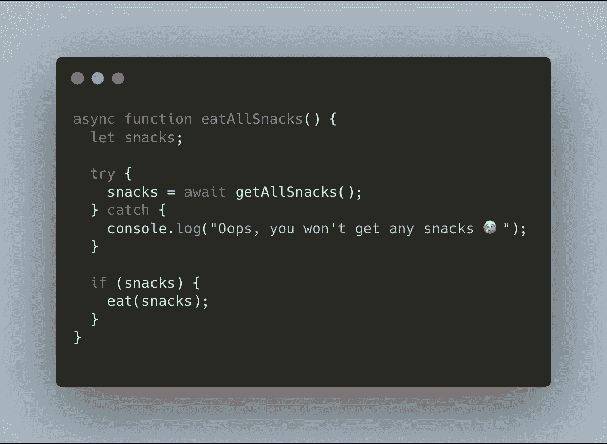

# 更清晰的异步语法的承诺处理程序

> 原文：<https://itnext.io/promise-handlers-for-cleaner-async-syntax-771840da47b6?source=collection_archive---------2----------------------->

## 使用指南

## await-wrapper 是一个实用方法，允许更干净的承诺处理

## 介绍

当使用异步 javascript 时，有很多方法可以处理结果。我们可以使用回调并最终陷入回调地狱，我们可以连锁承诺，这很好，但最终会变得很长，或者我们可以使用异步/等待功能。很多时候使用 async / await 伴随着许多 try / catch 块，我们的代码最终看起来有点庞大。

在本文中，我们将看看这三种方法，然后看看一个帮助器方法，它将让您编写的代码看起来几乎是同步的。

## 复试

只是谷歌回调地狱，这就是我要说的。

## 承诺链

使用承诺时最常见的方法是使用承诺链。承诺链是一段调用异步函数然后使用。然后还是。捕捉运算符。下面是一个有很大链条的承诺的例子。

链式方法是一种处理承诺的好方法，但它遭受了与回调地狱相同的命运，最终你有了一个承诺，它调用了一个承诺，调用了一个承诺，链条就这样继续下去。

## 异步/等待

“promise 进化”的下一步是异步 await 语法。这种语法允许开发人员摆脱承诺链，并且“看起来”是同步的。但是，它可能会变得很庞大，因为大多数异步 await 方法都需要一个 try / catch 块。promise 方法提供的捕获。

有一个警告，这种语法只能在异步函数中使用。这意味着我们不需要调用一个承诺并链接它，而是必须编写一个函数，然后我们可以调用这个函数来调用我们的承诺。在下面的例子中，你可以看到一个异步函数的例子。

[学分](https://www.google.com/url?sa=i&url=https%3A%2F%2Fitnext.io%2Fasync-await-without-try-catch-in-javascript-6dcdf705f8b1&psig=AOvVaw1NjxxjEpXh4a24tRjBQExC&ust=1650706069926000&source=images&cd=vfe&ved=0CAwQjRxqFwoTCMjassStp_cCFQAAAAAdAAAAABAr)

然而，现在我们可以使用顶级等待。根据 mozilla 开发者文档，你现在可以在 javascript 模块中使用[顶级等待](https://developer.mozilla.org/en-US/docs/Web/JavaScript/Reference/Operators/await#top_level_await)。这允许您在不需要异步函数的情况下使用它。

## awaitWrap

那么，在看到所有这些处理承诺的好方法之后，我们为什么还需要一个承诺处理器呢？答案是我们真的不知道，但是它可以很好地清理我们的代码，并提供一种处理错误和响应的好方法。

承诺处理器是一个简单的函数。它是一个将承诺作为参数并解决或拒绝它的函数。然而，我们并不只是返回值，而是返回一个包含该数据的对象。

在下面的要点中，你可以看到一个简单的例子，说明如何使用这个包装函数来处理来自承诺的决议和拒绝。

## 性能问题

许多人可能注意到这个库的一件事是，我们实际上是在创造两个承诺。你原本要打电话的承诺和包装的等待。如果应用程序的性能是您的最高优先级，那么很容易传入 resolveCallback 或 rejectCallback，当您使用返回的数据来控制代码流时，可以在处理程序中立即调用这些方法。

等待带有回调的包装

## 结论

一个人可以有太多的方式在他们的 javascript 代码中处理承诺。为了清理代码，我发现这个工具非常好用。如果你想使用它，可以通过 NPM 访问[。你也可以在](https://www.npmjs.com/package/await-wrapper) [Github 这里](https://github.com/EvanBurbidge/await-wrapper)分叉代码。

如果您想注册访问更多媒体内容，请点击以下[链接](https://thewebuiguy.com/membership)。这将使我能够写更多的故事，通过一个小的委员会从媒体。