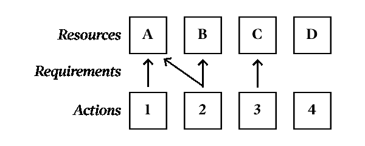

# Promise Mate:委托 JavaScript 中的异步结果

> 原文：<https://itnext.io/promise-mate-delegating-asynchronous-results-in-javascript-895c912069e3?source=collection_archive---------5----------------------->


来自 www.flaticon.com[的](http://www.flaticon.com/) [Freepik](https://www.flaticon.com/authors/freepik) 制作的图标

最近，我创建了一个 Node.js CLI 来帮助完成我工作中一个比较繁琐的部分。CLI 将监控多达三个不同的 API 端点的变化，并根据某些标准，在信息发生变化时向我发出警报。例如，我添加了一个检查，以便在特定的 API 值自上次检查以来发生变化时发出警报。

我希望这个工具是模块化的，你可以定义单独的“检查”来测试变化，并按照你的意愿混合和匹配。我没有*而不是*想要获取所有的端点，因为我知道这将会浪费时间和资源，这取决于所提供的检查。

为此，我使用`Promise.all`只请求所需的资源，并将它们分配给需要它们的检查。在这篇文章中，我将描述这个概念和由此产生的模块， [**【承诺伴侣**](https://npm.im/promise-mate) 。

因为这是从 JavaScript 项目开发的，所以我可能会使用 JavaScript 术语，比如“promise”。然而，其基本概念可能适用于任何具有并行性的语言。

# 纲要

这种方法适用于…

*   您有一个依赖于异步结果的操作池。
*   其中一些行动可能取决于同样的结果。
*   即使需要多个操作，结果也应该只解析一次。
*   动作可以/应该在运行之前等待所有的解决方案(甚至是它们不需要的解决方案)(如 JavaScript 的`Promise.all`)。
*   在解决问题后，按顺序运行操作是有利的，也是不合理的(如果不这样做，还有其他方法)。
*   当涉及到动作及其相关的异步结果时，可重用性和/或模块化是关注的问题。

# 概念

让我们创建一个示例项目，作为解释这个概念的框架。



行动、资源以及两者之间的关系。

我们有四个可能的**资源**需要并行解析*: A、B、C 和 d。我们有四个**动作**需要执行:1、2、3 和 4。基于我们可能的资源，这四个动作有**需求**:动作 1 和 2 需要资源 A，动作 2 也需要资源 B，动作 3 需要资源 C，动作 4 不需要任何资源，任何动作都不需要资源 D。

任何重复的需求将减少到只有一个请求(例如资源 A 将仅被提取一次而不是两次)。此外，将不获取不需要的资源(例如没有请求资源 D，因此它不会被请求)。

请求资源，并且当所有资源都被解析时，它们被传递给它们的请求动作进行处理。

**这不一定是资源获取，它本身可以是一个动作，如发布数据、保存文件等。甚至返回一个常量变量。然而，我将在整个文档中使用“resource ”,坚持使用这个示例项目中引入的措辞。*

# 将概念付诸实践

从这个概念框架出发，我创建了模块 Promise Mate(因为动作与它们的承诺以及彼此之间是“匹配”的)。以下是如何在模块中实现这一概念。

## 资源

使用 Promise Mate，你必须定义如何获取你的资源。这些定义是一个标准对象，其关键字标识资源，值或者是一个生成承诺的函数，或者是一个将按原样传递给`Promise.all`的变量。

```
const resources = {
  A: () => fetch('A.txt').then(res => res.text()),
  B: 'B',
  C: () => Promise.resolve('C'),
  D: Promise.resolve('D')
}
```

## 行动

在 Promise Mate 中，动作需要定义它们所需的资源(如果有的话)和回调函数来调用这些解析的资源。标准格式如下:

```
const action2 = {
  requires: ['A', 'B'],
  then(a, b) { console.log(a, b) }
}
```

`then`函数是所有承诺(包括这个特定动作不需要的承诺)被解析时的回调函数。所需的资源按照定义的顺序作为参数传递给该函数。

`requires`属性声明了动作成功运行所需的资源。通常，它是一个字符串数组，对应于已定义资源的键。当只请求一个资源时，也可以只使用相关的键，而不使用数组:

```
const action1 = { requires: 'A', then: (a) => { console.log(a) } }
```

如果`requires`属性没有可解析的键(它们要么不是字符串，要么没有被定义)，那么它们被假定为要传递给回调的常量。

```
const action3 = {
  requires: [{ prefix: 'I found ' }, 'C'],
  then: ({ prefix }, c) => { console.log(`${prefix}${c}`) }
}const action4 = {
  requires: undefined,  // Essentially the same as just not defining the requires property or as an empty array
  then() { console.log('Check complete!') }
}
```

## 把这一切联系在一起

现在，您可以像下面这样运行所有内容:

```
import Mate from 'promise-mate'Mate
  .all(resources, [action1, action2, action3, action4])
  .then(() => { console.log('All done!') })// Console output:
// A
// A B
// I found C
// Check complete!
// All done!
```

或者，对于可重用和可扩展的资源定义，您可以采用更加面向对象的方法:

```
import Mate from 'promise-mate'const runner = new Mate(resources)
runner.define('C', () => Promise.resolve('B'))runner
  .all([action1, action2, action3, action4])
  .then(() => { console.log('All done!') })
```

请注意，尽管资源将被异步解析，但一旦解析，操作将按顺序运行。

## 继续还是打破承诺链

`Mate.all`和`Mate.prototype.all`都返回一个承诺，这个承诺用每个动作的回调函数返回的数组(如果有的话)来解析。这样，您可以做如下事情:

```
runner
  .all([action1, action2])
  .then(([result1, result2]) => { console.log(result1, result2) })
```

如果你的行为可能会带来承诺，你可以使用`Promise.all`来解决它们:

```
const promises = await runner.all([action1, action2])
const [result1, result2] = await Promise.all(promises)
console.log(result1, result2)
```

如果在一个承诺中遇到错误或拒绝，*所有的*都将被拒绝(就像`Promise.all`中一样)。

```
runner
  .all([action1, action2, action3, action4])
  .catch((err) => { console.error(err) })
```

我建议，如果一个承诺最终被拒绝，那就没有必要了，那就用 [**p-reflect**](https://www.npmjs.com/package/p-reflect) (或类似的说法):

```
import reflect from 'p-reflect'runner.define('E', () => reflect(getText("dubious.txt")))const action5 = {
  requires: ['A', 'E']
  then(a, e) {
    if (e.isFulfilled) {
      console.log(a, e.value)
    } else {
      console.warn(e.reason)
      console.log(a)
    }
  }
}runner.all([action1, action5])
```

# 结论

如前所述，这种模式并不适用于每种情况，但在适用的情况下可能非常有效。

请随意浏览 [Promise Mate](https://github.com/czycha/promise-mate) 的源代码，了解任何底层实现细节。您还可以使用`npm i promise-mate`或`yarn add promise-mate`将它添加到 Node.js 项目中。