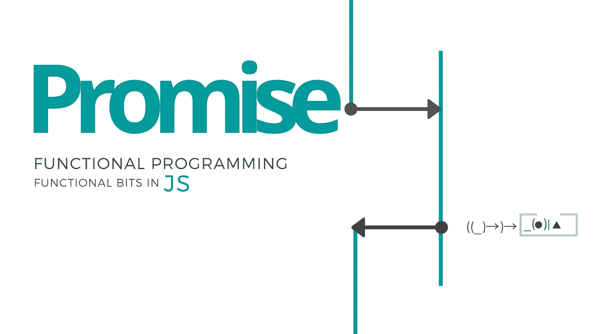

# JavaScript 中的承诺和延续单子

> 原文：<https://itnext.io/promises-continuation-monad-in-javascript-f2d70ceb24a4?source=collection_archive---------2----------------------->



这是研究 javascript 异步编程的基础数学和机制的三部分中的一部分

1.  [承诺&JavaScript 中的延续单子](https://medium.com/@dimpapadim3/promises-continuation-monad-in-javascript-f2d70ceb24a4) (this)
2.  [JavaScript 中的异步/等待延续协同单子](https://medium.com/@dimpapadim3/async-await-a-k-a-continuation-co-monad-in-javascript-3593f0092413)
3.  反应式扩展 RxJs、连续单子和观察者模式

当我想理解延续时，我从基础开始: ***回调*** 经过多次重构，我发现了承诺，最后是*所有单子之母，它被称为:延续单子。*

假设你有一个简单的函数

```
const square = x =>  x * x ;
console.log(square(4));     // prints 16
```

# 第一部分

## 1)使用回调并移除返回类型

您可以传递回调并移除返回类型。这就是著名的[传接式](https://en.wikipedia.org/wiki/Continuation-passing_style)

```
const square= **(x,callback)=>callback(x*x);**
square(4,console.log);  // prints 16
```

您可以像这样用回调来构造函数:

```
const square = (x,callback)=>callback(x*x);
square(2,
         x=>square(x,console.log));  // prints 16
```

这当然会导致[回调地狱](http://callbackhell.com/)哪个[是箭头反模式](http://wiki.c2.com/?ArrowAntiPattern)的特例…

## 2) [库里](https://en.wikipedia.org/wiki/Currying)回调

如果我们 [curry](https://en.wikipedia.org/wiki/Currying) 这个动作并返回它的结果会怎么样？！我们可以这样做:

```
const square = **(x)=>callback**=>callback(x*x); 
```

如果你长时间观察这个并将**回调**重命名为**解决**，你会发现这实际上类似于一个 [**承诺**](https://developer.mozilla.org/en-US/docs/Web/JavaScript/Reference/Global_Objects/Promise) **。**并这样使用它:

```
square(4)(y=>console.log(y));  // prints 4
```

[旁注:我们**可以把它变成一个承诺**，如果我们把回调封装到一个公开**然后**函数的对象中，就像这样:

```
const square = (x)=>**callback=>callback(x*x)**;// transform it intoconst square = (x)=>({***then***:**resolve=>resolve(x*x)**});square(2).then(r=>console.log(r))
```

附注结束]

它看起来好一点，但我们可以做更多的重构动作。这个**回调= >回调(x*x)** 的返回类型实际上是 **(int → ⊥) → ⊥** 其中 **⊥** 是[初始对象*/空类型/false。*](https://ncatlab.org/nlab/show/relation+between+type+theory+and+category+theory) *这是说，如果你给我一个函数，它取一个 int i，不返回任何值* **(int → ⊥)** *我会对它做一些处理，然后不返回任何值* **(int → ⊥) → ⊥** 。

## 3)推广返回的延拓

如果我们想推广它，而不是⊥返回一个任意的类型 t，那会怎么样呢？

**(int → T) → T** :

也就是说，如果你给我一个函数，它接受一个 int i 并给出一个 T，我会对它做些什么，然后返回 T，这是

**(int → ⊥) → ⊥**

因为我们使用非类型化的 javascript，所以这并不重要，但是对于像 Typescript 这样的强类型 js 语言扩展，我们需要积极关注这一点。

这个**函数签名(U→ T) → T** 算是比较有名的，我们可以称之为 ***延续***


# 第二部分

如果我们想更进一步，那么单子就来了。这部分有点复杂，跟着做就行了。我们可以从这个延续类型 **(U→ T) → T** 组成一个单子就是**回调= >回调(x*x)** 。对于那些不知道单子是什么的人:


*   **函子**是一个容器。例如，List 是最著名的函子。这里是延续 **(U→ T) → T，我们可以把它看成是 U.** 的容器
*   [**内函子**](https://ncatlab.org/nlab/show/endofunctor) 是从一个范畴到自身的[函子](https://medium.com/@dimpapadim3/the-definite-guide-to-functors-in-js-6f5e82bd1dac)。在这种情况下，一个延续 **(A→ T) → T** 可以转换成另一个延续 **(B→ T) → T** 两者都属于同一类别的**延续**，因此这是一个结束函子。
*   **幺半群**是一个[结构](https://en.wikipedia.org/wiki/Algebraic_structure)，有一个[二元运算](https://en.wikipedia.org/wiki/Binary_operation) **∘** 和一个[单位元](https://en.wikipedia.org/wiki/Identity_element) **Id** 。从某种意义上说，弄清楚如何像**((a→t)→t)*∘*****((b→t)→t)**

你要记住的是单子有两个运算:

```
*c → T(c)          //****Return***T(T(c))*→ T(c)     //****join*** 
```

**1)** 在第一个操作中 *c → T(c)* 我们可以从一个对象 C 开始，得到一个容器 *T(c)。*

**2)** 第二个 T(T(c)) *→ T(c)* 意思是我们可以把两个容器合/平为一体。

## 4)提取延续结构

现在我们只需要从 square 函数中提取延续机制，这样我们就可以重用它了。所以我们可以有单子的第一部分，Return***c→T(c)****，*这是用延续符对值的换行，就像这样:

为了最终得到延续单子，我们必须添加组成延续的**绑定方法:** T (A) → (A → T (B)) → T (B)。这是迄今为止最难理解的部分，如果你一次都不尝试自己去构建，你就无法真正理解它。

如果我们在这个中用 **(A→ T) → T 代替 T，那就是单子**

```
**T (A) → (A → T (B)) → T (B)**
```

我们在字体形式中得到这样荒谬的东西

```
**((A→ T) → T)→( A→((B→ T) → T))→ ((B→ T) → T)**
```

这里说:“如果你给我一个 A 的延拓[ **(A→ T) → T]和一个取 A 并给 B 一个延拓的函数[A→((B→T)→T]那么我可以给你一个 B 的延拓**[**(B→T)→T]”**

当你明白为什么下面的绑定方法像 [js 禅宗公案](https://simple.wikipedia.org/wiki/Hacker_koan)一样工作时，你可以思考一下。

```
var bind = (cont1, func)=>(callback=>cont1(contResult=>func(contResult)(callback)));
```

好吧，让我试着解释一下。如果你到了这里，顺便恭喜你。

好的我们有一个 cont1 **(A→ T) → T** 和一个 func **A→((B→ T) → T)** 我们要返回 **(B→ T) → T .** 所以我们先写callback= >也就是 **(B→ T)** ，剩下的这个应该返回值 T，我们要怎么得到这个值呢？我们可以从 **cont1 =(A→ T) → T** 中得到它，只需传递一个函数，这个函数带有一个名为 **contResult 的参数 A。好的，直到现在我们有了**

```
bind = (cont1, func)=>(callback=>cont1(contResult=>
```

…你能看到剩下的吗？？？

这将结束构造。看看下面这个 js 提琴的结果标签:

# 总而言之:

1.  从初始功能开始

```
const f = x =>  x * x ;
console.log(f(4));     // prints 16
```

2.使用回调并移除返回类型

```
const f1 = **(x,callback)=>callback(x*x);**
```

3.库里回电

```
const squareCont = **(x)=>callback=>callback(x*x);**
```

5.提取延续结构也称为单子的返回方法

```
const **toCont=v=>callback=>callback(v);****toCont**(x=>x*x) 
        (y=>**toCont**(y(4))
          (t=>console.log(t)));
```

6.添加绑定单子方法，从而完成单子

```
var bind = (cont1, func)=>(callback =>cont1(contResult=>func(contResult)(callback)));
```

有问题吗？就在下面留言评论吧。

你想更进一步吗？阅读如何从承诺走向异步功能性错误处理

阅读更多信息:

[](https://medium.com/@dimpapadim3/the-definite-guide-to-functors-in-js-6f5e82bd1dac) [## Js 中的函子指南

### 让我告诉你什么是面向对象编程的函子:它是一个容器。连同一张地图…

medium.com](https://medium.com/@dimpapadim3/the-definite-guide-to-functors-in-js-6f5e82bd1dac) 

请随时在 LinkedIn 与我联系