# 承诺，承诺

> 原文：<https://itnext.io/promises-promises-33f43490e8b7?source=collection_archive---------4----------------------->

## 用 Golang 实现 Javascript 异步模式

*(本博客由 https://creativecommons.org/licenses/by/4.0/*[授权，](https://creativecommons.org/licenses/by/4.0/)*所有代码由 https://www.apache.org/licenses/LICENSE-2.0***授权)**

**

## *介绍*

*Golang 的关键字数量有限(25 个)，主要致力于构建多线程程序。这些目标，当你深入挖掘，似乎是对立的。有许多多线程抽象原则上可能需要它们自己的关键字和语法，以便通过语言抽象更容易访问。至少在看原生围棋的时候只有两个可以合作的:*围棋*和*围棋*。*

*问题是:仅仅用这两种工具实现更高层次的异步抽象可能吗？是的，当然，只要有足够的代码来解决这个问题，你几乎可以做任何事情。有没有可能用一种通用的方法，不需要为每个实现重新创建模式的充满 bug 的过程？golang 通常在这一点上偏离了传统的面向对象(OO)方法。*

## *无商标消费品*

*Java 或 C++工程师倾向于从泛型开始这个过程。问题:golang 中没有泛型(例如 C++模板)(也不应该有)。Golang 可以以面向对象的方式使用，但它并不是最佳的面向对象语言，它介于面向对象和函数式编程(FP)之间。golang 中有空*接口{}* 形式的“非类型化”结构(这里我们引入第三个关键字，它的工作方式很像 C 语言中的 *void** ),但是它们有一个严重的缺点:为了处理通过空接口获得的对象的方法或成员，必须使用动态强制转换。然而，我们不能在变量中传递“type”关键字，所以任何试图利用空接口的代码都必须通过类型*开关*(或者*如果*是阶梯)或一些中间接口得到一些帮助。这并不像我们希望的那样普遍。在有些应用中，这已经足够了，它们引导我们使用 golang 开发人员工具包中的下一个工具:*

## *代码生成*

*解决泛型问题的标准方法是使用模板语言来编写泛型函数，然后使用 golang 的代码生成工具箱来为您的应用定制实现。这可以避开空的*接口*的一些问题，因为您可以使用另一个信息源(json、yaml 等)将类型信息应用于模板化的类型开关和转换函数。这可以允许接受空接口的函数“解码”基础类型，以便在通用代码完成其工作后使用。虽然这对于许多问题来说已经足够了(我在我自己的项目中使用了这种技术，比如使用 openapi 3.0 的规范驱动设计和我的 [go-decode](https://github.com/weberr13/go-decode) 包，也在使用优秀的模拟库[伪造者](https://github.com/maxbrunsfeld/counterfeiter)为单元测试生成 spy 时使用了这种技术)，但是代码生成带来了新的问题。*

*首先，它可以将“不可编译的代码”以模板和所使用的任何规范的形式引入到项目中。现在，golang 中没有的一套新工具是构建软件所必需的。*

*其次，虽然可以编写代码来练习模板，但模板代码不能直接测试。您只能测试模板到 golang 代码的“投影”,以进行解析、林挺和运行时检查。*

*上述因素的结合也给大型项目引入了一种“宗教”辩论。一派认为代码生成应该在提交前应用，并将生成的代码“快照”到 repos 中(并通过 CICD 验证)，以便真实信息的来源(yaml、openapi 规范等)可以独立更改。另一派希望减少源代码控制中包含的“不可读”代码，而选择代码生成作为构建时间步骤。两者各有利弊，但最好不要选择任何一个。*

*有没有一个通用问题(特别是多线程抽象)的解决方案，不需要我们引入空接口的脆弱性或构建时代码生成的复杂性？*

## *一级函数和闭包*

*Golang 是 FP 和 OO 技术的混合，可能不是“FP 完全的”,但是它对解决这个特殊问题所必需的两种成分提供了本地支持。*

1.  *第一类函数——在 golang 中，函数可以存储在变量绑定或“l 值”(如函数参数)和“r 值”(如返回值)中。*
2.  *闭包——函数定义范围内的变量被“封闭”在已定义函数的范围内。*

*下面是 golang 代码的这两个属性如何协同工作的简单说明:*

*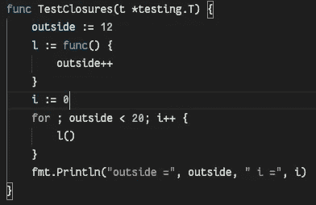*

***i** 和外**的最终值是多少？***

*变量绑定“ *l* ”(对于 lambda)包含一个函数，该函数将变量“*”封闭在*之外，然后循环观察被封闭的变量调用 *l()* ，直到它达到值 20。如果没有闭包，你会认为循环会永远运行下去，因为循环计数器“ *i* ”永远不会被检查。(或者您会认为编译器会抱怨函数范围内未定义的绑定)。运行测试时，我们发现情况并非如此:*

*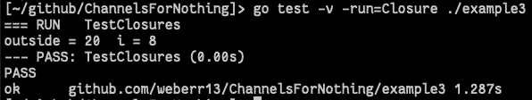*

*显然，测试不会永远运行，也不会编译失败。当你第一次看到它时，这绝对是一个有趣的行为，但是除了重用代码之外，它不一定有用。第一类函数除了存储在绑定中之外还有另一个属性，它们也可以是函数的返回值。请考虑以下情况:*

*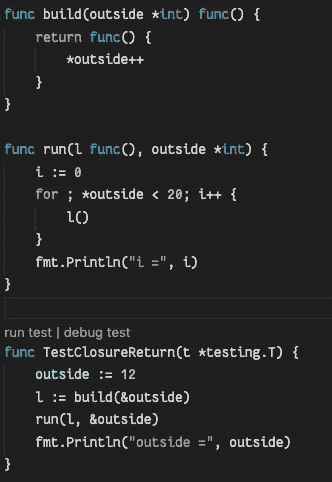*

*从这一点开始，您必须包含引用*

*在前面的代码中，对外部的引用是自动为我们处理的。通过在函数范围之外定义“ *build* ”，我们需要做一些指针工作。*

**

*它确实可以工作，但不如以前优雅*

*虽然这段代码看起来不必要的复杂，但是请注意“run”方法发生了什么:它现在通用于" *l* "的任何实现。例如，让我们更改我们的规范，即循环必须在每次迭代中向“外部”值添加一个变量。使用这种策略，不需要改变“运行”方法:*

*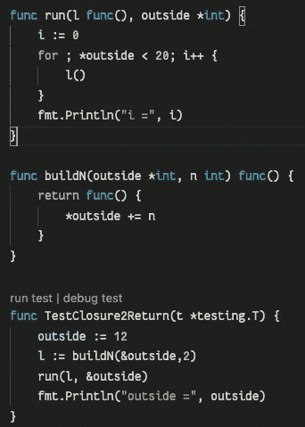*

*“构建”功能会改变，但“运行”功能不会改变*

*虽然" *run* "没有改变，但是它所执行的动作已经与" *l* "的内容解耦，而且传递给构建的**参数现在完全在我们的控制之下:***

*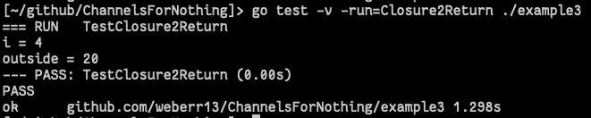*

*现在“外部”每跑两步*

***构造函数***

*在 golang 中，没有构造函数的内置概念，但惯例是创建一个 NewStructName()格式的函数，该函数返回一个带有默认值和分配(如通道和地图)的引用对象。这对这门语言的新手来说可能会不太舒服，而且这不是一个普遍使用的习语。就像上面的例子一样，这个构造函数不需要直接返回一个对象。它可以返回一个函数，这个函数能够用给定的设置构建无数的对象。采取以下措施:*

*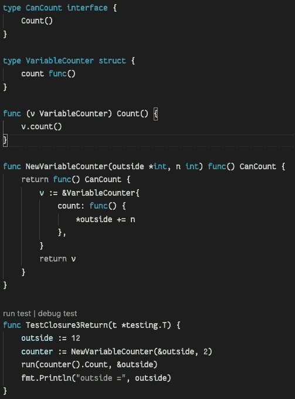*

*“运行”的代码没有任何改变*

*进一步考虑第二个例子中代码的一般性质，我们现在为能够运行函数“ *Count* ”的对象引入一个接口(不是空接口，而是相当一般的接口)。对于接口的特定实现，我们通过构造函数重新实现第二个示例的功能，该构造函数返回的不是结构引用，而是结构引用的*builder*。该构建器仅作为“*运行*的参数调用，并传递对其“*计数*函数的引用。这是一个更加通用的方法，但是我们可以更进一步。*

*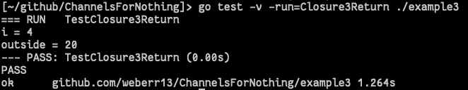*

*前一个示例中的行为被重现*

*现在我们不需要把自己限制在"*运行*"只调用一个函数。我们现在可以构建界面并包含许多功能。*

*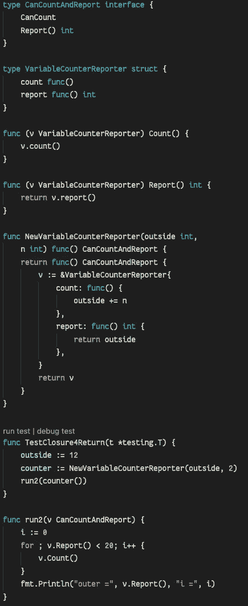*

*Run 不再知道“外部”是什么，我们可以再次删除引用。*

*我们终于回到了第一个实现的所有方面(outside 不再通过引用传递，并且“run”可以通过 report()接口报告秘密变量“outer”)。*

*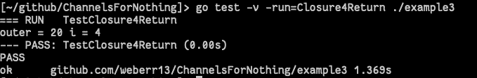*

*表示封闭变量的私有状态的一行打印行。*

## ***一个通用的承诺***

*有了背景如何闭包，第一类函数返回，以及这些返回接口对象的函数的“builder”构造函数；我们有工具来构建一个既不依赖于代码生成也不依赖于类型切换的通用模式(但是将会有一个单独的动态造型，稍后会详细介绍)。*

*假设我们想简单地使用 goroutines 和通道在 golang 中实现 JavaScript“Promise”对象。此外，由于本系列关注的是“actor 模式”，这个承诺应该在通用 actor 中起作用。对于接口，请考虑以下事项:*

*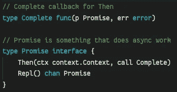*

*为了便于阅读，函数定义是打字的*

*Promise 是实现两个功能的对象的接口:*

*   **然后是*，当异步工作完成时，它调用一个在原始结构上操作的函数。*
*   **Repl* ，它返回一个完成的结构应该被发送的承诺*

*在我们继续之前，你可能已经注意到了一些事情。如果对象是一个接口，那么根据定义它就是一个引用对象。如果引用对象在一个单独的 goroutine 中被操作，那么从一个“Main”例程中读取它不会产生一个竞争条件吗？幸运的是，golang 中的调度程序是与堆绑定在一起的，如果一个对象在通道上从一个 goroutine 发送，并且在别处被接收时已经完成，那么这个对象的“所有权”就交给了接收例程。这允许对象在完成自己的私人工作后通过通道“邮寄自己”。这对于实现可能更有意义:*

*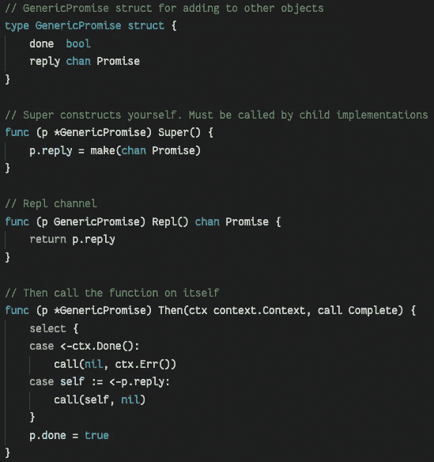*

*超级？比如 python？*

*这个结构将作为 promise 的任何实现的通用主干。子例程对它的使用必须在调用“Then”之后结束，并且上下文用于关闭/超时生存期。*

*闭包示例的“Run”方法将是一个通用 actor，它允许对通用 promise 的实现进行两步操作。一个“工作”函数，完成调用者定义的一些任务，然后以一种变异的状态返回。*

*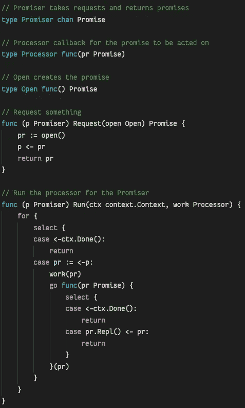*

*“R **epl** 通道是无缓冲的，因此未能调用**然后调用**可能会导致 goroutine 泄漏*

*对于示例实现，必须编写 4 个函数来利用该结构:*

1.  *嵌入“ *GenericPromise* ”的结构。*
2.  *返回开放函数的构造函数。*
3.  *一个" *work* "函数构造器，它返回一个执行应该异步执行的操作的函数。*
4.  *一个" *call* "函数构造器，返回一个作用于已完成工作负载的函数。*

*例如:*

*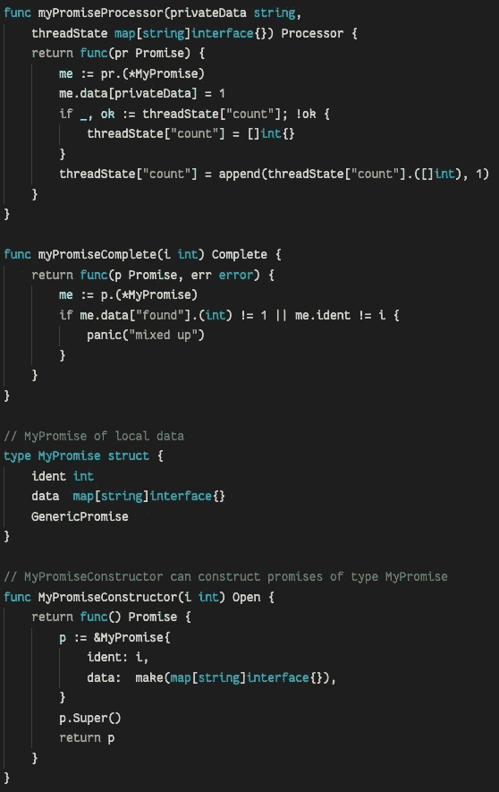*

*到处都是闭包，没有上下文或通道*

*3 个构造函数的参数是任意的，同样地， *MyPromise* 中的数据可以是任何东西，并且不需要以任何方式本质上是线程安全的。*

*您可能会注意到，在处理器和完整的函数构造函数中，确实存在动态强制转换。这与本文前面的方法有两个主要不同之处:*

1.  *只有一种类型被铸造。*
2.  *如果失败了，演员可以惊慌失措。*

*我们可以肯定，如果代码作为一个单元使用，强制转换不会失败。 *open* 函数的 return 必须通过一个接口返回一个 *MyPromise* ，但是这两个函数不会对任何不同的东西进行操作。这些仍然是动态类型转换，但是在这种情况下它们总是安全的。除了进行造型之外，*工作*和*调用*(返回)中剩余的程序代码可以写成好像函数直接修饰*我的承诺*。*

*利用*承诺者*分为两种用例:同步和异步；*

*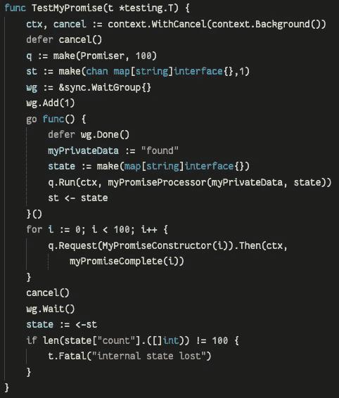*

*每个请求被“连接”，然后按顺序*

*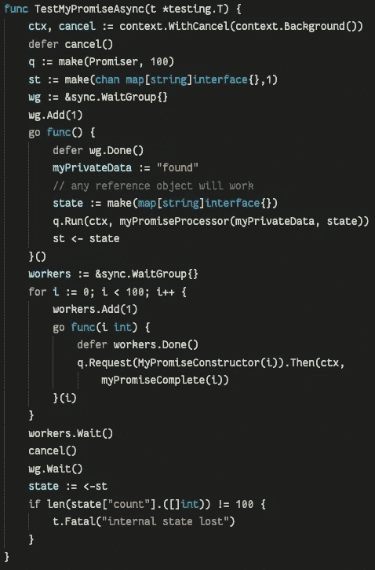*

*请求是异步发出和“加入”的*

*在这两种情况下,“Run”方法都在上下文运行时被阻塞。一旦取消,“参与者”goroutine 的最后一个动作是将内部引用对象“邮寄”回主例程进行解析。虽然这似乎充满了共享冲突，但实际上共享对象的所有规则都得到遵守:*

*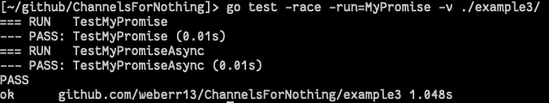*

*神奇！*

## ***结论***

*这种方法表明，您可以在 golang 中为线程实现更高级别的抽象。我还认为它回答了一个更根本的问题:在 golang 中泛型有必要吗？虽然围绕泛型的争论很长，有时超出了我的理解范围，但我相信，如果没有代码生成，它们实际上并不是编写泛型代码所必需的。通过从对象与程序其余部分交互的每一步返回类型化函数，通用行为可以在任意应用程序代码上使用。*

*所有示例都在 Apache 2.0 许可下获得许可，并可在[https://github.com/weberr13/ChannelsForNothing/](https://github.com/weberr13/ChannelsForNothing/)获得*