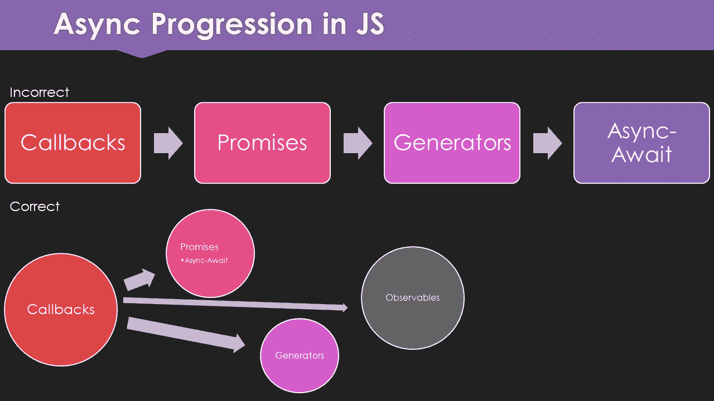

# 承诺:权威指南

> 原文：<https://itnext.io/promises-the-definitive-guide-6a49e0dbf3b7?source=collection_archive---------2----------------------->

## 没有你想象的那么强大

*我不想指名道姓，但我读过的许多关于 JavaScript 中的异步的文章，尤其是那些在 ES2015 (ES6)推出时的文章，都是完全错误的。我将通过展示对 JavaScript 中 async 工作方式的真实理解来澄清这个错误。*

*这一系列文章是基于我做的一个关于 Redux-Observable* *的演讲的幻灯片。我想更进一步，解释异步是如何工作的，以及为什么它是 JavaScript 编码的基础。*

# 能力最差的方法

承诺是惊人的，但极其有限。这些年来，我已经做了很多承诺，甚至在它们作为原生 JavaScript 的一部分在 2015 年普及之前。我最喜欢的一点是他们如何让异步变得更容易掌握。它修复了回调问题，并通过提供一个可以从上到下阅读的线性 API，减少了由承诺引起的间接性。

算是吧。

那么，为什么承诺是“最没有能力”的呢？因为它们有很多缺点。当你使用承诺时，你会看到更多的这些缺点，并渴望改正。虽然我以前用过蓝鸟，但它不能解决所有问题；这只是让承诺更加通用。

# 混乱

过去，存在许多不同的 promise 实现。我最熟悉 jQuery 版本，并对其进行了高度定制，使其更像是通过管道多次发送数据。它没有遵循 A+规范，但最终在 1.8 中提供了这样做所必需的方法。

安古拉杰也是如此。当它问世时，它使用了一种与我们今天所知的承诺完全不同的方法。版本 1.6 为 A+承诺打开了大门，版本 1.7 完全抛弃了旧的方法！

你可能熟悉或者听说过蓝鸟。这是一个非常棒的库，它添加了 es 2015 promises 实现中目前缺少的许多功能。甚至 ES2018 版本只增加了`Promise.prototype.finally`；没有什么像蓝鸟提供的。

同样，严格来说，蓝鸟是你的图书馆。但是外面并不只有承诺。JavaScript 中还存在其他异步方法，虽然前景很好，但它们被可观的东西取代了。不过，到了紧要关头，A+ `Promise`是 ES2015 的原生版本，它对 observables 等任何需要第三方库的东西都有明确的限制。

# 解决还是拒绝？这是个问题。

从来没有人问过这个问题。这些方法是什么，我如何访问它们？

如果你从回拨中创造一个承诺，你会像这样创造一个`Promise`:

`new Promise`接受回调，所以就像回调一样，你需要把你的`try` - `catch`代码放在回调中，而不是放在回调之外。

令人惊讶的是，当创建一个新的承诺时，你不仅给了它一个回调，而且在你的回调函数中也给了你两个回调。这就是我在[回调:权威指南](/the-definitive-guide-to-callbacks-in-javascript-44a39c065292)中提到的:JavaScript 中的所有异步都基于回调。`resolve`给出一个可输出的结果，而`reject`向承诺链抛出一个错误，但不返回错误。下一节将详细介绍这一点。

不过我很少更新`Promise`。相反，我选择语义上的`Promise.resolve`和`Promise.reject`。有时它们不符合您的需要，比如上面的例子，或者如果您从回调进行转换，但是它们对于调试非常好，并且当您需要从平面值创建承诺时非常有用。就像直接调用`resolve`和`reject`回调一样。

它们看起来有点像这样:

# 然后表格

承诺被称为“thenable ”,这意味着您可以将一组`then`语句链接起来，每个语句都接收前一个回调的返回值。在我之前关于回调的文章中，你会记得我说过有可能得到回调的返回值。因此，如果您保持回调同步，您就能够从回调中获取返回值，而不是调用另一个回调。

这正是 promise 的`then`函数使用的过程。它接受一个回调(也称为处理程序)，同步执行它，接受返回值，并将其传递给链上的下一个`then`。如果任何一个回调出错，它将遍历整个链，直到找到一个`catch`(或者一个`then`的第二个参数)，并调用它的回调方法。

## “catch”之后会发生什么？

对大多数人来说，这是奇怪的部分。我保证大多数 JavaScript 开发人员不知道这些信息。

如果你从一个`catch`中`throw`了一个错误，并且在链的某处还有另一个`catch`，第二个捕捉将得到那个错误。但是假设你没有抛出一个错误，取而代之的只是`console.error`。太糟糕了，现在你要去点击链中的下一个`then`。

因此，虽然你可以继续处理错误，这很酷，但最糟糕的是你会一直处理下去。没有办法停止一个承诺，因为任何一个`then`都会被调用，除非你已经完成了所有的任务，并且任何一个错误都会触发一个`catch`，它可以继续下一个`catch`或者`then`。

这在过去已经抓住了我，并且是我停止在产品代码中使用承诺的核心原因之一(现在我使用 observables)。如果你的整个应用程序是由一长串的承诺组成的，那么情况会变得更糟。这可能会非常棘手，但至少你的应用程序不会停止处理！👺

## 两个“then”参数还是“catch”？

承诺的`then`方法可以接受两个参数。我只推荐给它一个参数，因为第二个参数实际上和在`then`后面加上`catch`是一样的。

以这两个例子为例:

它们是完全一样的东西，但是一个更好读，更易维护，并且在调试时不太可能被遗漏。相信我，当你处理复杂的异步 bug 时，你会想要尽可能少的疯狂代码。

不管出于什么原因，如果你的`then`中有很长的匿名函数，你每次都会错过第二个参数。这是你团队中所有的开发人员，包括 6 个月后的你。

老实说，在你的项目中做最适合你的团队的事情，但是我更喜欢语义的`catch`而不是非语义的双参数`then`，我真的认为你也应该这样做。如果没有一个可笑的好理由，我绝不会允许另一个开发人员使用双参数版本。

# 回报承诺

为了避免回调，需要注意的是`then`可以处理返回值和另一个承诺。当返回一个值时，它被传递到下一个`then`，但是当返回一个承诺时，它实际上将你的下一个`then`切换到承诺沿着链传递的值；而不是承诺本身。

看起来是这样的:

注意你如何回复已解决和拒绝的承诺，它们会像平常一样回复下一个`then`或`catch`。这是一个强大的功能，因为它可以让你始终如一地保持你的承诺标签在大多数情况下都在左边。

# 回调-地狱

我真的见过有人写这样的回电——让承诺见鬼去吧:

然后，作为一个聪明的承诺开发者，你会进去解决它:

当你有范围问题时，问题就来了。例如，您可能已经在消息函数中使用了服务器和连接对象，因为您需要知道将响应发送回哪个连接以及调用了哪个服务器。即使您清理了代码，也丢失了以前值的范围。

有几种方法可以解决这个问题，但是最干净的方法之一可能是每次都将它们组合成一个新的对象:

我以前用过这种方法，但从来没有喜欢过。当你因为你的`then`回调变得太大而需要分割东西时，它就派上用场了。虽然它可以让你避免回调，但它是否真的更好还值得商榷。

这与我在[回调:最终指南](/the-definitive-guide-to-callbacks-in-javascript-44a39c065292)中谈到的情况完全相同。回调-地狱不一定是一件坏事。尽管有人告诉你承诺可以规避，但事实并非如此。

# 反模式

就像回调一样，承诺对`try` - `catch`不起作用，不是大多数人使用它们的方式。

这里有一个您通常会看到的反模式:

这应该写成:

这是为什么呢？因为承诺总是异步的。绝对没有办法像你会香草回电一样同步作出承诺。知道这一点很重要，因为不使用`Promise.prototype.catch`方法会让你。我经常在 Node.js 应用程序中遇到这类问题，因为大多数浏览器开发人员经常使用`Promise.prototype.catch`。

# 最后

回到 ES2018 之前，我们没有急需的`finally`方法，现在我们 ***终于*** 有了。简单地说，这个方法所做的就是在一对`then`和`catch`周围添加语法糖，但是不传递值。这类似于 RxJS 中的`finalize`操作符，遗憾的是，它也不取值。考虑到我见过的没有它会导致问题的 promise 代码的数量，我想说它是 ES2018 的一个受欢迎的补充。

我要再说一遍，`finally`回调不接收值。它不像 RxJS 中的`tap`，它是一个无论代码成功还是出错都只帮助清理的方法。

它看起来是这样的:

这可能不是你所期望的，但是每次一个`finally`被传递，它就会执行。所以，如果你把它放在一串连锁的`then`和`catch`语句之前，它会在它们之前执行。除非`then`，否则出错时也会执行。通常这些函数会传递到下一个`catch`，但是它们也会执行所有的`finally`函数。

在现实世界的应用程序中，如果你没有`finally`，你可能会产生一堆内存泄漏和永无止境的加载指示器等等。这是因为大多数人从来不用`catch`来结束他们的承诺，而只用`then`。如果你的承诺出错，你的最后一个`then`删除了你的装载指示器，它将永远不会消失。

虽然`finally`不一定要出现在承诺的末尾，但拥有它可以让你用它来代替`then`，并确保你的应用在完成后清理干净。

## 尝试-捕捉-最终

如果你还不知道的话，`try` - `catch`还有一个`finally`的方法。看起来是这样的:

在这种情况下，必须按照`try`，然后`catch`，然后`finally`的顺序。完全省略`catch`或`finally`是可能的，但不能两者都省略。

如你所见，无论你点击`try`还是`catch`，它都会执行。为什么会有这种情况？您完全可以在您的`try` - `catch`语句之后登录，而不是使用`finally`。这是最重要的一点。如果您的`catch`抛出一个错误，那么您的执行将立即停止，您的`console.log`将永远不会发生。to 确保即使在抛出一个错误后，你仍然可以执行一些东西。

那你为什么不把代码放在`catch`而不是`finally`里呢？因为您也想在您的`try`中使用该代码。这可以防止代码重复，并确保只要`try` - `catch` - `finally`语句存在，您的代码就会一直执行。

Promises 更多地使用`finally`作为一个更干净的助手函数，但是在这两种情况下，您仍然可能有一个需要关闭的数据库连接。这是它将被执行的地方(即使在`catch`中抛出一个错误之后也是如此)来关闭那个连接。这在这种情况下是不可或缺的。

# 一切为了种族，种族为了一切

如果您不知道，promise API 中还隐藏了另外两个方法:`Promise.race`和`Promise.all`。它们都是处理承诺的`Array`的方法——更具体地说，是承诺的迭代器，但我们不去那里。

## 全部

`Promise.all`获取承诺列表，等待所有承诺返回值，并将这些值的数组发送给下一个`then`回调:

确保在使用`Promise.all`时，传递一个承诺数组，因为它只接受一个参数。您的结果也返回到一个数组中，其中每个值都是前一个值的解析值。

如果有，我的意思是任何一个承诺失败，你的整个`Promise.all`都处于拒绝(出错)状态，你的错误消息只是来自第一个出错的承诺。如果你有一个以上的错误，你就无从知道了。

## 人种

`Promise.race`获取承诺列表，并获取第一个承诺来产生一个值。如果你有一堆，其他的基本上会被取消:

这可能是`Promise.race`最常见的用例。我自己并没有经常使用这个操作符，但是它也有一些缺陷。首先，你必须记住像`Promise.all`一样给它传递一个数组。第二，如果其中一个承诺了错误，这无关紧要，除非该错误首先发出。

所以如果你有两个承诺，一个成功，另一个错误，你会得到成功值。如果你有两个承诺，在另一个成功之前有一个错误，你的`Promise.race`将处于拒绝状态。这是一个很大的怪癖，也可能是使用`Promise.race`的人感到沮丧的原因。

# 蓝鸟

有很多 promise 库，但是到目前为止，最流行的，也可能是您将在产品中实际看到的，是 Bluebird。这是一个非常棒的 promise 库，有很多特性，但是除非你在 Node.js 空间，否则你可能看不到它。

JavaScript 原生承诺不是蓝鸟承诺，所以你必须转换它们。

使用这个库有很多好处，最好的一个是`Bluebird.promisify`函数。

就我个人而言，我不建议遵循蓝鸟的官方最佳实践将其导入到您的项目中，为了您的利益，我已经写了一整篇关于它的文章:
[蓝鸟的不良实践文档](/bluebirds-docs-suck-f9cc94b1af9)

# 许多缺点

我所说的大部分都是优点，但是我给这篇文章加了副标题，意思是承诺有点糟糕。为什么？当他们看起来比试镜更好的时候会有什么不好呢？

## 一次搞定

首先，它们只能发射一次。正是因为这个原因，回调优于承诺，因为它们可以随着时间的推移处理事件。承诺受限于一次发射，这是我在很多场合遇到的致命缺陷。我想，每当我在大规模应用程序中做出承诺时，它就会出现。

## 调试是痛苦的

控制台日志记录(接入流)是困难的。调试承诺烂透了。虽然您可能认为`Promise.prototype.finally`正是我们要找的，但是它没有从 promise 链接收任何数据，所以它不能用于日志目的。蓝鸟对此也没有解决方案。

RxJS observables 最强大的一点是，您可以在其操作的任何一点接入流。每个`Promise.prototype.then`都相当于一个`map`和`switchMap`，在这里你可以返回一个值或者另一个承诺。遗憾的是，这修改了链中传递的值，并且需要更复杂的逻辑来获得一些调试语句，如果操作不正确，这种逻辑会导致维护问题。

只有在调试时，我使用的作弊方法是这样的:

## 它一直走啊走啊…

承诺不会停止执行。这是一个捕捉错误和之后的问题。他们穿过链条，直到什么都没有了，而且完全没有办法中途停下来。

您可以为 promise 对象本身分配一个“停止处理”值，但是这样您要么必须扩展`Promise`类，要么将每个`then`、`catch`和`finally`包装在一个“检查 promise 是否停止”函数中。

## 立即执行

承诺在创造时立即执行。虽然可能不明显，但是如果你在 promise 声明中有一个`setTimeout`，那么它一存在就会执行，而不是等待你的第一个`then`存在。如果你没有预料到，这可能会造成一些损害。唯一的解决方法是创建一个函数，然后返回包装了`setTimeout`的承诺。

## 从不同步

承诺即使和`Promise.resolve`也从来不同步。这意味着在我们等待正式的 ES 实现时，他们不能被替换为本地管道操作者。

在我的文章中有更多关于这个的内容:
[一个表情符号爱好者的函数式编程指南:第 4 部分](/an-emoji-lovers-guide-to-functional-programming-part-4-735c17ca4113)

## 并不能完全消除回调——见鬼

同样，回调需要闭包来摆脱回调地狱，承诺需要将返回数据映射到更复杂的对象中。由于变量的作用域，很容易陷入类似的回调——就像回调一样糟糕。

## 在“那时”很难传递承诺

如果你真的想把一个承诺——而不是它的值——传递给下一个`then`，你必须把它包装在一个数组或对象中，这样它就不会被自动转换。大多数人不会意识到这一点，可能会花几个小时试图找出为什么他们的代码不工作。我知道我有。

## 语义学

`then`不是语义。当然，从语义上说“这发生了，`then`这发生了”，但这不是我的意思。您传递到 promise 的`then`中的每个函数要么是匿名的(即未命名的),要么是存在于您的应用程序中其他地方的已命名的函数。这导致了你在回调中发现的同样的间接性，由于操作的线性，这种间接性只会稍微好一点。

# 结论

如果我有的只是承诺，我会利用它们。在我的书中，它们比回调更受欢迎，在我坚持使用它们的 3 年里，它们帮助我管理 JavaScript 中的异步，这是一个巨大的进步，但在我过去一年多写的所有东西中，我选择了 observables，因为它们很好，超出了你可以从承诺中期望的任何东西的完整包。

你的承诺越简单，就越容易实现。你的承诺越长，在应用程序中传递的次数越多，就越难追踪，也越不可靠。

**我喜欢承诺吗？** 是的。

我认为可观察的更好吗？
当然。

如果我在使用回调，我会答应吗？
大概再也不会了。

# 更多阅读

我还会收到更多这样的异步文章！前一个是关于回调的:

[试听:权威指南](/the-definitive-guide-to-callbacks-in-javascript-44a39c065292)

如果你喜欢你所读的，请查看我关于类似的令人大开眼界的主题的其他文章:

*   [特性标志:真正敏捷](/feature-flags-be-truly-agile-820ff50294c)
*   [用食物表情符号制作便便](/an-emoji-lovers-guide-to-functional-programming-part-1-241d8d4c9223)
*   [使用 React 路由器的异步 React&暂停](/async-react-using-react-router-suspense-a86ade1176dc)
*   [使用转换器加速 JavaScript 数组](/using-transducers-to-speed-up-javascript-arrays-92677d000096)