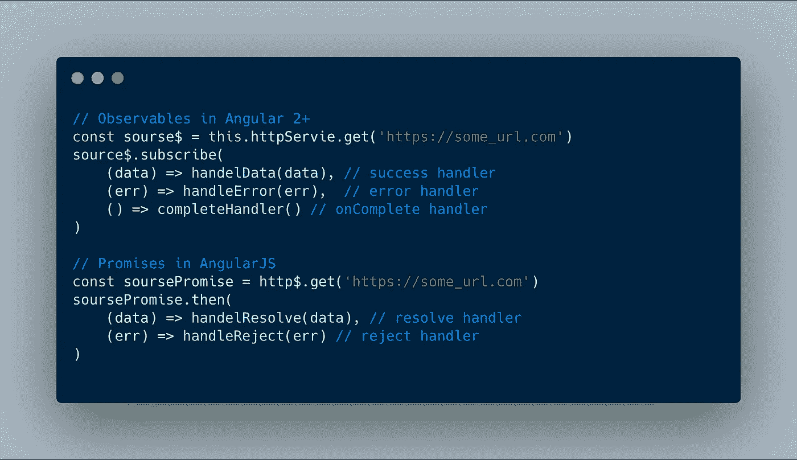
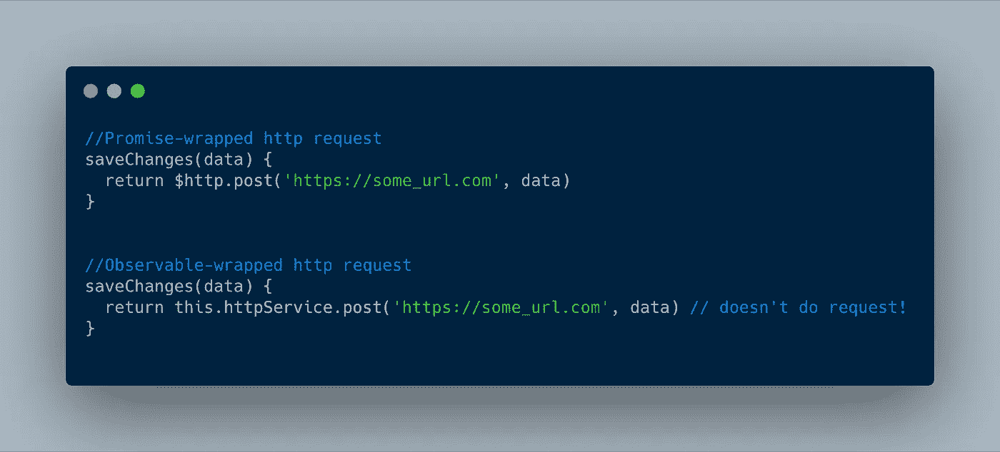
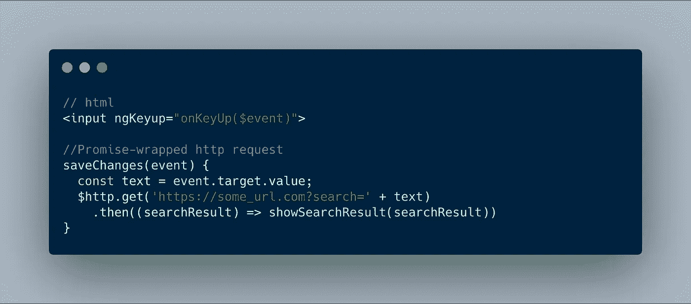
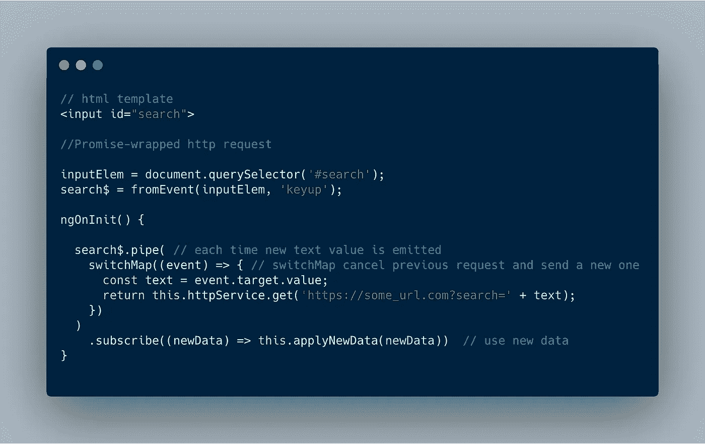
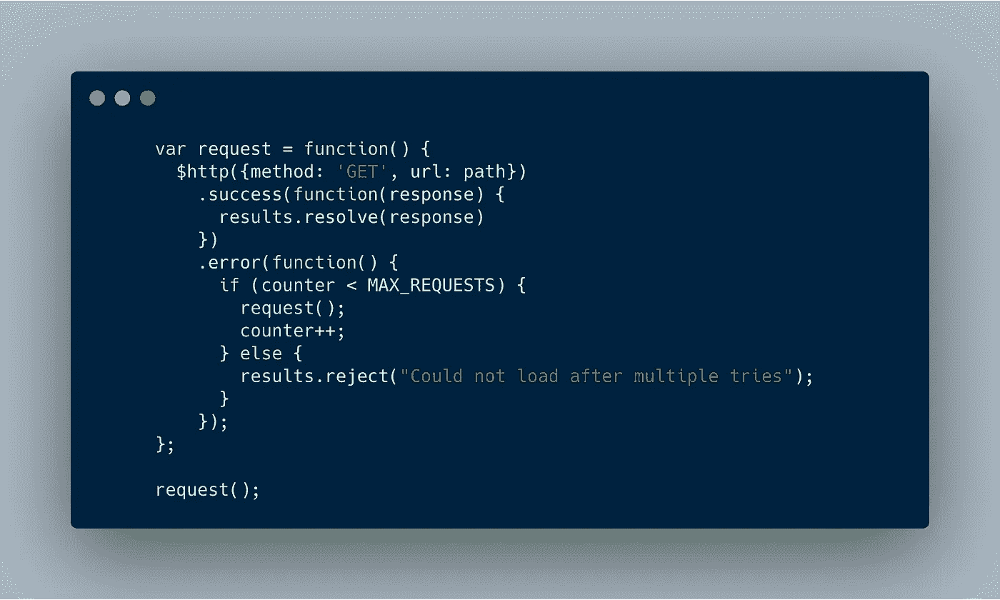
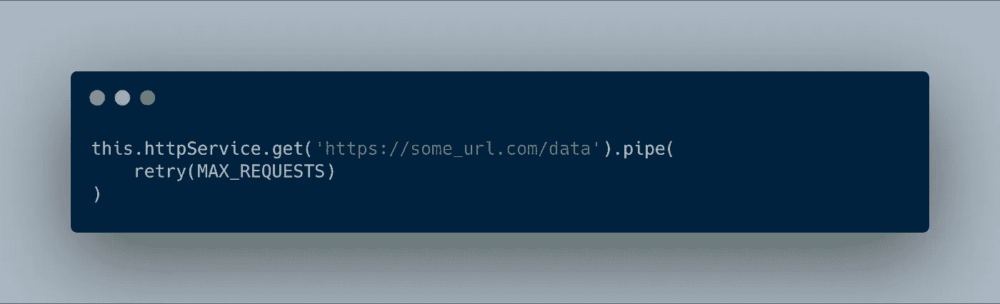
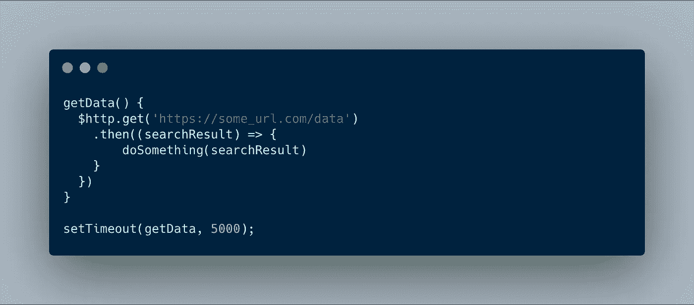
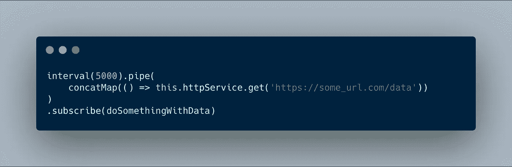

# 角到角偏移的前景与可观测性

> 原文：<https://itnext.io/promises-vs-observables-for-angularjs-to-angular-migration-1161afacef7e?source=collection_archive---------6----------------------->

AngularJS(Angular 1)大量使用 Promises 进行 HTTP 调用，而 Angular 2+将网络调用包装在 Observables 中。这导致一些开发人员在将项目从 AngularJS 迁移到 Angular 2+时遇到了特定的问题。我想在这里解决这些问题，并通过回顾可观察到的和承诺之间的典型差异来描述为什么它们会出现。


可观——为网络开发人员提供更多功能。(图片由[媒体修改器](https://pixabay.com/ru/users/mediamodifier-1567646/)拍摄)

```
**Pre-requisites:** you should know JS Promises
```

**可观察的事物和承诺——简短介绍**

乍一看——可观察值只是高级承诺:承诺发出一个值并完成(resolve)，可观察值发出 0、一个或多个值并完成(发出和完成是不同的动作)。AngularJS 和 Angular 中的 HTTP 服务只提供一个值——所以在这种情况下，两个框架的工作方式非常相似。



[片段链接](https://carbon.now.sh/?bg=rgba(171%2C%20184%2C%20195%2C%201)&t=cobalt&wt=none&l=javascript&ds=true&dsyoff=20px&dsblur=68px&wc=true&wa=false&pv=56px&ph=56px&ln=false&fm=Hack&fs=14px&lh=133%25&si=false&es=2x&wm=false&code=%252F%252F%2520Observables%2520in%2520Angular%25202%252B%250Aconst%2520sourse%2524%2520%253D%2520this.httpServie.get(%27https%253A%252F%252Fsome_url.com%27)%250Asource%2524.subscribe(%250A%2509(data)%2520%253D%253E%2520handelData(data)%252C%2520%252F%252F%2520success%2520handler%250A%2520%2520%2509(err)%2520%253D%253E%2520handleError(err)%252C%2520%2520%252F%252F%2520error%2520handler%250A%2520%2520%2520%2520()%2520%253D%253E%2520completeHandler()%2520%252F%252F%2520onComplete%2520handler%250A)%250A%250A%252F%252F%2520Promises%2520in%2520AngularJS%250Aconst%2520soursePromise%2520%253D%2520http%2524.get(%27https%253A%252F%252Fsome_url.com%27)%250AsoursePromise.then(%250A%2509(data)%2520%253D%253E%2520handelResolve(data)%252C%2520%252F%252F%2520resolve%2520handler%250A%2520%2520%2509(err)%2520%253D%253E%2520handleReject(err)%2520%252F%252F%2520reject%2520handler%250A)%250A)

而且有人可能认为只要把 ***$http*** 改名为***this . httpservice***， ***然后*** 改名为 ***subscribe*** 大家都会高兴。在非常简单的应用程序中，它甚至可以工作——但是如果你的应用程序做的不仅仅是“Hello world”——请注意这些差异。

## #1 渴望与懒惰

看看下面的例子:



[片段链接](https://carbon.now.sh/?bg=rgba(171%2C%20184%2C%20195%2C%201)&t=cobalt&wt=none&l=javascript&ds=true&dsyoff=20px&dsblur=68px&wc=true&wa=false&pv=56px&ph=56px&ln=false&fm=Hack&fs=14px&lh=133%25&si=false&es=2x&wm=false&code=%252F%252FPromise-wrapped%2520http%2520request%250AsaveChanges(data)%2520%257B%250A%2520%2520return%2520%2524http.post(%27https%253A%252F%252Fsome_url.com%27%252C%2520data)%250A%257D%250A%250A%250A%252F%252FObservable-wrapped%2520http%2520request%250AsaveChanges(data)%2520%257B%250A%2520%2520return%2520this.httpService.post(%27https%253A%252F%252Fsome_url.com%27%252C%2520data)%2520%252F%252F%2520doesn%27t%2520do%2520request!%250A%257D%250A)

当我调用 **saveChanges** 方法时——第一个带有承诺包装请求的例子将按预期工作。但是在秒可观察包装的例子中，什么都不会发生，因为可观察是**懒惰评估的**，而承诺是**急切评估的。**

这意味着 Promises 不关心他们是否有一些订阅者来获得他们的结果。但是，可观察的事物(准确地说，是冷可观察的事物)只有在我们认同它们的情况下才会变冷。在上述情况下，您应该订阅由 **saveChanges** 函数返回的 Observable。

```
saveChanges(data).subscribe()
```

为了保持对它的关注——使用 Nicholas Jamieson 的 [rxjs-tslint-rules](https://github.com/cartant/rxjs-tslint-rules/blob/master/source/rules/rxjsNoIgnoredObservableRule.ts) 中的*rxjs-no-ignored-observable*规则。

## **#2 承诺不可取消，可观测量可退订**

同样，从输入文本改变时我们在后端搜索的例子开始:



[片段链接](https://carbon.now.sh/?bg=rgba(171%2C%20184%2C%20195%2C%201)&t=cobalt&wt=none&l=javascript&ds=true&dsyoff=20px&dsblur=68px&wc=true&wa=false&pv=56px&ph=56px&ln=false&fm=Hack&fs=14px&lh=133%25&si=false&es=2x&wm=false&code=%252F%252F%2520html%250A%253Cinput%2520ngKeyup%253D%2522onKeyUp(%2524event)%2522%253E%250A%2520%2520%250A%252F%252FPromise-wrapped%2520http%2520request%250AsaveChanges(event)%2520%257B%250A%2520%2520const%2520text%2520%253D%2520event.target.value%253B%250A%2520%2520%2524http.get(%27https%253A%252F%252Fsome_url.com%253Fsearch%253D%27%2520%252B%2520text)%250A%2520%2520%2520%2520.then((searchResult)%2520%253D%253E%2520showSearchResult(searchResult))%250A%257D)

这里的缺点是什么——如果用户继续输入，您不能拒绝前一个请求的结果(去抖动会使这个问题稍微减轻，但不会消除它)。还有一个问题——竞争条件是可能的(当后面的请求结果比前面的更快返回时——所以我们得到不正确的响应显示)。

用 [**switchMap**](https://rxjs-dev.firebaseapp.com/api/operators/switchMap) 操作符可以相当优雅地避免这种顾虑:



[片段链接](https://carbon.now.sh/?bg=rgba(171%2C%20184%2C%20195%2C%201)&t=cobalt&wt=none&l=javascript&ds=true&dsyoff=20px&dsblur=68px&wc=true&wa=false&pv=56px&ph=56px&ln=false&fm=Hack&fs=14px&lh=133%25&si=false&es=2x&wm=false&code=%252F%252F%2520html%2520template%250A%253Cinput%2520id%253D%2522search%2522%253E%250A%2520%2520%250A%252F%252FPromise-wrapped%2520http%2520request%250A%250AinputElem%2520%253D%2520document.querySelector(%27%2523search%27)%253B%250Asearch%2524%2520%253D%2520fromEvent(inputElem%252C%2520%27keyup%27)%253B%250A%250AngOnInit()%2520%257B%250A%2520%2520%250A%2520%2520search%2524.pipe(%2520%252F%252F%2520each%2520time%2520new%2520text%2520value%2520is%2520emitted%250A%2520%2520%2509switchMap((event)%2520%253D%253E%2520%257B%2520%252F%252F%2520switchMap%2520cancel%2520previous%2520request%2520and%2520send%2520a%2520new%2520one%250A%2520%2520%2520%2520%2520%2520const%2520text%2520%253D%2520event.target.value%253B%250A%2520%2520%2520%2520%2520%2520return%2520this.httpService.get(%27https%253A%252F%252Fsome_url.com%253Fsearch%253D%27%2520%252B%2520text)%253B%250A%2520%2520%2520%2520%257D)%250A%2520%2520)%250A%2520%2520%2520%2520.subscribe((newData)%2520%253D%253E%2520this.applyNewData(newData))%2520%2520%252F%252F%2520use%2520new%2520data%250A%257D%250A)

在这里，我们将输入文本转换成可观察到的排放值。每次发送新的文本值时，switchMap operator 将取消之前的网络请求(如果尚未完成)并发送新的请求。

*Packtpub.com 和我准备了一整套* [***RxJS 课程***](https://www.udemy.com/hands-on-rxjs-for-web-development/) *还有许多其他细节，告诉你如何用这个神奇的库解决你的日常开发任务。它对初学者来说可能很有趣，但也包含高级主题。* [***看一看！***](https://www.udemy.com/hands-on-rxjs-for-web-development/)

## #3 没有内置的承诺重试或重复逻辑。 [**重复**](https://rxjs-dev.firebaseapp.com/api/operators/repeat) **'** 和' [**重试**](https://rxjs-dev.firebaseapp.com/api/operators/retry) **'** 操作符为可观测量。

您可以用承诺实现重试逻辑，但这看起来有点麻烦:



[片段链接](https://carbon.now.sh/?bg=rgba(171%2C%20184%2C%20195%2C%201)&t=cobalt&wt=none&l=javascript&ds=true&dsyoff=20px&dsblur=68px&wc=true&wa=false&pv=56px&ph=56px&ln=false&fm=Hack&fs=14px&lh=133%25&si=false&es=2x&wm=false&code=%2520%2520%2520%2520%2520%2520var%2520request%2520%253D%2520function()%2520%257B%250A%2520%2520%2520%2520%2520%2520%2520%2520%2524http(%257Bmethod%253A%2520%27GET%27%252C%2520url%253A%2520path%257D)%250A%2520%2520%2520%2520%2520%2520%2520%2520%2520%2520.success(function(response)%2520%257B%250A%2520%2520%2520%2520%2520%2520%2520%2520%2520%2520%2520%2520results.resolve(response)%250A%2520%2520%2520%2520%2520%2520%2520%2520%2520%2520%257D)%250A%2520%2520%2520%2520%2520%2520%2520%2520%2520%2520.error(function()%2520%257B%250A%2520%2520%2520%2520%2520%2520%2520%2520%2520%2520%2520%2520if%2520(counter%2520%253C%2520MAX_REQUESTS)%2520%257B%250A%2520%2520%2520%2520%2520%2520%2520%2520%2520%2520%2520%2520%2520%2520request()%253B%250A%2520%2520%2520%2520%2520%2520%2520%2520%2520%2520%2520%2520%2520%2520counter%252B%252B%253B%250A%2520%2520%2520%2520%2520%2520%2520%2520%2520%2520%2520%2520%257D%2520else%2520%257B%250A%2520%2520%2520%2520%2520%2520%2520%2520%2520%2520%2520%2520%2520%2520results.reject(%2522Could%2520not%2520load%2520after%2520multiple%2520tries%2522)%253B%250A%2520%2520%2520%2520%2520%2520%2520%2520%2520%2520%2520%2520%257D%250A%2520%2520%2520%2520%2520%2520%2520%2520%2520%2520%257D)%253B%250A%2520%2520%2520%2520%2520%2520%257D%253B%250A%250A%2520%2520%2520%2520%2520%2520request()%253B)

而相同代码的可观察性会短得多:



[片段链接](https://carbon.now.sh/?bg=rgba(171%2C%20184%2C%20195%2C%201)&t=cobalt&wt=none&l=javascript&ds=true&dsyoff=20px&dsblur=68px&wc=true&wa=false&pv=56px&ph=56px&ln=false&fm=Hack&fs=14px&lh=133%25&si=false&es=2x&wm=false&code=this.httpService.get(%27https%253A%252F%252Fsome_url.com%252Fdata%27).pipe(%250A%2509retry(MAX_REQUESTS)%250A))

在我的文章中阅读更多关于重复和重试操作符的用例。

## #4 少量承诺组合工具。Observables 为此提供了各种各样的操作符。

对于承诺，您可以组合结果的所有可能性有:

**Promise.all** —等待所有承诺被解析，然后提供结果数组。

**Promise.race** —等待其中一个承诺得到解决，并返回结果。

可观测量为组合提供了非常丰富的弹药:

**combineLatest(observable1，observable2，…)** —等待任何一个可观察对象发出并提供所有可观察对象最后发出的值的数组(结果:[value_obs1，value_obs2，..]).非常好，如果你应该从几个不同的来源更新页面上的新数据。

**observable1 . pipe(*with latest from*(observable2)**—对 observable 1 的每个值，还提供 observable 2 的最后一个发出的值(结果:[value_obs1，value_obs2])。

**forkJoin(observable1，observable2，…)** — analog for Promise.all —等待所有可观察值完成，然后发出所有自变量可观察值的最后一个值的数组。

**zip** ..]).

**race(observable1，observable2，...)—** 返回一个可观测值，该可观测值反映了第一个可观测到的发射物品的源。

**merge(observable1，observable2，…)——**订阅每个可观察的参数，并从所有这些参数中重新发出值。

**switch all**——如果之前的观察没有完成——取消它并订阅新的。

**concat(** observable1，observable2，... **)** —仅在前一个可观察序列完成后开始下一个可观察序列(在每个特定的可观察序列完成后逐一发出值)

还有更多( [switchMap](https://rxjs-dev.firebaseapp.com/api/operators/switchMap) ，mergeMap， [partition](https://rxjs-dev.firebaseapp.com/api/index/function/partition) ， [iif](https://rxjs-dev.firebaseapp.com/api/index/function/iif) ， [groupBy](https://rxjs-dev.firebaseapp.com/api/operators/groupBy) ， [window](https://rxjs-dev.firebaseapp.com/api/operators/window) 等)

您可以在此了解有关这些运营商的更多信息:

1.  [*学会将 RxJs 序列与超级直观的交互图结合*](https://blog.angularindepth.com/learn-to-combine-rxjs-sequences-with-super-intuitive-interactive-diagrams-20fce8e6511)
2.  [官方文件举例](https://rxjs-dev.firebaseapp.com/api)
3.  “网络开发实践 RxJS”[视频课程](https://www.packtpub.com/web-development/hands-rxjs-web-development-video)。

## #5 容易防止具有可观察性和难以承诺的竞态条件。

假设我们定期向网络请求更新数据。但是在某些情况下，后面的请求结果会比前面的结果返回得更快，所以我们得到的错误(前面请求的)响应显示为最后一个。



[片段链接](https://carbon.now.sh/?bg=rgba(171%2C%20184%2C%20195%2C%201)&t=cobalt&wt=none&l=javascript&ds=true&dsyoff=20px&dsblur=68px&wc=true&wa=false&pv=56px&ph=56px&ln=false&fm=Hack&fs=14px&lh=133%25&si=false&es=2x&wm=false&code=getData()%2520%257B%250A%2520%2520%2524http.get(%27https%253A%252F%252Fsome_url.com%252Fdata%27)%250A%2520%2520%2520%2520.then((searchResult)%2520%253D%253E%2520%257B%250A%2520%2520%2509%2509doSomething(searchResult)%250A%2520%2520%2520%2520%257D%250A%2520%2520%257D)%250A%257D%250A%250AsetTimeout(getData%252C%25205000)%253B)

此代码可能会受到竞争条件问题的影响。

为了防止可观察包装的请求出现这种情况，我们可以使用 [concatMap](https://rxjs-dev.firebaseapp.com/api/operators/concatMap) 操作符。



[片段链接](https://carbon.now.sh/?bg=rgba(171%2C%20184%2C%20195%2C%201)&t=cobalt&wt=none&l=javascript&ds=true&dsyoff=20px&dsblur=68px&wc=true&wa=false&pv=56px&ph=56px&ln=false&fm=Hack&fs=14px&lh=133%25&si=false&es=2x&wm=false&code=interval(5000).pipe(%250A%2509concatMap(()%2520%253D%253E%2520this.httpService.get(%27https%253A%252F%252Fsome_url.com%252Fdata%27))%250A)%250A.subscribe(doSomethingWithData))

**concatMap** 只有在前一个完成并处理后，才会进行下一个网络调用。当然，如果您不需要以前的结果，那么可以使用 switchMap(如本文的第一个示例)。

## 结论

在从 AngularJS(使用网络调用的承诺)迁移到 Angular 2+(使用可观察的)的过程中，您应该意识到承诺和可观察的可能差异。希望我的文章能帮助你澄清这个话题。现在是时候迁徙了！

喜欢这篇文章？ [**发微博**](https://clicktotweet.com/U46K2) 和我一起上 [**推特**](https://twitter.com/El_Extremal) ！🤓

[](http://eepurl.com/gHF0av)