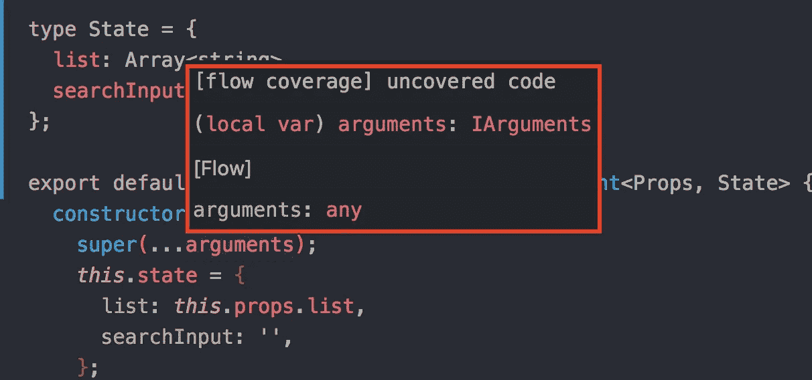
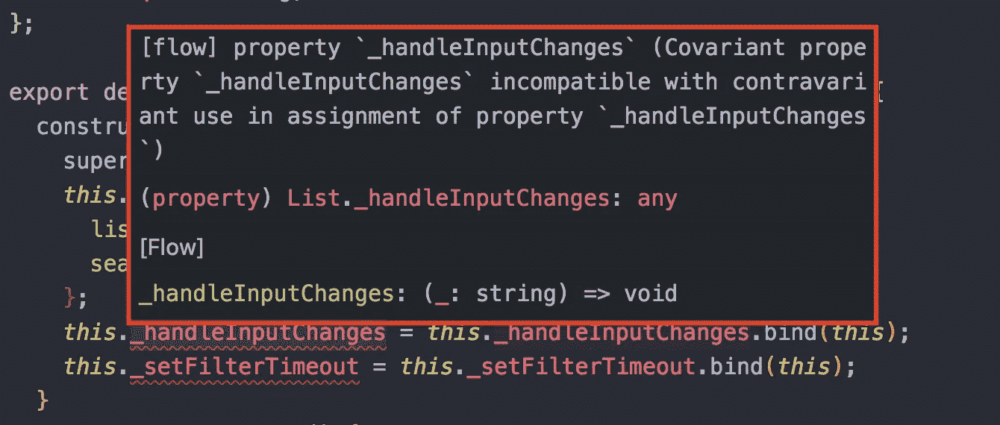
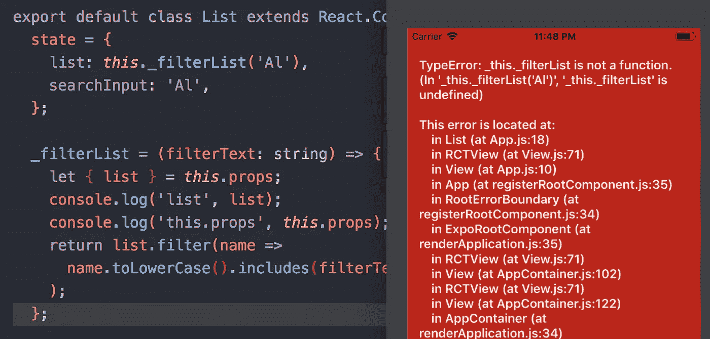

# 属性初始化器:什么，为什么，以及如何使用它

> 原文：<https://itnext.io/property-initializers-what-why-and-how-to-use-it-5615210474a3?source=collection_archive---------1----------------------->


当你不必再为你的方法做任何绑定时的感觉，图片来自 [Unsplash](https://unsplash.com/photos/ROsoCDtkGdo)

[*点击这里在 LinkedIn 上分享这篇文章*](https://www.linkedin.com/cws/share?url=https%3A%2F%2Fitnext.io%2Fproperty-initializers-what-why-and-how-to-use-it-5615210474a3)

新的类“属性初始化器”允许您使用常规的 ES6 类在 React 组件中定义方法(或任何属性),而不用担心绑定。对，我再说一遍，**无绑定**。其背后的思想是给一个属性分配一个箭头函数，它将像一个普通的方法一样工作，并自动从[封闭执行上下文](https://developer.mozilla.org/en-US/docs/Web/JavaScript/Reference/Functions/Arrow_functions)的值中绑定 **this** (在本例中是构造函数)。它经常被用来[创建一个更加“干净”的 ES6 类组件。](https://www.fullstackreact.com/articles/use-property-initializers-for-cleaner-react-components/)

在这篇文章中，我们将创建一个简单的屏幕，呈现一个用户列表和一个文本输入来过滤列表。

该列表可能包含数百个用户，所以我们不想每次用户输入内容时都进行过滤，因为这可能会导致重新呈现列表时出现性能问题。为了克服这一点，我们可以将过滤器的执行延迟一段时间，实质上是等待用户完成输入(去抖动事件)。很常见的情况，对吧？

在这个例子中，我们将看到属性初始化器是如何工作的，与常规的类方法相比有什么不同，优缺点，以及当你面对它的限制时可以做的一些变通方法。

在此之前，让我们快速看一下如果用普通的 React 类定义 List 组件，它会是什么样子。为了简单起见，这个列表只是一个随机名称的数组。

```
export default class List extends React.Component {
  constructor() {
    super(...arguments);
    *this*.state = {
      list: *this*.props.list,
      searchInput: '',
    };
    ***this*._handleInputChange = *this*._handleInputChange.bind(*this*);
    *this*._filterList = *this*._filterList.bind(*this*);**
  }
  componentWillUnmount() {
    if (*this*._filterTimeout) clearTimeout(*this*._filterTimeout);
  }
  render() {
    let { searchInput } = this.state;
    return (
      <View style={{ flex: 1 }}>
        <View style={styles.searchContainer}>
          <TextInput
            style={styles.textInput}
            placeholder="Search by name"
            value={searchInput}
           ** onChangeText={this._handleInputChange}**
            autoCorrect={false}
          />
          <Icon name="search" size={26} color="#476DC5" />
        </View>
        <ScrollView>
          {this.state.list.map((name, index) => {
            return (
              <ListItem
                key={index} // please pardon this one
                roundAvatar
                avatar={defaultProfilePicture}
                title={name}
              />
            );
          })}
        </ScrollView>
      </View>
    );
  }

  _handleInputChange(searchInput) {
    this.setState({ searchInput });
    if (this._filterTimeout) {
      clearTimeout(this._filterTimeout);
    }
 **this._filterTimeout = setTimeout(this._filterList, 400);**
  }

  _filterList() {
    let filterText = this.state.searchInput.toLowerCase();
    let { list } = this.props;
    this.setState({
      list: list.filter(name =>
        name.toLowerCase().includes(filterText),
      ),
    });
  }
}
```

在上面的示例代码中，我们将过滤后的列表存储在 state 中，以便在列表发生变化时触发重新呈现。注意，我们需要绑定每个被传递的方法(作为一个属性或回调)，因为将一个方法作为一个参数传递会将它从它的上下文(`this`)中“分离”。我们还需要实现一个构造函数来定义初始状态并放置我们所有的绑定，这意味着我们需要调用`super`并将所有参数传递给它。

你可能在网上看到的一些例子将绑定在`render()`方法中，而不是构造函数中。这效率稍低，并且需要同样多的样板文件。

这只是一个小例子。想象一个更大的真实世界的组件，你的 React 类中可能有更多的方法需要绑定。有了这种行为，就很难在整个团队中保持代码的一致性，而且随着代码可读性的降低，与其他开发人员的协作也变得更加困难和容易出错。

另一个小问题是，如果您使用 Flow 作为代码类型检查器，您可能会意识到使用`super(...arguments)`会降低 Flow 代码覆盖率，因为 Flow 不知道您传递的参数的形状。更糟糕的是，Flow 抱怨`bind`行，因为您正在覆盖实例方法。



流程不能涵盖参数类型。



流抱怨是因为我们覆盖了实例方法。

现在，让我们看看如何用属性初始化器来实现它！

```
export default class List extends React.Component {
  state = {
    list: this.props.list,
    searchInput: '',
  };

  componentWillUnmount() {
    if (this._filterTimeout) clearTimeout(this._filterTimeout);
  }

  render() {
    let { searchInput, list } = this.state;
    return (
      <View style={{ flex: 1 }}>
        <View style={styles.searchContainer}>
          <TextInput
            style={styles.textInput}
            placeholder="Search by name"
            value={searchInput}
            onChangeText={this._handleInputChange}
            autoCorrect={false}
          />
          <Icon name="search" size={26} color="#476DC5" />
        </View>
        <ScrollView>
          {this.state.list.map((name, index) => {
            return (
              <ListItem
                key={index}
                roundAvatar
                avatar={defaultProfilePicture}
                title={name}
              />
            );
          })}
        </ScrollView>
      </View>
    );
  }

  **_handleInputChange** = (searchInput) => {
    this.setState({ searchInput });
    if (this._filterTimeout) {
      clearTimeout(this._filterTimeout);
    }
    this._filterTimeout = setTimeout(this._filterList, 400);
  };

  **_filterList** = () => {
    let filterText = this.state.searchInput.toLowerCase();
    let { list } = this.props;
    this.setState({
      list: list.filter(name =>
        name.toLowerCase().includes(filterText),
      ),
    });
  };
}
```

看吧！我们不再需要构造函数或绑定:)

我们可以从中获得一些好处:

*   没有必要明确地称呼`bind()`。 ***这个*** 被正确绑定是因为我们使用了箭头函数语法。
*   不需要定义构造函数方法(我们可以在构造函数之外定义初始状态！).
*   如果你愿意，你甚至可以使用属性初始化语法和所有其他的组件生命周期方法。

尽管它能带来巨大的好处，但至少从我的经验来看，它也有一些缺点:

## 如果您想在定义状态时使用您的方法，您需要在初始化状态之前初始化**方法。**

让我们稍微改变一下我们的`_filterList`。这个方法将返回一个新的过滤后的数组，而不是调用`setState()`。然后，假设你想用字符串' Al '过滤列表，并把它存储为初始状态。如果我们把我们的方法按照如上所示的顺序排列，它将抛出一个错误`this._filterList`是未定义的。

如果在状态之后初始化方法*，在初始化状态时调用方法将不起作用。*



如果在 state 之后初始化方法，则在初始化 state 时使用方法将不起作用。

如果你面对这个用例，你可以把方法放在状态之前，就像这样:

```
export default class List extends React.Component {
  // This must go first
  _filterList = (filterText) => {
    let { list } = this.props;
    return list.filter(name =>
      name.toLowerCase().includes(filterText.toLowerCase()),
    );
  };

  state = {
    list: this._filterList('Al'),
    searchInput: 'Al',
  };

  ...
}
```

但是这使得您的实现更加脆弱，更容易出错。如果您团队中的另一个工程师重构了这个类，他们可能会为了代码风格的一致性而重新排序属性/方法。这可能会导致在代码审查中难以发现的错误(还好你有测试，对吧！).

一个解决方法是回到构造函数方法。

```
export default class List extends React.Component {

  // This will work as expected.
  constructor() {
    super(...arguments);
    this.state = {
      list: this._filterList('Al'),
      searchInput: 'Al',
    };
  }
  ...
  render() {
    ...
  }
  ...
  _filterList = (filterText) => {
    let { list } = this.props;
    this.setState({
      list: list.filter(name =>
        name.toLowerCase().includes(filterText.toLowerCase()),
      ),
    });
  };
}
```

**一个更好的解决方案**是将`filterList()`定义为独立的、类外的纯函数。这也使得测试变得容易，因为它没有副作用。

```
let filterList = (list, filterText) => {
  let lowerCasedFilterText = filterText.toLowerCase();
  return list.filter(name =>
    name.toLowerCase().includes(lowerCasedFilterText),
  );
};
export default class List extends React.Component {
  // This will work
  state = {
    list: filterList(this.props.list, 'Al'),
    searchInput: 'Al',
  };

  ...
}
```

## 其他一些缺点:

*   像这样初始化状态时，不能使用对象析构。你每次都必须打出`this.props.x`。
*   可能会有性能问题(你可以在[可能的陷阱](https://medium.com/@nikolalsvk/loosing-bind-this-in-react-8637ebf372cf)部分阅读更多)。
*   如果你想使用属性初始化器，你将需要 Babel 来转换你的代码(但是如果你使用 JSX 或者其他现代语法/特性，你可能会使用 Babel)。

属性初始化器仍然是 JS 中的一个实验性特性，这意味着它还没有被 ECMAScript 官方标准接受。目前，你需要 Babel 使用`[babel-plugin-transform-class-properties](https://babeljs.io/docs/plugins/transform-class-properties/)`来传输它。但是这个特性正在成为一个标准，它在 JavaScript/React 社区中被广泛使用，在许多组织的生产中，你会在网络指南中看到这个模式。

## 摘要

我们已经看到了属性初始化器在 React 组件中是如何工作的，并将其与传统的 React 类(使用构造函数)进行了比较。我认为主要的优势是能够消除使用`bind()`的需要，在我看来，这将创建更干净的代码。尽管这种方法可以带来好处，但它仍然有一些问题，您已经看到了我们如何通过一些变通方法来解决每个限制。如果你有我在上面没有提到的其他好处、限制或解决方法，请在下面留下评论！我很乐意向你学习更多:)你可以在这里看到完整的源代码[。](https://github.com/AudyOdi/example-property-initializers)