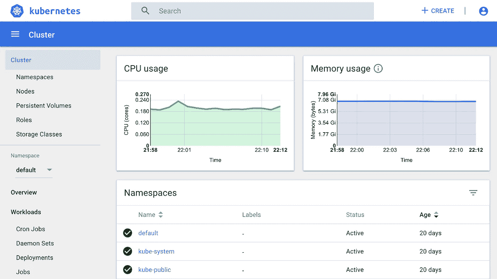
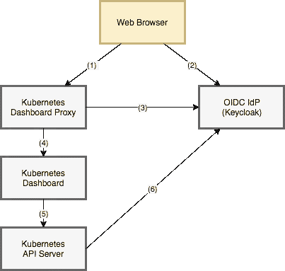

# 使用 OpenID Connect 保护 Kubernetes 仪表板

> 原文：<https://itnext.io/protect-kubernetes-dashboard-with-openid-connect-104b9e75e39c?source=collection_archive---------1----------------------->

# TL；速度三角形定位法(dead reckoning)

[Kubernetes Dashboard](https://github.com/kubernetes/dashboard) 是一个很酷的用于 Kubernetes 集群的 web UI。您可以使用 OpenID Connect 反向代理来保护您的 Kubernetes 仪表板，例如 [keycloak-proxy](https://github.com/gambol99/keycloak-proxy) 。



Kubernetes 仪表板

在本文中，我们配置了以下堆栈:

*   Keycloak / Google 帐户(OpenID Connect 身份提供者)
*   keycloak-proxy (OpenID 连接反向代理)
*   kube-apiserver (Kubernetes API 服务器)
*   Kubernetes 仪表板

# 入门指南

## 第 1(a)条。安装钥匙锁

你可以从[舵图](https://github.com/kubernetes/charts/tree/master/stable/keycloak)中部署一个 Keycloak 服务器。

将 Keycloak 配置为 OpenID Connect 身份提供者。

在本文中，它假设如下:

*   你在领域`hello`
*   你有用户`foo`
*   你属于`admin`组织

添加具有以下属性的客户端:

*   客户端 ID: `kubernetes`
*   客户端协议:openid-connect
*   访问类型:机密
*   有效重定向 URIs: `https://kubernetes-dashboard.example.com/oauth/callback`

然后创建一个映射器。它允许基于组的访问控制。

*   名称:`groups`
*   映射器类型:组成员资格
*   令牌声明名称:`groups`

现在钥匙锁变成了身份提供者。

## 第 1 款(b)项。设置 Google 身份平台

你也可以使用你的谷歌账户。这样更容易。

打开[Google API 控制台](https://console.developers.google.com/apis/credentials)并创建一个 OAuth 客户端，如下所示:

*   应用类型:Web 应用
*   重定向网址:`[https://kubernetes-dashboard.example.com/oauth/callback](https://kubernetes-dashboard.example.com/oauth/callback)`

请在后面的部分用`[https://accounts.google.com](https://accounts.google.com.)`替换发行者 URL。

## 2.设置 Kubernetes API

配置 kube-apiserver 接受 OpenID Connect 的 ID 令牌。

如果您使用 kops，通过`kops edit cluster`添加以下内容:

```
spec:
  kubeAPIServer:
    oidcClientID: kubernetes
    oidcGroupsClaim: groups
    oidcIssuerURL: https://keycloak.example.com/auth/realms/hello
```

如果您正在使用 kube-aws，将以下内容添加到`cluster.yaml`:

```
 oidc:
         enabled: true
         issuerUrl: https://keycloak.example.com/auth/realms/hello
         clientId: kubernetes
         groupsClaim: groups
```

现在 kube-apiserver 可以通过 ID 令牌进行身份验证。

## 3.设置密钥锁代理

运行 OpenID 连接代理服务器。keycloak-proxy 是一个用 Go 编写的轻量级代理服务器。

您可以从[舵图](https://github.com/int128/kubernetes-dashboard-proxy)中部署一个 keycloak-proxy，如下所示:

```
helm repo add int128.github.io [https://int128.github.io/helm-charts](https://int128.github.io/helm-charts)
helm repo update
helm install int128.github.io/kubernetes-dashboard-proxy
```

或者你可以`kubectl apply`下面的清单:

上面的例子使用了一个入口来发布代理端口，但是你也可以使用一个`NodePort`或者`LoadBalancer`。

如果使用 [nginx-ingress](https://github.com/kubernetes/ingress-nginx) ，确保`proxy_buffer_size`选项大于 4kB。您可以通过配置图进行配置。

```
 proxy-buffer-size: "64k"
```

## 4.设置 Kubernetes 仪表板

你可以从[舵图](https://github.com/kubernetes/charts/tree/master/stable/kubernetes-dashboard)安装一个 Kubernetes 仪表盘。

```
helm install stable/kubernetes-dashboard --namespace kube-system --name kubernetes-dashboard
```

打开`https://kubernetes-dashboard.example.com`。

由于没有给当前用户或组分配角色，仪表板上将显示一条`Unauthorized`警告。

将`cluster-admin`角色分配给当前组。

```
kind: ClusterRoleBinding
apiVersion: rbac.authorization.k8s.io/v1
metadata:
  name: keycloak-admin-group
roleRef:
  apiGroup: rbac.authorization.k8s.io
  kind: ClusterRole
  name: cluster-admin
subjects:
- kind: Group
  name: /admin
```

现在，所有对象都显示在仪表板中。

注意`cluster-admin`角色是超级管理员，可以做任何事情。在你的实际操作中考虑一个专门的角色。

# 深潜

在本文中，我们构建了以下堆栈:



首先，代理向 Keycloak 发送一个重定向。如果身份验证成功完成，代理将接收 ID 令牌并将其存储到浏览器 Cookie 中。

通过身份验证后，代理将带有`Authorization`头的请求转发给仪表板。然后[仪表板通过使用 ID 令牌](https://github.com/kubernetes/dashboard/wiki/Access-control)访问 kube-apiserver。

这样，仪表板将认证委托给 kube-apiserver。这就是为什么您必须配置 kube-apiserver。

# 包裹

在本文中，我介绍了如何用 OpenID Connect 代理服务器保护 Kubernetes 仪表板。

# 请参见

*   [带 OpenID 连接的 ku bectl](https://medium.com/@int128/kubectl-with-openid-connect-43120b451672)